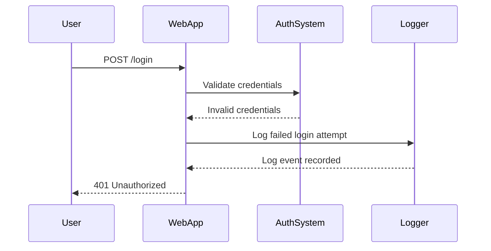

## Logging & Monitoring for Security: Creating Custom Metric Filters for Failed Login Metrics

### Background Theory

Logging and monitoring are critical components of DevSecOps, enabling teams to detect and respond to security incidents promptly. One of the key aspects of logging is creating custom metric filters to track specific events, such as failed login attempts. These metrics can help identify potential security threats, such as brute-force attacks or unauthorized access attempts.

### What Are Custom Metric Filters?

Custom metric filters are rules that define which log events should be counted as metrics. In the context of security, these filters can be used to track failed login attempts, which can indicate suspicious activity. By setting up these filters, you can monitor the number of failed login attempts over time and trigger alerts when certain thresholds are exceeded.

#### Why Are They Important?

- **Detection**: Custom metric filters help in detecting unusual patterns of failed login attempts, which could indicate an ongoing attack.
- **Response**: Once detected, these patterns can be used to trigger automated responses, such as blocking IP addresses or notifying security teams.
- **Compliance**: Many regulatory requirements mandate the tracking and reporting of security-related events, including failed login attempts.

### How to Create Custom Metric Filters for Failed Login Metrics

Let's walk through the process of creating a custom metric filter for failed login metrics using AWS CloudWatch Logs Insights as an example.

#### Step-by-Step Process

1. **Identify Log Events**: First, identify the log events that correspond to failed login attempts. This typically involves looking at the log messages generated by your authentication system.

2. **Define the Filter Pattern**: Next, define a filter pattern that matches the log events of interest. This pattern will be used to extract the relevant information from the logs.

3. **Create the Metric Filter**: Finally, create the metric filter using the defined pattern. This will allow you to track the number of failed login attempts over time.

#### Example Scenario

Suppose you have an application that logs failed login attempts with the following format:

```plaintext
Failed login attempt from IP 192.168.1.1 with username admin
```

To create a custom metric filter for these events, follow these steps:

1. **Identify Log Events**:
   - Look for log entries that contain the phrase "Failed login attempt".

2. **Define the Filter Pattern**:
   - The filter pattern should match the log entries containing "Failed login attempt". For example:
     ```plaintext
     { $.message = "Failed login attempt*" }
     ```

3. **Create the Metric Filter**:
   - Use AWS CloudWatch Logs Insights to create the metric filter.

Here’s how you can set this up in CloudWatch Logs Insights:

1. **Open CloudWatch Logs Insights**:
   - Navigate to the CloudWatch console and select "Logs Insights" from the left-hand menu.

2. **Write the Query**:
   - Write a query to match the failed login attempts. For example:
     ```sql
     fields @timestamp, @message
     | filter @message like /Failed login attempt/
     | stats count(*) as FailedLogins by bin(1h)
     ```

3. **Create the Metric Filter**:
   - After running the query, you can create a metric filter based on the results. This will allow you to track the number of failed login attempts over time.

### Full Example with Code

Let’s look at a complete example of creating a custom metric filter for failed login metrics using AWS CloudWatch Logs Insights.

#### Step 1: Identify Log Events

Assume your application logs failed login attempts with the following format:

```plaintext
Failed login attempt from IP 192.168.1.1 with username admin
```

#### Step 2: Define the Filter Pattern

The filter pattern should match the log entries containing "Failed login attempt". For example:

```plaintext
{ $.message = "Failed login attempt*" }
```

#### Step 3: Create the Metric Filter

Use AWS CloudWatch Logs Insights to create the metric filter.

1. **Open CloudWatch Logs Insights**:
   - Navigate to the CloudWatch console and select "Logs Insights" from the left-hand menu.

2. **Write the Query**:
   - Write a query to match the failed login attempts. For example:
     ```sql
     fields @timestamp, @message
     | filter @message like /Failed login attempt/
     | stats count(*) as FailedLogins by bin(1h)
     ```

3. **Create the Metric Filter**:
   - After running the query, you can create a metric filter based on the results. This will allow you to track the number of failed login attempts over time.

### Real-World Examples

#### Recent Breaches and CVEs

Recent breaches and CVEs often involve unauthorized access attempts, which can be detected using custom metric filters for failed login metrics. For example:

- **CVE-2021-26855**: A vulnerability in the Apache Struts framework allowed attackers to bypass authentication mechanisms. By monitoring failed login attempts, organizations could detect and respond to such attacks more quickly.
- **SolarWinds Supply Chain Attack (2020)**: This attack involved unauthorized access to systems. Monitoring failed login attempts could have helped detect the initial compromise.

### Pitfalls and Common Mistakes

- **Overlooking Log Events**: Ensure that you capture all relevant log events related to failed login attempts.
- **Incorrect Filter Patterns**: Make sure the filter patterns accurately match the log events of interest.
- **Ignoring Thresholds**: Set appropriate thresholds for triggering alerts based on the number of failed login attempts.

### How to Prevent / Defend

#### Detection

- **Monitor Failed Login Attempts**: Use custom metric filters to track the number of failed login attempts over time.
- **Set Thresholds**: Configure alerts to notify security teams when the number of failed login attempts exceeds a certain threshold.

#### Prevention

- **Rate Limiting**: Implement rate limiting on login attempts to prevent brute-force attacks.
- **Account Lockout Policies**: Enforce account lockout policies after a certain number of failed login attempts.
- **Multi-Factor Authentication (MFA)**: Require MFA for user accounts to add an additional layer of security.

#### Secure Coding Fixes

Compare the vulnerable and secure versions of the code:

**Vulnerable Code**:
```python
def authenticate(username, password):
    if check_password(username, password):
        return True
    else:
        log_event("Failed login attempt from IP {} with username {}".format(request.remote_addr, username))
        return False
```

**Secure Code**:
```python
def authenticate(username, password):
    if check_password(username, password):
        return True
    else:
        log_event("Failed login attempt from IP {} with username {}".format(request.remote_addr, username))
        if check_rate_limit(request.remote_addr):
            raise Exception("Too many failed login attempts")
        return False
```

### Complete Example with Raw HTTP Messages

Consider a scenario where a user attempts to log in with incorrect credentials. Here’s the full HTTP request and response:

**HTTP Request**:
```http
POST /login HTTP/1.1
Host: example.com
Content-Type: application/x-www-form-urlencoded
Content-Length: 29

username=admin&password=wrongpassword
```

**HTTP Response**:
```http
HTTP/1.1 401 Unauthorized
Date: Mon, 01 Jan 2024 00:00:00 GMT
Server: Apache/2.4.41 (Ubuntu)
Content-Length: 27
Content-Type: text/html; charset=UTF-8

{"error": "Unauthorized"}
```

### Mermaid Diagrams

#### Sequence Diagram for Failed Login Attempt



### Hands-On Labs

For hands-on practice, consider the following labs:

- **PortSwigger Web Security Academy**: Offers a series of labs focused on web security, including authentication and authorization.
- **OWASP Juice Shop**: A deliberately insecure web application for practicing web security skills.
- **DVWA (Damn Vulnerable Web Application)**: Another intentionally vulnerable web application for learning web security.

These labs provide practical experience in identifying and mitigating security vulnerabilities, including those related to failed login attempts.

By thoroughly understanding and implementing custom metric filters for failed login metrics, you can significantly enhance your organization's security posture

---
<!-- nav -->
[[DevSecOps/DevSecOps Bootcamp/08-Logging & Incident Response/04-Logging & Monitoring for Security/Create Custom Metric Filter for Failed Login Metrics/05-Introduction to Logging and Monitoring for Security|Introduction to Logging and Monitoring for Security]] | [[DevSecOps/DevSecOps Bootcamp/08-Logging & Incident Response/04-Logging & Monitoring for Security/Create Custom Metric Filter for Failed Login Metrics/00-Overview|Overview]] | [[DevSecOps/DevSecOps Bootcamp/08-Logging & Incident Response/04-Logging & Monitoring for Security/Create Custom Metric Filter for Failed Login Metrics/07-Practice Questions & Answers|Practice Questions & Answers]]
