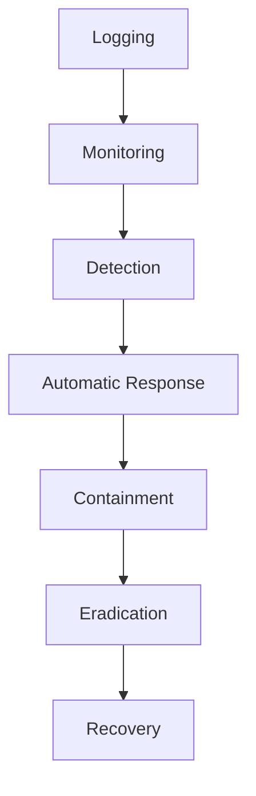

## Introduction to Incident Response Workflow Planning

In the realm of DevSecOps, planning an effective incident response workflow is crucial for maintaining the security and integrity of your systems. This chapter will delve into the details of planning such a workflow, focusing on a real-world case study involving the coffee company, Wired Brain Coffee, which uses AWS cloud services. We will explore the necessary components, steps, and best practices to ensure that security incidents are detected, responded to, and resolved in an automated manner.

### Background Theory

Incident response is a structured approach to addressing security breaches or other types of cyber incidents. It involves identifying, analyzing, containing, eradicating, and recovering from security incidents. The goal is to minimize damage, reduce recovery time, and prevent future incidents.

#### Key Components of Incident Response

1. **Logging**: Capturing detailed information about system activities.
2. **Monitoring**: Continuously watching for signs of security incidents.
3. **Automatic Response**: Automating the response to detected incidents.

### Case Study: Wired Brain Coffee

Wired Brain Coffee is an online retailer with a small development team. They use AWS cloud services, and Bob, the developer in charge of security, is tasked with ensuring that security incidents are handled in line with DevSecOps practices. This includes:

- Detecting security incidents.
- Responding to them.
- Automating these processes using code.

### Identifying Logging, Monitoring, and Automatic Response Requirements

To plan the incident response workflow, we need to identify the logging, monitoring, and automatic response requirements. Let's break down each component:

#### Logging

Logging is the process of recording events that occur within a system. These logs provide valuable data that can be used to detect and analyze security incidents.

**Why Logging Matters**

- **Detection**: Logs help in identifying unusual activities that could indicate a security breach.
- **Analysis**: Logs provide context and details needed to understand the nature and extent of an incident.
- **Compliance**: Many regulatory frameworks require logging to meet compliance standards.

**Example of Logging Configuration**

```yaml
# Example CloudWatch Logs Configuration
{
  "logGroupName": "/aws/lambda/WiredBrainCoffeeFunction",
  "retentionInDays": 30,
  "metricFilterName": "ErrorCount",
  "metricNamespace": "WiredBrainCoffee",
  "metricValue": "$.error"
}
```

#### Monitoring

Monitoring involves continuously observing system activities to detect anomalies that may indicate a security incident.

**Why Monitoring Matters**

- **Real-time Detection**: Monitoring allows for immediate detection of suspicious activities.
- **Proactive Defense**: By catching issues early, you can take preventive actions before significant damage occurs.

**Example of Monitoring Configuration**

```yaml
# Example CloudWatch Alarms Configuration
{
  "alarmName": "HighErrorRateAlarm",
  "comparisonOperator": "GreaterThanThreshold",
  "evaluationPeriods": 1,
  "metricName": "ErrorCount",
  "namespace": "WiredBrainCoffee",
  "period": 60,
  "statistic": "Sum",
  "threshold": 5,
  "treatMissingData": "notBreaching"
}
```

#### Automatic Response

Automated response involves setting up predefined actions to be taken when certain conditions are met. This ensures that incidents are addressed promptly and consistently.

**Why Automated Response Matters**

- **Speed**: Automated responses can mitigate threats faster than manual intervention.
- **Consistency**: Automation ensures that the same steps are followed every time, reducing human error.

**Example of Automated Response Configuration**

```yaml
# Example Lambda Function for Automated Response
{
  "functionName": "IncidentResponseLambda",
  "handler": "index.handler",
  "runtime": "nodejs14.x",
  "role": "arn:aws:iam::123456789012:role/LambdaExecutionRole",
  "environment": {
    "variables": {
      "SLACK_WEBHOOK_URL": "https://hooks.slack.com/services/..."
    }
  },
  "timeout": 15,
  "memorySize": 128
}
```

### Scenario: Security Misconfiguration in Cloud Storage

One of the top 10 OWASP security risks is security misconfiguration. In this scenario, we will look at the cloud storage service being misconfigured accidentally by one of the development team members at Wired Brain Coffee.

#### What is Security Misconfiguration?

Security misconfiguration occurs when a system is not properly configured to enforce security policies. This can lead to vulnerabilities that attackers can exploit.

**Why Security Misconfiguration Matters**

- **Vulnerabilities**: Misconfigurations can expose sensitive data and create entry points for attackers.
- **Regulatory Compliance**: Misconfigurations can result in non-compliance with regulatory standards.

#### Real-World Example: Recent Breaches

A notable example of a security misconfiguration leading to a breach is the Capital One data breach in 2019. An attacker exploited a misconfigured server to access sensitive customer data.

**Example of Vulnerable Cloud Storage Configuration**

```json
// Vulnerable S3 Bucket Policy
{
  "Version": "2012-10-17",
  "Statement": [
    {
      "Sid": "PublicReadGetObject",
      "Effect": "Allow",
      "Principal": "*",
      "Action": "s3:GetObject",
      "Resource": "arn:aws:s3:::wiredbraincoffee/*"
    }
  ]
}
```

### How to Prevent / Defend Against Security Misconfiguration

#### Detection

Detecting security misconfigurations involves continuous monitoring and auditing of configurations.

**Example of Detection Mechanism**

```yaml
# Example AWS Config Rule for S3 Bucket Policy
{
  "ConfigRuleName": "S3BucketPolicyAudit",
  "Description": "Audits S3 bucket policies for public access.",
  "Scope": {
    "ComplianceResourceTypes": ["AWS::S3::Bucket"]
  },
  "Source": {
    "Owner": "AWS",
    "SourceIdentifier": "S3_BUCKET_POLICY_AUDIT"
  }
}
```

#### Prevention

Preventing security misconfigurations involves implementing strict configuration management practices and using tools to enforce security policies.

**Example of Secure Cloud Storage Configuration**

```json
// Secure S3 Bucket Policy
{
  "Version": "2012-10-17",
  "Statement": [
    {
      "Sid": "DenyPublicAccess",
      "Effect": "Deny",
      "Principal": "*",
      "Action": "s3:*",
      "Resource": "arn:aws:s3:::wiredbraincoffee/*",
      "Condition": {
        "StringNotEquals": {
          "aws:PrincipalArn": "arn:aws:iam::123456789012:root"
        }
      }
    }
  ]
}
```

#### Secure Coding Practices

Implementing secure coding practices ensures that configurations are set correctly and securely.

**Example of Secure Code Implementation**

```python
# Example Python Code for Setting Secure S3 Bucket Policy
import boto3

def set_secure_s3_policy(bucket_name):
    s3 = boto3.client('s3')
    policy = {
        "Version": "2012-10-17",
        "Statement": [
            {
                "Sid": "DenyPublicAccess",
                "Effect": "Deny",
                "Principal": "*",
                "Action": "s3:*",
                "Resource": f"arn:aws:s3:::{bucket_name}/*",
                "Condition": {
                    "StringNotEquals": {
                        "aws:PrincipalArn": "arn:aws:iam::123456789012:root"
                    }
                }
            }
        ]
    }
    s3.put_bucket_policy(Bucket=bucket_name, Policy=json.dumps(policy))

set_secure_s3_policy('wiredbraincoffee')
```

### Diagrams and Topologies

#### Mermaid Diagrams

Let's visualize the incident response workflow using Mermaid diagrams.



### Conclusion

Planning an effective incident response workflow is essential for maintaining the security and integrity of your systems. By identifying the necessary logging, monitoring, and automatic response requirements, you can ensure that security incidents are detected, responded to, and resolved in an automated manner. Using the case study of Wired Brain Coffee, we explored how to handle security misconfigurations and implemented secure coding practices to prevent such issues.

### Practice Labs

For hands-on practice, consider the following labs:

- **PortSwigger Web Security Academy**: Focuses on web application security.
- **OWASP Juice Shop**: Provides a vulnerable web application for learning.
- **DVWA (Damn Vulnerable Web Application)**: Another resource for practicing web application security.
- **CloudGoat**: Offers scenarios for practicing cloud security on AWS.

By following these guidelines and practicing with real-world examples, you can develop a robust incident response workflow that aligns with DevSecOps principles.

---
<!-- nav -->
[[DevSecOps/DevSecOps Bootcamp/08-Logging & Incident Response/05-Planning Your Incident Response Workflow/01-Case Study with AWS Services/00-Overview|Overview]] | [[02-Planning Your Incident Response Workflow with AWS Services|Planning Your Incident Response Workflow with AWS Services]]
