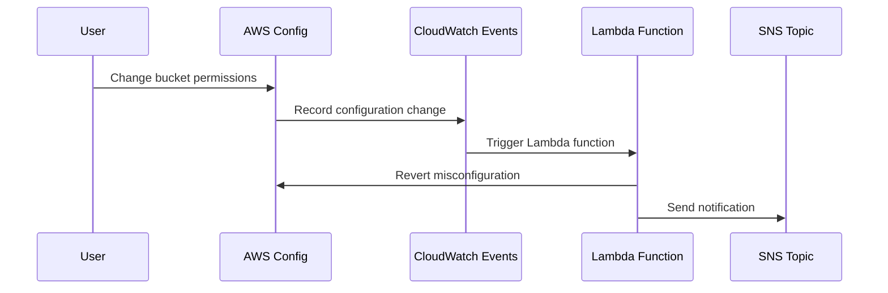

## Planning Your Incident Response Workflow with AWS Services

### Introduction to Incident Response in Cloud Environments

Incident response in cloud environments, particularly within services like Amazon Web Services (AWS), is critical for maintaining the integrity, availability, and confidentiality of your data. In this case study, we will focus on AWS S3 storage, which is a highly scalable object storage service used for storing and retrieving any amount of data at any time. However, misconfigurations in S3 buckets can lead to serious security issues, such as unauthorized access and data breaches. Therefore, implementing robust incident response workflows is essential.

### Technical Makeup of the Solution

To make our example realistic, we will assume that the cloud storage service is AWS S3. Our goal is to detect and correct misconfigurations on this storage service. This involves implementing logging, monitoring, and responding to configuration changes.

#### AWS Config Service

The first step is to implement the AWS Config service on the S3 bucket. AWS Config is a service that enables you to assess, audit, and record configurations of your AWS resources. By enabling AWS Config, you can track changes to your S3 bucket's permissions and other configurations.

**What is AWS Config?**
AWS Config is a service that provides you with an inventory of your AWS resources, their relationships, and their configurations. It also tracks changes to these configurations over time. This helps you maintain compliance with internal policies and external regulations.

**Why Use AWS Config?**
Using AWS Config allows you to:
- Maintain an up-to-date inventory of your AWS resources.
- Track changes to resource configurations.
- Ensure compliance with regulatory requirements.
- Detect and respond to misconfigurations quickly.

**How Does AWS Config Work?**
AWS Config works by continuously collecting configuration details about your resources. You can enable AWS Config for specific resources, such as S3 buckets, and it will start recording their configurations. You can then use this information to monitor and manage your resources effectively.

**Enabling AWS Config for S3 Buckets**

To enable AWS Config for an S3 bucket, follow these steps:

1. **Navigate to the AWS Config Console:**
   - Open the AWS Management Console.
   - Navigate to the AWS Config service.

2. **Enable AWS Config:**
   - Click on "Get started."
   - Select the regions where you want to enable AWS Config.
   - Choose the resources you want to monitor (e.g., S3 buckets).

3. **Configure Recording Rules:**
   - Define rules to specify which resources and configurations you want to track.
   - For S3 buckets, you can create a rule to track changes to permissions and other settings.

Here is an example of how to enable AWS Config using the AWS CLI:

```bash
aws configservice put-configuration-recorder --configuration-recorder file://recorder.json
```

Where `recorder.json` contains:

```json
{
    "name": "default",
    "roleARN": "arn:aws:iam::123456789012:role/aws-config-role",
    "recordingGroup": {
        "allSupported": true,
        "includeGlobalResourceTypes": true
    }
}
```

### Monitoring Configuration Changes with CloudWatch Events

Once AWS Config is enabled, the next step is to set up monitoring for configuration changes using CloudWatch Events. CloudWatch Events allows you to capture changes to your resources and trigger actions based on those changes.

**What are CloudWatch Events?**
CloudWatch Events is a service that allows you to capture changes to your AWS resources and react to them. You can create rules that match specific events and trigger actions, such as sending notifications or executing Lambda functions.

**Why Use CloudWatch Events?**
Using CloudWatch Events allows you to:
- Capture changes to your resources in real-time.
- Trigger automated responses to configuration changes.
- Integrate with other AWS services for comprehensive monitoring and response.

**How Does CloudWatch Events Work?**
CloudWatch Events works by capturing events from various sources, including AWS Config. You can create rules that match specific events and define actions to take when those events occur.

**Creating a CloudWatch Event Rule for S3 Bucket Changes**

To create a CloudWatch Event rule for S3 bucket changes, follow these steps:

1. **Navigate to the CloudWatch Console:**
   - Open the AWS Management Console.
   - Navigate to the CloudWatch service.

2. **Create a New Rule:**
   - Click on "Rules" in the left-hand menu.
   - Click on "Create rule."

3. **Define the Rule:**
   - Set the event source to "Event Pattern."
   - Define the event pattern to match changes to S3 bucket configurations.

Here is an example of how to create a CloudWatch Event rule using the AWS CLI:

```bash
aws events put-rule --name s3-bucket-change-rule --event-pattern file://event-pattern.json
```

Where `event-pattern.json` contains:

```json
{
    "source": ["aws.config"],
    "detail-type": ["Config Change"],
    "detail": {
        "resourceType": ["AWS::S3::Bucket"]
    }
}
```

### Automated Response with AWS Lambda

When a misconfiguration is detected, an automated response can be triggered using AWS Lambda. AWS Lambda is a serverless compute service that lets you run code without provisioning or managing servers.

**What is AWS Lambda?**
AWS Lambda is a compute service that runs your code in response to events and automatically manages the underlying compute resources for you. You can use Lambda to execute code in response to changes detected by CloudWatch Events.

**Why Use AWS Lambda?**
Using AWS Lambda allows you to:
- Execute code in response to events without managing servers.
- Automate responses to configuration changes.
- Integrate with other AWS services for comprehensive incident response.

**How Does AWS Lambda Work?**
AWS Lambda works by running your code in response to events. You can write your code in various languages, such as Python, Node.js, Java, and more. When an event occurs, Lambda executes your code and returns the result.

**Creating an AWS Lambda Function for Automated Response**

To create an AWS Lambda function for automated response, follow these steps:

1. **Navigate to the Lambda Console:**
   - Open the AWS Management Console.
   - Navigate to the Lambda service.

2. **Create a New Function:**
   - Click on "Create function."
   - Choose "Author from scratch."
   - Enter a name for your function.
   - Choose a runtime (e.g., Python 3.8).
   - Click on "Create function."

3. **Write the Lambda Code:**
   - Write the code to handle the automated response. For example, you can send a notification or revert the misconfiguration.

Here is an example of a Lambda function written in Python:

```python
import boto3

def lambda_handler(event, context):
    # Extract the bucket name from the event
    bucket_name = event['detail']['resourceName']
    
    # Revert the misconfiguration
    s3 = boto3.client('s3')
    s3.put_bucket_acl(Bucket=bucket_name, ACL='private')
    
    # Send a notification
    sns = boto3.client('sns')
    sns.publish(
        TopicArn='arn:aws:sns:us-east-1:123456789012:my-topic',
        Message=f'Misconfiguration detected and reverted for bucket {bucket_name}',
        Subject='Misconfiguration Detected'
    )
```

### Integrating CloudWatch Events with Lambda

To integrate CloudWatch Events with Lambda, you need to create a rule that triggers the Lambda function when a misconfiguration is detected.

**Creating a CloudWatch Event Rule to Trigger Lambda**

To create a CloudWatch Event rule that triggers a Lambda function, follow these steps:

1. **Navigate to the CloudWatch Console:**
   - Open the AWS Management Console.
   - Navigate to the CloudWatch service.

2. **Create a New Rule:**
   - Click on "Rules" in the left-hand menu.
   - Click on "Create rule."

3. **Define the Rule:**
   - Set the event source to "Event Pattern."
   - Define the event pattern to match changes to S3 bucket configurations.
   - Set the target to the Lambda function you created.

Here is an example of how to create a CloudWatch Event rule using the AWS CLI:

```bash
aws events put-targets --rule s3-bucket-change-rule --targets Id=1,Arn=arn:aws:lambda:us-east-1:123456789012:function:my-lambda-function
```

### Example Scenario: Misconfiguration Detection and Response

Let's walk through an example scenario where a misconfiguration is detected and responded to using the setup described above.

1. **Initial Setup:**
   - AWS Config is enabled for the S3 bucket.
   - A CloudWatch Event rule is created to detect changes to the bucket's configuration.
   - An AWS Lambda function is created to handle the automated response.

2. **Misconfiguration Occurs:**
   - Someone accidentally changes the bucket's permissions to allow public access.

3. **Detection:**
   - AWS Config detects the change and records it.
   - CloudWatch Events captures the event and triggers the Lambda function.

4. **Response:**
   - The Lambda function reverts the misconfiguration by setting the bucket's permissions back to private.
   - The Lambda function sends a notification via SNS to alert the team.

Here is the full sequence of events in a mermaid diagram:



### Real-World Examples and Recent Breaches

Recent breaches involving S3 misconfigurations highlight the importance of proper incident response workflows. For example, in 2021, a healthcare company suffered a data breach due to misconfigured S3 buckets, exposing sensitive patient data. This breach could have been prevented with a robust incident response workflow.

**CVE-2021-38642: Healthcare Data Breach**
In this breach, a healthcare company had multiple S3 buckets configured to allow public access. This allowed attackers to download sensitive patient data. The company later implemented AWS Config and CloudWatch Events to detect and respond to similar misconfigurations.

### How to Prevent / Defend Against Misconfigurations

To prevent and defend against S3 misconfigurations, you can implement the following measures:

#### Secure Configuration Practices

1. **Use IAM Policies:**
   - Restrict access to S3 buckets using IAM policies.
   - Ensure that only authorized users and roles can modify bucket permissions.

2. **Enable Server-Side Encryption:**
   - Enable server-side encryption for S3 buckets to protect data at rest.

3. **Use Versioning:**
   - Enable versioning on S3 buckets to prevent accidental deletion of objects.

#### Detection and Prevention

1. **Implement AWS Config:**
   - Enable AWS Config to track changes to S3 bucket configurations.
   - Monitor configuration changes in real-time.

2. **Use CloudWatch Events:**
   - Create rules to detect changes to S3 bucket configurations.
   - Trigger automated responses to misconfigurations.

3. **Automate Responses with Lambda:**
   - Write Lambda functions to revert misconfigurations and send notifications.

#### Secure Coding Practices

1. **Secure Configuration Example:**
   - Here is an example of a secure configuration for an S3 bucket:

   ```json
   {
       "Version": "2012-10-17",
       "Statement": [
           {
               "Sid": "PublicReadGetObject",
               "Effect": "Allow",
               "Principal": "*",
               "Action": "s3:GetObject",
               "Resource": "arn:aws:s3:::my-bucket/*"
           }
       ]
   }
   ```

2. **Vulnerable Configuration Example:**
   - Here is an example of a vulnerable configuration for an S3 bucket:

   ```json
   {
       "Version": "2012-10-17",
       "Statement": [
           {
               "Sid": "PublicReadGetObject",
               "Effect": "Allow",
               "Principal": "*",
               "Action": "s3:*",
               "Resource": "arn:aws:s3:::my-bucket/*"
           }
       ]
   }
   ```

3. **Corrected Configuration Example:**
   - Here is the corrected configuration for an S3 bucket:

   ```json
   {
       "Version": "2012-10-17",
       "Statement": [
           {
               "Sid": "PublicReadGetObject",
               "Effect": "Allow",
               "Principal": "*",
               "Action": "s3:GetObject",
               "Resource": "arn:aws:s3:::my-bucket/*"
           }
       ]
   }
   ```

### Conclusion

Implementing a robust incident response workflow for S3 buckets is crucial for maintaining the security of your data. By using AWS Config, CloudWatch Events, and Lambda functions, you can detect and respond to misconfigurations quickly and effectively. This ensures that your data remains secure and compliant with regulatory requirements.

### Practice Labs

For hands-on experience with incident response workflows in AWS, consider the following labs:

- **PortSwigger Web Security Academy:** Offers interactive labs on web application security, including incident response scenarios.
- **OWASP Juice Shop:** A deliberately insecure web application for practicing web security skills.
- **DVWA (Damn Vulnerable Web Application):** A PHP/MySQL web application that is riddled with vulnerabilities for educational purposes.
- **WebGoat:** An interactive, gamified training application for learning about web application security.

These labs provide practical experience in detecting and responding to security incidents in cloud environments.

---

This detailed explanation covers the entire process of planning an incident response workflow for AWS S3 buckets, including background theory, recent real-world examples, complete code, mermaid diagrams, pitfalls, and a clear 'How to Prevent / Defend' section.

---
<!-- nav -->
[[01-Introduction to Incident Response Workflow Planning|Introduction to Incident Response Workflow Planning]] | [[DevSecOps/DevSecOps Bootcamp/08-Logging & Incident Response/05-Planning Your Incident Response Workflow/01-Case Study with AWS Services/00-Overview|Overview]] | [[DevSecOps/DevSecOps Bootcamp/08-Logging & Incident Response/05-Planning Your Incident Response Workflow/01-Case Study with AWS Services/03-Practice Questions & Answers|Practice Questions & Answers]]
