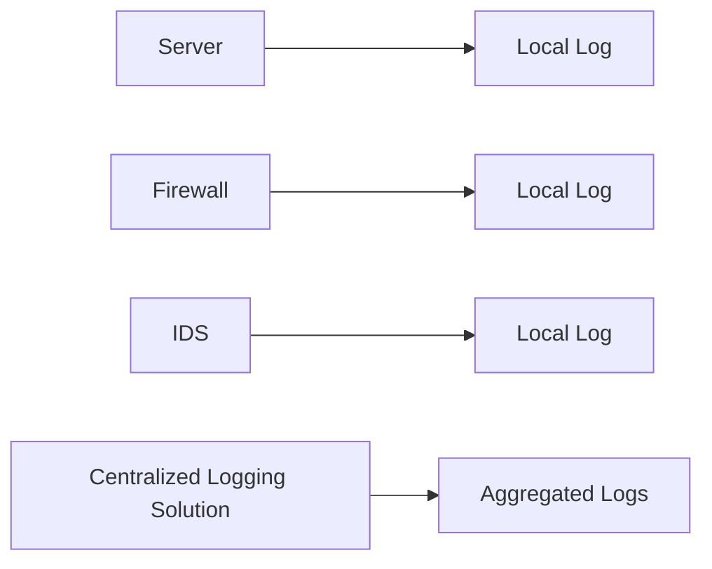
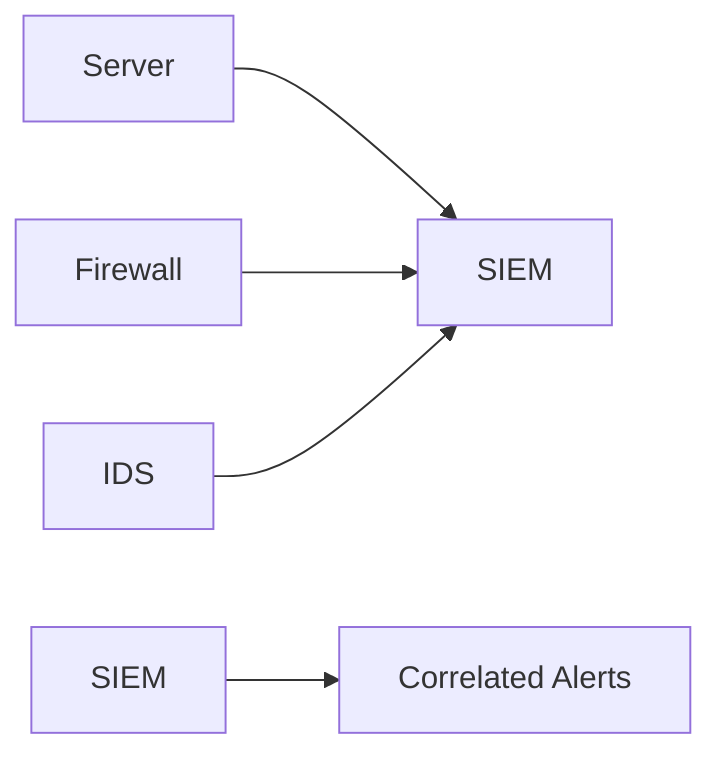
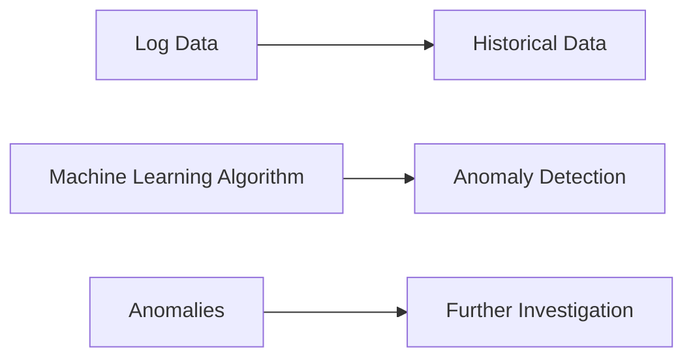
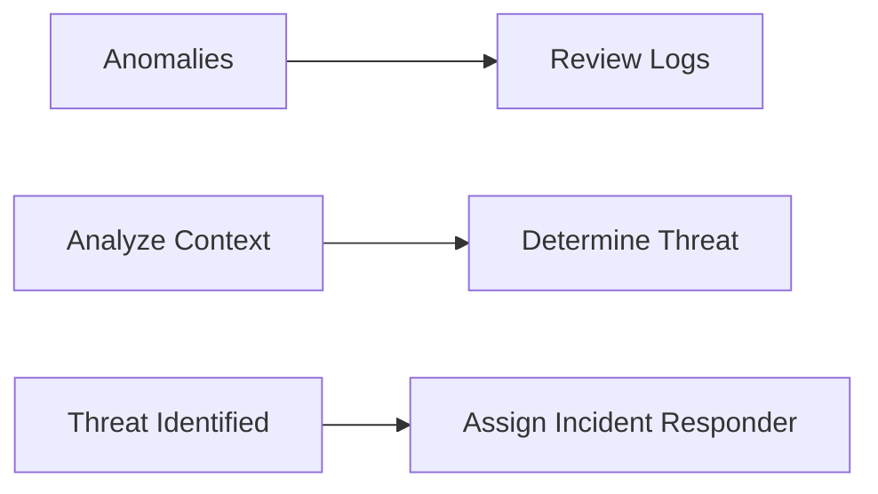
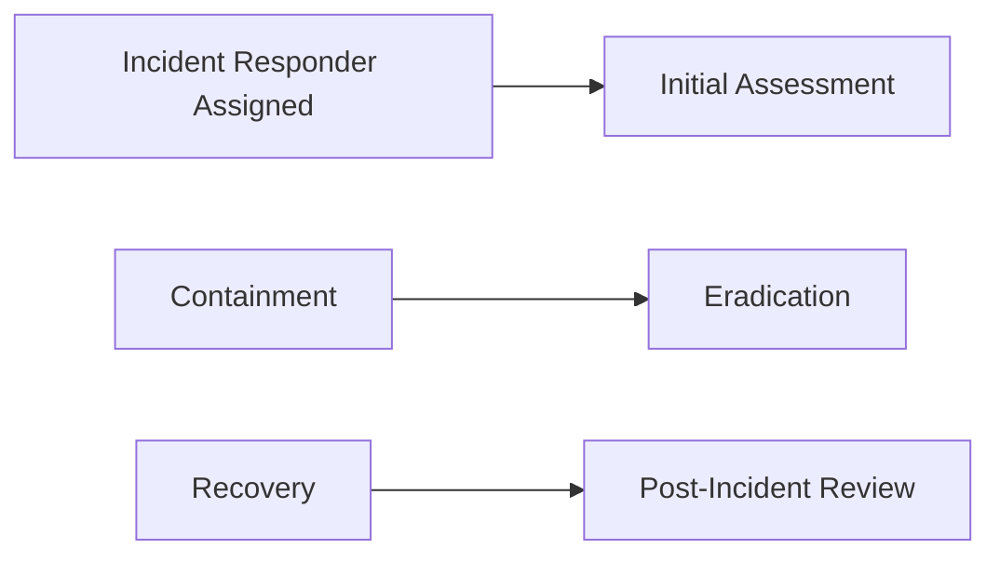
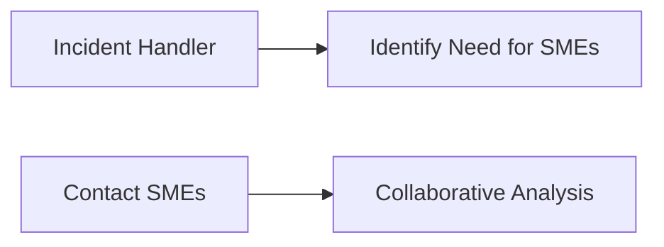
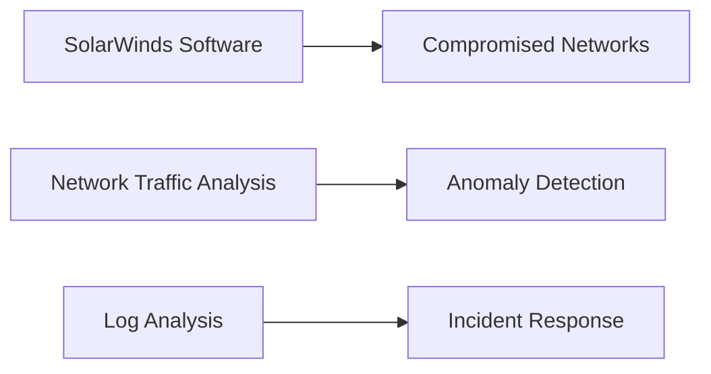
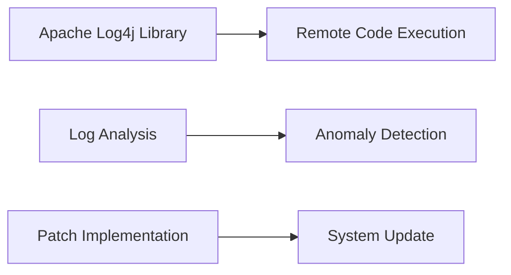
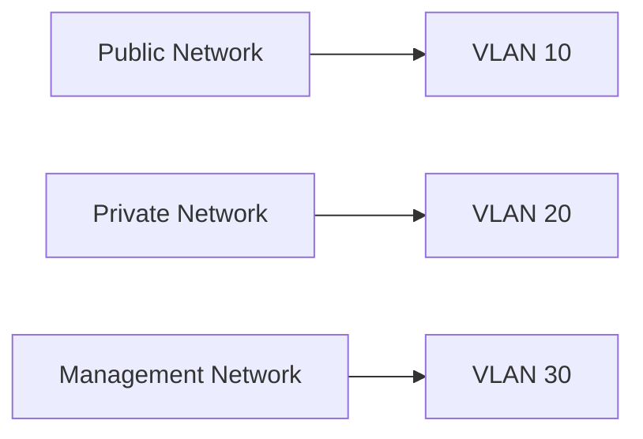

## Understanding the Incident Response Workflow

### Introduction to Incident Response Lifecycle

Incident response is a critical component of cybersecurity, designed to minimize damage and reduce recovery time after a security breach. The National Institute of Standards and Technology (NIST) provides a widely accepted framework for incident response, which consists of four main phases:

1. **Preparation**
2. **Detection and Analysis**
3. **Containment, Eradication, and Recovery**
4. **Post-Incident Activity**

In this module, we will focus on the middle two stages: **Detection and Analysis** and **Containment, Eradication, and Recovery**. These stages are crucial because they involve identifying the breach, analyzing the extent of the damage, and taking immediate actions to mitigate the threat.

### Detection and Analysis

#### Automated Workflow

The first step in the detection and analysis phase is the collection and monitoring of logs. Logs are records of events that occur within a system, such as login attempts, file accesses, and network traffic. These logs are essential for detecting anomalies and potential security incidents.

**Log Generation and Capture**

Logs are generated and captured automatically by various systems, including servers, firewalls, intrusion detection systems (IDS), and other security tools. These logs can be stored locally on the systems or aggregated into a centralized logging solution.



**Security Information and Event Management (SIEM)**

One common approach to aggregating and analyzing logs is through a Security Information and Event Management (SIEM) system. SIEM solutions collect logs from multiple sources, correlate them, and provide real-time alerts based on predefined rules.



#### Manual Workflow

Once the logs are collected, they need to be analyzed manually. This involves inspecting the logs for anomalies and patterns that indicate a security incident. Anomalies can include unusual login attempts, unexpected network traffic, or unauthorized access to sensitive data.

**Anomaly Detection**

Anomaly detection involves comparing the current log data against historical data and known baselines. Any deviations from the norm are flagged for further investigation. This process can be automated using machine learning algorithms that learn normal behavior over time.



### Investigation by Analysts

Once anomalies are detected, they are passed to Security Operations Center (SOC) analysts for further investigation. The SOC analysts are responsible for separating true incidents from false positives.

**True Incidents vs. False Positives**

A true incident is an event that indicates a genuine security breach, such as unauthorized access or data exfiltration. A false positive, on the other hand, is an alert that does not correspond to an actual security issue, such as a benign network scan.

**Investigation Process**

The investigation process involves reviewing the logs, analyzing the context of the anomaly, and determining whether it represents a real threat. This may involve checking user accounts, reviewing network traffic, and examining system configurations.



### Incident Responder Assignment

Once the analyst identifies the items that require further action, an incident responder is assigned to the case. The incident responder follows defined procedures to analyze the incident further and identify how to contain and recover from the current incident.

**Defined Procedures**

The procedures followed by the incident responder include:

1. **Initial Assessment**: Determine the scope and impact of the incident.
2. **Containment**: Isolate affected systems to prevent further damage.
3. **Eradication**: Remove the threat from the environment.
4. **Recovery**: Restore systems to their original state.
5. **Post-Incident Review**: Conduct a post-mortem to identify lessons learned and improve future responses.



### Escalation to Subject Matter Experts

Sometimes the incident handler has to escalate to specialist subject matter experts (SMEs). SMEs are individuals with deep knowledge in specific areas, such as malware analysis, network forensics, or cryptography. They can provide specialized expertise to help resolve complex incidents.

**Escalation Process**

The escalation process involves:

1. **Identifying the Need for SMEs**: Determine if the incident requires specialized knowledge.
2. **Contacting SMEs**: Reach out to the appropriate SMEs for assistance.
3. **Collaborative Analysis**: Work together with SMEs to analyze the incident and develop a plan of action.



### Real-World Examples

#### Recent Breaches

Recent high-profile breaches have highlighted the importance of effective incident response. For example, the SolarWinds supply chain attack in 2020 involved sophisticated malware that compromised multiple organizations. The attackers used a backdoor in SolarWinds software to gain access to networks and steal sensitive data.

**SolarWinds Supply Chain Attack**

The SolarWinds attack was detected through anomaly detection in network traffic and log analysis. The attackers were identified by analyzing the patterns of network activity and correlating it with known malicious behavior.



#### CVE Examples

Common Vulnerabilities and Exposures (CVE) entries provide detailed information about specific vulnerabilities. For example, CVE-2021-44228, also known as the Log4j vulnerability, was a critical flaw in the Apache Log4j library that allowed remote code execution.

**CVE-2021-44228 (Log4j Vulnerability)**

The Log4j vulnerability was detected through log analysis and anomaly detection. Organizations that were affected had to quickly implement patches and update their systems to mitigate the risk.



### How to Prevent / Defend

#### Detection and Analysis

**Detection Strategies**

To effectively detect security incidents, organizations should implement the following strategies:

1. **Centralized Logging**: Aggregate logs from multiple sources into a centralized logging solution.
2. **Real-Time Monitoring**: Use SIEM solutions to monitor logs in real-time and generate alerts based on predefined rules.
3. **Anomaly Detection**: Implement machine learning algorithms to detect anomalies in log data.

**Example Configuration**

Here is an example configuration for a centralized logging solution using ELK Stack (Elasticsearch, Logstash, Kibana):

```yaml
input {
  beats {
    port => 5044
  }
}

filter {
  grok {
    match => { "message" => "%{COMBINEDAPACHELOG}" }
  }
}

output {
  elasticsearch {
    hosts => ["localhost:9200"]
    index => "logs-%{+YYYY.MM.dd}"
  }
}
```

**Secure Coding Practices**

To prevent false positives, organizations should implement secure coding practices to ensure that legitimate activities do not trigger alerts. This includes:

1. **Least Privilege Principle**: Ensure that users and processes have only the minimum permissions necessary to perform their tasks.
2. **Input Validation**: Validate all inputs to prevent injection attacks.
3. **Error Handling**: Implement proper error handling to avoid exposing sensitive information.

**Example Secure Code**

Here is an example of secure code that validates user input:

```python
def validate_input(user_input):
    if not isinstance(user_input, str):
        raise ValueError("Input must be a string")
    if len(user_input) > 100:
        raise ValueError("Input too long")
    return user_input

try:
    user_input = validate_input(input("Enter your name: "))
except ValueError as e:
    print(f"Error: {e}")
```

#### Containment, Eradication, and Recovery

**Containment Strategies**

To effectively contain security incidents, organizations should implement the following strategies:

1. **Isolation**: Isolate affected systems to prevent further damage.
2. **Network Segmentation**: Segment the network to limit the spread of the threat.
3. **Access Control**: Restrict access to sensitive systems and data.

**Example Network Segmentation**

Here is an example of network segmentation using VLANs:



**Eradication Strategies**

To effectively eradicate security threats, organizations should implement the following strategies:

1. **Malware Removal**: Use antivirus software to remove malware from infected systems.
2. **System Reinstallation**: Reinstall operating systems and applications to ensure a clean environment.
3. **Patch Management**: Apply security patches to fix known vulnerabilities.

**Example Malware Removal**

Here is an example of using ClamAV to scan and remove malware:

```bash
# Install ClamAV
sudo apt-get install clamav

# Update virus definitions
sudo freshclam

# Scan the system
clamscan -r /path/to/directory

# Remove detected malware
clamscan --remove /path/to/directory
```

**Recovery Strategies**

To effectively recover from security incidents, organizations should implement the following strategies:

1. **Data Backup**: Regularly backup data to ensure it can be restored in case of loss.
2. **Disaster Recovery Plan**: Develop a disaster recovery plan to guide the recovery process.
3. **Testing**: Test the recovery process regularly to ensure it works as expected.

**Example Disaster Recovery Plan**

Here is an example of a disaster recovery plan:

```yaml
disaster_recovery_plan:
  - backup_data:
      frequency: daily
      storage_location: offsite
  - restore_data:
      steps:
        - verify_backup
        - restore_from_backup
        - test_restored_data
  - test_recovery:
      frequency: monthly
      steps:
        - simulate_disaster
        - execute_recovery_plan
        - verify_recovery
```

### Conclusion

Effective incident response is critical for minimizing damage and reducing recovery time after a security breach. By implementing the strategies outlined in this module, organizations can detect, analyze, contain, eradicate, and recover from security incidents more effectively. The key is to have a well-defined incident response plan and to practice it regularly to ensure it works as expected.

### Practice Labs

For hands-on experience with incident response, consider the following labs:

- **PortSwigger Web Security Academy**: Offers interactive labs for web application security.
- **OWASP Juice Shop**: A deliberately insecure web application for practicing security testing.
- **DVWA (Damn Vulnerable Web Application)**: A PHP/MySQL web application that demonstrates web application vulnerabilities.
- **WebGoat**: An interactive training application that teaches web application security.

These labs provide practical experience in detecting and responding to security incidents, helping to reinforce the concepts covered in this module.

---
<!-- nav -->
[[01-Introduction to Incident Response Workflow|Introduction to Incident Response Workflow]] | [[DevSecOps/DevSecOps Bootcamp/08-Logging & Incident Response/05-Planning Your Incident Response Workflow/02-Incident Response Workflow/00-Overview|Overview]] | [[DevSecOps/DevSecOps Bootcamp/08-Logging & Incident Response/05-Planning Your Incident Response Workflow/02-Incident Response Workflow/03-Practice Questions & Answers|Practice Questions & Answers]]
