## Introduction to Indicators of Compromise (IOC)

Indicators of Compromise (IOC) are critical elements in the field of cybersecurity, particularly within the context of incident response and threat hunting. They serve as the first line of defense against potential security breaches by providing actionable intelligence about suspicious activities or anomalies within a system. Understanding and effectively utilizing IOCs can significantly enhance an organization’s ability to detect and respond to cyber threats proactively.

### What Are Indicators of Compromise?

An Indicator of Compromise (IOC) is a specific piece of evidence that suggests a security breach or malicious activity has occurred within a system. IOCs can take various forms, including but not limited to:

- **Malware signatures**: Unique identifiers associated with known malicious software.
- **IP addresses**: Known malicious IP addresses used by attackers.
- **File hashes**: Hash values of files that are known to be malicious.
- **URLs**: Links to malicious websites or phishing pages.
- **Behavioral patterns**: Unusual user behavior such as logins from unexpected locations or times.

### Why Are IOCs Important?

IOCs are crucial because they help organizations identify and respond to security incidents in a timely manner. By recognizing these indicators, security teams can take immediate action to mitigate the damage caused by a breach and prevent further attacks. This proactive approach is essential in today’s rapidly evolving threat landscape.

### How Do IOCs Work?

IOCs work by monitoring systems and networks for signs of malicious activity. Security tools and software can be configured to detect and alert on specific IOCs, allowing security teams to investigate and respond accordingly. The process typically involves the following steps:

1. **Detection**: Security tools scan for known IOCs.
2. **Alerting**: When an IOC is detected, an alert is generated.
3. **Investigation**: Security teams investigate the alert to determine if a breach has occurred.
4. **Response**: Appropriate actions are taken to contain and remediate the breach.

### Real-World Examples of IOCs

To better understand the practical application of IOCs, let’s consider some recent real-world examples:

#### Example 1: SolarWinds Supply Chain Attack (CVE-2020-1014)

In December 2020, the SolarWinds supply chain attack compromised numerous high-profile organizations, including government agencies and private companies. One of the key IOCs in this attack was the presence of a backdoor in the SolarWinds Orion software. This backdoor allowed attackers to gain unauthorized access to systems and steal sensitive data.

**Detection**:
Security teams could have detected this IOC by monitoring for unusual network traffic patterns or by checking for the presence of known malicious code in the SolarWinds software.

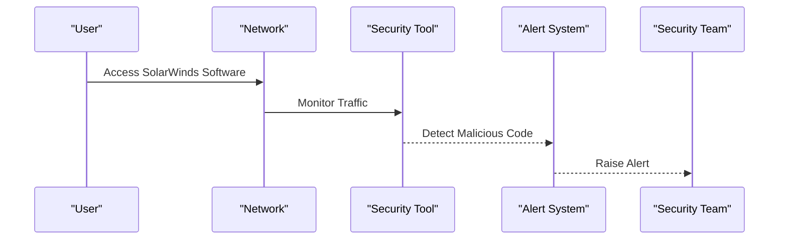

#### Example 2: Microsoft Exchange Server Vulnerabilities (CVE-2021-26855, CVE-2021-26857, CVE-2021-26858, CVE-2021-27065)

In March 2021, several vulnerabilities were discovered in Microsoft Exchange Server, leading to widespread exploitation by hackers. One of the IOCs in this case was the presence of unauthorized web shells on affected servers.

**Detection**:
Security teams could have detected this IOC by monitoring for unauthorized files or scripts on their Exchange servers.

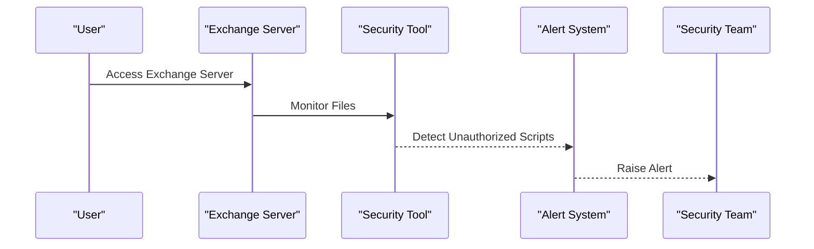

### Types of Indicators of Compromise

There are several types of IOCs that security teams should be aware of:

#### Malware Signatures

Malware signatures are unique identifiers associated with known malicious software. These signatures can be used to detect and block malware from executing on a system.

**Example**:
A known malware signature might be a specific hash value of a malicious file.

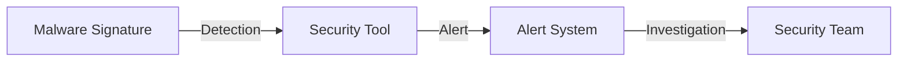

#### IP Addresses

IP addresses are often used by attackers to communicate with compromised systems. Monitoring for known malicious IP addresses can help detect and block these communications.

**Example**:
A known malicious IP address might be `192.168.1.1`.

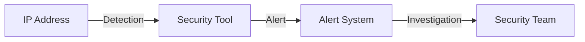

#### File Hashes

File hashes are unique identifiers associated with specific files. Monitoring for known malicious file hashes can help detect and block the execution of these files.

**Example**:
A known malicious file hash might be `SHA-256: abcdef1234567890`.

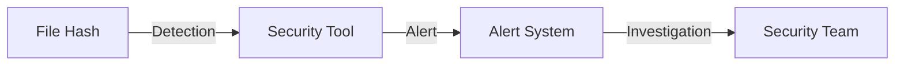

#### URLs

URLs are often used by attackers to distribute malicious content or to conduct phishing attacks. Monitoring for known malicious URLs can help detect and block these attacks.

**Example**:
A known malicious URL might be `http://maliciouswebsite.com`.

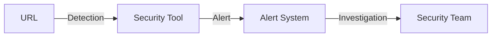

#### Behavioral Patterns

Behavioral patterns refer to unusual user behavior that may indicate a security breach. Monitoring for these patterns can help detect and respond to breaches in a timely manner.

**Example**:
Unusual login behavior might include logins from unexpected locations or times.

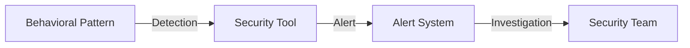

### How to Prevent / Defend Against IOCs

Preventing and defending against IOCs requires a comprehensive approach that includes both technical and procedural measures.

#### Detection

Detecting IOCs involves using security tools and software to monitor systems and networks for signs of malicious activity. This can be achieved through:

- **Real-time monitoring**: Continuously monitoring systems and networks for IOCs.
- **Automated alerts**: Configuring security tools to generate alerts when IOCs are detected.
- **Regular scans**: Conducting regular scans of systems and networks to detect IOCs.

#### Prevention

Preventing IOCs involves implementing security measures to reduce the likelihood of a breach occurring. This can be achieved through:

- **Patch management**: Regularly updating systems and software to patch known vulnerabilities.
- **Access control**: Implementing strict access controls to limit user privileges and prevent unauthorized access.
- **Employee training**: Educating employees on security best practices and how to recognize and report IOCs.

#### Secure Coding Fixes

Secure coding practices can help prevent IOCs by reducing the likelihood of vulnerabilities being exploited. This can be achieved through:

- **Input validation**: Validating user input to prevent injection attacks.
- **Error handling**: Properly handling errors to prevent information leakage.
- **Code reviews**: Conducting regular code reviews to identify and fix security vulnerabilities.

#### Configuration Hardening

Configuration hardening involves securing system configurations to reduce the attack surface. This can be achieved through:

- **Disabling unnecessary services**: Disabling services that are not required to reduce the attack surface.
- **Enforcing strong passwords**: Enforcing strong password policies to prevent brute-force attacks.
- **Limiting user privileges**: Limiting user privileges to prevent unauthorized access.

### Complete Example: Email Scanning Software

Let’s consider a complete example of how email scanning software can be used to detect and prevent spear-phishing emails.

#### Vulnerable Scenario

In a vulnerable scenario, an attacker sends a spear-phishing email to an employee. The email contains a malicious attachment that, when opened, installs malware on the employee’s workstation.

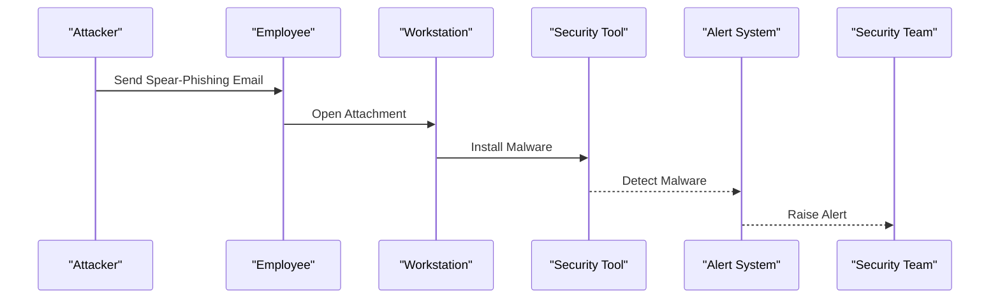

#### Secure Scenario

In a secure scenario, email scanning software is used to detect and block spear-phishing emails. The software scans incoming emails for known IOCs and generates alerts when suspicious activity is detected.

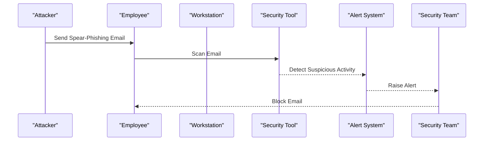

### Complete Example: Malware Signature Detection

Let’s consider a complete example of how malware signature detection can be used to prevent malware from being installed on a user’s workstation.

#### Vulnerable Scenario

In a vulnerable scenario, an attacker sends a malicious file to a user. The user downloads and opens the file, which installs malware on their workstation.

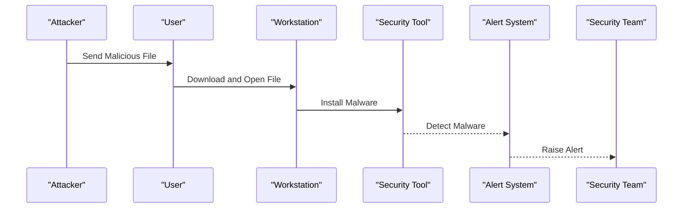

#### Secure Scenario

In a secure scenario, malware signature detection is used to prevent malware from being installed on a user’s workstation. The security tool scans the file for known malware signatures and blocks the installation if a match is found.

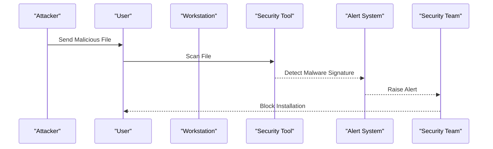

### Complete Example: Unusual Login Event Detection

Let’s consider a complete example of how unusual login event detection can be used to prevent unauthorized access to a system.

#### Vulnerable Scenario

In a vulnerable scenario, an attacker gains access to a user’s credentials and uses them to log in to the system from an unusual location or time.

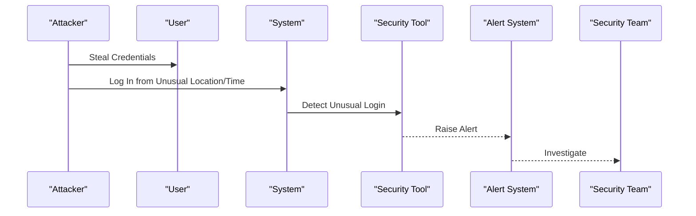

#### Secure Scenario

In a secure scenario, unusual login event detection is used to prevent unauthorized access to a system. The security tool monitors login events and generates alerts when unusual activity is detected.

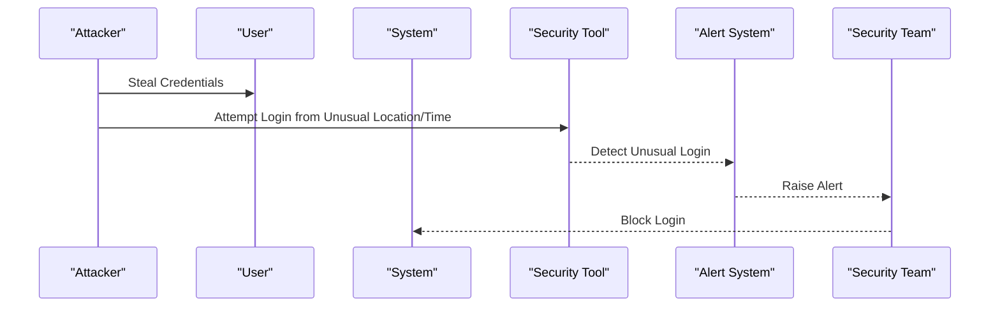

### Complete Example: Unusual Data Transfer Pattern Detection

Let’s consider a complete example of how unusual data transfer pattern detection can be used to prevent data exfiltration.

#### Vulnerant Scenario

In a vulnerable scenario, an attacker gains access to a user’s account and uses it to transfer large amounts of data to an external server.

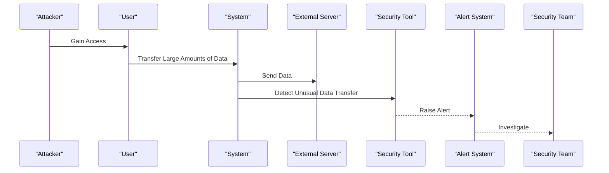

#### Secure Scenario

In a secure scenario, unusual data transfer pattern detection is used to prevent data exfiltration. The security tool monitors data transfer patterns and generates alerts when unusual activity is detected.

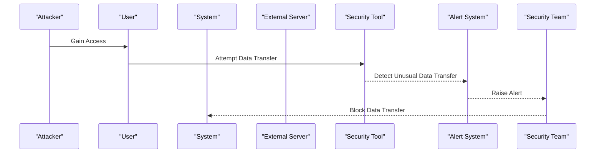

### Hands-On Labs

To gain practical experience with IOCs, consider the following hands-on labs:

- **PortSwigger Web Security Academy**: Offers interactive labs to practice detecting and responding to IOCs in web applications.
- **OWASP Juice Shop**: Provides a vulnerable web application to practice identifying and responding to IOCs.
- **DVWA (Damn Vulnerable Web Application)**: Allows users to practice identifying and responding to IOCs in a controlled environment.
- **WebGoat**: Offers a series of lessons to practice identifying and responding to IOCs in web applications.

By engaging in these hands-on labs, you can gain valuable experience in detecting and responding to IOCs, enhancing your skills in incident response and threat hunting.

### Conclusion

Indicators of Compromise (IOCs) play a crucial role in the field of cybersecurity, particularly within the context of incident response and threat hunting. By understanding and effectively utilizing IOCs, organizations can significantly enhance their ability to detect and respond to security incidents proactively. Through real-world examples, complete code, and mermaid diagrams, this chapter has provided a comprehensive overview of IOCs, their importance, and how to prevent and defend against them. By applying the knowledge and techniques covered in this chapter, you can become proficient in identifying and responding to IOCs, ensuring the security of your systems and networks.

---
<!-- nav -->
[[DevSecOps/DevSecOps Bootcamp/08-Logging & Incident Response/05-Planning Your Incident Response Workflow/03-Indicators of Compromise IOC/00-Overview|Overview]] | [[DevSecOps/DevSecOps Bootcamp/08-Logging & Incident Response/05-Planning Your Incident Response Workflow/03-Indicators of Compromise IOC/02-Practice Questions & Answers|Practice Questions & Answers]]
