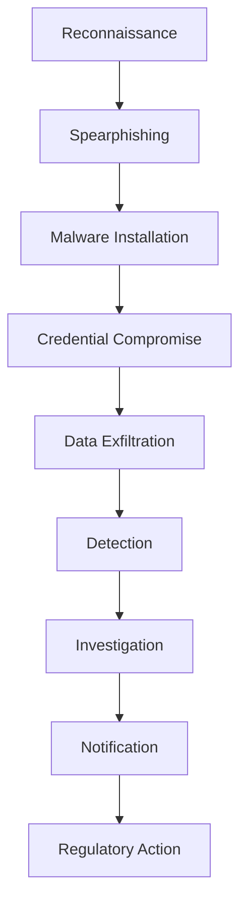
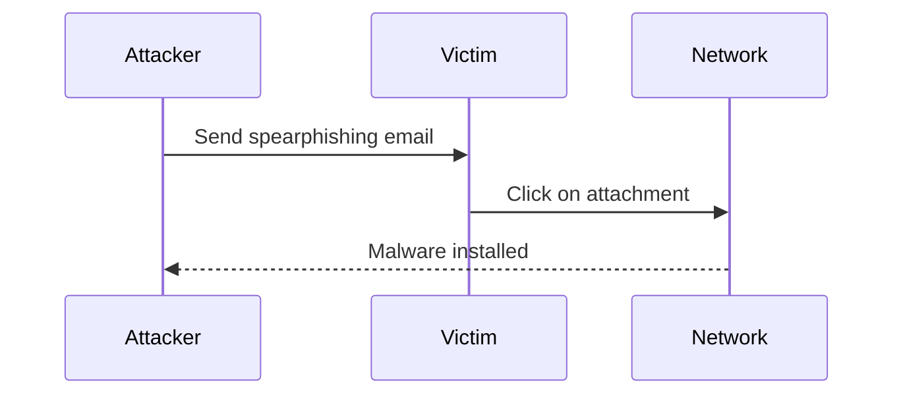
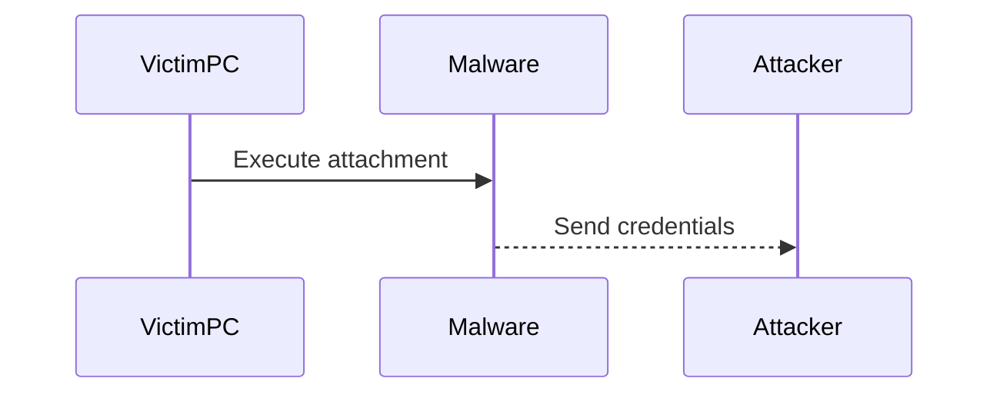
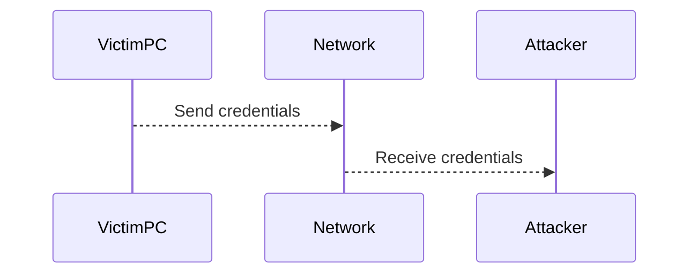
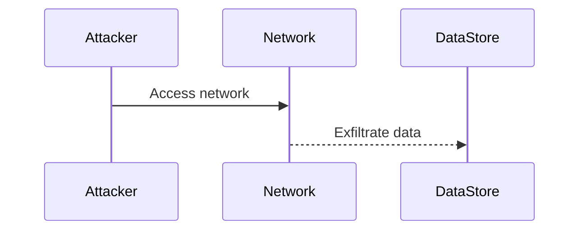
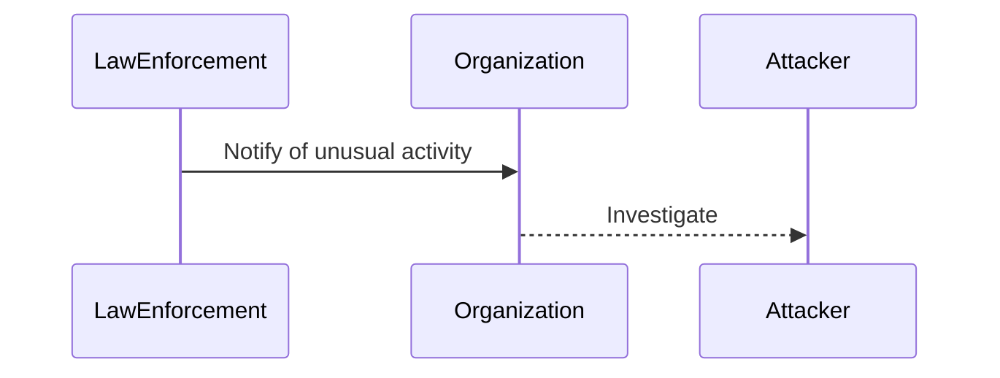
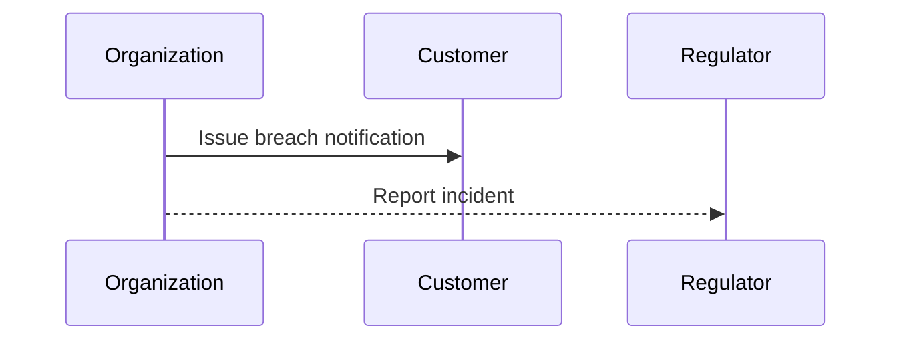

## Understanding the Concept of "Left of Breach"

The phrase "left of breach" is a strategic approach used by organizations to prevent data breaches before they occur. This concept emphasizes proactive measures and early detection to mitigate potential threats. To fully understand this concept, let's break down the typical timeline leading up to a data breach and explore each phase in detail.

### Typical Timeline to a Data Breach

#### Reconnaissance Phase

**Reconnaissance** is the initial phase where an attacker gathers information about the target organization. This often involves using social media, public websites, and other publicly available resources to gather details such as employee names, roles, and contact information.

**Example**: In the Equifax data breach of 2017, attackers exploited a vulnerability in the Apache Struts framework. Prior to exploiting this vulnerability, the attackers likely conducted extensive reconnaissance to identify potential entry points.



#### Spearphishing Email

Once the attacker has gathered sufficient information, they will craft a **spearphishing email** targeting specific individuals within the organization. These emails are designed to appear legitimate and often contain malicious attachments or links.

**Example**: In the SolarWinds supply chain attack of 2020, attackers used spearphishing emails to compromise SolarWinds' systems. The emails were crafted to look like legitimate business communications, making them difficult to detect.



#### Malware Installation

When the victim clicks on the malicious attachment or link, malware is installed on their local PC. This malware can range from simple keyloggers to sophisticated remote access tools.

**Example**: The Emotet malware, first discovered in 2014, is a banking Trojan that spreads via phishing emails. Once installed, it can steal sensitive information and provide remote access to the attacker.



#### Credential Compromise

With the malware installed, the attacker can now steal the victim's network credentials. These credentials are then used to gain unauthorized access to the organization's network.

**Example**: In the Target data breach of 2013, attackers gained access to the network through stolen credentials obtained from a third-party HVAC contractor.



#### Data Exfiltration

Using the stolen credentials, the attacker can now exfiltrate sensitive data from the organization. This data can include customer records, financial information, and intellectual property.

**Example**: In the Capital One data breach of 2019, attackers accessed over 100 million customer records by exploiting a misconfigured web application firewall.



#### Detection and Investigation

It can take months or even years for the organization to detect the breach. Often, the breach is detected by external parties such as law enforcement or security researchers.

**Example**: In the Yahoo data breach of 2013, the breach was not discovered until 2016 when Yahoo disclosed that all three billion user accounts had been compromised.



#### Notification and Regulatory Action

Once the breach is confirmed, the organization must notify affected customers and regulatory bodies. This can lead to significant financial penalties and legal consequences.

**Example**: In the Uber data breach of 2016, the company paid a $148 million settlement to the U.S. Department of Transportation for failing to disclose the breach in a timely manner.



### How to Prevent / Defend Against Data Breaches

#### Proactive Measures

To prevent data breaches, organizations should implement proactive measures such as:

- **Employee Training**: Regular training sessions to educate employees about phishing attacks and safe computing practices.
- **Multi-Factor Authentication (MFA)**: Implement MFA to add an additional layer of security to user authentication.
- **Patch Management**: Ensure all systems are regularly patched and updated to protect against known vulnerabilities.
- **Network Segmentation**: Segment the network to limit the spread of malware and restrict access to sensitive data.

#### Early Detection

Early detection is crucial to minimizing the impact of a breach. Organizations should:

- **Implement Intrusion Detection Systems (IDS)**: Use IDS to monitor network traffic and detect suspicious activity.
- **Conduct Regular Audits**: Perform regular security audits to identify and address vulnerabilities.
- **Use Threat Intelligence**: Leverage threat intelligence feeds to stay informed about emerging threats and vulnerabilities.

#### Secure Coding Practices

Secure coding practices can help prevent vulnerabilities that can be exploited by attackers. Examples include:

- **Input Validation**: Validate all user inputs to prevent injection attacks.
- **Error Handling**: Properly handle errors to avoid exposing sensitive information.
- **Least Privilege Principle**: Ensure that applications and services run with the least privileges necessary.

#### Example: Secure vs. Vulnerable Code

Consider a simple login form where user input is not properly validated:

**Vulnerable Code**:
```python
def login(username, password):
    if username == "admin" and password == "password":
        return "Login successful"
    else:
        return "Invalid credentials"
```

**Secure Code**:
```python
import re

def validate_input(input_str):
    if re.match(r'^[\w.-]+$', input_str):
        return True
    return False

def login(username, password):
    if validate_input(username) and validate_input(password):
        if username == "admin" and password == "password":
            return "Login successful"
        else:
            return "Invalid credentials"
    else:
        return "Invalid input"
```

#### Configuration Hardening

Hardening configurations can help prevent unauthorized access and reduce the attack surface. Examples include:

- **Firewall Configuration**: Configure firewalls to allow only necessary traffic.
- **Access Control Lists (ACLs)**: Use ACLs to control access to sensitive resources.
- **Secure Default Settings**: Ensure that default settings are secure and do not expose unnecessary information.

#### Real-World Example: Equifax Data Breach

In the Equifax data breach of 2017, attackers exploited a vulnerability in the Apache Struts framework. This breach could have been prevented with proper patch management and intrusion detection systems.

**Detection**:
Equifax could have implemented an IDS to detect the exploitation of the Apache Struts vulnerability. Additionally, regular security audits would have identified the unpatched system.

**Prevention**:
Proper patch management would have ensured that the Apache Struts framework was up-to-date and protected against known vulnerabilities. Multi-factor authentication could have added an additional layer of security to user authentication.

### Hands-On Labs

For hands-on practice in planning your incident response workflow, consider the following labs:

- **PortSwigger Web Security Academy**: Offers interactive labs to practice identifying and mitigating various web security vulnerabilities.
- **OWASP Juice Shop**: A deliberately insecure web application for practicing web security skills.
- **DVWA (Damn Vulnerable Web Application)**: A PHP/MySQL web application that demonstrates web application vulnerabilities.

By implementing these proactive measures and conducting regular security audits, organizations can significantly reduce the risk of data breaches and improve their overall security posture.

---

This expanded chapter provides a comprehensive overview of the "left of breach" concept, detailing each phase of a typical data breach timeline and offering practical advice on how to prevent and defend against such incidents.

---
<!-- nav -->
[[DevSecOps/DevSecOps Bootcamp/08-Logging & Incident Response/05-Planning Your Incident Response Workflow/04-Left of Breach/00-Overview|Overview]] | [[02-Planning Your Incident Response Workflow Left of Breach|Planning Your Incident Response Workflow Left of Breach]]
