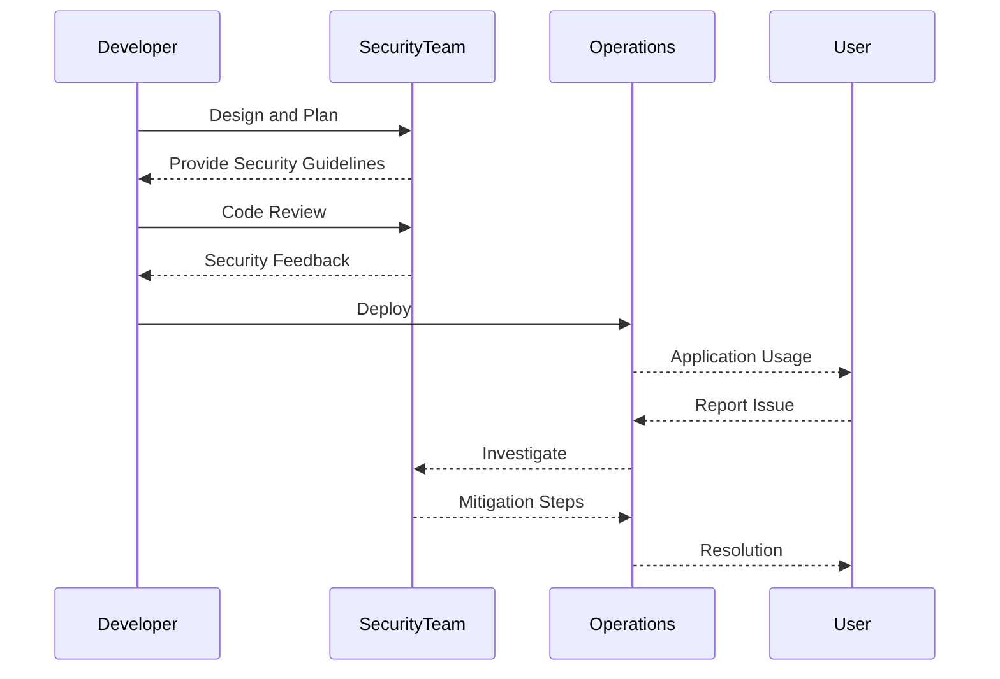

## Planning Your Incident Response Workflow: Left of Breach

### Understanding the Concept of "Left of Breach"

The term "left of breach" refers to the proactive approach of identifying and mitigating potential security threats before they can cause harm. This concept is rooted in the idea that the earlier you can detect and respond to a threat, the less damage it will cause. In the context of DevSecOps, moving left means integrating security practices into the earliest stages of the development lifecycle, from planning and design to coding and testing.

#### Why Move Left?

Moving left is crucial because it allows organizations to catch vulnerabilities and security issues early in the development process. This is important for several reasons:

1. **Cost Efficiency**: Fixing bugs and vulnerabilities early in the development cycle is significantly cheaper than addressing them after deployment. According to a study by the National Institute of Standards and Technology (NIST), fixing a vulnerability during the design phase costs about $1, whereas fixing the same issue post-deployment can cost up to $30.

2. **Reduced Risk**: Early detection and mitigation reduce the likelihood of a successful attack. By addressing security concerns proactively, organizations can prevent breaches from occurring in the first place.

3. **Improved Quality**: Integrating security into the development process improves the overall quality of the application. Secure coding practices lead to more robust and reliable software.

### Background Theory

To understand the importance of moving left, it's essential to delve into the principles of DevSecOps. DevSecOps is an approach that integrates security practices into the entire software development lifecycle (SDLC). This includes continuous integration, continuous delivery (CI/CD), and automated testing.

#### Key Principles of DevSecOps

1. **Shift Left**: Integrate security into the earliest stages of development.
2. **Continuous Monitoring**: Continuously monitor applications for vulnerabilities and security issues.
3. **Automated Testing**: Use automated tools to test for security vulnerabilities.
4. **Collaboration**: Foster collaboration between developers, security teams, and operations teams.

### Real-World Examples

Recent high-profile breaches highlight the importance of moving left. For instance, the SolarWinds breach in 2020, which affected numerous government agencies and private companies, was a result of a supply chain attack. The attackers compromised SolarWinds' software update mechanism, allowing them to inject malicious code into legitimate updates. This breach could have been prevented if the organization had implemented stronger security measures earlier in the development process.

Another example is the Capital One breach in 2019, where an attacker exploited a misconfigured web application firewall (WAF) to gain access to sensitive customer data. This breach could have been avoided if the organization had conducted thorough security testing and implemented proper configuration management practices.

### Complete Code Examples

Let's consider a simple example of how moving left can be applied in practice. Suppose you are developing a web application that handles user data. Here’s how you can integrate security practices into the development process:

#### Vulnerable Code Example

```python
# Vulnerable code example
def login(username, password):
    # Check if the username and password match
    if username == "admin" and password == "password":
        return True
    else:
        return False
```

This code is vulnerable to brute-force attacks and does not implement proper authentication mechanisms.

#### Secure Code Example

```python
# Secure code example
import hashlib

def hash_password(password):
    # Hash the password using SHA-256
    return hashlib.sha256(password.encode()).hexdigest()

def login(username, password):
    # Retrieve the hashed password from the database
    stored_password = get_stored_password_from_db(username)
    
    # Compare the hashed input password with the stored hashed password
    if hash_password(password) == stored_password:
        return True
    else:
        return False
```

In the secure code example, we use a hashing function to store passwords securely. This prevents attackers from easily obtaining plaintext passwords.

### Mermaid Diagrams

To visualize the concept of moving left, let's create a sequence diagram showing the different stages of the SDLC and where security practices should be integrated.



### Pitfalls and Common Mistakes

While moving left is crucial, there are several pitfalls and common mistakes to avoid:

1. **Overlooking Security in Early Stages**: Many organizations focus solely on functional requirements in the early stages of development and neglect security considerations. This can lead to significant vulnerabilities being introduced later in the process.

2. **Insufficient Training**: Developers may lack the necessary training and knowledge to implement secure coding practices. Organizations should invest in regular security training and awareness programs.

3. **Lack of Automation**: Manual security testing is time-consuming and error-prone. Organizations should leverage automated tools and continuous integration pipelines to ensure consistent security testing.

### How to Prevent / Defend

#### Detection

To detect potential security issues early, organizations should implement continuous monitoring and automated testing. This includes:

1. **Static Application Security Testing (SAST)**: Tools like SonarQube and Fortify can analyze source code for security vulnerabilities.
2. **Dynamic Application Security Testing (DAST)**: Tools like Burp Suite and OWASP ZAP can simulate attacks on running applications to identify vulnerabilities.
3. **Dependency Scanning**: Tools like Snyk and WhiteSource can scan dependencies for known vulnerabilities.

#### Prevention

To prevent security issues, organizations should:

1. **Implement Secure Coding Practices**: Follow best practices such as input validation, output encoding, and secure storage of sensitive data.
2. **Use Automated Tools**: Leverage automated tools to enforce security policies and detect vulnerabilities.
3. **Conduct Regular Security Audits**: Perform regular security audits and penetration testing to identify and mitigate vulnerabilities.

#### Secure-Coding Fixes

Here’s an example of a vulnerable code snippet and its secure counterpart:

**Vulnerable Code**

```python
# Vulnerable code example
def login(username, password):
    # Check if the username and password match
    if username == "admin" and password == "password":
        return True
    else:
        return False
```

**Secure Code**

```python
# Secure code example
import hashlib

def hash_password(password):
    # Hash the password using SHA-256
    return hashlib.sha256(password.encode()).hexdigest()

def login(username, password):
    # Retrieve the hashed password from the database
    stored_password = get_stored_password_from_db(username)
    
    # Compare the hashed input password with the stored hashed password
    if hash_password(password) == stored_password:
        return True
    else:
        return False
```

### Configuration Hardening

Configuration hardening is another critical aspect of moving left. Here’s an example of how to configure an Nginx server securely:

**Insecure Configuration**

```nginx
server {
    listen 80;
    server_name example.com;

    location / {
        root /var/www/html;
        index index.html index.htm;
    }
}
```

**Secure Configuration**

```nginx
server {
    listen 80 default_server;
    server_name example.com;

    location / {
        root /var/www/html;
        index index.html index.htm;
        try_files $uri $uri/ =404;
    }

    location ~ /\.ht {
        deny all;
    }

    location ~* \.(js|css|png|jpg|jpeg|gif)$ {
        expires 30d;
    }
}
```

### Detection and Prevention Tools

To effectively move left, organizations should use a combination of tools and techniques:

1. **Static Application Security Testing (SAST) Tools**: SonarQube, Fortify
2. **Dynamic Application Security Testing (DAST) Tools**: Burp Suite, OWASP ZAP
3. **Dependency Scanning Tools**: Snyk, WhiteSource
4. **Penetration Testing Tools**: Metasploit, Kali Linux
5. **Configuration Management Tools**: Ansible, Puppet, Chef

### Practice Labs

For hands-on experience with incident response workflow and moving left, consider the following labs:

- **PortSwigger Web Security Academy**: Offers interactive labs to learn web security concepts and techniques.
- **OWASP Juice Shop**: A deliberately insecure web application to practice security testing and vulnerability identification.
- **DVWA (Damn Vulnerable Web Application)**: A PHP/MySQL web application that contains a large number of security vulnerabilities.

By integrating these practices and tools into your development process, you can significantly reduce the risk of data breaches and improve the overall security posture of your applications.

---
<!-- nav -->
[[01-Understanding the Concept of Left of Breach|Understanding the Concept of Left of Breach]] | [[DevSecOps/DevSecOps Bootcamp/08-Logging & Incident Response/05-Planning Your Incident Response Workflow/04-Left of Breach/00-Overview|Overview]] | [[DevSecOps/DevSecOps Bootcamp/08-Logging & Incident Response/05-Planning Your Incident Response Workflow/04-Left of Breach/03-Practice Questions & Answers|Practice Questions & Answers]]
