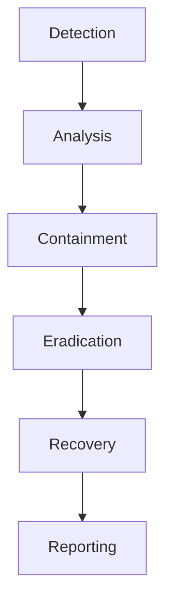
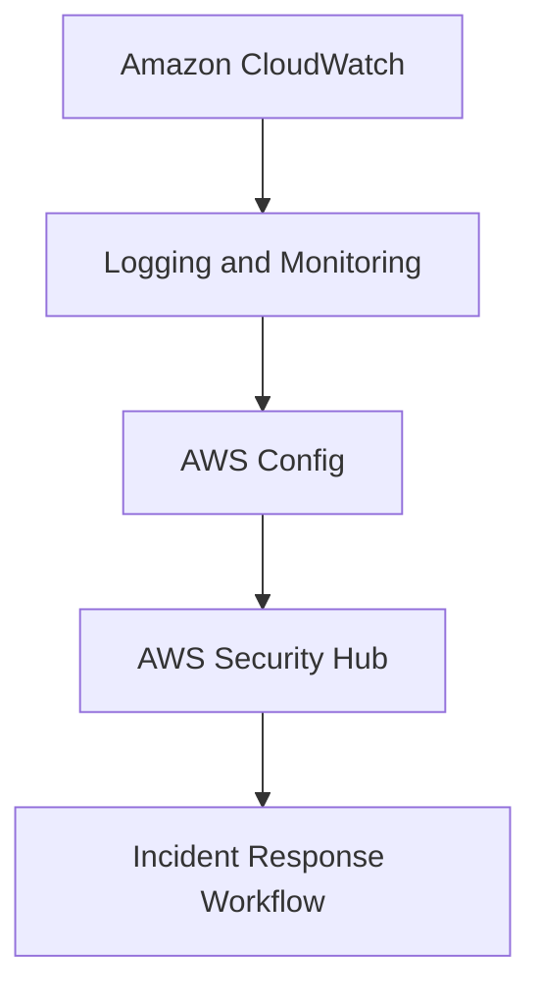
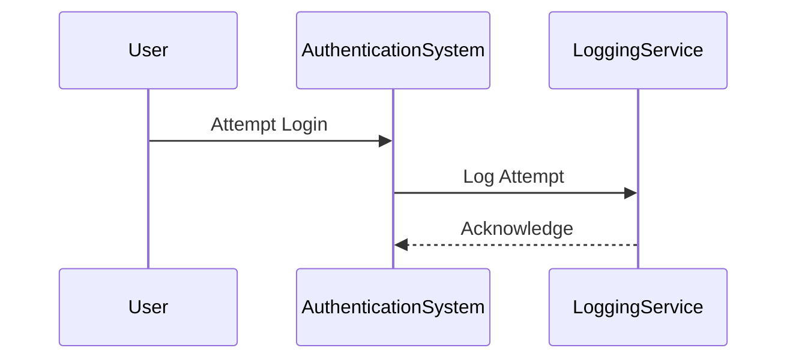

## Planning Your Incident Response Workflow

### Introduction to Incident Response

Incident response is a critical component of any organization's cybersecurity strategy. It involves the identification, analysis, containment, eradication, recovery, and reporting of security incidents. The goal is to minimize damage, reduce recovery time, and prevent future occurrences. A well-planned incident response workflow ensures that an organization can quickly and effectively respond to security threats.

### Decomposing a Typical Scenario for Incident Response

To understand the importance of a structured incident response workflow, let's break down a typical scenario:

1. **Identification**: Detecting that an incident has occurred.
2. **Analysis**: Understanding the nature and scope of the incident.
3. **Containment**: Limiting the spread of the incident.
4. **Eradication**: Removing the threat completely.
5. **Recovery**: Restoring systems to normal operation.
6. **Reporting**: Documenting the incident and lessons learned.

#### Importance of Logging and Monitoring

Logging and monitoring are fundamental to effective incident response. They provide the necessary data to identify and analyze security incidents.

- **Logging**: Capturing detailed records of system activity. Logs can include authentication attempts, file access, network traffic, and application events.
- **Monitoring**: Real-time analysis of logs and system behavior to detect anomalies and potential threats.

**Why Both Activities Are Needed**

- **Logging**: Provides a historical record that can be used for forensic analysis after an incident.
- **Monitoring**: Enables real-time detection and immediate response to ongoing threats.

**Example of Logging and Monitoring**

Consider a recent breach where attackers gained unauthorized access to a company's database. The incident was detected through monitoring tools that flagged unusual login attempts and database queries. The logs provided a detailed timeline of the attacker's actions, which was crucial for the forensic investigation.



### Designing an Incident Response Workflow

The design of an incident response workflow should align with the specific needs and resources of an organization. Here’s a step-by-step guide to designing such a workflow:

1. **Define Roles and Responsibilities**: Identify who will handle different aspects of the incident response process.
2. **Establish Communication Channels**: Ensure that all team members can communicate effectively during an incident.
3. **Create Playbooks**: Develop detailed procedures for handling various types of incidents.
4. **Integrate with Existing Systems**: Ensure that the incident response workflow integrates seamlessly with existing IT infrastructure and tools.

#### Mapping the Workflow to Physical Services

When mapping the incident response workflow to physical services, consider the following:

- **Cloud Service Providers**: Major cloud providers like AWS, Azure, and Google Cloud offer a range of services that can support incident response.
- **Security Tools**: Utilize tools like SIEM (Security Information and Event Management) systems, IDS/IPS (Intrusion Detection/Prevention Systems), and SOAR (Security Orchestration, Automation, and Response) platforms.

**Example: AWS Incident Response Workflow**

AWS provides several services that can be integrated into an incident response workflow:

- **Amazon CloudWatch**: For logging and monitoring.
- **AWS Config**: For compliance and change management.
- **AWS Security Hub**: For aggregating security findings and providing a unified view.



### Key Security Events to Log and Monitor

To ensure effective incident response, it is essential to define key security events that should be logged and monitored. These events can vary based on the type of system and the nature of the business.

#### Common Security Events

- **Authentication Attempts**: Successful and failed login attempts.
- **File Access**: Changes to critical files and directories.
- **Network Traffic**: Unusual outbound traffic or connections to known malicious IP addresses.
- **Application Errors**: Unexpected errors or crashes in applications.

**Example: Logging Authentication Attempts**



### How to Prevent / Defend

#### Detection

- **Real-Time Alerts**: Set up alerts for suspicious activities.
- **Log Analysis**: Regularly review logs for signs of compromise.

#### Prevention

- **Access Controls**: Implement strict access controls and least privilege principles.
- **Patch Management**: Keep systems and applications up to date with the latest security patches.

#### Secure Coding Fixes

**Vulnerable Code Example**

```python
# Vulnerable code: Insecure password storage
def store_password(username, password):
    with open('passwords.txt', 'a') as f:
        f.write(f"{username}:{password}\n")
```

**Secure Code Example**

```python
# Secure code: Hashed password storage
import hashlib

def store_password(username, password):
    hashed_password = hashlib.sha256(password.encode()).hexdigest()
    with open('passwords.txt', 'a') as f:
        f.write(f"{username}:{hashed_password}\n")
```

### Complete Example: Full HTTP Request and Response

Consider a scenario where an attacker attempts to exploit a SQL injection vulnerability. The following is a complete HTTP request and response:

**HTTP Request**

```http
POST /login HTTP/1.1
Host: example.com
Content-Type: application/x-www-form-urlencoded
Content-Length: 28

username=admin' OR '1'='1&password=anything
```

**HTTP Response**

```http
HTTP/1.1 200 OK
Date: Mon, 23 Jan 2023 12:00:00 GMT
Server: Apache/2.4.41 (Ubuntu)
Content-Length: 102
Content-Type: text/html; charset=UTF-8

<!DOCTYPE html>
<html>
<head>
<title>Login</title>
</head>
<body>
<h1>Welcome, admin!</h1>
</body>
</html>
```

### Pitfalls and Common Mistakes

- **Ignoring Logs**: Not reviewing logs regularly can lead to missed incidents.
- **Over-reliance on Automated Tools**: While automation is crucial, human oversight is also important.
- **Incomplete Playbooks**: Playbooks should cover all possible scenarios and be regularly updated.

### Hands-On Labs

For practical experience in planning and implementing an incident response workflow, consider the following labs:

- **PortSwigger Web Security Academy**: Offers modules on incident response and security monitoring.
- **OWASP Juice Shop**: A deliberately insecure web application for practicing security testing and incident response.
- **DVWA (Damn Vulnerable Web Application)**: Another web application with intentional vulnerabilities for security training.

By thoroughly understanding and implementing these concepts, organizations can significantly enhance their ability to respond to security incidents effectively.

---
<!-- nav -->
[[DevSecOps/DevSecOps Bootcamp/08-Logging & Incident Response/05-Planning Your Incident Response Workflow/05-Module Summary/00-Overview|Overview]] | [[DevSecOps/DevSecOps Bootcamp/08-Logging & Incident Response/05-Planning Your Incident Response Workflow/05-Module Summary/02-Practice Questions & Answers|Practice Questions & Answers]]
