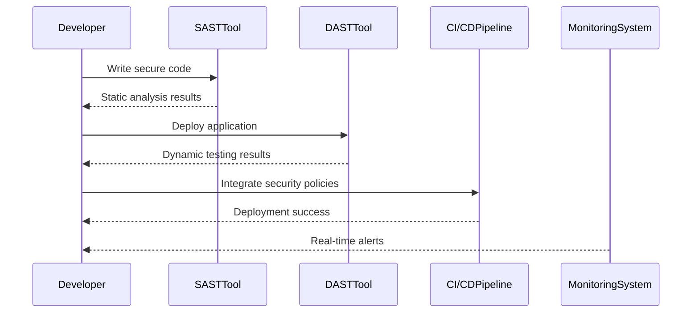
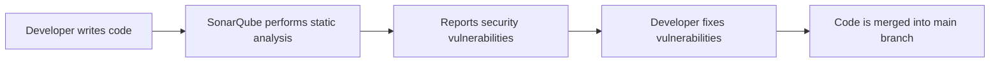

## Introduction to Certified DevSecOps Practitioner Credential

The Certified DevSecOps Practitioner (CDO) credential is a significant milestone in the journey of professionals working in the DevSecOps domain. This certification validates that an individual has mastered the essential skills and knowledge required to integrate security practices into the continuous development and deployment processes. By obtaining this certification, professionals can demonstrate their expertise in creating secure and reliable software systems.

### What is DevSecOps?

DevSecOps is an approach that integrates security practices into the entire software development lifecycle (SDLC). It emphasizes the collaboration between development, operations, and security teams to ensure that security is not an afterthought but an integral part of the development process. The goal is to identify and mitigate security risks early in the development cycle, thereby reducing the likelihood of vulnerabilities making it into production.

#### Why DevSecOps Matters

In today’s digital landscape, security threats are becoming increasingly sophisticated and frequent. Traditional security approaches often involve a separate security team that reviews code and infrastructure post-deployment. This approach can lead to delays and missed vulnerabilities. DevSecOps addresses these issues by embedding security practices throughout the SDLC, ensuring that security is considered at every stage of development and deployment.

#### How DevSecOps Works

DevSecOps operates on the principle of continuous integration and continuous delivery (CI/CD). Here’s a high-level overview of how it works:

1. **Code Development**: Developers write code using secure coding practices.
2. **Static Code Analysis**: Automated tools scan the code for potential security vulnerabilities.
3. **Dynamic Testing**: Automated testing frameworks simulate attacks to identify runtime vulnerabilities.
4. **Security Policies**: Security policies are integrated into the CI/CD pipeline to enforce compliance.
5. **Deployment**: Secure configurations and hardened environments are used during deployment.
6. **Monitoring and Incident Response**: Continuous monitoring detects and responds to security incidents in real-time.

### Applying for the CDO Certification

To apply for the Certified DevSecOps Practitioner (CDO) credential, candidates must demonstrate proficiency in several key areas:

- **Secure Coding Practices**
- **Automated Security Testing**
- **Infrastructure as Code (IaC) Security**
- **Continuous Integration and Continuous Delivery (CI/CD)**
- **Incident Response and Monitoring**

#### Prerequisites

Before applying for the CDO certification, candidates should have completed a comprehensive DevSecOps training program. This typically includes hands-on experience with tools and technologies such as:

- **Static Application Security Testing (SAST) Tools**: SonarQube, Fortify
- **Dynamic Application Security Testing (DAST) Tools**: Burp Suite, OWASP ZAP
- **Infrastructure as Code (IaC) Tools**: Terraform, Ansible
- **CI/CD Tools**: Jenkins, GitLab CI, CircleCI
- **Monitoring and Logging Tools**: ELK Stack, Splunk

### Real-World Examples and Recent Breaches

Understanding the practical implications of DevSecOps principles can be enhanced by examining recent security breaches and vulnerabilities. Here are a few notable examples:

#### Example 1: Capital One Data Breach (CVE-2019-11510)

**Description**: In 2019, Capital One suffered a data breach affecting over 100 million customers. The breach was caused by a misconfigured web application firewall (WAF) that allowed unauthorized access to sensitive customer data.

**Impact**: This breach resulted in significant financial losses and reputational damage for Capital One.

**How DevSecOps Could Have Helped**: Implementing DevSecOps practices could have included regular security audits of WAF configurations, automated testing for misconfigurations, and continuous monitoring to detect unusual access patterns.



#### Example 2: Equifax Data Breach (CVE-2017-5638)

**Description**: In 2017, Equifax suffered a massive data breach affecting 147 million consumers. The breach was caused by a vulnerability in Apache Struts, which was not patched in a timely manner.

**Impact**: This breach led to significant financial losses and legal consequences for Equifax.

**How DevSecOps Could Have Helped**: Implementing DevSecOps practices could have included regular vulnerability scanning, automated patch management, and continuous monitoring to detect and respond to security incidents promptly.

### Common Pitfalls and How to Avoid Them

#### Pitfall 1: Lack of Automation

**Issue**: Manual security testing and auditing can be time-consuming and prone to human error.

**Solution**: Automate security testing and auditing processes using tools like SonarQube, Burp Suite, and Jenkins. This ensures that security checks are performed consistently and efficiently.

#### Pitfall 2: Insufficient Monitoring

**Issue**: Without continuous monitoring, security incidents may go undetected until it is too late.

**Solution**: Implement real-time monitoring and logging solutions like the ELK Stack or Splunk. These tools provide visibility into system activities and help detect anomalies quickly.

#### Pitfall 3: Poor Configuration Management

**Issue**: Misconfigured systems and applications can introduce security vulnerabilities.

**Solution**: Use Infrastructure as Code (IaC) tools like Terraform and Ansible to manage configurations. This ensures that configurations are consistent, version-controlled, and easily auditable.

### How to Prevent / Defend

#### Secure Coding Practices

**Vulnerable Code Example**:
```python
def login(username, password):
    if username == "admin" and password == "password":
        return True
    else:
        return False
```

**Secure Code Example**:
```python
import hashlib

def hash_password(password):
    return hashlib.sha256(password.encode()).hexdigest()

def login(username, hashed_password):
    stored_hash = get_stored_hash(username)
    if stored_hash == hashed_password:
        return True
    else:
        return False
```

**Explanation**: The secure code example uses a hashing function to store passwords securely, preventing plain-text password storage.

#### Automated Security Testing

**Example**: Using SonarQube for static code analysis.



#### Infrastructure as Code (IaC) Security

**Example**: Using Terraform to manage infrastructure configurations.

```hcl
resource "aws_security_group" "web_sg" {
  name        = "web-sg"
  description = "Security group for web servers"

  ingress {
    from_port   = 80
    to_port     = 80
    protocol    = "tcp"
    cidr_blocks = ["0.0.0.0/0"]
  }

  egress {
    from_port   = 0
    to_port     = 0
    protocol    = "-1"
    cidr_blocks = ["0.0.0.0/0"]
  }
}
```

**Explanation**: This Terraform configuration defines a security group for web servers, ensuring that only necessary ports are open.

#### Continuous Integration and Continuous Delivery (CI/CD)

**Example**: Using Jenkins for CI/CD pipelines.

```yaml
pipeline {
    agent any
    stages {
        stage('Build') {
            steps {
                sh 'mvn clean package'
            }
        }
        stage('Test') {
            steps {
                sh 'mvn test'
            }
        }
        stage('Deploy') {
            steps {
                sh 'scp target/myapp.jar user@server:/opt/app/'
            }
        }
    }
}
```

**Explanation**: This Jenkins pipeline automates the build, test, and deployment processes, ensuring that security checks are integrated at each stage.

### Conclusion

Obtaining the Certified DevSecOps Practitioner (CDO) credential is a significant achievement that demonstrates proficiency in integrating security practices into the software development lifecycle. By mastering secure coding practices, automated security testing, Infrastructure as Code (IaC) security, continuous integration and delivery (CI/CD), and incident response and monitoring, professionals can significantly enhance the security of their software systems.

### Hands-On Labs

For hands-on practice, consider the following well-known labs:

- **PortSwigger Web Security Academy**: Offers interactive labs for learning web application security.
- **OWASP Juice Shop**: A deliberately insecure web application for practicing web security.
- **DVWA (Damn Vulnerable Web Application)**: A PHP/MySQL web application that is vulnerable by design.
- **WebGoat**: An interactive, gamified training application for learning about web application security.

By completing these labs, you can gain practical experience in applying DevSecOps principles and techniques.

Congratulations on your journey towards becoming a Certified DevSecOps Practitioner!

---
<!-- nav -->
[[DevSecOps/DevSecOps Bootcamp/09-Miscellaneous/01-Apply for the Certified DevSecOps Practitioner credential Digital Badge/00-Overview|Overview]] | [[DevSecOps/DevSecOps Bootcamp/09-Miscellaneous/01-Apply for the Certified DevSecOps Practitioner credential Digital Badge/02-Introduction to DevSecOps|Introduction to DevSecOps]]
