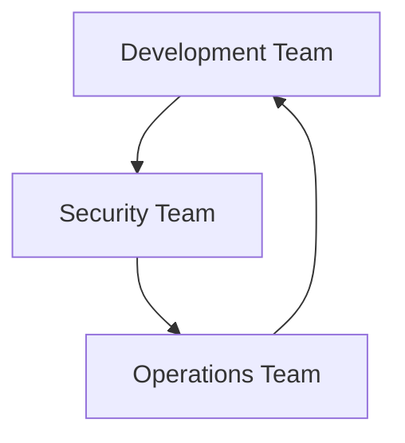
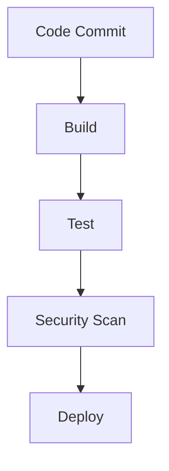

## Introduction to DevSecOps

Congratulations on completing the DevSecOps bootcamp! This is a significant milestone in your career as an engineer. DevSecOps, short for Development, Security, and Operations, is a methodology that integrates security practices into the entire software development lifecycle. This approach ensures that security is not an afterthought but is embedded throughout the process, from planning and coding to testing and deployment.

### What is DevSecOps?

DevSecOps is a cultural shift that emphasizes collaboration between development, security, and operations teams. Traditionally, security was often considered a separate phase that occurred late in the development cycle. However, in a DevSecOps environment, security is integrated into every stage of the development process. This integration helps catch vulnerabilities early, reducing the cost and complexity of fixing them later.

#### Why is DevSecOps Important?

In today’s fast-paced software development landscape, organizations need to release products quickly while maintaining high levels of security. DevSecOps enables teams to achieve both speed and security by automating security checks and integrating them into continuous integration and continuous delivery (CI/CD) pipelines.

**Real-World Example:**
Consider the Equifax breach in 2017, where hackers exploited a vulnerability in the Apache Struts framework. This breach could have been prevented if DevSecOps principles were followed. Regular security audits and automated security checks would have identified the vulnerability earlier, allowing for timely remediation.

### Key Components of DevSecOps

To fully understand DevSecOps, let’s break down its key components:

1. **Collaboration:** Effective communication and collaboration among development, security, and operations teams.
2. **Automation:** Automating security checks and tests to ensure consistency and efficiency.
3. **Continuous Integration and Continuous Delivery (CI/CD):** Integrating security into the CI/CD pipeline to catch issues early.
4. **Security as Code:** Writing security policies and configurations as code to ensure they are version-controlled and consistent across environments.

#### Collaboration

Collaboration is crucial in a DevSecOps environment. Developers, security experts, and operations teams must work together to identify and mitigate risks. This collaboration can be facilitated through regular meetings, shared documentation, and integrated tools.

**Mermaid Diagram: Collaboration in DevSecOps**



#### Automation

Automation is another critical aspect of DevSecOps. By automating security checks, teams can ensure that security is consistently applied across all stages of the development process. This includes static code analysis, dynamic application security testing (DAST), and security compliance checks.

**Example of Automated Security Checks:**

```yaml
# Jenkinsfile for CI/CD Pipeline
pipeline {
    agent any
    stages {
        stage('Build') {
            steps {
                sh 'mvn clean package'
            }
        }
        stage('Test') {
            steps {
                sh 'mvn test'
            }
        }
        stage('Security Scan') {
            steps {
                sh 'dependency-check --project MyProject --scan target/'
            }
        }
        stage('Deploy') {
            steps {
                sh 'kubectl apply -f k8s-deployment.yaml'
            }
        }
    }
}
```

#### Continuous Integration and Continuous Delivery (CI/CD)

CI/CD pipelines are essential in a DevSecOps environment. These pipelines automate the build, test, and deployment processes, ensuring that security checks are performed at each stage. This helps catch vulnerabilities early and reduces the risk of introducing security issues in production.

**Mermaid Diagram: CI//CD Pipeline with Security Checks**



#### Security as Code

Writing security policies and configurations as code ensures that they are version-controlled and consistent across different environments. This practice also makes it easier to audit and enforce security policies.

**Example of Security Policies as Code:**

```json
{
  "Version": "2012-10-17",
  "Statement": [
    {
      "Sid": "AllowReadOnlyAccess",
      "Effect": "Allow",
      "Action": [
        "s3:GetObject",
        "s3:ListBucket"
      ],
      "Resource": [
        "arn:aws:s3:::my-bucket",
        "arn:aws:s3:::my-bucket/*"
      ]
    }
  ]
}
```

### Benefits of DevSecOps

The benefits of adopting DevSecOps are numerous:

1. **Faster Time-to-Market:** By integrating security early in the development process, teams can catch and fix vulnerabilities faster, reducing the time to market.
2. **Improved Security Posture:** Regular security checks and automated tests help maintain a higher level of security.
3. **Reduced Costs:** Catching vulnerabilities early reduces the cost of fixing them later.
4. **Enhanced Collaboration:** Improved collaboration between teams leads to better outcomes and more efficient workflows.

### Challenges of Implementing DevSecOps

While the benefits of DevSecOps are clear, implementing it can be challenging. Some common challenges include:

1. **Cultural Shift:** Changing the mindset of teams to embrace security as a shared responsibility requires significant effort.
2. **Tooling:** Finding the right tools to automate security checks and integrate them into existing CI/CD pipelines can be complex.
3. **Training:** Ensuring that all team members are trained in DevSecOps principles and practices is essential for success.

### Real-World Examples of DevSecOps Success

Several organizations have successfully implemented DevSecOps principles, leading to improved security and faster time-to-market. Here are a few examples:

1. **Netflix:** Netflix uses a microservices architecture and has implemented extensive automation for security checks. They use tools like Spinnaker for CI/CD and Chaos Monkey for resilience testing.
2. **Capital One:** Capital One has adopted DevSecOps to improve their security posture. They use tools like SonarQube for static code analysis and Veracode for dynamic application security testing.

### How to Prevent / Defend Against DevSecOps Pitfalls

To ensure successful implementation of DevSecOps, it is important to address potential pitfalls proactively. Here are some strategies:

1. **Cultural Change Management:** Encourage a culture of collaboration and shared responsibility. Provide training and support to help teams adapt to the new way of working.
2. **Tool Selection and Integration:** Choose tools that fit your existing infrastructure and integrate them seamlessly into your CI/CD pipelines. Consider using open-source tools like SonarQube, OWASP ZAP, and Trivy.
3. **Regular Audits and Reviews:** Conduct regular security audits and reviews to ensure that security policies are being followed and that vulnerabilities are being caught and fixed.

### Conclusion

Congratulations again on completing the DevSecOps bootcamp! You now possess a highly valuable skill set that is in high demand. Make sure to showcase your DevSecOps skills proudly and request your well-deserved Certified DevSecOps Practitioner badge. This badge is recognized by many companies as a symbol of the highest quality of knowledge in the DevOps field. Including it in your resume or LinkedIn profile will give you additional credibility and make you a strong candidate for any job.

### Practice Labs

To further enhance your DevSecOps skills, consider participating in the following practice labs:

1. **PortSwigger Web Security Academy:** Focuses on web application security and provides hands-on labs to practice various security techniques.
2. **OWASP Juice Shop:** An intentionally insecure web application designed to teach web security concepts.
3. **CloudGoat:** Provides hands-on labs to practice securing cloud environments using AWS services.

By actively practicing and applying the principles of DevSecOps, you will continue to grow and excel in your career as an engineer.

---
<!-- nav -->
[[01-Introduction to Certified DevSecOps Practitioner Credential|Introduction to Certified DevSecOps Practitioner Credential]] | [[DevSecOps/DevSecOps Bootcamp/09-Miscellaneous/01-Apply for the Certified DevSecOps Practitioner credential Digital Badge/00-Overview|Overview]] | [[DevSecOps/DevSecOps Bootcamp/09-Miscellaneous/01-Apply for the Certified DevSecOps Practitioner credential Digital Badge/03-Practice Questions & Answers|Practice Questions & Answers]]
