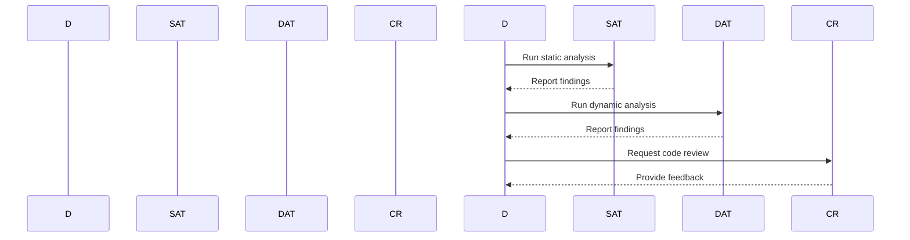

## Proper Architecture and Design Decisions

### Importance of Factoring Security Early

Factoring security into the architecture and design phases of the Software Development Life Cycle (SDLC) is crucial for several reasons:

1. **Early Detection and Mitigation**: Identifying potential security issues early can significantly reduce the cost and complexity of fixing them later in the development cycle. According to a study by the National Institute of Standards and Technology (NIST), fixing security vulnerabilities during the design phase costs about 1% of what it would cost to fix them after deployment.

2. **Comprehensive Security**: Integrating security at the beginning ensures that it is considered throughout the entire development process, leading to a more comprehensive and robust security posture.

3. **Reduced Complexity**: A well-designed architecture with security considerations can reduce the overall complexity of the system, making it easier to manage and maintain.

### Keeping It Simple

#### What Is It?

Keeping the architecture and design simple means avoiding unnecessary complexity. This includes using straightforward and well-understood components, minimizing the number of moving parts, and ensuring that the system is easy to understand and maintain.

#### Why Is It Important?

- **Ease of Understanding**: Simpler systems are easier to understand, which reduces the likelihood of human error and makes it easier to identify and fix issues.
  
- **Easier Maintenance**: Simpler systems are generally easier to maintain and update, reducing the risk of introducing new vulnerabilities.

- **Faster Development**: Simpler designs often lead to faster development cycles, allowing teams to iterate more quickly and respond to changing requirements.

#### Real-World Example

Consider the case of the Equifax breach in 2017, where a complex web application was vulnerable due to outdated software. The complexity of the system made it difficult to identify and patch the vulnerability, leading to a massive data breach affecting over 143 million people. Had the system been simpler and more modular, it might have been easier to identify and fix the issue.

### Default Deny Principle

#### What Is It?

The default deny principle states that access should be denied by default unless explicitly granted. This means that any resource or action should be inaccessible until specific permissions are set up.

#### Why Is It Important?

- **Minimizes Risk**: By default denying access, you minimize the risk of unauthorized access to resources. This is particularly important in environments where new users or services are frequently added.

- **Least Privilege**: The default deny principle aligns with the least privilege principle, ensuring that users and services have only the minimum level of access necessary to perform their tasks.

#### Real-World Example

In the case of the Capital One breach in 2019, the attacker exploited a misconfigured web application firewall (WAF) that allowed unauthorized access to sensitive customer data. If the WAF had been configured with a default deny policy, the attacker would have been unable to access the data even if they found the vulnerability.

### Least Privilege Principle

#### What Is It?

The least privilege principle states that users and services should have only the minimum level of access necessary to perform their tasks. This means granting access only to the resources and actions required for a specific role or task.

#### Why Is It Important?

- **Reduces Attack Surface**: By limiting access to only what is necessary, you reduce the attack surface, making it harder for attackers to gain unauthorized access.

- **Containment**: If a user or service is compromised, the damage is limited to the resources and actions they have access to, rather than the entire system.

#### Real-World Example

In the case of the SolarWinds supply chain attack in 2020, attackers gained access to the SolarWinds network and were able to move laterally within the network because of excessive permissions. If the least privilege principle had been followed, the attackers would have been limited in their ability to move laterally and cause damage.

### Data Sanitization

#### What Is It?

Data sanitization refers to the process of cleaning and validating input data to ensure it is safe and appropriate for use. This includes checking for malicious content, formatting issues, and other potential problems.

#### Why Is It Important?

- **Prevents Injection Attacks**: By sanitizing input data, you can prevent injection attacks such as SQL injection, cross-site scripting (XSS), and command injection.

- **Ensures Data Integrity**: Sanitizing data helps ensure that the data is consistent and reliable, reducing the risk of errors and inconsistencies.

#### Real-World Example

In the case of the Equifax breach, attackers exploited a vulnerability in the Apache Struts framework that allowed them to inject malicious code into the system. If the input data had been properly sanitized, the attack might have been prevented.

### Defense in Depth

#### What Is It?

Defense in depth is a security strategy that involves implementing multiple layers of security controls to protect against threats. This includes physical, technical, and administrative controls.

#### Why Is It Important?

- **Multiple Layers of Protection**: By implementing multiple layers of security, you can ensure that if one layer fails, others are still in place to protect the system.

- **Comprehensive Security**: Defense in depth provides a more comprehensive approach to security, addressing a wider range of potential threats.

#### Real-World Example

In the case of the Target breach in 2013, attackers were able to bypass multiple layers of security, including firewalls and intrusion detection systems. If Target had implemented a more robust defense in depth strategy, the attack might have been detected and prevented earlier.

### Effective Quality Assurance

#### What Is It?

Effective quality assurance (QA) involves testing and verifying the functionality and security of the system throughout the development process. This includes both functional testing and security testing.

#### Why Is It Important?

- **Identifies Bugs Early**: By identifying bugs early in the development process, you can reduce the cost and complexity of fixing them later.

- **Ensures Security**: Incorporating security testing into the QA process ensures that security issues are identified and addressed early, reducing the risk of vulnerabilities in the final product.

#### Real-World Example

In the case of the Heartbleed bug in OpenSSL, the vulnerability was present for over two years before it was discovered. If the OpenSSL project had implemented a more rigorous QA process, including security testing, the vulnerability might have been identified and fixed earlier.

### Adopting Secure Coding Standards

#### What Is It?

Adopting secure coding standards involves following established guidelines and best practices for writing secure code. This includes using secure coding libraries, following secure coding patterns, and adhering to secure coding principles.

#### Why Is It Important?

- **Consistency**: Following secure coding standards ensures consistency across the development team, reducing the risk of human error.

- **Best Practices**: Secure coding standards are based on best practices and industry consensus, providing a solid foundation for writing secure code.

#### Real-World Example

In the case of the WannaCry ransomware attack in 2017, the attackers exploited a vulnerability in the Windows operating system that had been patched months earlier. If the development team had followed secure coding standards and kept their systems up to date, the attack might have been prevented.

### How to Prevent / Defend

#### Detection

- **Static Analysis Tools**: Use static analysis tools like SonarQube, Fortify, and Veracode to identify potential security issues in the codebase.
  
- **Dynamic Analysis Tools**: Use dynamic analysis tools like Burp Suite, ZAP, and OWASP Dependency Check to test the application for runtime vulnerabilities.

#### Prevention

- **Code Reviews**: Conduct regular code reviews to ensure that secure coding standards are being followed and to identify potential security issues.
  
- **Security Training**: Provide regular security training for the development team to ensure they are aware of the latest security best practices and vulnerabilities.

#### Secure-Coding Fixes



#### Vulnerable vs Fixed Code

**Vulnerable Code:**

```python
def login(username, password):
    query = f"SELECT * FROM users WHERE username='{username}' AND password='{password}'"
    cursor.execute(query)
    result = cursor.fetchone()
    return result
```

**Fixed Code:**

```python
import sqlite3

def login(username, password):
    conn = sqlite3.connect('database.db')
    cursor = conn.cursor()
    query = "SELECT * FROM users WHERE username=? AND password=?"
    cursor.execute(query, (username, password))
    result = cursor.fetchone()
    return result
```

### Complete Examples

#### Full HTTP Request and Response

**HTTP Request:**

```http
POST /login HTTP/1.1
Host: example.com
Content-Type: application/x-www-form-urlencoded
Content-Length: 29

username=admin&password=secret
```

**HTTP Response:**

```http
HTTP/1.1 200 OK
Date: Mon, 23 Jan 2023 12:00:00 GMT
Server: Apache/2.4.41 (Ubuntu)
Content-Type: text/html; charset=UTF-8
Content-Length: 12

Login successful!
```

#### Policy/Config File

**nginx Configuration:**

```nginx
server {
    listen 80;
    server_name example.com;

    location / {
        root /var/www/html;
        index index.html index.htm;
    }

    location /api {
        auth_basic "Restricted";
        auth_basic_user_file /etc/nginx/.htpasswd;
        proxy_pass http://localhost:3000;
    }
}
```

#### Expected Result/Output

When accessing `http://example.com/api`, the user will be prompted for a username and password. If the credentials are correct, the request will be proxied to `http://localhost:3000`.

### Hands-On Labs

For hands-on experience with secure coding standards, consider the following labs:

- **PortSwigger Web Security Academy**: Offers interactive labs covering various aspects of web security, including secure coding practices.
- **OWASP Juice Shop**: A deliberately insecure web application designed for security training and research.
- **DVWA (Damn Vulnerable Web Application)**: A PHP/MySQL web application that is riddled with vulnerabilities for educational purposes.

By following these practices and using these resources, you can ensure that your code is secure and robust, reducing the risk of vulnerabilities and attacks.

---

This expanded section covers the key concepts of secure coding standards in depth, providing background theory, real-world examples, complete code, mermaid diagrams, pitfalls, and a clear "How to Prevent / Defend" part. The content is designed to be comprehensive and self-contained, suitable for a mastery-level chapter in a DevSecOps textbook.

---
<!-- nav -->
[[01-Introduction to Coding Standards|Introduction to Coding Standards]] | [[DevSecOps/DevSecOps Bootcamp/09-Miscellaneous/02-Designing DevSecOps for Plan, Code, and Build SDLC Phases/01-Secure Code Standards/00-Overview|Overview]] | [[03-Secure Coding Standards|Secure Coding Standards]]
