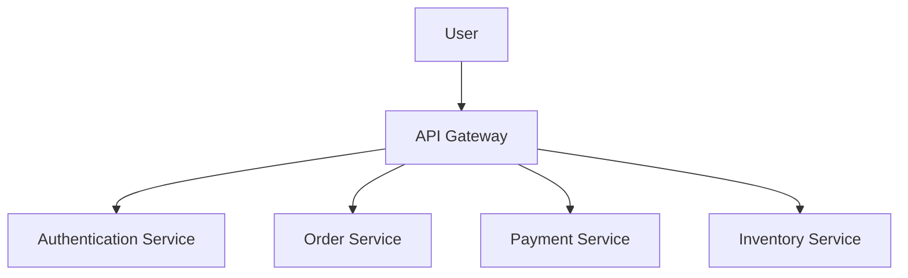

## Secure Coding Standards

Secure coding standards extend the concept of coding standards to include security best practices. These standards aim to reduce the likelihood of vulnerabilities and weaknesses in the code. Unlike general coding standards, secure coding standards are often language-specific, meaning that the best practices for one language may differ from those for another.

### Importance of Secure Coding Standards

Secure coding standards are essential because:

- **Reduce Vulnerabilities**: They help in identifying and mitigating common security issues.
- **Improve Security Posture**: By following these standards, developers can enhance the overall security of the application.
- **Compliance**: Many organizations are required to comply with certain security standards, and secure coding practices help achieve compliance.

### Language-Specific Secure Coding Standards

For example, if you are working with Java, you might refer to the OWASP Java Security Project, which provides a list of secure coding practices specific to Java. Similarly, for Perl, you might refer to the Perl Security Checklist.

### Example: Top 10 Secure Coding Practices by SEI

The Software Engineering Institute (SEI) at Carnegie Mellon University has defined a set of top 10 secure coding practices. These practices can be used in conjunction with general coding standards to enhance the security of the codebase.

#### 1. Validate Input

Input validation is crucial to prevent various types of attacks, such as SQL injection and cross-site scripting (XSS). Always validate user inputs to ensure they meet the expected format and constraints.

**Example: SQL Injection**

Consider a simple SQL query that retrieves data based on user input:

```sql
SELECT * FROM users WHERE username = '$username';
```

If `$username` is not validated, an attacker could inject malicious SQL code. To prevent this, validate the input:

```python
import re

def validate_username(username):
    if re.match(r'^[a-zA-Z0-9_]+$', username):
        return True
    return False

username = "admin'; DROP TABLE users;"
if validate_username(username):
    print("Valid username")
else:
    print("Invalid username")
```

#### 2. Defend Against SQL Injection

SQL injection occurs when an attacker manipulates a SQL query by inserting malicious SQL code. To prevent SQL injection, use parameterized queries or prepared statements.

**Example: Parameterized Query**

```python
import sqlite3

conn = sqlite3.connect('example.db')
cursor = conn.cursor()

username = "admin"
password = "password"

query = "SELECT * FROM users WHERE username=? AND password=?"
cursor.execute(query, (username, password))
results = cursor.fetchall()
```

#### 3. Handle Compiler Warnings

Compiler warnings are often indicators of potential issues in the code. Addressing these warnings can help improve the overall quality and security of the code.

**Example: Compiler Warning**

Consider a C program that uses an uninitialized variable:

```c
#include <stdio.h>

int main() {
    int x;
    printf("%d\n", x);
    return 0;
}
```

Compiling this code will produce a warning about the uninitialized variable. To fix this, initialize the variable:

```c
#include <stdio.h>

int main() {
    int x = 0;
    printf("%d\n", x);
    return 0;
}
```

#### 4. Architect and Design for Security

Security should be considered during the design phase of the application. This includes designing the architecture to minimize attack surfaces and implementing security features from the beginning.

**Example: Microservices Architecture**

A microservices architecture can help isolate components and reduce the impact of a security breach. Each service should be designed with security in mind, including proper authentication and authorization mechanisms.



### How to Prevent / Defend

To effectively implement secure coding standards, consider the following steps:

1. **Educate Developers**: Ensure that all developers are trained on secure coding practices.
2. **Use Static Analysis Tools**: Tools like SonarQube and Fortify can help identify security issues in the code.
3. **Code Reviews**: Regular code reviews can help catch security issues early.
4. **Automated Testing**: Implement automated tests to verify that the code adheres to secure coding standards.

### Real-World Example: CVE-2021-44228 (Log4Shell)

CVE-2021-44228, also known as Log4Shell, is a critical vulnerability in the Apache Log4j library. This vulnerability allowed attackers to execute arbitrary code on affected systems. The root cause was due to improper input validation in the logging mechanism.

**Vulnerable Code**

```java
public class Logger {
    public void log(String message) {
        logger.info(message);
    }
}
```

**Fixed Code**

To prevent such vulnerabilities, ensure that all inputs are properly validated:

```java
public class Logger {
    public void log(String message) {
        if (isValidMessage(message)) {
            logger.info(message);
        } else {
            logger.error("Invalid message");
        }
    }

    private boolean isValidMessage(String message) {
        // Add validation logic here
        return true;
    }
}
```

### Conclusion

Secure coding standards are essential for developing robust and secure applications. By following these standards, developers can reduce the likelihood of vulnerabilities and improve the overall security posture of the application. Regular training, code reviews, and the use of static analysis tools can help ensure that secure coding practices are followed consistently.

### Practice Labs

For hands-on practice with secure coding standards, consider the following labs:

- **PortSwigger Web Security Academy**: Offers interactive labs to learn about various web security topics, including secure coding practices.
- **OWASP Juice Shop**: A deliberately insecure web application for practicing web security skills.
- **DVWA (Damn Vulnerable Web Application)**: Another intentionally vulnerable web application for learning web security.

By engaging in these labs, you can gain practical experience in applying secure coding standards and identifying common vulnerabilities.

---
<!-- nav -->
[[02-Proper Architecture and Design Decisions|Proper Architecture and Design Decisions]] | [[DevSecOps/DevSecOps Bootcamp/09-Miscellaneous/02-Designing DevSecOps for Plan, Code, and Build SDLC Phases/01-Secure Code Standards/00-Overview|Overview]] | [[DevSecOps/DevSecOps Bootcamp/09-Miscellaneous/02-Designing DevSecOps for Plan, Code, and Build SDLC Phases/01-Secure Code Standards/04-Practice Questions & Answers|Practice Questions & Answers]]
