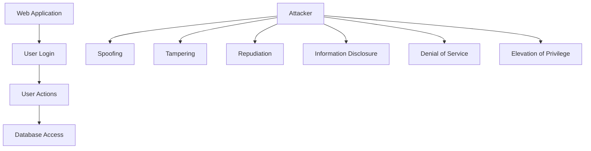

## Introduction to Threat Modeling in DevSecOps

Threat modeling is a critical component of the DevSecOps lifecycle, particularly during the planning phase. It involves identifying, enumerating, and prioritizing potential threats to an application from the perspective of a hypothetical attacker. This process helps in foreseeing weaknesses that could be exploited and building a more robust system to defend against these threats.

### What is Threat Modeling?

Threat modeling is a structured approach to identifying and analyzing potential security threats to a system or application. It involves:

- **Identifying** potential threats and vulnerabilities.
- **Enumerating** these threats systematically.
- **Prioritizing** them based on their likelihood and impact.

The goal is to understand the risks associated with the application and take proactive measures to mitigate them.

### Why is Threat Modeling Important?

Threat modeling is crucial because it allows developers and security teams to:

- **Proactively identify** security issues before they become problems.
- **Understand the attacker’s mindset**, which helps in designing more secure systems.
- **Prioritize security efforts** based on the most significant risks.
- **Reduce the likelihood** of security breaches and data leaks.

Without threat modeling, security issues may go unnoticed until they are exploited, leading to costly and potentially damaging incidents.

### How Does Threat Modeling Work?

Threat modeling typically involves several key steps:

1. **Define the System**: Understand the architecture, components, and interactions within the system.
2. **Identify Threat Agents**: Determine who might want to exploit the system and what their motivations are.
3. **Enumerate Potential Threats**: List out possible ways the system could be attacked.
4. **Prioritize Threats**: Rank the threats based on their likelihood and impact.
5. **Mitigate Threats**: Develop strategies to address the highest-priority threats.

### Common Threat Modeling Methodologies

There are several methodologies used for threat modeling, including:

- **STRIDE**
- **PASTA (Process for Attack Simulation and Threat Analysis)**
- **VAST (Visual, Agile, Simple, and Thorough)**

#### STRIDE Methodology

One of the most widely used methodologies is STRIDE, which stands for:

- **Spoofing**: Impersonating another user or system.
- **Tampering**: Modifying data or code.
- **Repudiation**: Denying actions taken.
- **Information Disclosure**: Unauthorized access to sensitive information.
- **Denial of Service**: Disrupting normal operations.
- **Elevation of Privilege**: Gaining unauthorized access to higher privileges.

### Example: STRIDE Applied to a Web Application

Let's consider a simple web application that allows users to log in and perform various actions. We will apply the STRIDE methodology to identify potential threats.

#### Spoofing

An attacker might try to impersonate a legitimate user to gain unauthorized access. This could be achieved through:

- **Credential Theft**: Stealing login credentials.
- **Session Hijacking**: Intercepting session tokens.

**Example**: An attacker could use a phishing attack to steal a user's credentials.

**Detection**: Monitor for unusual login patterns, such as multiple failed login attempts from different IP addresses.

**Prevention**: Implement multi-factor authentication (MFA) and enforce strong password policies.

#### Tampering

An attacker might attempt to modify data or code to alter the behavior of the application. This could involve:

- **SQL Injection**: Injecting malicious SQL queries to manipulate database data.
- **Cross-Site Scripting (XSS)**: Injecting malicious scripts into web pages viewed by other users.

**Example**: An attacker could inject a malicious SQL query to delete or modify sensitive data.

**Detection**: Use intrusion detection systems (IDS) to monitor for suspicious activities.

**Prevention**: Sanitize user inputs and use parameterized queries to prevent SQL injection. Implement Content Security Policy (CSP) to mitigate XSS attacks.

#### Repudiation

An attacker might deny performing certain actions, making it difficult to trace the origin of the attack. This could involve:

- **Forged Transactions**: Creating fake transactions that cannot be traced back to the attacker.
- **Manipulated Logs**: Altering logs to cover up malicious activities.

**Example**: An attacker could forge a transaction to transfer funds and then manipulate logs to remove evidence.

**Detection**: Implement immutable logging and audit trails to ensure logs cannot be altered.

**Prevention**: Use digital signatures and hash functions to verify the integrity of transactions and logs.

#### Information Disclosure

An attacker might attempt to gain unauthorized access to sensitive information. This could involve:

- **Data Leakage**: Exposing sensitive data through insecure APIs or endpoints.
- **Insecure Storage**: Storing sensitive data in plaintext or using weak encryption.

**Example**: An attacker could exploit an insecure API endpoint to retrieve sensitive user data.

**Detection**: Use data loss prevention (DLP) tools to monitor for unauthorized data transfers.

**Prevention**: Encrypt sensitive data both in transit and at rest. Implement least privilege access controls.

#### Denial of Service

An attacker might attempt to disrupt normal operations by overwhelming the system with traffic. This could involve:

- **DDoS Attacks**: Flooding the server with excessive traffic.
- **Resource Exhaustion**: Consuming all available resources, such as memory or CPU.

**Example**: An attacker could launch a DDoS attack to bring down the web application.

**Detection**: Monitor for sudden spikes in traffic and resource usage.

**Prevention**: Implement rate limiting and use a content delivery network (CDN) to distribute traffic.

#### Elevation of Privilege

An attacker might attempt to gain unauthorized access to higher privileges. This could involve:

- **Privilege Escalation**: Exploiting vulnerabilities to gain elevated permissions.
- **Weak Authentication**: Using weak or default credentials to gain access.

**Example**: An attacker could exploit a vulnerability to escalate privileges and gain administrative access.

**Detection**: Monitor for unusual privilege changes and unauthorized access attempts.

**Prevention**: Enforce strong authentication mechanisms and regularly review and update access controls.

### Real-World Examples

#### CVE-2021-44228 (Log4Shell)

In December 2021, the Log4j vulnerability (CVE-2021-44228) was discovered, affecting millions of Java applications worldwide. This vulnerability allowed attackers to execute arbitrary code on affected servers, leading to widespread exploitation.

**Threat Modeling Insight**: The Log4j vulnerability highlights the importance of threat modeling, especially in identifying and mitigating remote code execution (RCE) vulnerabilities.

**Detection**: Monitor for unexpected outbound connections and unusual log entries.

**Prevention**: Keep all dependencies and libraries up to date. Implement strict input validation and use security-focused logging frameworks.

#### Equifax Data Breach (2017)

In 2017, Equifax suffered a massive data breach that exposed sensitive personal information of over 143 million individuals. The breach was caused by a vulnerability in the Apache Struts framework.

**Threat Modeling Insight**: The Equifax breach underscores the importance of regular vulnerability assessments and patch management.

**Detection**: Use vulnerability scanners to identify known vulnerabilities.

**Prevention**: Regularly update and patch all software components. Implement a comprehensive incident response plan.

### Static Code Analysis (SCA) vs. Software Composition Analysis (SAS)

Static Code Analysis (SCA) and Software Composition Analysis (SAS) are two important tools used in the code phase of the DevSecOps lifecycle.

#### Static Code Analysis (SCA)

SCA involves analyzing the source code of an application to identify potential security vulnerabilities and coding errors. This is typically done using automated tools that scan the codebase for known patterns and issues.

**Example**: Tools like SonarQube and Fortify can be used to perform SCA.

**Detection**: Identify and report potential security vulnerabilities and coding errors.

**Prevention**: Fix identified issues and implement coding standards to prevent similar issues in the future.

#### Software Composition Analysis (SAS)

SAS involves analyzing the software components and libraries used in an application to identify known vulnerabilities and licensing issues. This is typically done using tools that scan the dependency tree of the application.

**Example**: Tools like Snyk and WhiteSource can be used to perform SAS.

**Detection**: Identify and report known vulnerabilities in third-party components and libraries.

**Prevention**: Regularly update and patch all dependencies. Use secure coding practices to minimize reliance on vulnerable components.

### Vulnerability Scanning in the Build Phase

During the build phase, vulnerability scanning is crucial to ensure that the final product is free from known vulnerabilities. This involves:

- **Scanning the codebase** for known vulnerabilities.
- **Analyzing dependencies** for known vulnerabilities.
- **Running automated tests** to identify potential security issues.

**Example**: Tools like OWASP ZAP and Burp Suite can be used to perform vulnerability scanning.

**Detection**: Identify and report potential security vulnerabilities in the codebase and dependencies.

**Prevention**: Fix identified issues and implement a continuous integration/continuous deployment (CI/CD) pipeline to ensure that vulnerabilities are detected and addressed early in the development process.

### Conclusion

Threat modeling is a critical component of the DevSecOps lifecycle, helping to identify and mitigate potential security threats proactively. By applying methodologies such as STRIDE, developers and security teams can better understand the risks associated with their applications and take appropriate measures to defend against them.

### Hands-On Labs

For practical experience with threat modeling and related concepts, consider the following labs:

- **PortSwigger Web Security Academy**: Offers interactive labs on web security, including threat modeling.
- **OWASP Juice Shop**: A deliberately insecure web application for practicing security testing and threat modeling.
- **DVWA (Damn Vulnerable Web Application)**: Another intentionally vulnerable web application for learning web security.

These labs provide real-world scenarios and hands-on experience, allowing you to apply the concepts learned in this chapter effectively.

---

This expanded section covers the core concepts of threat modeling in DevSecOps, providing detailed explanations, real-world examples, and practical guidance. The next sections will delve deeper into static code analysis, software composition analysis, and vulnerability scanning, ensuring a comprehensive understanding of the topic.

---
<!-- nav -->
[[DevSecOps/DevSecOps Bootcamp/09-Miscellaneous/02-Designing DevSecOps for Plan, Code, and Build SDLC Phases/03-Threat Modeling/00-Overview|Overview]] | [[DevSecOps/DevSecOps Bootcamp/09-Miscellaneous/02-Designing DevSecOps for Plan, Code, and Build SDLC Phases/03-Threat Modeling/02-Practice Questions & Answers|Practice Questions & Answers]]
