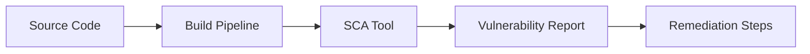
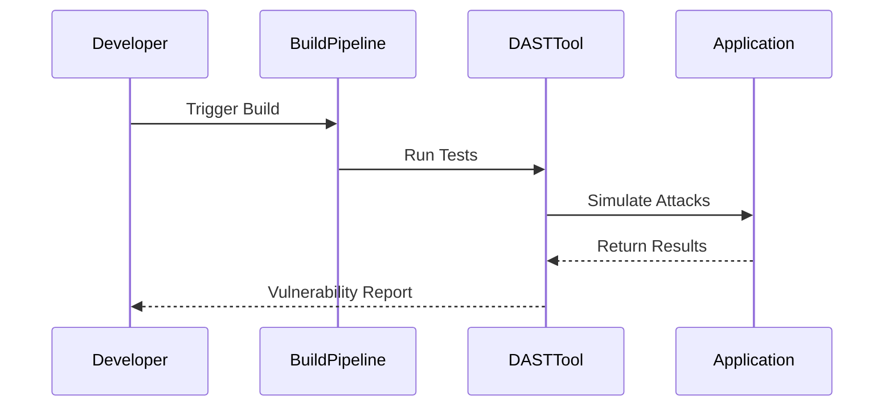

## Introduction to Vulnerability Scanning in the Build Phase

In the context of DevSecOps, the build phase is a critical stage in the Software Development Life Cycle (SDLC). During this phase, the source code is compiled into executable or deployable artifacts. Ensuring that these artifacts are free from vulnerabilities is paramount to maintaining the security and integrity of the final product. This chapter delves into the concept of vulnerability scanning during the build phase, exploring various techniques such as Software Composition Analysis (SCA) and Dynamic Application Security Testing (DAST).

### Background Theory

#### What is Vulnerability Scanning?

Vulnerability scanning is the process of identifying security weaknesses in software systems. These weaknesses can range from coding errors to misconfigurations, which could potentially be exploited by attackers. The goal of vulnerability scanning is to identify and mitigate these issues before they can be exploited, thereby enhancing the overall security posture of the application.

#### Why is Vulnerability Scanning Important?

Vulnerability scanning is crucial because it helps organizations identify and address security flaws early in the development process. By catching vulnerabilities during the build phase, teams can avoid costly remediation efforts later in the deployment cycle. Additionally, regular vulnerability scanning can help maintain compliance with industry standards and regulations.

### Techniques for Vulnerability Scanning

#### Software Composition Analysis (SCA)

Software Composition Analysis (SCA) is a technique used to identify open-source components and their associated vulnerabilities within an application. This method is particularly useful during the build phase, as it ensures that the compiled code does not contain any known vulnerabilities from third-party libraries.

##### How SCA Works

SCA tools analyze the dependencies of an application and compare them against databases of known vulnerabilities. These tools typically integrate into the build pipeline, allowing developers to receive immediate feedback on potential security issues.

##### Real-World Example

Consider the case of the Log4j vulnerability (CVE-2021-44228), which affected millions of applications worldwide. An SCA tool would have identified the presence of the vulnerable Log4j library during the build phase, alerting developers to the need for an update or patch.



#### Dynamic Application Security Testing (DAST)

Dynamic Application Security Testing (DAST) is another technique used to identify vulnerabilities in the compiled code. Unlike SCA, which focuses on static analysis of dependencies, DAST involves running automated tests against the live application to detect security flaws.

##### How DAST Works

DAST tools simulate attacks on the application to identify vulnerabilities such as SQL injection, cross-site scripting (XSS), and buffer overflows. These tools typically interact with the application through its user interface or API endpoints.

##### Real-World Example

In the Equifax breach (CVE-2017-5638), a vulnerability in the Apache Struts framework was exploited. A DAST tool could have detected this vulnerability by simulating an attack on the application's web interface.



### Integrating Vulnerability Scanning into the Build Pipeline

To effectively integrate vulnerability scanning into the build pipeline, it is essential to automate the process and ensure that it runs as part of the continuous integration/continuous deployment (CI/CD) workflow.

#### Automating Vulnerability Scanning

Automated vulnerability scanning can be achieved using CI/CD tools such as Jenkins, GitLab CI, or CircleCI. These tools allow developers to define build pipelines that include steps for running SCA and DAST scans.

##### Example Build Pipeline Configuration

Here is an example of a build pipeline configuration using Jenkins:

```yaml
pipeline {
    agent any
    stages {
        stage('Build') {
            steps {
                sh 'mvn clean install'
            }
        }
        stage('SCA Scan') {
            steps {
                script {
                    def scaResult = sh(script: 'sca-tool scan', returnStdout: true)
                    echo "SCA Result: ${scaResult}"
                }
            }
        }
        stage('DAST Scan') {
            steps {
                script {
                    def dastResult = sh(script: 'dast-tool scan', returnStdout: true)
                    echo "DAST Result: ${dDastResult}"
                }
            }
        }
    }
}
```

### Common Pitfalls and Best Practices

#### Common Pitfalls

1. **False Positives**: Both SCA and DAST tools can generate false positives, leading to unnecessary remediation efforts. It is important to validate findings manually.
2. **Dependency Management**: Inadequate management of dependencies can lead to the inclusion of vulnerable libraries. Regular updates and audits of dependencies are necessary.
3. **Configuration Issues**: Misconfigured tools or pipelines can result in incomplete or inaccurate scans. Ensure that tools are properly configured and integrated.

#### Best Practices

1. **Regular Updates**: Keep all tools and dependencies up to date to ensure that the latest vulnerabilities are detected.
2. **Manual Validation**: Manually validate findings to reduce false positives and ensure accurate remediation.
3. **Continuous Monitoring**: Implement continuous monitoring to detect and respond to new vulnerabilities as they are discovered.

### How to Prevent / Defend

#### Detection

Detection involves regularly running vulnerability scans and monitoring the results. Tools like SCA and DAST should be integrated into the build pipeline to provide real-time feedback.

#### Prevention

Prevention involves implementing secure coding practices and maintaining up-to-date dependencies. Developers should follow best practices such as input validation, parameterized queries, and least privilege access.

#### Secure Coding Fixes

Here is an example of a vulnerable code snippet and its secure counterpart:

**Vulnerable Code:**
```python
import sqlite3

def login(username, password):
    conn = sqlite3.connect('database.db')
    cursor = conn.cursor()
    cursor.execute(f"SELECT * FROM users WHERE username='{username}' AND password='{password}'")
    result = cursor.fetchone()
    if result:
        print("Login successful")
    else:
        print("Login failed")
```

**Secure Code:**
```python
import sqlite3

def login(username, password):
    conn = sqlite3.connect('database.db')
    cursor = conn.cursor()
    cursor.execute("SELECT * FROM users WHERE username=? AND password=?", (username, password))
    result = cursor.fetchone()
    if result:
        print("Login successful")
    else:
        print("Login failed")
```

#### Configuration Hardening

Hardening configurations involves securing the environment in which the application runs. This includes securing the operating system, network, and database configurations.

**Example of a Hardened Configuration:**

```yaml
server:
  port: 8080
spring:
  datasource:
    url: jdbc:mysql://localhost:3306/mydb?useSSL=true&requireSSL=true
    username: myuser
    password: mypassword
    driver-class-name: com.mysql.cj.jdbc.Driver
```

### Hands-On Labs

For hands-on experience with vulnerability scanning, consider the following labs:

- **PortSwigger Web Security Academy**: Offers interactive labs for learning about various security testing techniques, including DAST.
- **OWASP Juice Shop**: A deliberately insecure web application for practicing security testing and vulnerability scanning.
- **DVWA (Damn Vulnerable Web Application)**: A PHP/MySQL web application that is riddled with vulnerabilities for educational purposes.

By integrating vulnerability scanning into the build phase, organizations can significantly enhance the security of their applications. Regular scanning, combined with secure coding practices and continuous monitoring, forms a robust defense against potential threats.

### Conclusion

In conclusion, vulnerability scanning is a critical component of the DevSecOps approach. By leveraging techniques such as SCA and DAST, organizations can identify and mitigate security flaws early in the development process. Integrating these tools into the build pipeline ensures that security is a core part of the development lifecycle, ultimately leading to more secure and reliable software products.

---
<!-- nav -->
[[DevSecOps/DevSecOps Bootcamp/09-Miscellaneous/02-Designing DevSecOps for Plan, Code, and Build SDLC Phases/04-Vulnerability Scanning/00-Overview|Overview]] | [[DevSecOps/DevSecOps Bootcamp/09-Miscellaneous/02-Designing DevSecOps for Plan, Code, and Build SDLC Phases/04-Vulnerability Scanning/02-Practice Questions & Answers|Practice Questions & Answers]]
