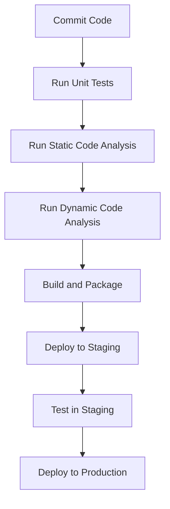

## Common Vulnerabilities

- [ ] Check for SQL injection vulnerabilities.
- [ ] Check for XSS vulnerabilities.
- [ ] Check for buffer overflow vulnerabilities.
```

### Real-World Examples

#### Recent CVEs and Breaches

To illustrate the importance of integrating security practices throughout the SDLC, let's look at some recent CVEs and breaches.

##### CVE-2021-44228 (Log4Shell)

CVE-2021-44228, also known as Log4Shell, is a critical vulnerability in the Apache Log4j library. This vulnerability allows attackers to execute arbitrary code on affected systems, leading to remote code execution (RCE).

**Why Log4Shell Matters**

Log4Shell is a prime example of why integrating security practices throughout the SDLC is crucial. The vulnerability was present in the Log4j library for years, and it was only discovered recently. This highlights the importance of continuous security assessments and the need to stay vigilant.

**How to Prevent / Defend Against Log4Shell**

To prevent and defend against Log4Shell, follow these steps:

1. **Update Dependencies**: Ensure that all dependencies are up to date and patched.
2. **Use Secure Libraries**: Use libraries that are regularly maintained and reviewed for security.
3. **Implement Security Controls**: Implement security controls such as firewalls and intrusion detection systems (IDS).

**Example: Secure Dependency Management**

```yaml
# Maven POM.xml
<dependencies>
    <dependency>
        <groupId>org.apache.logging.log4j</groupId>
        <artifactId>log4j-core</artifactId>
        <version>2.17.1</version>
    </dependency>
</dependencies>
```

##### Equifax Data Breach (2017)

The Equifax data breach in 2017 exposed the personal information of approximately 147 million people. The breach was caused by a vulnerability in the Apache Struts web application framework.

**Why Equifax Data Breach Matters**

The Equifax data breach is a stark reminder of the importance of integrating security practices throughout the SDLC. The breach could have been prevented if proper security measures were in place.

**How to Prevent / Defend Against Data Breaches**

To prevent and defend against data breaches, follow these steps:

1. **Patch Vulnerabilities**: Regularly patch and update all systems and applications.
2. **Implement Access Controls**: Implement strict access controls to limit access to sensitive data.
3. **Monitor and Audit**: Monitor and audit system activity to detect and respond to suspicious behavior.

**Example: Access Control Policy**

```json
{
    "Version": "2012-10-17",
    "Statement": [
        {
            "Sid": "AllowAccessToSensitiveData",
            "Effect": "Allow",
            "Principal": {
                "AWS": "arn:aws:iam::123456789012:user/admin"
            },
            "Action": "s3:GetObject",
            "Resource": "arn:aws:s3:::my-bucket/sensitive-data/*"
        }
    ]
}
```

### How to Prevent / Defend

#### Detection

To detect security issues, teams should implement continuous monitoring and logging. This includes:

- **Continuous Integration/Continuous Deployment (CI/CD)**: Automate the build and deployment process to catch issues early.
- **Logging and Monitoring**: Implement logging and monitoring to detect and respond to security incidents.

**Example: CI/CD Pipeline**



#### Prevention

To prevent security issues, teams should implement the following:

- **Secure Coding Practices**: Follow secure coding practices to prevent common vulnerabilities.
- **Regular Patching**: Regularly patch and update all systems and applications.
- **Access Controls**: Implement strict access controls to limit access to sensitive data.

**Example: Secure Coding Practices**

```java
// Secure Coding Example
public String getUserInput(String input) {
    // Validate user input
    if (!input.matches("[a-zA-Z0-9]+")) {
        throw new IllegalArgumentException("Invalid input");
    }
    return input;
}
```

#### Secure-Coding Fixes

To demonstrate secure-coding fixes, let's look at an example of a vulnerable code and its secure version.

**Vulnerable Code**

```java
// Vulnerable Code
public void login(String username, String password) {
    String query = "SELECT * FROM users WHERE username = '" + username + "' AND password = '" + password + "'";
    // Execute query
}
```

**Secure Code**

```java
// Secure Code
public void login(String username, String password) {
    String query = "SELECT * FROM users WHERE username = ? AND password = ?";
    try (PreparedStatement stmt = connection.prepareStatement(query)) {
        stmt.setString(1, username);
        stmt.setString(2, password);
        // Execute query
    } catch (SQLException e) {
        // Handle exception
    }
}
```

#### Configuration Hardening

To harden configurations, teams should implement the following:

- **Secure Configuration Files**: Ensure that configuration files are secure and not accessible to unauthorized users.
- **Firewall Rules**: Implement firewall rules to restrict access to sensitive systems and ports.

**Example: Secure Configuration File**

```yaml
# Nginx Configuration
server {
    listen 80;
    server_name example.com;

    location / {
        root /var/www/html;
        index index.html;
    }

    location /api {
        auth_basic "Restricted Area";
        auth_basic_user_file /etc/nginx/.htpasswd;
    }
}
```

### Conclusion

Integrating security practices throughout the SDLC is crucial for developing secure applications. By implementing security checks at the design, code, and build phases, teams can ensure that their applications are secure from the start. Continuous monitoring, logging, and regular patching are essential for maintaining the security of the application. By following these best practices, teams can prevent and defend against security issues and ensure that their applications are secure.

### Practice Labs

For hands-on practice in DevSecOps, consider the following labs:

- **PortSwigger Web Security Academy**: Offers interactive labs for learning web security concepts.
- **OWASP Juice Shop**: An intentionally insecure web application for practicing web security.
- **DVWA (Damn Vulnerable Web Application)**: A PHP/MySQL web application that is deliberately vulnerable for educational purposes.
- **WebGoat**: An interactive training application designed to teach web application security lessons.

These labs provide practical experience in applying DevSecOps principles and techniques to real-world scenarios.

---
<!-- nav -->
[[DevSecOps/DevSecOps Bootcamp/09-Miscellaneous/02-Designing DevSecOps for Plan, Code, and Build SDLC Phases/Module Summary/00-Overview|Overview]] | [[02-Common Vulnerabilities|Common Vulnerabilities]]
