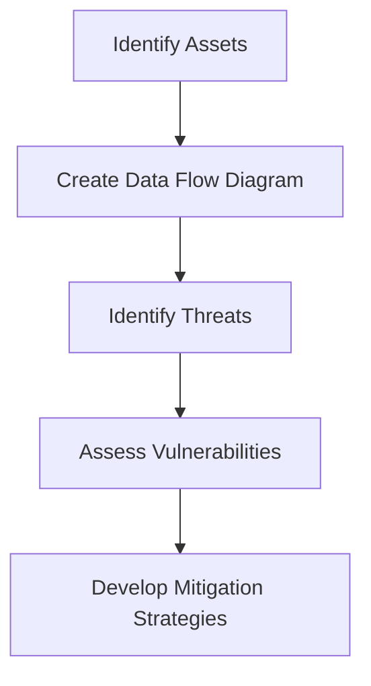

## Designing DevSecOps for Plan, Code, and Build SDLC Phases

### Introduction

In the realm of DevSecOps, integrating security practices throughout the Software Development Life Cycle (SDLC) is crucial. This ensures that security is not an afterthought but a core component of the development process. In this module, we will delve into the security checks and practices that should be implemented during the initial stages of the SDLC: Plan, Code, and Build.

### Plan Phase

#### Overview

The Plan phase is the first stage of the SDLC, where the project is conceptualized, requirements are gathered, and the overall architecture is designed. During this phase, security considerations should be integrated to ensure that the foundational aspects of the application are secure.

#### Security Checks at Design Time

Before any code is written, it is essential to perform security checks at the design level. These checks include:

- **Threat Modeling**: Identifying potential threats and vulnerabilities in the system architecture.
- **Security Requirements Gathering**: Ensuring that security requirements are included in the project scope.
- **Architecture Review**: Evaluating the architectural design for security weaknesses.

##### Threat Modeling

Threat modeling is a structured approach to identifying and assessing potential threats to a system. It helps in understanding the attack surface and prioritizing security measures.

**Why Threat Modeling Matters**

Threat modeling is critical because it allows developers to anticipate and mitigate potential security issues before they become actual problems. By identifying threats early, teams can design more secure systems and reduce the likelihood of vulnerabilities being exploited.

**How Threat Modeling Works**

Threat modeling typically involves the following steps:

1. **Asset Identification**: Identify the assets that need protection.
2. **Data Flow Diagrams**: Create data flow diagrams to understand how data moves through the system.
3. **Threat Identification**: Identify potential threats based on the data flow diagrams.
4. **Vulnerability Assessment**: Assess the likelihood and impact of identified threats.
5. **Mitigation Strategies**: Develop strategies to mitigate identified threats.

**Example: Threat Modeling Diagram**



##### Security Requirements Gathering

Security requirements gathering involves ensuring that security is a key consideration in the project scope. This includes defining security goals, identifying security controls, and specifying security-related features.

**Why Security Requirements Matter**

Security requirements are essential because they provide a clear framework for integrating security into the development process. Without explicit security requirements, security may be overlooked or treated as an afterthought.

**How to Gather Security Requirements**

To gather security requirements, follow these steps:

1. **Define Security Goals**: Clearly define what the security objectives are for the project.
2. **Identify Security Controls**: Determine which security controls are necessary to meet the defined goals.
3. **Specify Security Features**: Include specific security features in the project scope.

**Example: Security Requirements Document**

```markdown
# Security Requirements Document

---
<!-- nav -->
[[02-Common Vulnerabilities|Common Vulnerabilities]] | [[DevSecOps/DevSecOps Bootcamp/09-Miscellaneous/02-Designing DevSecOps for Plan, Code, and Build SDLC Phases/Module Summary/00-Overview|Overview]] | [[04-Security Best Practices Part 1|Security Best Practices Part 1]]
