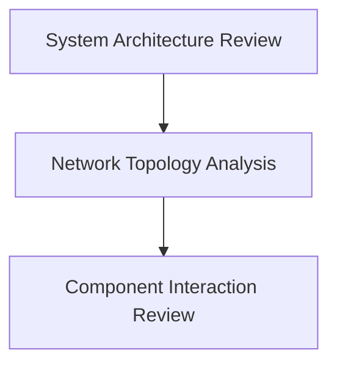

## Security Features

- Two-factor authentication (2FA).
- Data encryption.
- Secure communication protocols (TLS).
```

##### Architecture Review

An architecture review involves evaluating the overall design of the system for security weaknesses. This includes reviewing the system architecture, network topology, and component interactions.

**Why Architecture Review Matters**

An architecture review is crucial because it helps identify potential security issues at the design level. By catching these issues early, teams can avoid costly rework and ensure that the system is designed securely from the start.

**How to Perform an Architecture Review**

To perform an architecture review, follow these steps:

1. **Review System Architecture**: Evaluate the overall system architecture for security weaknesses.
2. **Network Topology Analysis**: Analyze the network topology to identify potential attack vectors.
3. **Component Interaction Review**: Review how components interact to ensure secure communication and data handling.

**Example: Architecture Review Diagram**



### Code Phase

#### Overview

The Code phase is where the actual implementation of the project takes place. During this phase, it is essential to integrate security practices into the coding process to ensure that the codebase is secure.

#### Source Code Testing

Source code testing involves analyzing the codebase for security vulnerabilities. This includes static code analysis, dynamic code analysis, and manual code reviews.

##### Static Code Analysis

Static code analysis involves analyzing the code without executing it. This is done using tools that scan the code for potential security issues.

**Why Static Code Analysis Matters**

Static code analysis is important because it helps identify security vulnerabilities early in the development process. By catching these issues before the code is executed, teams can prevent security breaches and ensure that the codebase is secure.

**How Static Code Analysis Works**

Static code analysis tools work by scanning the codebase for patterns that indicate potential security issues. These tools can identify issues such as SQL injection, cross-site scripting (XSS), and buffer overflows.

**Example: Static Code Analysis Tool Output**

```markdown
# Static Code Analysis Report

---
<!-- nav -->
[[06-Security Controls|Security Controls]] | [[DevSecOps/DevSecOps Bootcamp/09-Miscellaneous/02-Designing DevSecOps for Plan, Code, and Build SDLC Phases/Module Summary/00-Overview|Overview]] | [[08-Security Goals|Security Goals]]
