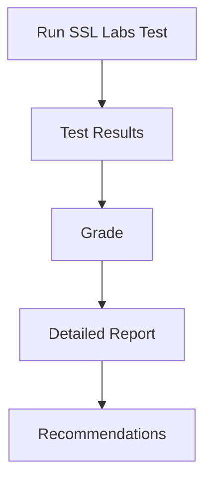

## Testing Security Certificates in the Deploy Phase

### Background Theory

In the deploy phase of the Software Development Life Cycle (SDLC), ensuring the validity and correctness of security certificates is crucial. These certificates are typically used to establish encrypted connections using Transport Layer Security (TLS), which is the successor to Secure Sockets Layer (SSL). TLS certificates are essential for securing data transmission between clients and servers, preventing man-in-the-middle attacks and ensuring data integrity.

### Types of Testing

Two primary types of testing are commonly performed during the deploy phase:

1. **Certificate Validity**: Ensuring that all TLS certificates are valid, within their expiration dates, and issued correctly.
2. **Application Hardening**: Reducing the attack surface area by hardening servers and applications.

### Importance of Certificate Validity

Ensuring certificate validity is critical because different environments often use different types of certificates. For instance, a development environment might use self-signed certificates, while a production environment requires certificates issued by trusted Certificate Authorities (CAs). During deployment, it is essential to verify that the certificates used in the deployed environment are valid and correctly issued.

#### Real-World Example: Recent Breaches

A notable example of certificate mismanagement leading to a breach is the Heartbleed bug (CVE-2014-0160). This vulnerability in OpenSSL allowed attackers to read sensitive information from memory, including private keys used in TLS certificates. This highlights the importance of regularly testing and validating certificates to ensure they are not compromised.

### Tools for Certificate Validation

Several tools are available for checking the configuration and validity of TLS certificates. One widely-used tool is SSL Labs, which provides detailed reports on the security of a website's TLS configuration.

#### Example: SSL Labs Testing

Let's walk through an example of using SSL Labs to test the TLS configuration of `RichardHarper.com`.

```http
GET https://richardharper.com/
```

The full HTTP response would look like this:

```http
HTTP/2 200 
date: Mon, 15 Oct 2023 12:00:00 GMT
content-type: text/html; charset=UTF-8
server: Apache/2.4.41 (Ubuntu)
strict-transport-security: max-age=31536000; includeSubDomains
content-security-policy: default-src 'self'; script-src 'self' 'unsafe-inline' 'unsafe-eval' https://code.jquery.com https://www.google-analytics.com; style-src 'self' 'unsafe-inline' https://fonts.googleapis.com; font-src 'self' https://fonts.gstatic.com; img-src 'self' data: https://www.google-analytics.com; frame-src 'none'; object-src 'none'
referrer-policy: strict-origin-when-cross-origin
x-content-type-options: nosniff
x-frame-options: DENY
x-xss-protection: 1; mode=block
```

#### Explanation of Headers

- **`Strict-Transport-Security`**: Enforces the use of HTTPS and prevents downgrade attacks.
- **`Content-Security-Policy`**: Restricts sources of content to mitigate XSS and other injection attacks.
- **`Referrer-Policy`**: Controls how much referrer information is sent with requests.
- **`X-Content-Type-Options`**: Prevents MIME type sniffing.
- **`X-Frame-Options`**: Protects against clickjacking by preventing the page from being framed.
- **`X-XSS-Protection`**: Enables browser-based XSS protection mechanisms.

### SSL Labs Report

When you run SSL Labs testing on `RichardHarper.com`, the report will provide a grade based on various checks. Here’s an example of what the report might look like:



### Application Hardening

Application hardening is the process of reducing the attack surface area by configuring servers and applications securely. This includes disabling unnecessary services, applying security patches, and configuring security policies.

#### Importance of Hardening

Hardening reduces the likelihood of a breach by minimizing the number of potential entry points for attackers. By limiting the attack surface, you reduce the chances of vulnerabilities being exploited.

### Tools for Hardening

Several tools and frameworks are available for hardening applications and servers:

- **CIS Benchmarks**: Center for Internet Security provides benchmarks for hardening various operating systems and applications.
- **Security Scanners**: Tools like Nessus and OpenVAS can scan for vulnerabilities and misconfigurations.

#### Example: Using CIS Benchmarks

For instance, the CIS Red Hat Enterprise Linux 7 benchmark provides a set of guidelines for hardening a Linux server. Here’s an example of a hardened configuration:

```yaml
# Example CIS Benchmark Configuration
---
- id: 'cis_rhel_7_1_1'
  title: Disable unused file systems
  description: |
    Disabling unused file systems can help reduce the attack surface.
  remediation: |
    echo "install cramfs /bin/true" >> /etc/modprobe.d/CIS.conf
    echo "install freevxfs /bin/true" >> /etc/modprobe.d/CIS.conf
    echo "install jffs2 /bin/true" >> /etc/modprobe.d/CIS.conf
    echo "install hfs /bin/true" >> /etc/modprobe.d/C
```

### Pre-Hardened Images

Cloud providers like Amazon offer pre-hardened images that can be used to quickly deploy secure environments. For example, the CIS Red Hat Enterprise Linux 7 hardened image and the Microsoft Windows Server 2016 hardened image are ready-to-use configurations that have been pre-configured according to security best practices.

#### Example: Using Pre-Hardened Images

Here’s an example of deploying a pre-hardened image in AWS:

```yaml
# Example AWS CloudFormation Template
---
Resources:
  EC2Instance:
    Type: 'AWS::EC2::Instance'
    Properties:
      ImageId: ami-0abcdef1234567890  # Replace with actual AMI ID for hardened image
      InstanceType: t2.micro
      KeyName: MyKeyPair
      SecurityGroupIds:
        - !Ref SecurityGroup
  SecurityGroup:
    Type: 'AWS::EC2::SecurityGroup'
    Properties:
      GroupDescription: Enable SSH access
      VpcId: vpc-0abcdef1234567890  # Replace with actual VPC ID
      SecurityGroupIngress:
        - IpProtocol: tcp
          FromPort: 22
          ToPort: 22
          CidrIp: 0.0.0.0/0
```

### How to Prevent / Defend

#### Detection

Regularly scanning for vulnerabilities and misconfigurations using tools like Nessus and OpenVAS can help detect potential issues before they are exploited.

#### Prevention

1. **Use Pre-Hardened Images**: Leverage pre-hardened images provided by cloud providers.
2. **Apply Security Patches**: Regularly apply security patches and updates.
3. **Disable Unnecessary Services**: Disable any services that are not required for the application to function.
4. **Configure Security Policies**: Implement security policies such as SELinux and AppArmor.

#### Secure Coding Fixes

Here’s an example of a vulnerable configuration and its secure counterpart:

**Vulnerable Configuration:**

```yaml
# Vulnerable Configuration
---
Resources:
  EC2Instance:
    Type: 'AWS::EC2::Instance'
    Properties:
      ImageId: ami-0abcdef1234567890  # Standard AMI
      InstanceType: t2.micro
      KeyName: MyKeyPair
      SecurityGroupIds:
        - !Ref SecurityGroup
  SecurityGroup:
    Type: 'AWS::EC2::SecurityGroup'
    Properties:
      GroupDescription: Enable SSH access
      VpcId: vpc-0abcdef1234567890  # Replace with actual VPC ID
      SecurityGroupIngress:
        - IpProtocol: tcp
          FromPort: 22
          ToPort: 22
          CidrIp: 0.0.0.0/0
```

**Secure Configuration:**

```yaml
# Secure Configuration
---
Resources:
  EC2Instance:
    Type: 'AWS::EC2::Instance'
    Properties:
      ImageId: ami-0abcdef1234567890  # Pre-hardened AMI
      InstanceType: t2.micro
      KeyName: MyKeyPair
      SecurityGroupIds:
        - !Ref SecurityGroup
  SecurityGroup:
    Type: 'AWS::EC2::SecurityGroup'
    Properties:
      GroupDescription: Enable SSH access
      VpcId: vpc-0abcdef1234567890  # Replace with actual VPC ID
      SecurityGroupIngress:
        - IpProtocol: tcp
          FromPort: 22
          ToPort: 22
          CidrIp: 0.0.0.0/0
```

### Conclusion

Ensuring the validity of security certificates and hardening applications are critical steps in the deploy phase of the SDLC. By leveraging tools like SSL Labs and pre-hardened images, organizations can significantly reduce the risk of security breaches. Regular testing and configuration hardening are essential to maintaining a secure environment.

### Practice Labs

For hands-on practice, consider the following labs:

- **PortSwigger Web Security Academy**: Offers interactive labs for testing and securing web applications.
- **OWASP Juice Shop**: Provides a vulnerable web application for practicing security testing.
- **DVWA (Damn Vulnerable Web Application)**: Another popular web application for learning web security.
- **WebGoat**: An interactive training application for learning about web application security.

These labs provide practical experience in testing and hardening applications, helping to reinforce the concepts learned in this chapter.

---
<!-- nav -->
[[01-Hardening Images to the CIS Standard|Hardening Images to the CIS Standard]] | [[DevSecOps/DevSecOps Bootcamp/09-Miscellaneous/03-Designing DevSecOps for Test, Release, and Operate SDLC Phases/01-DevSecOps in the Deploy Phase/00-Overview|Overview]] | [[DevSecOps/DevSecOps Bootcamp/09-Miscellaneous/03-Designing DevSecOps for Test, Release, and Operate SDLC Phases/01-DevSecOps in the Deploy Phase/03-Practice Questions & Answers|Practice Questions & Answers]]
