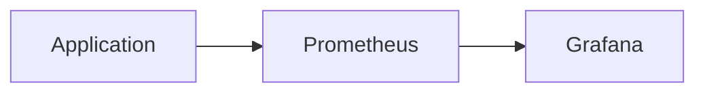
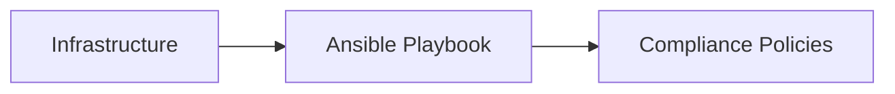

## Designing DevSecOps for the Operate Phase

### Introduction to the Operate Phase

The Operate phase of the Software Development Life Cycle (SDLC) focuses on ensuring that the application is running smoothly, securely, and efficiently once it has been deployed. This phase is critical because it involves continuous monitoring, verification, and compliance checks to ensure that the application remains secure and operational. In this phase, the primary goal is to detect and respond to any potential threats or unauthorized changes as quickly as possible.

### Monitoring and Detection

#### Importance of Monitoring

Monitoring is essential in the Operate phase because it allows teams to detect anomalies and potential security threats in real-time. Continuous monitoring helps in identifying deviations from normal behavior, which could indicate a security breach or an unauthorized change in the system configuration.

#### Tools for Monitoring

Several tools are available for monitoring applications in the Operate phase. Some popular ones include:

- **Prometheus**: An open-source systems monitoring and alerting toolkit.
- **Grafana**: A visualization platform that works with Prometheus and other data sources.
- **ELK Stack (Elasticsearch, Logstash, Kibana)**: A suite of open-source software for log management and analysis.

#### Example: Using Prometheus for Monitoring



**Prometheus Configuration Example:**

```yaml
# prometheus.yml
scrape_configs:
  - job_name: 'app-monitor'
    static_configs:
      - targets: ['localhost:8080']
```

**Grafana Dashboard Example:**

```json
{
  "title": "Application Metrics",
  "panels": [
    {
      "type": "timeseries",
      "title": "CPU Usage",
      "datasource": "Prometheus",
      "targets": [
        { "expr": "rate(process_cpu_seconds_total{job='app-monitor'}[5m])" }
      ]
    }
  ]
}
```

### Compliance as Code

#### What is Compliance as Code?

Compliance as Code refers to the practice of automating compliance checks using code. This approach ensures that the environment configuration adheres to predefined security policies and standards. By continuously validating the environment against these policies, organizations can quickly identify and remediate any deviations.

#### Tools for Compliance as Code

Some popular tools for implementing Compliance as Code include:

- **Ansible**: An automation tool that can enforce compliance policies.
- **Terraform**: A tool for infrastructure as code that can integrate with compliance checks.
- **InSpec**: A testing framework for infrastructure compliance.

#### Example: Using Ansible for Compliance Checks



**Ansible Playbook Example:**

```yaml
---
- name: Ensure compliance policies are met
  hosts: all
  tasks:
    - name: Check SELinux status
      selinux:
        policy: targeted
        state: enforcing
      register: selinux_status
    - debug:
        msg: "SELinux is {{ selinux_status.enforcing }}"
```

### Verification and Monitoring

#### Continuous Verification

Continuous verification involves regularly checking that the application is operating within expected norms. This includes monitoring performance metrics, security logs, and system configurations to ensure that everything is functioning as intended.

#### Real-World Example: Recent Breach

One recent example of a breach that highlights the importance of continuous monitoring and verification is the **SolarWinds Orion Platform breach** (CVE-2020-1014). This breach involved a supply chain attack where attackers compromised the SolarWinds software update mechanism, allowing them to inject malicious code into the software updates. Organizations that had implemented continuous monitoring and verification might have detected unusual activity and taken action to mitigate the threat.

### Tooling for DevSecOps

#### Periodic Table of DevOps Tools

The Periodic Table of DevOps Tools is a comprehensive resource that categorizes various tools used in the DevOps lifecycle. This table helps teams understand which tools are best suited for specific phases of the SDLC, including the Operate phase.

#### Accessing the Periodic Table

You can access the Periodic Table of DevOps Tools at the following URL: [https://devops.com/devops-periodic-table/](https://devops.com/devops-periodic-table/).

#### Security Tools in the Periodic Table

The bottom-right corner of the Periodic Table lists various security tools that are relevant to the Operate phase. These tools include:

- **SonarQube**: A static code analysis tool.
- **OWASP ZAP**: An open-source web application security scanner.
- **Nessus**: A vulnerability scanner.

### How to Prevent / Defend

#### Detecting Unauthorized Changes

Unauthorized changes to the environment configuration can be detected using tools like Ansible and InSpec. These tools can continuously validate the environment against predefined compliance policies and alert administrators to any deviations.

#### Preventing Unauthorized Changes

To prevent unauthorized changes, organizations should implement strict access controls and least privilege principles. This includes:

- **Role-Based Access Control (RBAC)**: Ensuring that users have only the permissions necessary to perform their job functions.
- **Audit Logs**: Maintaining detailed logs of all changes made to the environment.

#### Secure Coding Practices

Secure coding practices involve writing code that is resilient to attacks and adheres to security best practices. This includes:

- **Input Validation**: Ensuring that all user inputs are validated to prevent injection attacks.
- **Error Handling**: Properly handling errors to prevent information leakage.

#### Example: Secure Coding Fix

**Vulnerable Code:**

```python
def get_user_data(user_id):
    query = f"SELECT * FROM users WHERE id = {user_id}"
    cursor.execute(query)
    return cursor.fetchall()
```

**Fixed Code:**

```python
def get_user_data(user_id):
    query = "SELECT * FROM users WHERE id = %s"
    cursor.execute(query, (user_id,))
    return cursor.fetchall()
```

### Hands-On Labs

For hands-on practice in designing DevSecOps for the Operate phase, consider the following labs:

- **PortSwigger Web Security Academy**: Offers interactive labs for learning web security concepts.
- **OWASP Juice Shop**: A deliberately insecure web application for practicing security testing.
- **DVWA (Damn Vulnerable Web Application)**: Another intentionally vulnerable web application for security training.

### Conclusion

The Operate phase of the SDLC is crucial for ensuring the ongoing security and stability of an application. By implementing continuous monitoring, compliance as code, and verification, organizations can quickly detect and respond to potential threats. Utilizing the right tools and following secure coding practices are essential for maintaining a secure environment.

---
<!-- nav -->
[[DevSecOps/DevSecOps Bootcamp/09-Miscellaneous/03-Designing DevSecOps for Test, Release, and Operate SDLC Phases/02-DevSecOps in the Operate Phase/00-Overview|Overview]] | [[DevSecOps/DevSecOps Bootcamp/09-Miscellaneous/03-Designing DevSecOps for Test, Release, and Operate SDLC Phases/02-DevSecOps in the Operate Phase/02-Practice Questions & Answers|Practice Questions & Answers]]
