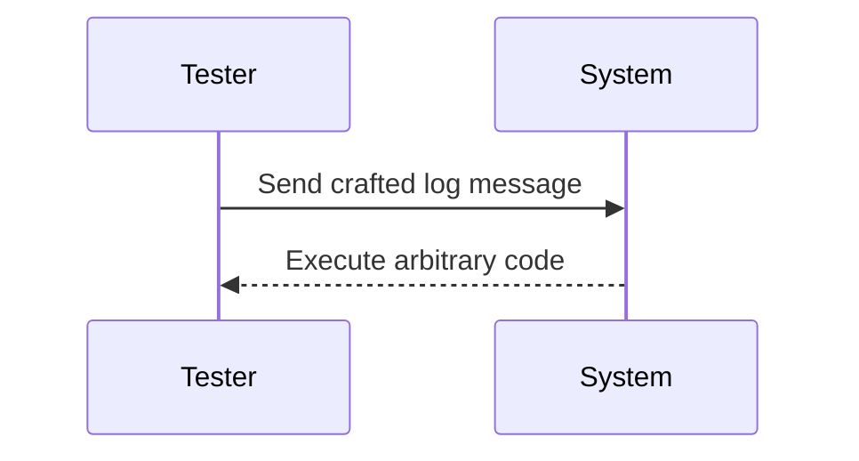
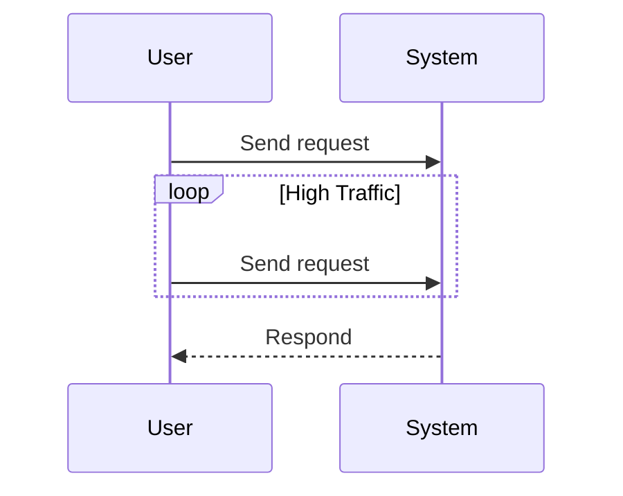
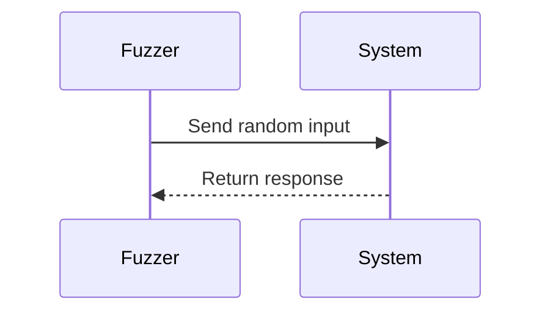
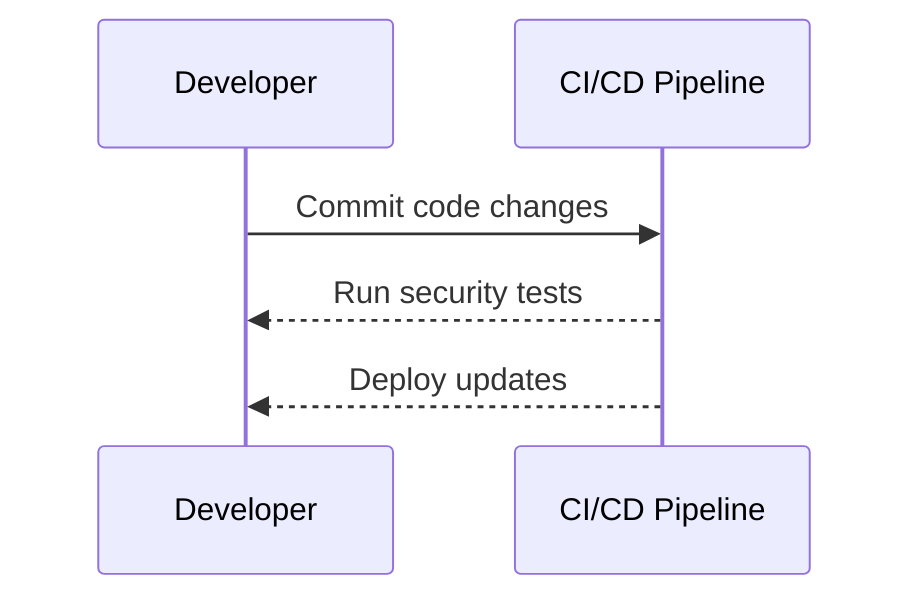

## Introduction to DevSecOps in the Test Phase

In the context of DevSecOps, the Test phase is crucial for ensuring that the final product is secure and robust. By this stage, the source code has been analyzed, and the built product is ready for comprehensive testing. This phase includes various types of security testing such as penetration testing, load testing, and fuzzing. Each type of testing serves a specific purpose and helps identify potential vulnerabilities and weaknesses in the system.

### Penetration Testing

Penetration testing, often referred to as "pen testing," is a manual process designed to simulate real-world attacks on a system. The goal is to identify vulnerabilities that could be exploited by malicious actors. This type of testing is essential because it provides insights into the security posture of the system from an attacker's perspective.

#### What is Penetration Testing?

Penetration testing involves attempting to compromise the security of a system using various attack techniques. These techniques can range from exploiting known vulnerabilities to social engineering tactics. The primary objective is to find weaknesses that could be exploited to gain unauthorized access to the system.

#### Why is Penetration Testing Important?

Penetration testing is important because it helps organizations understand their security gaps and take proactive measures to mitigate them. Automated tools can identify many vulnerabilities, but they cannot replicate the creativity and adaptability of human attackers. Penetration testing bridges this gap by simulating real-world attack scenarios.

#### How Does Penetration Testing Work?

Penetration testing typically follows these steps:

1. **Planning and Scoping**: Define the scope of the test, including the systems to be tested and the types of attacks to be simulated.
2. **Information Gathering**: Collect information about the target system, including IP addresses, open ports, and services.
3. **Threat Modeling**: Identify potential attack vectors based on the gathered information.
4. **Exploitation**: Attempt to exploit identified vulnerabilities to gain unauthorized access.
5. **Reporting**: Document the findings and provide recommendations for remediation.

#### Real-World Example: CVE-2021-44228 (Log4Shell)

One of the most significant recent vulnerabilities was the Log4Shell (CVE-2021-44228) vulnerability in Apache Log4j. This vulnerability allowed attackers to execute arbitrary code on affected systems. Penetration testing could have helped identify this vulnerability by simulating attacks that exploit similar vulnerabilities.

#### How to Prevent / Defend Against Penetration Testing Vulnerabilities

**Detection**:
- Implement intrusion detection systems (IDS) to monitor for suspicious activities.
- Use security information and event management (SIEM) tools to correlate events and detect anomalies.

**Prevention**:
- Regularly update and patch systems to address known vulnerabilities.
- Implement strict access controls and least privilege principles.

**Secure Coding Fix**:
- Ensure that logging mechanisms are configured securely and do not allow arbitrary code execution.

### Load Testing

Load testing is another critical aspect of the Test phase. It involves simulating high levels of traffic to determine how the system performs under stress. This type of testing is particularly important for identifying potential issues related to scalability and performance.

#### What is Load Testing?

Load testing is a process of subjecting a system to a heavy workload to measure its performance and identify bottlenecks. The goal is to ensure that the system can handle the expected user load without degrading performance or crashing.

#### Why is Load Testing Important?

Load testing is important because it helps organizations understand the limits of their systems and make necessary improvements. Without proper load testing, systems may fail during peak usage times, leading to downtime and loss of business.

#### How Does Load Testing Work?

Load testing typically involves the following steps:

1. **Define Objectives**: Determine the goals of the load test, such as the number of concurrent users or the expected transaction rate.
2. **Create Test Scenarios**: Develop test scenarios that simulate real-world usage patterns.
3. **Configure Load Generators**: Set up load generators to simulate user traffic.
4. **Run the Test**: Execute the load test and monitor system performance.
5. **Analyze Results**: Evaluate the results to identify performance bottlenecks and areas for improvement.

#### Real-World Example: Netflix Chaos Monkey

Netflix uses a tool called Chaos Monkey to simulate failures in their production environment. This tool randomly terminates instances to test the resilience of their systems. While not traditional load testing, it demonstrates the importance of testing systems under stress conditions.

#### How to Prevent / Defend Against Load Testing Vulnerabilities

**Detection**:
- Monitor system performance metrics such as CPU usage, memory usage, and response time.
- Use application performance monitoring (APM) tools to track performance in real-time.

**Prevention**:
- Scale infrastructure horizontally to handle increased loads.
- Optimize database queries and caching strategies to improve performance.

**Secure Coding Fix**:
- Ensure that the system can gracefully handle high loads without compromising security.

### Fuzzing

Fuzzing is a technique used to discover security vulnerabilities by providing random or unexpected inputs to a system. The goal is to identify unexpected behaviors that could lead to security incidents.

#### What is Fuzzing?

Fuzzing, or fuzz testing, is an automated software testing technique that involves providing invalid, unexpected, or random data as inputs to a computer program. The aim is to trigger errors or crashes that could indicate potential security vulnerabilities.

#### Why is Fuzzing Important?

Fuzzing is important because it can uncover hidden bugs and vulnerabilities that might not be detected through other forms of testing. By providing random inputs, fuzzing can reveal unexpected behaviors that could be exploited by attackers.

#### How Does Fuzzing Work?

Fuzzing typically involves the following steps:

1. **Generate Inputs**: Create random or unexpected inputs to feed into the system.
2. **Execute Tests**: Run the system with the generated inputs and observe the behavior.
3. **Monitor Responses**: Look for unexpected responses or crashes that could indicate a vulnerability.
4. **Analyze Results**: Evaluate the results to identify potential security issues.

#### Real-World Example: Microsoft Edge Fuzzing

Microsoft uses fuzzing extensively to test the security of their products, including Microsoft Edge. In 2020, fuzzing helped identify several vulnerabilities in the browser, demonstrating the effectiveness of this technique.

#### How to Prevent / Defend Against Fuzzing Vulnerabilities

**Detection**:
- Use static analysis tools to identify potential vulnerabilities in the code.
- Implement runtime protection mechanisms to detect and prevent exploits.

**Prevention**:
- Follow secure coding practices to minimize the risk of introducing vulnerabilities.
- Regularly review and update code to address known vulnerabilities.

**Secure Coding Fix**:
- Ensure that the system handles unexpected inputs gracefully without compromising security.

### Automation in DevSecOps

Automation plays a crucial role in the Test phase of DevSecOps. By automating repetitive tasks, organizations can free up resources for more complex and creative tasks like penetration testing. Automation can also help increase the speed and efficiency of the testing process.

#### What is Automation in DevSecOps?

Automation in DevSecOps refers to the use of tools and processes to automate repetitive tasks in the testing and deployment phases. This includes automating security testing, deployment, and monitoring tasks.

#### Why is Automation Important?

Automation is important because it helps streamline the testing and deployment process, reducing the risk of human error and increasing efficiency. Automated tools can run tests continuously, providing real-time feedback and enabling faster identification and resolution of issues.

#### How Does Automation Work?

Automation typically involves the following steps:

1. **Identify Tasks to Automate**: Determine which tasks can be automated, such as running security tests or deploying updates.
2. **Select Tools**: Choose appropriate tools for automation, such as continuous integration/continuous deployment (CI/CD) pipelines.
3. **Implement Automation**: Set up the automation process and integrate it into the existing workflow.
4. **Monitor and Maintain**: Continuously monitor the automated processes and make adjustments as needed.

#### Real-World Example: GitHub Actions

GitHub Actions is a popular tool for automating workflows in DevSecOps. It allows organizations to automate tasks such as running security tests, deploying updates, and monitoring system performance.

#### How to Prevent / Defend Against Automation Vulnerabilities

**Detection**:
- Use security scanning tools to identify vulnerabilities in the automated processes.
- Implement logging and monitoring to detect any unusual activity.

**Prevention**:
- Secure the automation pipeline by implementing access controls and encryption.
- Regularly review and update the automation scripts to address known vulnerabilities.

**Secure Coding Fix**:
- Ensure that the automation scripts are written securely and follow best practices.

### Conclusion

The Test phase of DevSecOps is critical for ensuring the security and robustness of the final product. Through various types of security testing such as penetration testing, load testing, and fuzzing, organizations can identify and mitigate potential vulnerabilities. Automation plays a key role in streamlining the testing and deployment process, enabling faster and more efficient identification and resolution of issues. By following best practices and implementing robust security measures, organizations can build secure and reliable systems.

### Practice Labs

For hands-on experience with DevSecOps in the Test phase, consider the following labs:

- **PortSwigger Web Security Academy**: Offers interactive labs for learning web security concepts, including penetration testing and fuzzing.
- **OWASP Juice Shop**: A deliberately insecure web application for practicing web security skills.
- **DVWA (Damn Vulnerable Web Application)**: A PHP/MySQL web application that is vulnerable by design, allowing users to practice penetration testing.

These labs provide practical experience in applying the concepts learned in this chapter.

---
<!-- nav -->
[[DevSecOps/DevSecOps Bootcamp/09-Miscellaneous/03-Designing DevSecOps for Test, Release, and Operate SDLC Phases/03-DevSecOps in the Test Phase/00-Overview|Overview]] | [[02-Monitoring for Exceptions During Testing|Monitoring for Exceptions During Testing]]
