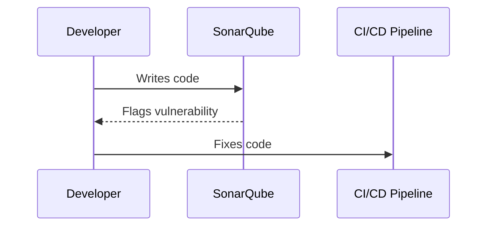
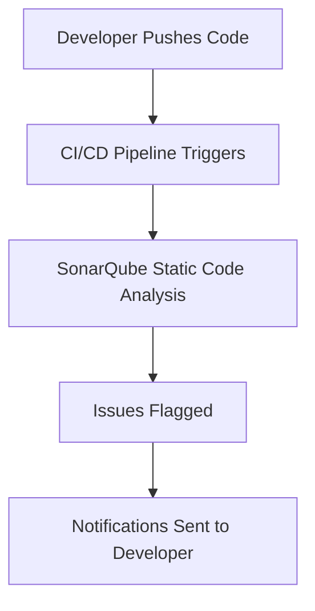
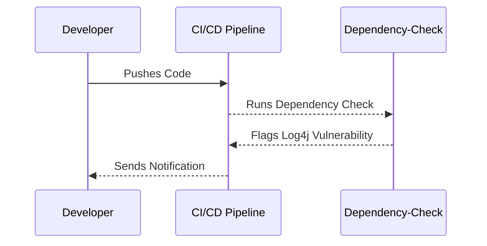

## Automated Checks in DevSecOps

### Importance of Automated Checks

Automated checks are a cornerstone of DevSecOps, ensuring that security practices are integrated seamlessly into the software development lifecycle (SDLC). By automating these checks, teams can achieve faster delivery times and maintain consistency across different environments. This is particularly crucial in today’s fast-paced development landscape, where manual processes can introduce delays and human errors.

#### Why Automation Matters

Automation helps in several key ways:

1. **Speed**: Automated checks run much faster than manual ones, allowing developers to receive immediate feedback on their code.
2. **Consistency**: Automated tools apply the same standards and rules consistently across all codebases, reducing variability.
3. **Scalability**: With the increasing complexity of modern applications and the growing number of code repositories, automation is essential to manage the volume of checks required.
4. **Skill Shortage Mitigation**: The cybersecurity industry faces a significant skill shortage. Automation can fill gaps by handling repetitive tasks, allowing skilled professionals to focus on more complex issues.

### Feedback Loops in DevSecOps

One of the most critical aspects of DevSecOps is the reduction of feedback time lag. This means minimizing the delay between identifying an issue and providing that information back to the developer. Immediate feedback is crucial because it ensures that the problem is still fresh in the developer’s mind, making it easier to understand and fix.

#### Example: Real-time Code Analysis

Consider a scenario where a developer writes a piece of code that introduces a security vulnerability. An automated tool like SonarQube can analyze the code in real-time and flag the issue immediately. This immediate feedback allows the developer to address the issue promptly, rather than waiting until later stages of the development process.



### Tooling in DevSecOps

Effective DevSecOps requires the use of appropriate tools at each phase of the SDLC. These tools range from static application security testing (SAST) and dynamic application security testing (DAST) to dependency scanning and container image analysis. Choosing the right tools is crucial for ensuring that security checks are comprehensive and effective.

#### Common Tools

- **SonarQube**: A popular tool for static code analysis, helping identify security vulnerabilities and coding issues.
- **OWASP ZAP**: A free, open-source tool for automated penetration testing, useful for DAST.
- **Trivy**: A tool for scanning container images and dependencies for known vulnerabilities.
- **Dependency-Check**: A tool for identifying project dependencies with known vulnerabilities.

#### Example: Using Trivy for Container Image Scanning

Trivy is a tool that scans container images for known vulnerabilities. Here’s how you might integrate it into a CI/CD pipeline:

```yaml
# .github/workflows/ci.yml
name: CI
on:
  push:
    branches: [ main ]
jobs:
  build:
    runs-on: ubuntu-latest
    steps:
      - name: Checkout code
        uses: actions/checkout@v2
      - name: Build Docker image
        run: docker build -t myapp .
      - name: Scan with Trivy
        run: trivy image --severity CRITICAL,HIGH myapp
```

This workflow builds a Docker image and then uses Trivy to scan it for vulnerabilities. If any critical or high-severity vulnerabilities are found, the build will fail.

### Reducing Feedback Time Lag

Reducing the feedback time lag is essential for effective DevSecOps. This involves integrating security checks into the continuous integration (CI) pipeline so that developers receive immediate feedback on their code.

#### Example: Real-time Feedback in CI/CD

Consider a CI/CD pipeline that integrates SonarQube for static code analysis. When a developer pushes code to the repository, the pipeline automatically triggers a build and runs SonarQube to analyze the code. Any issues are flagged immediately, and the developer receives notifications.



### How to Prevent / Defend

To ensure that automated checks and feedback loops are effective, it’s crucial to implement robust security measures and best practices.

#### Secure Coding Practices

Secure coding practices involve writing code that is less susceptible to vulnerabilities. This includes:

- **Input Validation**: Ensuring that all inputs are validated to prevent injection attacks.
- **Error Handling**: Properly handling errors to avoid exposing sensitive information.
- **Least Privilege Principle**: Running applications with the least privileges necessary to perform their tasks.

#### Example: Secure Coding Fix

Consider a scenario where a developer writes code that is vulnerable to SQL injection. Here’s how the vulnerable code might look:

```sql
# Vulnerable Code
SELECT * FROM users WHERE username = '$username';
```

And here’s the secure version using parameterized queries:

```sql
# Secure Code
PreparedStatement stmt = conn.prepareStatement("SELECT * FROM users WHERE username = ?");
stmt.setString(1, username);
ResultSet rs = stmt.executeQuery();
```

#### Configuration Hardening

Configuration hardening involves securing the environment in which the application runs. This includes:

- **Disabling Unnecessary Services**: Removing services that are not needed reduces the attack surface.
- **Using Strong Encryption**: Ensuring that data is encrypted both in transit and at rest.
- **Regular Updates and Patching**: Keeping all software components up-to-date to protect against known vulnerabilities.

#### Example: Configuration Hardening

Consider a Dockerfile that sets up a web server. Here’s how you might harden the configuration:

```dockerfile
# Dockerfile
FROM nginx:latest
COPY ./nginx.conf /etc/nginx/nginx.conf
RUN apt-get update && apt-get install -y openssl
RUN openssl req -newkey rsa:2048 -nodes -keyout /etc/nginx/ssl.key -x509 -days 365 -out /etc/nginx/ssl.crt
EXPOSE 443
CMD ["nginx", "-g", "daemon off;"]
```

In this example, the Dockerfile installs OpenSSL and generates a self-signed SSL certificate to enable HTTPS.

### Real-World Examples

#### Recent CVEs and Breaches

Recent CVEs and breaches highlight the importance of automated checks and feedback loops in DevSecOps. For example, the Log4j vulnerability (CVE-2021-44228) affected numerous applications due to a lack of proper security checks and updates.

#### Example: Log4j Vulnerability

The Log4j vulnerability was a critical flaw in the Apache Log4j library that allowed remote code execution. Many organizations were affected because they did not have automated checks in place to detect and mitigate such vulnerabilities.



### Conclusion

In conclusion, automated checks, reduced feedback time lag, and appropriate tooling are essential components of DevSecOps. By integrating these practices into the SDLC, organizations can improve their security posture and deliver high-quality software more efficiently. The next module will delve into some of the myths surrounding DevSecOps and debunk them, providing a clearer understanding of how to effectively implement DevSecOps principles.

### Practice Labs

For hands-on experience with DevSecOps, consider the following labs:

- **PortSwigger Web Security Academy**: Offers interactive labs to practice web security concepts.
- **OWASP Juice Shop**: A deliberately insecure web application for practicing security testing.
- **DVWA (Damn Vulnerable Web Application)**: Another intentionally vulnerable web app for learning security testing.
- **WebGoat**: A deliberately insecure Java application designed to teach web application security lessons.

These labs provide practical experience in applying DevSecOps principles and tools in real-world scenarios.

---
<!-- nav -->
[[DevSecOps/DevSecOps Bootcamp/09-Miscellaneous/03-Designing DevSecOps for Test, Release, and Operate SDLC Phases/04-Module Summary/00-Overview|Overview]] | [[DevSecOps/DevSecOps Bootcamp/09-Miscellaneous/03-Designing DevSecOps for Test, Release, and Operate SDLC Phases/04-Module Summary/02-Practice Questions & Answers|Practice Questions & Answers]]
