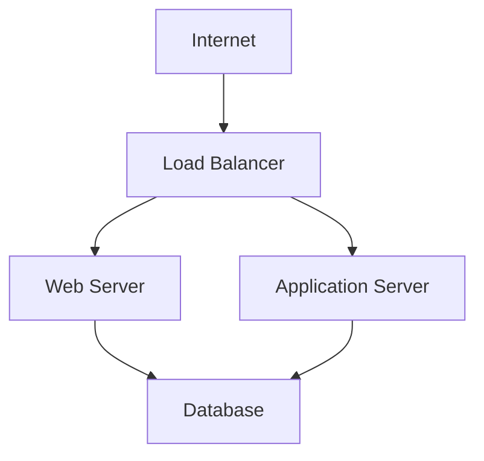

## Introduction to DevSecOps Bootcamp Curriculum Overview

In this section, we will delve into the core aspects of the DevSecOps bootcamp curriculum, focusing particularly on the deployment environment and the associated security concerns. This phase is critical as it involves making the application accessible to end-users, thereby exposing it to potential threats. We will explore infrastructure and cloud security, with a primary focus on Amazon Web Services (AWS), while emphasizing the importance of learning general security concepts applicable across different cloud platforms.

### Deployment Environment and Security Concerns

The deployment environment is where the application runs and becomes accessible to end-users. This stage introduces a myriad of security concerns due to the exposure to the public internet. Ensuring the security of the deployment environment is paramount to protect the application from various threats such as unauthorized access, data breaches, and malicious attacks.

#### Why Focus on Deployment Security?

Deployment security is crucial because:

- **Exposure to Public Internet**: Once deployed, the application is accessible via the internet, making it a target for attackers.
- **Data Protection**: Sensitive user data must be protected against unauthorized access and breaches.
- **Compliance Requirements**: Many industries have strict compliance requirements that mandate robust security measures.
- **Reputation Management**: Security breaches can severely damage an organization’s reputation and lead to financial losses.

### Infrastructure and Cloud Security

Infrastructure and cloud security involve securing the underlying hardware, software, and network components that support the application. Cloud computing, in particular, offers scalable and flexible resources but also introduces unique security challenges.

#### Importance of Cloud Security

Cloud security is essential because:

- **Shared Responsibility Model**: In cloud environments, the responsibility for security is shared between the cloud provider and the customer.
- **Multi-Tenancy**: Cloud platforms often host multiple customers on the same physical infrastructure, increasing the risk of cross-tenant attacks.
- **Dynamic Nature**: Cloud resources can be rapidly provisioned and deprovisioned, requiring dynamic security controls.

### Focus on AWS

Amazon Web Services (AWS) is widely recognized as one of the leading cloud providers. Given its extensive market share and rich set of services, AWS serves as an excellent platform to learn cloud security concepts.

#### Why AWS?

- **Market Leadership**: AWS is the most widely used cloud platform, providing a vast array of services.
- **Rich Ecosystem**: AWS offers a comprehensive set of security services and tools, making it ideal for learning cloud security.
- **Community Support**: Extensive documentation, forums, and community support make AWS a preferred choice for learners.

### Concepts Before Technologies

While learning AWS-specific services is valuable, the emphasis should be on understanding general security concepts. This approach ensures that learners can apply their knowledge across different cloud platforms and infrastructures.

#### General Security Concepts

Some key general security concepts include:

- **Access Management**
- **Network Security**
- **Data Encryption**
- **Identity and Access Management (IAM)**

### Access Management

Access management is a fundamental aspect of security that involves controlling who can access resources and what actions they can perform. Proper access management is crucial to prevent unauthorized access and ensure that only authorized individuals can interact with sensitive data.

#### What is Access Management?

Access management involves:

- **Authentication**: Verifying the identity of users.
- **Authorization**: Determining what actions authenticated users can perform.
- **Account Management**: Managing user accounts and permissions.

#### Why is Access Management Important?

- **Prevent Unauthorized Access**: Ensures that only authorized users can access resources.
- **Enforce Least Privilege**: Users are granted only the minimum permissions necessary to perform their tasks.
- **Audit and Compliance**: Helps in maintaining audit trails and ensuring compliance with regulatory requirements.

### Real-World Examples

Recent breaches and vulnerabilities highlight the importance of robust access management practices. For instance:

- **CVE-2021-26855**: A vulnerability in AWS Elastic Load Balancing allowed unauthorized access to internal resources.
- **SolarWinds Supply Chain Attack**: Malicious actors exploited weak access controls to gain unauthorized access to systems.

#### How to Prevent / Defend

To prevent access management-related vulnerabilities, implement the following measures:

- **Strong Authentication Mechanisms**: Use multi-factor authentication (MFA) to enhance security.
- **Least Privilege Principle**: Grant users only the permissions necessary to perform their tasks.
- **Regular Audits**: Conduct regular audits to ensure compliance with access control policies.

### Code Examples and Configurations

Let's look at some practical examples of implementing access management in AWS.

#### IAM Policy Example

```json
{
    "Version": "2012-10-17",
    "Statement": [
        {
            "Effect": "Allow",
            "Action": [
                "s3:ListBucket"
            ],
            "Resource": "arn:aws:s3:::example-bucket"
        },
        {
            "Effect": "Allow",
            "Action": [
                "s3:GetObject"
            ],
            "Resource": "arn:aws:s3:::example-bucket/*"
        }
    ]
}
```

This IAM policy allows a user to list objects in the `example-bucket` and retrieve objects from it.

#### Vulnerable vs. Secure Configuration

**Vulnerable Configuration:**

```json
{
    "Version": "2012-10-17",
    "Statement": [
        {
            "Effect": "Allow",
            "Action": "*",
            "Resource": "*"
        }
    ]
}
```

This policy grants unrestricted access to all AWS resources, which is highly insecure.

**Secure Configuration:**

```json
{
    "Version": "2012-10-17",
    "Statement": [
        {
            "Effect": "Allow",
            "Action": [
                "s3:ListBucket"
            ],
            "Resource": "arn:aws:s3:::example-bucket"
        },
        {
            “Effect”: “Deny”,
            “Action”: “*”,
            “NotResource”: “arn:aws:s3:::example-bucket”
        }
    ]
}
```

This policy restricts access to only the necessary actions and resources, enhancing security.

### Network Topology Diagram

A network topology diagram can help visualize the deployment environment and identify potential security risks.



### Hands-On Labs

For practical experience, consider the following labs:

- **PortSwigger Web Security Academy**: Offers hands-on exercises to understand and mitigate web security vulnerabilities.
- **OWASP Juice Shop**: A deliberately insecure web application for practicing web security skills.
- **DVWA (Damn Vulnerable Web Application)**: A PHP/MySQL web application that demonstrates web application vulnerabilities.
- **WebGoat**: An interactive, gamified training application for learning web security.

These labs provide a controlled environment to practice and reinforce the concepts learned in the bootcamp.

### Conclusion

In conclusion, the deployment environment is a critical phase in the application lifecycle, introducing significant security concerns. By focusing on general security concepts and using AWS as a practical example, learners can develop a robust understanding of cloud and infrastructure security. Emphasizing access management and implementing strong security practices can significantly reduce the risk of unauthorized access and data breaches. Through hands-on labs and real-world examples, learners can gain practical experience and become proficient in DevSecOps principles.

---
<!-- nav -->
[[02-Introduction to DevSecOps Bootcamp Curriculum Overview Part 1|Introduction to DevSecOps Bootcamp Curriculum Overview Part 1]] | [[DevSecOps/DevSecOps Bootcamp/01-DevSecOps Introduction/05-Getting Started with the DevSecOps Bootcamp/DevSecOps Bootcamp Curriculum Overview/00-Overview|Overview]] | [[04-Introduction to DevSecOps Bootcamp Curriculum Part 1|Introduction to DevSecOps Bootcamp Curriculum Part 1]]
