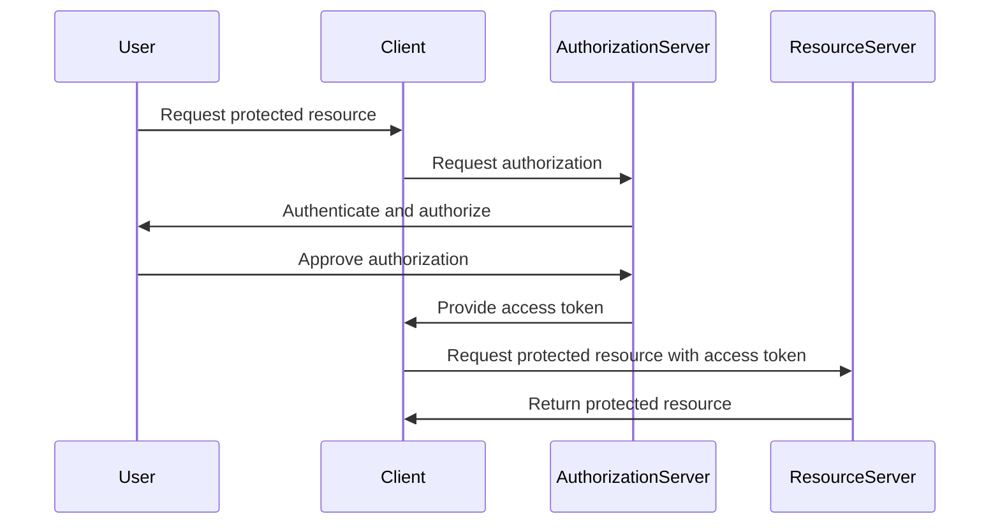

## Introduction to DevSecOps Bootcamp Prerequisites

Welcome to the DevSecOps Bootcamp! Before diving into the specifics of the bootcamp, it's essential to understand the prerequisites and foundational knowledge required to get the most out of this intensive learning experience. This chapter will provide a comprehensive overview of the necessary skills and concepts, ensuring that you are well-prepared to tackle the challenges ahead.

### What is DevSecOps?

DevSecOps is an approach to software development that integrates security practices throughout the entire software development lifecycle (SDLC). It emphasizes collaboration between development, operations, and security teams to ensure that security is not an afterthought but an integral part of the development process.

#### Why DevSecOps Matters

In today's fast-paced digital landscape, security vulnerabilities can have severe consequences. Recent high-profile breaches such as the SolarWinds supply chain attack (CVE-2020-1014) and the Colonial Pipeline ransomware attack (CVE-2021-34527) highlight the importance of robust security measures. DevSecOps aims to mitigate these risks by embedding security practices into every stage of the SDLC, from planning and coding to testing and deployment.

### Prerequisites Overview

To fully benefit from the DevSecOps Bootcamp, you should have a solid foundation in several key areas:

1. **Basic Understanding of DevOps**
2. **Familiarity with Continuous Integration/Continuous Deployment (CI/CD)**
3. **Knowledge of Version Control Systems (VCS)**
4. **Understanding of Infrastructure as Code (IaC)**
5. **Basic Security Concepts**

Each of these prerequisites is crucial for effectively integrating security into your DevOps pipeline. Let's explore each one in detail.

#### Basic Understanding of DevOps

**What is DevOps?**

DevOps is a set of practices that combines software development (Dev) and IT operations (Ops) to shorten the systems development life cycle while delivering features, fixes, and updates frequently in close alignment with business objectives.

**Why DevOps Matters**

DevOps enables organizations to deliver products faster and more reliably. By breaking down silos between development and operations teams, it fosters collaboration and communication, leading to more efficient workflows and better quality products.

**How DevOps Works**

The core principles of DevOps include:

- **Automation**: Automating repetitive tasks to increase efficiency and reduce human error.
- **Collaboration**: Encouraging cross-functional teamwork to improve communication and streamline processes.
- **Feedback Loops**: Implementing continuous feedback mechanisms to identify and address issues quickly.

**Real-World Example**

Consider the case of Netflix, which uses DevOps practices to manage its complex microservices architecture. By automating deployments and implementing robust monitoring and logging, Netflix can rapidly release new features and services while maintaining high availability and performance.

#### Familiarity with Continuous Integration/Continuous Deployment (CI/CD)

**What is CI/CD?**

CI/CD refers to the practice of automating the integration and deployment of code changes. Continuous Integration (CI) involves regularly merging code changes into a shared repository and running automated tests to catch bugs early. Continuous Deployment (CD) extends this by automatically deploying successful builds to production.

**Why CI/CD Matters**

CI/CD helps teams deliver software more efficiently and with fewer errors. By automating the build, test, and deployment processes, teams can focus on writing code rather than managing manual steps.

**How CI/CD Works**

A typical CI/CD pipeline includes the following stages:

1. **Source Control**: Code is stored in a version control system like Git.
2. **Build**: Automated builds compile the code and run unit tests.
3. **Test**: Automated tests verify the correctness of the code.
4. **Deploy**: Successful builds are deployed to staging and production environments.

**Real-World Example**

GitHub Actions is a popular CI/CD platform that allows developers to automate their workflows directly within GitHub. By setting up workflows using YAML files, teams can define the steps for building, testing, and deploying their applications.

```yaml
name: CI/CD Pipeline

on:
  push:
    branches:
      - main

jobs:
  build:
    runs-on: ubuntu-latest

    steps:
    - name: Checkout code
      uses: actions/checkout@v2

    - name: Set up Node.js
      uses: actions/setup-node@v2
      with:
        node-version: '14'

    - name: Install dependencies
      run: npm install

    - name: Run tests
      run: npm test

    - name: Deploy to production
      run: npm run deploy
```

#### Knowledge of Version Control Systems (VCS)

**What is VCS?**

Version Control Systems (VCS) are tools that help track changes to code over time. They allow multiple developers to work on the same project simultaneously without conflicts.

**Why VCS Matters**

VCS is essential for managing code changes and collaborating with other developers. It provides a history of changes, allowing teams to revert to previous versions if needed.

**How VCS Works**

The most popular VCS today is Git, which uses a distributed model. Key concepts include:

- **Repository**: A central location where code is stored.
- **Branches**: Separate lines of development that can be merged back into the main branch.
- **Commits**: Individual snapshots of changes made to the codebase.

**Real-World Example**

GitHub is a widely used platform for hosting Git repositories. It provides additional features such as issue tracking, pull requests, and code reviews, making it a popular choice for open-source and commercial projects.

```bash
# Initialize a new Git repository
git init

# Add files to the staging area
git add .

# Commit changes with a descriptive message
git commit -m "Initial commit"

# Push changes to a remote repository
git push origin main
```

#### Understanding of Infrastructure as Code (IaC)

**What is IaC?**

Infrastructure as Code (IaC) is the practice of managing and provisioning infrastructure using code instead of manual processes. It allows teams to define infrastructure configurations in a declarative manner, making it easier to manage and scale.

**Why IaC Matters**

IaC improves consistency, reduces errors, and enables faster deployment of infrastructure changes. By treating infrastructure as code, teams can version control their configurations, automate deployments, and easily replicate environments.

**How IaC Works**

Popular IaC tools include:

- **Terraform**: A tool for building, changing, and versioning infrastructure safely and efficiently.
- **Ansible**: An automation tool that can configure systems, deploy software, and orchestrate more advanced IT tasks.
- **CloudFormation**: A service provided by AWS for defining and provisioning infrastructure resources.

**Real-World Example**

Terraform is a powerful IaC tool that allows teams to define infrastructure using HCL (HashiCorp Configuration Language). Here’s an example of creating an EC2 instance using Terraform:

```hcl
provider "aws" {
  region = "us-west-2"
}

resource "aws_instance" "example" {
  ami           = "ami-0c55b159cbfafe1f0"
  instance_type = "t2.micro"

  tags = {
    Name = "example-instance"
  }
}
```

#### Basic Security Concepts

**What are Basic Security Concepts?**

Basic security concepts encompass fundamental principles and practices that help protect systems and data from unauthorized access, theft, and damage.

**Why Basic Security Matters**

Security is critical in today’s digital world. Without proper security measures, organizations are vulnerable to attacks that can result in financial losses, reputational damage, and legal liabilities.

**How Basic Security Works**

Key security concepts include:

- **Authentication**: Verifying the identity of users.
- **Authorization**: Granting permissions based on user roles.
- **Encryption**: Protecting data from unauthorized access.
- **Access Control**: Limiting access to resources based on user permissions.

**Real-World Example**

OAuth 2.0 is a widely used protocol for authorization. It allows third-party applications to access resources on behalf of a user without exposing their credentials. Here’s an example of an OAuth 2.0 authorization flow:



### How to Prevent / Defend

To ensure that your DevSecOps practices are robust and effective, it’s important to implement preventive measures and defensive strategies. Here are some key steps:

#### Detection

Implementing monitoring and logging tools to detect security incidents in real-time. Tools like Splunk, ELK Stack, and AWS CloudTrail can help track and analyze security events.

#### Prevention

Using security best practices such as:

- **Least Privilege Principle**: Granting users only the minimum permissions necessary to perform their tasks.
- **Regular Audits**: Conducting regular security audits to identify and address vulnerabilities.
- **Secure Coding Practices**: Following secure coding guidelines to prevent common vulnerabilities like SQL injection and cross-site scripting (XSS).

#### Secure-Coding Fixes

Here’s an example of a vulnerable code snippet and its secure counterpart:

**Vulnerable Code: SQL Injection**

```python
# Vulnerable code
query = f"SELECT * FROM users WHERE username='{username}' AND password='{password}'"
cursor.execute(query)
```

**Secure Code: Parameterized Queries**

```python
# Secure code
query = "SELECT * FROM users WHERE username=%s AND password=%s"
cursor.execute(query, (username, password))
```

#### Configuration Hardening

Hardening configurations to minimize attack surfaces. For example, securing an Nginx server:

**Vulnerable Configuration**

```nginx
server {
  listen 80;
  server_name example.com;

  location / {
    root /var/www/html;
    index index.html;
  }
}
```

**Secure Configuration**

```nginx
server {
  listen 80 default_server;
  server_name example.com;

  location / {
    root /var/www/html;
    index index.html;
    deny all;  # Deny all requests by default
  }

  location ~* \.(php|jsp|asp)$ {
    deny all;  # Deny access to script files
  }
}
```

### Practice Labs

To gain hands-on experience with DevSecOps concepts, consider the following practice labs:

- **PortSwigger Web Security Academy**: Offers interactive labs for learning web application security.
- **OWASP Juice Shop**: A deliberately insecure web application for practicing security testing.
- **DVWA (Damn Vulnerable Web Application)**: A PHP/MySQL web application that is riddled with vulnerabilities for educational purposes.
- **WebGoat**: An interactive, gamified training application for learning about web application security.

By completing these labs, you can apply the theoretical knowledge gained from this chapter to real-world scenarios, further enhancing your DevSecOps skills.

### Conclusion

This chapter has provided a comprehensive overview of the prerequisites for the DevSecOps Bootcamp. By understanding the foundational concepts of DevOps, CI/CD, VCS, IaC, and basic security, you are well-equipped to embark on this journey. Remember to continuously practice and refine your skills through hands-on exercises and real-world applications. Happy learning!

---
<!-- nav -->
[[DevSecOps/DevSecOps Bootcamp/01-DevSecOps Introduction/05-Getting Started with the DevSecOps Bootcamp/Pre Requisites of Bootcamp/01-Essentials of CICD Tools|Essentials of CICD Tools]] | [[DevSecOps/DevSecOps Bootcamp/01-DevSecOps Introduction/05-Getting Started with the DevSecOps Bootcamp/Pre Requisites of Bootcamp/00-Overview|Overview]] | [[03-Introduction to DevSecOps Bootcamp Prerequisites|Introduction to DevSecOps Bootcamp Prerequisites]]
