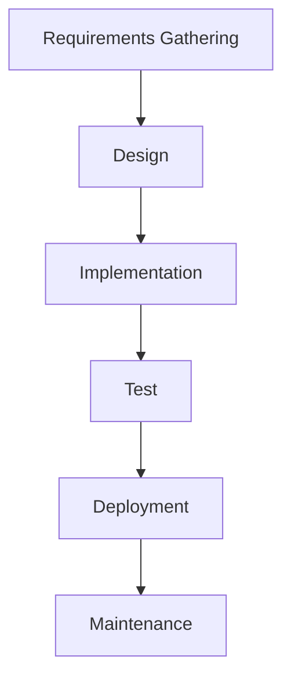
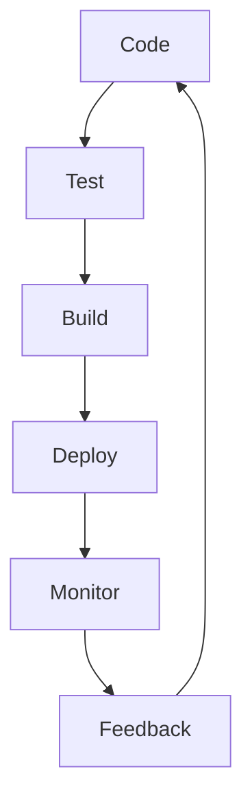

## Introduction to DevSecOps Bootcamp Prerequisites

### Overview of DevSecOps Bootcamp

The DevSecOps Bootcamp is designed to provide a comprehensive understanding of integrating security practices into the DevOps pipeline. This bootcamp focuses on using GitLab as the Continuous Integration/Continuous Deployment (CI/CD) tool. Before diving into the bootcamp, it is crucial to ensure that you meet the prerequisites to maximize your learning experience.

### Importance of Prerequisites

Understanding the prerequisites is essential because they lay the groundwork for effectively participating in the DevSecOps Bootcamp. These prerequisites include familiarity with GitLab CI/CD, basic software development concepts, and foundational knowledge of DevOps principles.

### GitLab CI/CD Essentials

#### What is GitLab CI/CD?

GitLab CI/CD is a powerful tool that enables developers to automate their build, test, and deployment processes. It integrates seamlessly with GitLab's version control system, providing a unified platform for continuous integration and continuous delivery.

#### Why is GitLab CI/CD Important?

GitLab CI/CD is important because it streamlines the development process, ensuring that code changes are tested and deployed efficiently. This reduces the risk of introducing bugs and vulnerabilities into production environments.

#### How Does GitLab CI/CD Work?

GitLab CI/CD works by defining a series of jobs and stages in a `.gitlab-ci.yml` file. Each job can run tests, build artifacts, or deploy applications. Here’s an example of a simple `.gitlab-ci.yml` file:

```yaml
stages:
  - build
  - test
  - deploy

build_job:
  stage: build
  script:
    - echo "Building the application..."
    - npm install
    - npm run build

test_job:
  stage: test
  script:
    - echo "Running tests..."
    - npm test

deploy_job:
  stage: deploy
  script:
    - echo "Deploying the application..."
    - ssh user@server "cd /path/to/app && git pull"
```

This configuration defines three stages: `build`, `test`, and `deploy`. Each stage contains a job that performs specific tasks.

#### Real-World Example: GitLab CI/CD in Action

Consider a recent breach where a company's CI/CD pipeline was compromised, leading to unauthorized deployments. In this case, the company used GitLab CI/CD. By implementing proper security measures such as secret management and access controls, the company could have prevented the breach.

#### How to Prevent / Defend

**Detection:**
- Monitor CI/CD pipelines for unusual activity using tools like GitLab's built-in audit logs.
- Implement anomaly detection systems to identify suspicious behavior.

**Prevention:**
- Use GitLab's secret management features to securely store and manage sensitive data.
- Limit access to CI/CD pipelines using role-based access control (RBAC).

**Secure Coding Fix:**
- **Vulnerable Code:**
  ```yaml
  deploy_job:
    stage: deploy
    script:
      - echo "Deploying the application..."
      - ssh user@server "cd /path/to/app && git pull"
  ```
- **Fixed Code:**
  ```yaml
  deploy_job:
    stage: deploy
    script:
      - echo "Deploying the application..."
      - ssh user@server -i /path/to/private_key "cd /path/to/app && git pull"
  ```

### Software Development Basics

#### What Are Software Development Basics?

Software development basics encompass fundamental concepts such as programming languages, software architecture, and the software development lifecycle (SDLC).

#### Why Are Software Development Basics Important?

Understanding software development basics is crucial because it provides a foundation for comprehending how software is developed, tested, and deployed. This knowledge helps in identifying potential security issues and integrating security practices throughout the SDLC.

#### How Does the Software Development Lifecycle Work?

The SDLC typically includes the following phases:

1. **Requirements Gathering:** Collecting and documenting the requirements for the software.
2. **Design:** Creating a detailed design of the software architecture.
3. **Implementation:** Writing the code based on the design.
4. **Testing:** Verifying that the software meets the requirements and functions correctly.
5. **Deployment:** Releasing the software to production.
6. **Maintenance:** Updating and fixing the software over time.

Here’s a mermaid diagram illustrating the SDLC:



#### Real-World Example: SDLC in Practice

A recent CVE (Common Vulnerabilities and Exposures) involved a software vulnerability that was introduced during the implementation phase. The vulnerability was exploited due to insufficient testing. By ensuring thorough testing and integrating security practices throughout the SDLC, such vulnerabilities can be mitigated.

#### How to Prevent / Defend

**Detection:**
- Use static code analysis tools to identify potential security issues during the implementation phase.
- Conduct regular security audits to assess the overall security posture of the software.

**Prevention:**
- Implement secure coding practices, such as input validation and error handling.
- Use automated testing tools to ensure comprehensive coverage.

**Secure Coding Fix:**
- **Vulnerable Code:**
  ```javascript
  function login(username, password) {
    // No validation or sanitization
    return db.query("SELECT * FROM users WHERE username = '" + username + "' AND password = '" + password + "'");
  }
  ```
- **Fixed Code:**
  ```javascript
  function login(username, password) {
    const sanitizedUsername = sanitizeInput(username);
    const sanitizedPassword = sanitizeInput(password);
    return db.query("SELECT * FROM users WHERE username = ? AND password = ?", [sanitizedUsername, sanitizedPassword]);
  }

  function sanitizeInput(input) {
    // Sanitize input to prevent SQL injection
    return input.replace(/[^a-zA-Z0-9]/g, '');
  }
  ```

### DevOps Fundamentals

#### What Are DevOps Fundamentals?

DevOps fundamentals include understanding the principles of collaboration between development and operations teams, automation, and continuous improvement.

#### Why Are DevOps Fundamentals Important?

DevOps fundamentals are important because they enable organizations to deliver software more efficiently and reliably. By fostering collaboration and automating processes, DevOps helps reduce the time-to-market and improves the quality of software products.

#### How Does DevOps Work?

DevOps involves several key practices, including:

1. **Collaboration:** Encouraging communication and cooperation between development and operations teams.
2. **Automation:** Automating repetitive tasks to improve efficiency and reduce errors.
3. **Continuous Integration and Continuous Delivery (CI/CD):** Integrating and delivering code changes frequently and automatically.
4. **Monitoring and Feedback:** Continuously monitoring the performance of the software and using feedback to drive improvements.

Here’s a mermaid diagram illustrating the DevOps workflow:



#### Real-World Example: DevOps in Practice

A recent breach involved a company that did not implement proper DevOps practices. The company experienced frequent outages and security incidents due to manual processes and lack of automation. By adopting DevOps principles and automating their processes, the company could have prevented these issues.

#### How to Prevent / Defend

**Detection:**
- Use monitoring tools to track the performance and security of the software.
- Implement logging and alerting mechanisms to detect anomalies.

**Prevention:**
- Automate as many processes as possible to reduce human error.
- Foster a culture of collaboration and continuous improvement.

**Secure Coding Fix:**
- **Vulnerable Code:**
  ```bash
  # Manual deployment script
  ssh user@server "cd /path/to/app && git pull"
  ```
- **Fixed Code:**
  ```bash
  # Automated deployment script using GitLab CI/CD
  ssh user@server -i /path/to/private_key "cd /path/to/app && git pull"
  ```

### Conclusion

By ensuring that you meet the prerequisites for the DevSecOps Bootcamp, you will be better prepared to integrate security practices into the DevOps pipeline. Understanding GitLab CI/CD, software development basics, and DevOps fundamentals will provide a solid foundation for success in the bootcamp. Remember to continuously monitor and improve your processes to maintain a secure and efficient development environment.

---
<!-- nav -->
[[02-Introduction to DevSecOps Bootcamp Prerequisites Part 1|Introduction to DevSecOps Bootcamp Prerequisites Part 1]] | [[DevSecOps/DevSecOps Bootcamp/01-DevSecOps Introduction/05-Getting Started with the DevSecOps Bootcamp/Pre Requisites of Bootcamp/00-Overview|Overview]] | [[04-Docker|Docker]]
