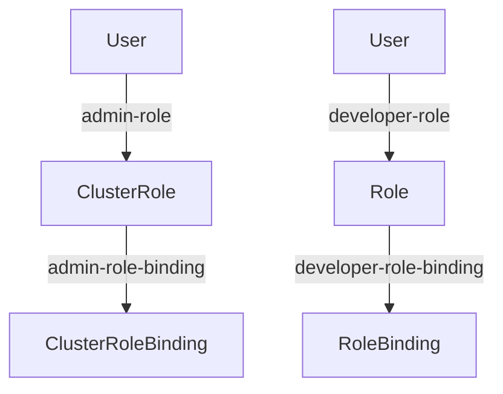

## Overview of Kubernetes Access Management

Before diving into the configuration of a Kubernetes cluster with proper secure access control, it is essential to understand the various components and roles involved in managing access to the cluster. This understanding will help in effectively setting up and maintaining a secure environment.

### Components of Access Management

Access management in Kubernetes involves several key components:

1. **Users**: Individuals who interact with the Kubernetes cluster.
2. **Roles**: Define the set of permissions granted to a user or group of users.
3. **Role Bindings**: Associate roles with specific users or groups.
4. **Service Accounts**: Special accounts used by pods to interact with the Kubernetes API.
5. **Cluster Roles**: Similar to roles but apply across the entire cluster.
6. **Cluster Role Bindings**: Bind cluster roles to users or groups.

### Logical Grouping of Users

To manage access effectively, users are typically grouped into logical categories based on their responsibilities and required permissions. In this context, we will consider two primary groups:

1. **Admins**: Responsible for managing the Kubernetes cluster.
2. **Developers**: Engineers who deploy applications to the cluster.

#### Admins

The admin group includes individuals such as:

- **Kubernetes Administrator**: Manages the overall Kubernetes infrastructure.
- **DevOps Engineer**: Handles deployment pipelines and automation.
- **Systems Administrator**: Ensures the underlying system infrastructure is stable and secure.

These individuals require elevated permissions to perform administrative tasks such as creating namespaces, deploying critical services, and managing service accounts.

#### Developers

The developer group includes individuals who deploy applications to the cluster. They typically require limited permissions to:

- Deploy and manage their own applications.
- View the status of their deployments.
- Access logs and other diagnostic information.

### Defining Roles and Permissions

To implement access control, we need to define roles and permissions for both the admin and developer groups. This involves creating custom roles and role bindings that grant the necessary permissions to each group.

#### Example Roles

Let's define some example roles for both groups:

```yaml
# Admin Role
apiVersion: rbac.authorization.k8s.io/v1
kind: ClusterRole
metadata:
  name: admin-role
rules:
- apiGroups: ["*"]
  resources: ["*"]
  verbs: ["*"]

# Developer Role
apiVersion: rbac.authorization.k8s.io/v1
kind: Role
metadata:
  namespace: default
  name: developer-role
rules:
- apiGroups: [""]
  resources: ["pods", "services", "deployments"]
  verbs: ["get", "list", "watch", "create", "update", "patch", "delete"]
```

### Role Bindings

Once roles are defined, we need to bind them to specific users or groups. This is done using role bindings.

#### Example Role Bindings

```yaml
# Admin Role Binding
apiVersion: rbac.authorization.k8s.io/v1
kind: ClusterRoleBinding
metadata:
  name: admin-role-binding
subjects:
- kind: User
  name: kubernetes-admin
  apiGroup: rbac.authorization.k8s.io
roleRef:
  kind: ClusterRole
  name: admin-role
  apiGroup: rb
```

```yaml
# Developer Role Binding
apiVersion: rbac.authorization.k8s.io/v1
kind: RoleBinding
metadata:
  name: developer-role-binding
  namespace: default
subjects:
- kind: User
  name: developer-user
  apiGroup: rbac.authorization.k8s.io
roleRef:
  kind: Role
  name: developer-role
  apiGroup: rbac.authorization.k8s.io
```

### Service Accounts

Service accounts are used by pods to authenticate with the Kubernetes API. Each pod runs with a default service account, but custom service accounts can be created to provide more granular control over permissions.

#### Example Service Account

```yaml
apiVersion: v1
kind: ServiceAccount
metadata:
  name: my-service-account
  namespace: default
```

### Cluster Roles and Cluster Role Bindings

Cluster roles and cluster role bindings are similar to roles and role bindings but apply across the entire cluster rather than within a specific namespace.

#### Example Cluster Role

```yaml
apiVersion: rbac.authorization.k8s.io/v1
kind: ClusterRole
metadata:
  name: my-cluster-role
rules:
- apiGroups: [""]
  resources: ["pods"]
  verbs: ["get", "list", "watch"]
```

#### Example Cluster Role Binding

```yaml
apiVersion: rbac.authorization.k8s.io/v1
kind: ClusterRoleBinding
metadata:
  name: my-cluster-role-binding
subjects:
- kind: User
  name: my-user
  apiGroup: rbac.authorization.k8s.io
roleRef:
  kind: ClusterRole
  name: my-cluster-role
  apiGroup: rbac.authorization.k8s.io
```

### Mermaid Diagrams

To visualize the relationships between users, roles, and role bindings, we can use mermaid diagrams.



### Real-World Examples and CVEs

Recent breaches and CVEs highlight the importance of proper access management in Kubernetes clusters. For example, the CVE-2020-8558 vulnerability allowed unauthorized access to the Kubernetes API server due to misconfigured RBAC rules.

#### CVE-2020-8558

This vulnerability affected Kubernetes versions prior to 1.18.10, 1.19.8, and 1.20.4. It allowed attackers to bypass RBAC restrictions and gain unauthorized access to the cluster.

**Detection and Prevention**

- **Detection**: Monitor audit logs for unauthorized access attempts.
- **Prevention**: Ensure RBAC rules are correctly configured and regularly reviewed.

### Secure Coding Practices

To prevent unauthorized access, follow these secure coding practices:

1. **Least Privilege Principle**: Grant users only the minimum permissions necessary to perform their tasks.
2. **Regular Audits**: Periodically review and update RBAC rules to ensure they remain appropriate.
3. **Use Strong Authentication Mechanisms**: Implement multi-factor authentication (MFA) for accessing the Kubernetes API.

#### Vulnerable vs. Secure Code

**Vulnerable Code**

```yaml
apiVersion: rbac.authorization.k8s.io/v1
kind: ClusterRole
metadata:
  name: insecure-role
rules:
- apiGroups: ["*"]
  resources: ["*"]
  verbs: ["*"]
```

**Secure Code**

```yaml
apiVersion: rbac.authorization.k8s.io/v1
kind: ClusterRole
metadata:
  name: secure-role
rules:
- apiGroups: [""]
  resources: ["pods", "services"]
  verbs: ["get", "list", "watch"]
```

### Hands-On Labs

To practice Kubernetes access management, consider the following labs:

- **Kubernetes Goat**: A hands-on lab for learning Kubernetes security.
- **OWASP WrongSecrets**: A series of challenges focused on Kubernetes security.
- **kube-hunter**: A tool for identifying security issues in Kubernetes clusters.

By thoroughly understanding and implementing proper access management, you can significantly enhance the security of your Kubernetes cluster.

---
<!-- nav -->
[[DevSecOps/DevSecOps Bootcamp/03-Identity & Access Management/02-Kubernetes Access Management/IAM Roles and K8s Roles How it works/01-Introduction to Kubernetes Access Management|Introduction to Kubernetes Access Management]] | [[DevSecOps/DevSecOps Bootcamp/03-Identity & Access Management/02-Kubernetes Access Management/IAM Roles and K8s Roles How it works/00-Overview|Overview]] | [[03-Kubernetes Access Management IAM Roles and K8s Roles Part 1|Kubernetes Access Management IAM Roles and K8s Roles Part 1]]
