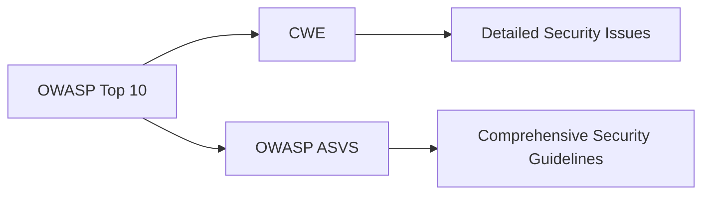

## Overview of OWASP Top 10

The Open Web Application Security Project (OWASP) is a non-profit organization dedicated to improving the security of software. One of its most influential contributions is the OWASP Top 10, an annual report that identifies the ten most critical web application security risks. This list is updated periodically to reflect the evolving landscape of cybersecurity threats and vulnerabilities. Understanding the OWASP Top 10 is crucial for security and DevSecOps engineers, as it provides a comprehensive framework for identifying and mitigating security risks in web applications.

### What is OWASP Top 10?

The OWASP Top 10 is a high-level categorization of various security aspects of web applications. It serves as a guide for developers, security professionals, and organizations to prioritize their efforts in securing web applications. Each category in the OWASP Top 10 represents a broad class of vulnerabilities that can be exploited by attackers to compromise the integrity, confidentiality, and availability of web applications.

### Detailed Security Issues: CWE and OWASP ASVS

While the OWASP Top 10 provides a high-level overview, there are more detailed lists available that can be mapped to these categories. The Common Weakness Enumeration (CWE) is one such list that provides a detailed taxonomy of software weaknesses. CWE entries can be mapped to specific OWASP Top 10 categories, providing a more granular view of potential vulnerabilities.

Another resource is the OWASP Application Security Verification Standard (ASVS). The ASVS is a more comprehensive list that provides detailed guidelines for verifying the security of web applications. It includes a wide range of security controls and checks that can be used to ensure that an application meets the necessary security standards.

### Importance for DevSecOps Engineers

As a security or DevSecOps engineer, understanding the OWASP Top 10 is essential for several reasons:

1. **Guidance**: The OWASP Top 10 provides a clear and concise list of the most critical security risks that need to be addressed.
2. **Prioritization**: It helps in prioritizing security efforts by focusing on the most significant threats first.
3. **Compliance**: Many organizations use the OWASP Top 10 as a benchmark for compliance and security audits.
4. **Education**: It serves as a valuable educational tool for developers and security professionals to understand common security risks and how to mitigate them.

### Before Scanning: Understanding Security Threats

Before scanning an application for security issues, it is crucial to understand the types of security threats that exist and how they can occur. This knowledge helps in identifying what to look for during the scanning process and how to interpret the results.

#### Types of Security Threats

Security threats can be broadly categorized into several types, including:

- **Injection Attacks**: These involve inserting malicious data into an application to manipulate its behavior.
- **Broken Authentication**: This occurs when authentication mechanisms are weak or improperly implemented.
- **Sensitive Data Exposure**: This happens when sensitive data is not properly protected, leading to unauthorized access.
- **Cross-Site Scripting (XSS)**: This involves injecting malicious scripts into web pages viewed by other users.
- **Insecure Deserialization**: This occurs when untrusted data is deserialized, potentially leading to remote code execution.
- **Security Misconfiguration**: This involves misconfigured security settings that leave the application vulnerable.
- **Cross-Site Request Forgery (CSRF)**: This involves tricking a user into performing unintended actions on a web application.
- **Using Components with Known Vulnerabilities**: This occurs when outdated or vulnerable components are used in an application.
- **Insufficient Logging & Monitoring**: This involves inadequate logging and monitoring, making it difficult to detect and respond to security incidents.
- **Server-Side Request Forgery (SSRF)**: This involves tricking a server into making unintended requests to internal services.

### Analyzing and Understanding Security Issues

When security issues are identified through scanning, it is essential to analyze and understand how attackers can take advantage of these issues. This analysis helps in developing effective strategies to protect systems and fix the issues.

#### Example: SQL Injection

**What is SQL Injection?**

SQL injection is a type of injection attack where an attacker manipulates a web application's database queries by inserting malicious SQL code. This can lead to unauthorized access to sensitive data, data manipulation, or even complete control of the database.

**Why Does SQL Injection Matter?**

SQL injection is one of the most common and dangerous types of attacks because it can have severe consequences, including data theft, data corruption, and system compromise.

**How Does SQL Injection Work?**

Consider a simple login form where a user enters a username and password. The application might construct a SQL query like this:

```sql
SELECT * FROM users WHERE username = '$username' AND password = '$password';
```

If the attacker inputs `admin' --` as the username, the query becomes:

```sql
SELECT * FROM users WHERE username = 'admin' --' AND password = '';
```

The `--` is a comment in SQL, so the rest of the query is ignored, effectively bypassing the password requirement.

**Real-World Example: CVE-2018-1259**

In 2018, a SQL injection vulnerability was discovered in the popular WordPress plugin WP Super Cache (CVE-2018-1259). The vulnerability allowed attackers to inject malicious SQL code into the plugin's database queries, potentially leading to unauthorized access to sensitive data.

**How to Prevent / Defend Against SQL Injection**

1. **Use Prepared Statements**: Prepared statements ensure that user input is treated as data rather than executable code.
   
   ```python
   import sqlite3
   
   conn = sqlite3.connect('example.db')
   cursor = conn.cursor()
   
   # Vulnerable code
   user_input = "admin' --"
   cursor.execute(f"SELECT * FROM users WHERE username = '{user_input}'")
   
   # Secure code using prepared statements
   user_input = "admin' --"
   cursor.execute("SELECT * FROM users WHERE username = ?", (user_input,))
   ```

2. **Input Validation**: Validate user input to ensure it conforms to expected formats and does not contain malicious characters.
   
   ```python
   import re
   
   def validate_username(username):
       return bool(re.match(r'^[a-zA-Z0-9_]+$', username))
   
   user_input = "admin' --"
   if validate_username(user_input):
       print("Valid username")
   else:
       print("Invalid username")
   ```

3. **Parameterized Queries**: Use parameterized queries to separate SQL logic from user input.
   
   ```python
   import psycopg2
   
   conn = psycopg2.connect(database="testdb", user="postgres", password="secret", host="127.0.0.1", port="5432")
   cursor = conn.cursor()
   
   user_input = "admin' --"
   cursor.execute("SELECT * FROM users WHERE username = %s", (user_input,))
   ```

### Conclusion

Understanding the OWASP Top 10 is crucial for security and DevSecOps engineers. It provides a comprehensive framework for identifying and mitigating security risks in web applications. By understanding the types of security threats and how they can occur, engineers can effectively scan and analyze applications for vulnerabilities. Additionally, knowing how to prevent and defend against these threats is essential for protecting systems and ensuring the security of web applications.

### Practice Labs

For hands-on practice with OWASP Top 10 vulnerabilities, consider the following resources:

- **PortSwigger Web Security Academy**: Offers interactive labs covering a wide range of web security topics, including the OWASP Top 10.
- **OWASP Juice Shop**: A deliberately insecure web application designed for security training and testing.
- **Damn Vulnerable Web Application (DVWA)**: A PHP/MySQL web application that contains numerous security vulnerabilities.
- **WebGoat**: An interactive, gamified training application for learning about web application security.

These resources provide practical experience in identifying and mitigating security risks, helping to reinforce the theoretical knowledge gained from studying the OWASP Top 10.

### Diagrams

To better visualize the relationship between the OWASP Top 10 and other security frameworks, consider the following diagram:



This diagram illustrates how the OWASP Top 10 serves as a high-level categorization, while the CWE and OWASP ASVS provide more detailed and comprehensive security guidelines.

### Summary

In summary, the OWASP Top 10 is a critical resource for security and DevSecOps engineers. It provides a comprehensive framework for identifying and mitigating security risks in web applications. By understanding the types of security threats and how they can occur, engineers can effectively scan and analyze applications for vulnerabilities. Additionally, knowing how to prevent and defend against these threats is essential for protecting systems and ensuring the security of web applications.

---
<!-- nav -->
[[07-Introduction to Security Essentials|Introduction to Security Essentials]] | [[DevSecOps/DevSecOps Bootcamp/03-Identity & Access Management/04-Security Essentials/OWASP top 10 Part 1/00-Overview|Overview]] | [[09-Application Configuration Files|Application Configuration Files]]
