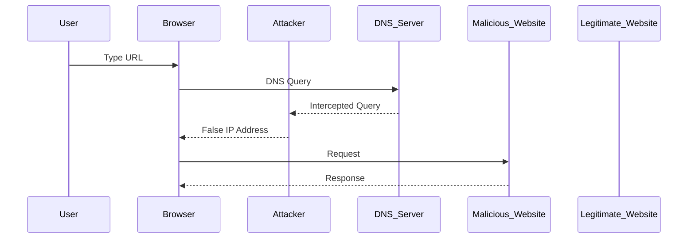

## Phishing Attacks Overview

Phishing attacks are a form of social engineering where attackers attempt to trick individuals into providing sensitive information such as usernames, passwords, credit card details, and other personal data. These attacks are highly effective because they exploit human psychology rather than relying solely on technical vulnerabilities. The goal of phishing is to deceive the victim into believing that they are interacting with a trusted entity, thereby lowering their guard and increasing the likelihood of divulging confidential information.

### Social Engineering and Trust Exploitation

Social engineering is the psychological manipulation of people into performing actions or divulging confidential information. In the context of phishing, attackers exploit trust by impersonating legitimate entities such as banks, service providers, or colleagues. This deception is often achieved through carefully crafted emails, messages, or websites that mimic the appearance and behavior of trusted sources.

#### Example: BEC Scams

Business Email Compromise (BEC) scams are a sophisticated form of phishing where attackers impersonate company executives or vendors to trick employees into transferring money or revealing sensitive information. A notable example is the 2016 attack on Ubiquiti Networks, where attackers used phishing emails to steal $46.7 million from the company. This incident highlights the significant financial and reputational damage that can result from successful phishing attacks.

### Types of Phishing Attacks

There are several types of phishing attacks, each designed to exploit different aspects of human behavior and technological weaknesses. Understanding these types is crucial for developing effective countermeasures.

#### Spear Phishing

Spear phishing is a targeted form of phishing where attackers gather specific information about their victims to create highly personalized and convincing messages. This approach increases the likelihood of success by making the phishing attempt appear more legitimate.

**Example:**

```plaintext
Subject: Urgent: Update Your Account Information

Dear [Victim's Name],

We have noticed some unusual activity on your account. To ensure the security of your information, please click on the link below to verify your details.

[Malicious Link]

Best regards,
[Bank's Name] Customer Support
```

In this example, the attacker uses the victim's name and references a legitimate concern (unusual activity) to make the email seem urgent and trustworthy.

#### Clone Phishing

Clone phishing involves creating a replica of a previously sent legitimate email and modifying it to include a malicious attachment or link. This technique leverages the trust already established between the sender and recipient.

**Example:**

```plaintext
Subject: Re: Your Recent Purchase

Dear [Victim's Name],

Thank you for your purchase. Please find attached the invoice for your recent transaction.

[Malicious Attachment]

Best regards,
[Company's Name]
```

Here, the attacker sends a follow-up email to a previous legitimate communication, making it appear as though the original sender is continuing the conversation.

### DNS Spoofing and Man-in-the-Middle Attacks

DNS spoofing is a technique where attackers manipulate DNS resolution settings to redirect users to malicious websites. This can be achieved by installing scripts on the user's local machine that intercept and modify DNS queries.

#### How DNS Spoofing Works

When a user types a URL into their browser, the browser sends a DNS query to resolve the domain name to an IP address. In a DNS spoofing attack, the attacker intercepts this query and returns a false IP address corresponding to a malicious website.



In this sequence diagram, the attacker intercepts the DNS query and redirects the user to a malicious website, which then collects the user's login credentials.

### Real-World Examples

Recent high-profile phishing attacks include:

- **Twitter Hack (2020):** High-profile Twitter accounts were compromised through a spear-phishing attack on Twitter employees. Attackers gained access to internal tools and posted fraudulent tweets soliciting Bitcoin donations.
- **SolarWinds Supply Chain Attack (2020):** This sophisticated attack involved the compromise of SolarWinds' update servers, which allowed attackers to distribute malware to customers. The initial breach was likely achieved through a phishing attack.

### How to Prevent / Defend Against Phishing Attacks

#### Detection

To detect phishing attempts, organizations should implement robust email filtering and monitoring systems. These systems can analyze incoming emails for suspicious characteristics such as:

- Unexpected attachments or links
- Requests for sensitive information
- Poor grammar or spelling errors
- Unusual sender addresses

#### Prevention

Preventing phishing attacks requires a multi-layered approach that includes technical controls, user education, and policy enforcement.

##### Technical Controls

- **Email Filtering:** Use advanced email filtering solutions that can detect and block phishing attempts based on content analysis, reputation checks, and behavioral patterns.
- **DNS Security:** Implement DNSSEC (DNS Security Extensions) to ensure the integrity and authenticity of DNS responses. This prevents attackers from manipulating DNS queries.
- **Two-Factor Authentication (2FA):** Require 2FA for accessing sensitive systems and services. This adds an additional layer of security even if login credentials are compromised.

##### User Education

Regular training sessions and simulations can help users recognize and avoid phishing attempts. Key points to cover include:

- Identifying suspicious emails and links
- Verifying the legitimacy of requests for sensitive information
- Reporting suspected phishing attempts

##### Policy Enforcement

Organizations should establish and enforce strict policies regarding the handling of sensitive information. This includes:

- Prohibiting the sharing of login credentials via email or unsecured channels
- Mandating the use of secure communication methods for sensitive transactions
- Conducting regular audits to ensure compliance with security policies

#### Secure Coding Fixes

To illustrate the importance of secure coding practices, consider the following example where a web application fails to properly validate user input, leading to a potential phishing attack.

**Vulnerable Code:**

```python
def process_login(request):
    username = request.POST['username']
    password = request.POST['password']
    # Process login logic
    return render(request, 'login.html')
```

In this example, the application does not validate the `username` and `password` inputs, making it susceptible to phishing attacks where an attacker could inject malicious content.

**Secure Code:**

```python
import re

def process_login(request):
    username = request.POST.get('username', '')
    password = request.POST.get('password', '')

    # Validate input
    if not re.match(r'^[\w.-]+$', username):
        return HttpResponseBadRequest("Invalid username")

    if len(password) < 8:
        return HttpResponseBadRequest("Password too short")

    # Process login logic
    return render(request, 'login.html')
```

In the secure version, the application validates the `username` and `password` inputs to ensure they meet basic security requirements, reducing the risk of phishing attacks.

### Conclusion

Phishing attacks remain a significant threat to both individuals and organizations. By understanding the various types of phishing attacks and implementing robust detection, prevention, and secure coding practices, it is possible to significantly reduce the risk of falling victim to these deceptive tactics. Regular training and awareness programs are essential to maintaining a strong defense against phishing attacks.

### Practice Labs

For hands-on experience with phishing attacks and countermeasures, consider the following well-known labs:

- **PortSwigger Web Security Academy:** Offers comprehensive modules on phishing and social engineering.
- **OWASP Juice Shop:** Provides a simulated environment for practicing web security skills, including phishing detection and prevention.
- **DVWA (Damn Vulnerable Web Application):** Allows users to practice identifying and mitigating various web application vulnerabilities, including those related to phishing.

By engaging with these labs, you can gain practical experience in recognizing and defending against phishing attacks.

---
<!-- nav -->
[[DevSecOps/DevSecOps Bootcamp/03-Identity & Access Management/04-Security Essentials/Types of Security Attacks Part 1/03-Introduction to Social Engineering Attacks|Introduction to Social Engineering Attacks]] | [[DevSecOps/DevSecOps Bootcamp/03-Identity & Access Management/04-Security Essentials/Types of Security Attacks Part 1/00-Overview|Overview]] | [[DevSecOps/DevSecOps Bootcamp/03-Identity & Access Management/04-Security Essentials/Types of Security Attacks Part 1/05-Client-Side Request Forgery (CSRF)|Client-Side Request Forgery (CSRF)]]
