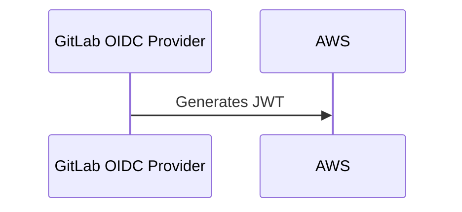
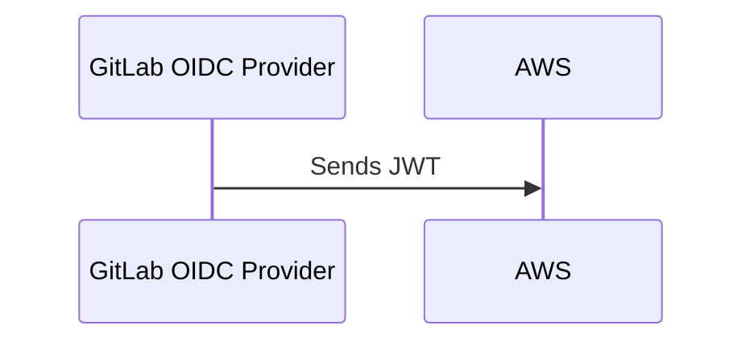
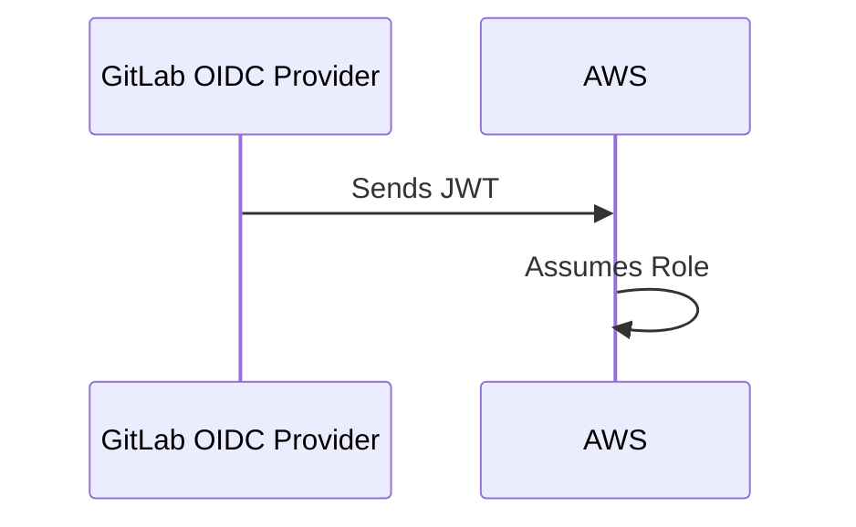
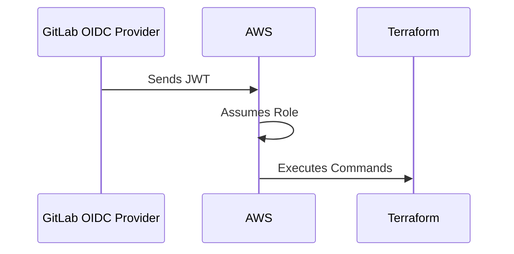

## Overview of Secure IaC Pipeline for EKS Provisioning Using GitLab OIDC in AWS

In this section, we will delve into the process of setting up a secure Infrastructure as Code (IaC) pipeline for provisioning Amazon Elastic Kubernetes Service (EKS) clusters using GitLab OpenID Connect (OIDC) integration with AWS. This setup ensures that your CI/CD pipeline can securely interact with AWS resources without the need for static credentials, thereby enhancing security and compliance.

### What is GitLab OIDC?

OpenID Connect (OIDC) is an authentication protocol built on top of the OAuth 2.0 framework. It allows clients to verify the identity of users based on the authentication performed by an authorization server, as well as to obtain basic profile information about them. In the context of GitLab, OIDC enables the creation of a trusted connection between GitLab and external services like AWS.

#### Why Use GitLab OIDC?

Using GitLab OIDC for AWS integration provides several benefits:

1. **Secure Authentication**: It eliminates the need for static credentials, reducing the risk of credential exposure.
2. **Fine-Grained Access Control**: You can define specific roles and permissions for different parts of your pipeline.
3. **Automated Token Management**: GitLab manages the lifecycle of the OIDC tokens, ensuring they are short-lived and rotated automatically.

### How GitLab OIDC Works with AWS

When you set up GitLab OIDC with AWS, GitLab acts as an OIDC provider. It generates a JWT (19-JSON Web Token) that is sent to AWS during the authentication process. AWS then verifies this token and uses it to assume a specified IAM role.

#### Steps Involved

1. **Generate JWT**: GitLab OIDC provider generates a JWT.
2. **Send JWT to AWS**: The JWT is sent along with AWS commands.
3. **Assume Role**: AWS uses the JWT to assume the defined IAM role.
4. **Execute Commands**: The assumed role's credentials are used to execute Terraform commands.

### Detailed Process

Let's break down each step in detail:

#### Step 1: Generate JWT

GitLab OIDC provider generates a JWT that contains claims such as the user's identity, expiration time, and other metadata. This token is signed using a private key associated with the OIDC provider.



#### Step 2: Send JWT to AWS

The JWT is sent along with AWS commands. This is typically done through environment variables or command-line arguments.



#### Step 3: Assume Role

AWS uses the JWT to assume the defined IAM role. This is done using the `sts:AssumeRoleWithWebIdentity` API call.



#### Step 4: Execute Commands

Once the role is assumed, the credentials of this role are used to execute Terraform commands.



### Configuring the Pipeline

Now that we understand the high-level process, let's dive into configuring the pipeline.

#### Configure GitLab OIDC

First, you need to configure GitLab OIDC in your GitLab project settings.

1. **Navigate to Project Settings**: Go to your GitLab project and navigate to `Settings > CI/CD`.
2. **Add AWS Configuration**: Under `Variables`, add the necessary AWS configuration variables such as `AWS_ACCESS_KEY_ID`, `AWS_SECRET_ACCESS_KEY`, and `AWS_DEFAULT_REGION`.

```yaml
variables:
  AWS_ACCESS_KEY_ID: $AWS_ACCESS_KEY_ID
  AWS_SECRET_ACCESS_KEY: $AWS_SECRET_ACCESS_KEY
  AWS_DEFAULT_REGION: us-east-1
```

#### Define IAM Role

Next, define an IAM role in AWS that will be assumed by GitLab.

1. **Create IAM Role**: Go to the AWS Management Console and create a new IAM role.
2. **Attach Policies**: Attach the necessary policies to the role, such as `AmazonEKSClusterPolicy` and `AmazonEKSServicePolicy`.

```json
{
  "Version": "2012-10-17",
  "Statement": [
    {
      "Effect": "Allow",
      "Action": [
        "eks:*"
      ],
      "Resource": "*"
    }
  ]
}
```

#### Configure GitLab CI/CD Pipeline

Now, configure your GitLab CI/CD pipeline to use the OIDC token and assume the IAM role.

1. **Create `.gitlab-ci.yml`**: Create a `.gitlab-ci.yml` file in your repository.

```yaml
stages:
  - build
  - deploy

build:
  stage: build
  script:
    - echo "Building the application"

deploy:
  stage: deploy
  script:
    - aws sts assume-role-with-web-identity --role-arn arn:aws:iam::123456789012:role/GitLabOIDCRole --role-session-name GitLabSession --web-identity-token $(curl -s http://localhost:3000/oauth2/token) --provider-id https://gitlab.com
    - export AWS_ACCESS_KEY_ID=$(echo $AWS_CREDENTIALS | jq -r '.Credentials.AccessKeyId')
    - export AWS_SECRET_ACCESS_KEY=$(echo $AWS_CREDENTIALS | jq -r '.Credentials.SecretAccessKey')
    - export AWS_SESSION_TOKEN=$(echo $AWS_CREDENTIALS | jq -r '.Credentials.SessionToken')
    - terraform init
    - terraform apply -auto-approve
```

#### Remote Terraform State

To ensure that the Terraform state is centralized and accessible across multiple pipelines, store it in an S3 bucket.

1. **Create S3 Bucket**: Create an S3 bucket to store the Terraform state.
2. **Configure Terraform Backend**: Configure the Terraform backend to use the S3 bucket.

```hcl
terraform {
  backend "s3" {
    bucket = "my-tf-state-bucket"
    key    = "state/eks-provisioning.tfstate"
    region = "us-east-1"
  }
}
```

### Pitfalls and Best Practices

#### Common Mistakes

1. **Static Credentials**: Avoid using static credentials in your pipeline. Instead, use OIDC tokens.
2. **Insufficient Permissions**: Ensure that the IAM role has the minimum necessary permissions.
3. **State Management**: Properly manage the Terraform state to avoid conflicts and data loss.

#### Best Practices

1. **Least Privilege Principle**: Assign the least privilege necessary to the IAM role.
2. **Regular Audits**: Regularly audit your IAM roles and policies to ensure they remain secure.
3. **Secure Storage**: Store sensitive information securely, such as in encrypted S3 buckets.

### Real-World Examples

#### Recent Breaches

One notable breach involving misconfigured IAM roles was the Capital One breach in 2019. An attacker exploited a misconfigured web application firewall to gain unauthorized access to sensitive customer data. This highlights the importance of proper IAM role management and least privilege principles.

### How to Prevent / Defend

#### Detection

1. **CloudTrail**: Enable AWS CloudTrail to log all API calls made to your AWS account.
2. **IAM Access Advisor**: Use IAM Access Advisor to monitor and review the services accessed by your IAM roles.

#### Prevention

1. **IAM Policies**: Implement strict IAM policies that follow the principle of least privilege.
2. **Multi-Factor Authentication (MFA)**: Enable MFA for all IAM users and roles.

#### Secure Coding Fixes

**Vulnerable Code**

```yaml
deploy:
  stage: deploy
  script:
    - aws sts assume-role --role-arn arn:aws:iam::123456789012:role/GitLabOIDCRole --role-session-name GitLabSession
    - export AWS_ACCESS_KEY_ID=static-key
    - export AWS_SECRET_ACCESS_KEY=static-secret
    - terraform apply -auto-approve
```

**Fixed Code**

```yaml
deploy:
  stage: deploy
  script:
    - aws sts assume-role-with-web-identity --role-arn arn:aws:iam::123456789012:role/GitLabOIDCRole --role-session-name GitLabSession --web-identity-token $(curl -s http://localhost:3000/oauth2/token) --provider-id https://gitlab.com
    - export AWS_ACCESS_KEY_ID=$(echo $AWS_CREDENTIALS | jq -r '.Credentials.AccessKeyId')
    - export AWS_SECRET_ACCESS_KEY=$(echo $AWS_CREDENTIALS | jq -r '.Credentials.SecretAccessKey')
    - export AWS_SESSION_TOKEN=$(echo $AWS_CREDENTIALS | jq -r '.Credentials.SessionToken')
    - terraform apply -auto-approve
```

### Conclusion

By following these steps and best practices, you can ensure that your IaC pipeline for EKS provisioning is secure and compliant. The use of GitLab OIDC with AWS provides a robust and secure method for managing access to your AWS resources.

### Hands-On Labs

For practical experience, consider the following labs:

- **PortSwigger Web Security Academy**: Focuses on web application security but can provide foundational knowledge.
- **OWASP Juice Shop**: A deliberately insecure web application for learning about web security.
- **DVWA (Damn Vulnerable Web Application)**: Another web application for practicing web security skills.

These labs will help you solidify your understanding of secure IaC pipelines and GitLab OIDC integration with AWS.

---
<!-- nav -->
[[04-Introduction to Secure Infrastructure as Code (IaC) Pipeline for EKS Provisioning|Introduction to Secure Infrastructure as Code (IaC) Pipeline for EKS Provisioning]] | [[DevSecOps/DevSecOps Bootcamp/04-Infrastructure Security/03-Secure IaC Pipeline for EKS Provisioning/Using GitLab OIDC in AWS/00-Overview|Overview]] | [[06-Overview of Secure IaC Pipeline for EKS Provisioning Using GitLab OIDC in AWS|Overview of Secure IaC Pipeline for EKS Provisioning Using GitLab OIDC in AWS]]
