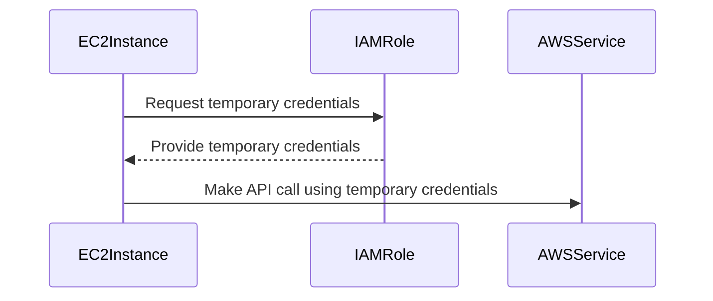
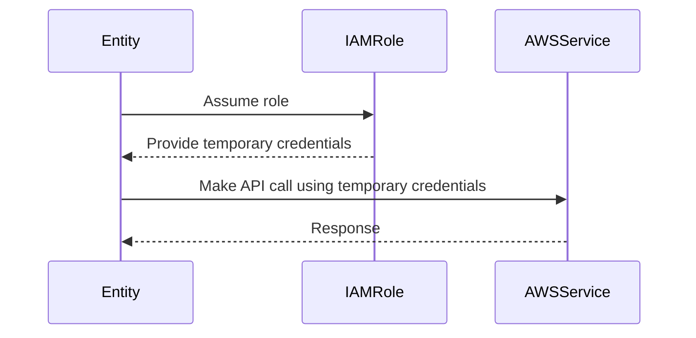
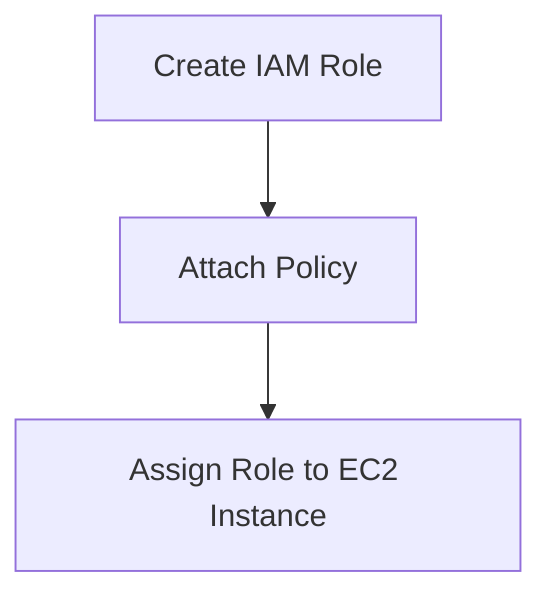
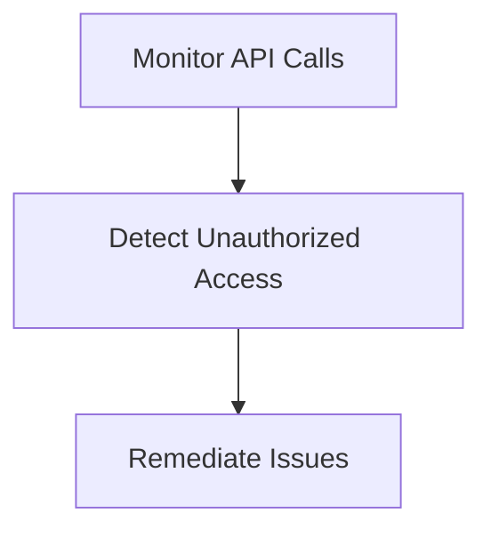
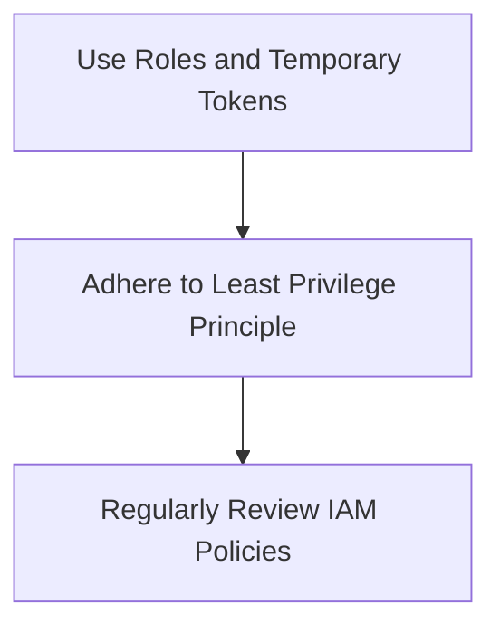

## Overview of AWS Security Measures and Continuous Security Improvements

In the realm of DevSecOps, ensuring continuous deployment and integration while maintaining robust security measures is paramount. This chapter delves into the specific security measures employed within AWS, focusing on how these measures enhance the security posture of your infrastructure and applications. We will explore the concept of roles and temporary tokens, their implications, and how they contribute to a more secure environment.

### Understanding Roles and Temporary Tokens

#### What Are Roles?

In AWS, a role is an IAM entity that defines a set of permissions. Unlike users, roles do not have specific credentials associated with them. Instead, roles are assumed by entities such as EC2 instances, Lambda functions, or other AWS services. By assigning a role to an EC2 instance, you grant the instance the necessary permissions to perform specific actions within AWS.

**Why Use Roles?**

Using roles significantly enhances security by eliminating the need to manage and store long-lived credentials. Instead of storing AWS user credentials in your CI/CD pipeline, you can assign a role to your EC2 instance. This role will automatically provide the necessary permissions to execute AWS CLI commands without exposing sensitive information.

**How Roles Work Under the Hood**

When an EC2 instance is launched with an assigned role, AWS automatically retrieves temporary security credentials for that role. These credentials are stored securely on the instance and are used whenever the instance needs to make API calls to AWS services. The credentials are short-lived and must be refreshed periodically.



#### Temporary Tokens

Temporary tokens, also known as temporary security credentials, are short-lived credentials that are issued to an entity assuming a role. These tokens consist of an access key ID, secret access key, and a security token. They are valid for a limited period, typically a few hours, and must be refreshed before they expire.

**Why Use Temporary Tokens?**

Temporary tokens provide an additional layer of security by ensuring that credentials are only valid for a short duration. This reduces the window of opportunity for an attacker to misuse stolen credentials. Additionally, since the tokens are automatically managed by AWS, there is no need to manually rotate or manage long-lived credentials.

**How Temporary Tokens Work Under the Hood**

When an entity assumes a role, AWS generates a set of temporary security credentials. These credentials are then used to make API calls to AWS services. After a specified period, the credentials expire, and new ones must be requested.



### Security Implications

The use of roles and temporary tokens significantly enhances the security of your AWS environment. Here are some key security implications:

- **Reduced Credential Exposure**: By using roles and temporary tokens, you eliminate the need to store long-lived credentials in your CI/CD pipeline. This reduces the risk of credentials being exposed through misconfigurations or breaches.
  
- **Short-Lived Credentials**: Temporary tokens are short-lived, reducing the window of opportunity for an attacker to misuse stolen credentials. This makes it more difficult for attackers to gain persistent access to your AWS resources.

- **Least Privilege Principle**: Roles allow you to define fine-grained permissions for different entities. By assigning roles with the minimum necessary permissions, you adhere to the principle of least privilege, further enhancing security.

### Real-World Examples

Recent breaches and vulnerabilities highlight the importance of proper security measures in AWS environments. For example, the Capital One breach in 2019 was caused by a misconfigured firewall rule that allowed unauthorized access to sensitive data. In this case, the lack of proper role-based access control and temporary token usage contributed to the breach.

Another example is the AWS S3 bucket exposure incident involving Tesla in 2019. The incident occurred due to misconfigured S3 buckets that were accessible to the public. Proper use of roles and temporary tokens could have prevented unauthorized access to these buckets.

### Implementation Example

Let's walk through a complete example of setting up an EC2 instance with a role and using temporary tokens to execute AWS CLI commands.

#### Step 1: Create an IAM Role

First, create an IAM role with the necessary permissions. For this example, let's create a role named `EC2InstanceRole` with permissions to read and write to S3 buckets.



```bash
# Create IAM role
aws iam create-role --role-name EC2InstanceRole --assume-role-policy-document file://trust-policy.json

# Attach policy to role
aws iam attach-role-policy --role-name EC2InstanceRole --policy-arn arn:aws:iam::aws:policy/AmazonS3FullAccess
```

#### Step 2: Assign Role to EC2 Instance

Next, launch an EC2 instance and assign the `EC2InstanceRole` to it.

```bash
# Launch EC2 instance with role
aws ec2 run-instances --image-id ami-0c94855ba95c71c99 --count 1 --instance-type t2.micro --key-name MyKeyPair --security-group-ids sg-0123456789abcdef0 --subnet-id subnet-0123456789abcdef0 --iam-instance-profile Name=EC2InstanceRole
```

#### Step 3: Execute AWS CLI Commands Using Temporary Tokens

Once the EC2 instance is running, you can use the temporary security credentials to execute AWS CLI commands.

```bash
# Retrieve temporary credentials
aws sts assume-role --role-arn arn:aws:iam::123456789012:role/EC2InstanceRole --role-session-name MySession

# Output:
{
    "Credentials": {
        "AccessKeyId": "ASIA...",
        "SecretAccessKey": "wJalrXUtnFEMI/K7MDENG/bPxRfiCYEXAMPLEKEY",
        "SessionToken": "AQoDYXdzEJr...EXAMPLETOKEN==",
        "Expiration": "2023-10-10T12:34:56Z"
    },
    "AssumedRoleUser": {
        "Arn": "arn:aws:sts::123456789012:assumed-role/EC2InstanceRole/MySession",
        "AssumedRoleId": "AROACLKIQJLMNOPQRSTU:MySession"
    }
}
```

Use the retrieved credentials to execute AWS CLI commands.

```bash
# Set environment variables
export AWS_ACCESS_KEY_ID=ASIA...
export AWS_SECRET_ACCESS_KEY=wJalrXUtnFEMI/K7MDENG/bPxRfiCYEXAMPLEKEY
export AWS_SESSION_TOKEN=AQoDYXdzEJr...EXAMPLETOKEN==

# Execute AWS CLI command
aws s3 ls s3://my-bucket/
```

### Common Pitfalls and How to Avoid Them

#### Storing Long-Lived Credentials

One common pitfall is storing long-lived credentials in your CI/CD pipeline. This increases the risk of credentials being exposed through misconfigurations or breaches. To avoid this, always use roles and temporary tokens instead of storing long-lived credentials.

#### Misconfigured IAM Policies

Another pitfall is misconfiguring IAM policies, leading to overly permissive roles. Always ensure that roles have the minimum necessary permissions required to perform their tasks. Regularly review and audit IAM policies to identify and mitigate potential risks.

### How to Prevent / Defend

#### Detection

To detect potential security issues, regularly monitor your AWS environment for unauthorized access attempts and misconfigurations. Use AWS CloudTrail to log API calls and AWS Config to track resource configurations.



#### Prevention

To prevent unauthorized access, follow best practices such as using roles and temporary tokens, adhering to the principle of least privilege, and regularly reviewing IAM policies.



#### Secure Coding Fixes

Here is an example of a vulnerable code snippet and its secure counterpart:

**Vulnerable Code:**
```python
import boto3

# Hardcoded AWS credentials
access_key = 'AKIA...'
secret_key = 'wJalrXUtnFEMI/K7MDENG/bPxRfiCYEXAMPLEKEY'

# Create S3 client
s3_client = boto3.client('s3', aws_access_key_id=access_key, aws_secret_access_key=secret_key)

# List S3 buckets
buckets = s3_client.list_buckets()
print(buckets)
```

**Secure Code:**
```python
import boto3
import os

# Retrieve temporary credentials from environment variables
access_key = os.environ['AWS_ACCESS_KEY_ID']
secret_key = os.environ['AWS_SECRET_ACCESS_KEY']
session_token = os.environ['AWS_SESSION_TOKEN']

# Create S3 client
s3_client = boto3.client('s3', aws_access_key_id=access_key, aws_secret_access_key=secret_key, aws_session_token=session_token)

# List S3 buckets
buckets = s3_client.list_buckets()
print(buckets)
```

### Configuration Hardening

To further harden your AWS environment, consider implementing the following configurations:

- **Enable MFA for IAM Users**: Require multi-factor authentication (MFA) for IAM users to add an extra layer of security.
  
- **Enable CloudTrail**: Enable CloudTrail to log API calls and monitor your AWS environment for unauthorized access attempts.

- **Enable AWS Config**: Enable AWS Config to track resource configurations and detect changes that may violate your security policies.

### Hands-On Labs

To practice and reinforce your understanding of these concepts, consider the following hands-on labs:

- **PortSwigger Web Security Academy**: Offers a variety of labs focused on web application security, including secure coding practices and vulnerability assessments.
  
- **OWASP Juice Shop**: A deliberately insecure web application designed for security training and research.

- **CloudGoat**: A cloud security-focused lab that provides scenarios for practicing security hardening and vulnerability assessments in AWS.

By following these best practices and regularly monitoring your AWS environment, you can significantly enhance the security of your continuous deployment and integration processes.

---

This comprehensive chapter covers the essential aspects of AWS security measures and continuous security improvements, providing deep insights into roles, temporary tokens, and their implementation. Through detailed explanations, real-world examples, and practical code snippets, you should now have a solid understanding of how to implement and maintain a secure AWS environment.

---
<!-- nav -->
[[DevSecOps/DevSecOps Bootcamp/05-Application Security Testing/10-Secure Continuous Deployment & DAST/01-Overview of AWS Security Measures and Continuous Security Improvements/00-Overview|Overview]] | [[DevSecOps/DevSecOps Bootcamp/05-Application Security Testing/10-Secure Continuous Deployment & DAST/01-Overview of AWS Security Measures and Continuous Security Improvements/02-Practice Questions & Answers|Practice Questions & Answers]]
