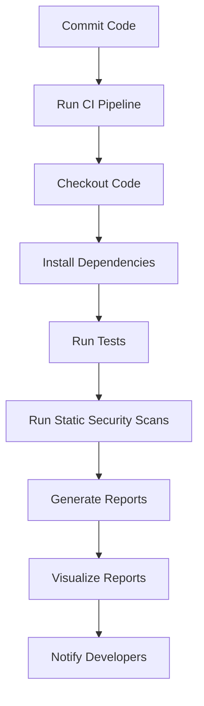

## Overview of Static Security Scans in CI Pipeline

In the realm of DevSecOps, one of the critical components is ensuring that the application dependencies are free from vulnerabilities. This is achieved through static security scans integrated into the Continuous Integration (CI) pipeline. These scans help identify potential security issues early in the development lifecycle, reducing the risk of deploying insecure code.

### What Are Static Security Scans?

Static security scans are automated tools that analyze source code, configuration files, and dependencies without executing the code. They are designed to detect security vulnerabilities, coding errors, and compliance issues. By integrating these scans into the CI pipeline, organizations can ensure that their applications meet security standards before deployment.

#### Why Static Security Scans Matter

Static security scans are crucial because they:

- **Identify Vulnerabilities Early**: Detecting vulnerabilities during the development phase allows teams to address them promptly, reducing the cost and complexity of fixing issues later.
- **Ensure Compliance**: Many industries have regulatory requirements that mandate regular security assessments. Static scans help ensure compliance with these regulations.
- **Improve Code Quality**: By identifying and fixing security issues, the overall quality of the codebase improves, leading to more robust and reliable applications.

### Components of a Static Security Scan

A typical static security scan includes several key components:

1. **Dependency Scanning**: Analyzes third-party libraries and frameworks used in the application to check for known vulnerabilities.
2. **Code Analysis**: Examines the source code for security weaknesses such as SQL injection, cross-site scripting (XSS), and buffer overflows.
3. **Configuration Review**: Checks configuration files for misconfigurations that could lead to security risks.

### Configuring Static Security Scans in CI Pipeline

To integrate static security scans into a CI pipeline, you need to configure the pipeline to run these scans automatically whenever changes are pushed to the repository. This ensures that every commit undergoes a thorough security assessment.

#### Example Configuration Using GitHub Actions

Here’s an example of how to configure a GitHub Actions workflow to run a static security scan using `dependency-check`:

```yaml
name: Static Security Scan

on:
  push:
    branches:
      - main
  pull_request:
    branches:
      - main

jobs:
  build:
    runs-on: ubuntu-latest

    steps:
    - name: Checkout code
      uses: actions/checkout@v2

    - name: Set up Java
      uses: actions/setup-java@v2
      with:
        java-version: '11'

    - name: Install dependency-check
      run: |
        wget https://github.com/jeremylong/DependencyCheck/releases/download/v6.2.2/dependency-check-cli-6.2.2-release.zip
        unzip dependency-check-cli-6.2.2-release.zip

    - name: Run dependency-check
      run: |
        ./dependency-check/bin/dependency-check.sh --project MyProject --scan . --out ./report
```

This workflow sets up a CI job that checks out the code, installs Java, downloads and unzips `dependency-check`, and runs the scan on the project. The results are saved in a report directory.

### Visualizing Scan Reports

Once the scans are completed, the results need to be visualized in a way that is easily understandable by developers. This typically involves generating HTML reports that can be reviewed and analyzed.

#### Example Report Generation

The `dependency-check` tool generates an HTML report that includes details about the vulnerabilities found, their severity, and recommendations for remediation. Here’s an example of how to generate such a report:

```bash
./dependency-check/bin/dependency-check.sh --project MyProject --scan . --out ./report
```

This command will create an HTML report in the `./report` directory. Developers can open this report in a browser to review the findings.

### Hard-Coded Secrets Detection

One of the most common security issues in applications is the presence of hard-coded secrets such as API keys, database passwords, and other sensitive information. Static security scans can detect these hard-coded secrets and alert developers to remove them.

#### Example of Hard-Coded Secret Detection

Consider the following Python code snippet:

```python
import os

# Hard-coded secret
API_KEY = "my-secret-key"

def get_data():
    return os.getenv("API_KEY", API_KEY)
```

A static security scan would flag the `API_KEY` variable as a hard-coded secret. The correct approach is to use environment variables or a secrets management system like HashiCorp Vault.

#### Secure Code Fix

Here’s how the code should be refactored to avoid hard-coding secrets:

```python
import os

def get_data():
    API_KEY = os.getenv("API_KEY")
    if not API_KEY:
        raise ValueError("API_KEY environment variable is not set")
    return API_KEY
```

### Dependency Vulnerability Scanning

Dependency scanning is another critical aspect of static security scans. It involves checking the third-party libraries and frameworks used in the application against a database of known vulnerabilities.

#### Example of Dependency Vulnerability Scanning

Consider an application that uses the `requests` library in Python. A static security scan might detect a known vulnerability in a specific version of `requests`.

```bash
./dependency-check/bin/dependency-check.sh --project MyProject --scan .
```

If a vulnerability is detected, the report will provide details about the affected package and the recommended version to upgrade to.

### How to Prevent / Defend Against Static Security Issues

#### Detection

- **Regular Scans**: Integrate static security scans into the CI pipeline to ensure that every commit is scanned.
- **Automated Alerts**: Configure the CI pipeline to send alerts to developers when vulnerabilities are detected.

#### Prevention

- **Use Secure Libraries**: Always use the latest versions of libraries and frameworks to minimize the risk of known vulnerabilities.
- **Environment Variables**: Avoid hard-coding secrets in the codebase. Use environment variables or secrets management systems instead.

#### Secure Coding Practices

- **Input Validation**: Validate all user inputs to prevent common attacks like SQL injection and XSS.
- **Least Privilege Principle**: Ensure that applications run with the least privileges necessary to perform their tasks.

### Real-World Examples

#### Recent CVEs and Breaches

- **CVE-2021-44228 (Log4Shell)**: This vulnerability in the Apache Log4j library allowed attackers to execute arbitrary code on affected servers. Static security scans could have detected the use of vulnerable versions of Log4j.
- **SolarWinds Supply Chain Attack**: This attack involved the compromise of SolarWinds Orion software, which was then used to infiltrate numerous organizations. Static security scans could have helped detect the use of compromised dependencies.

### Mermaid Diagrams

#### CI Pipeline with Static Security Scans



### Conclusion

Integrating static security scans into the CI pipeline is a crucial step in ensuring the security of application dependencies. By automating these scans, organizations can detect and address vulnerabilities early in the development process, improving the overall security posture of their applications. Regularly reviewing and updating the scans helps maintain a robust security framework.

### Practice Labs

For hands-on experience with static security scans in CI pipelines, consider the following labs:

- **PortSwigger Web Security Academy**: Offers interactive labs on various web security topics, including static analysis.
- **OWASP Juice Shop**: A deliberately insecure web application for practicing security testing and vulnerability scanning.
- **Docker Security Workshops**: Provides practical exercises on securing Docker images and containers.

By leveraging these resources, you can gain a deeper understanding of how to effectively integrate static security scans into your CI pipeline.

---
<!-- nav -->
[[DevSecOps/DevSecOps Bootcamp/05-Application Security Testing/14-Vulnerability Scanning for Application Dependencies/01-Overview of Static Security Scans in CI Pipeline/00-Overview|Overview]] | [[DevSecOps/DevSecOps Bootcamp/05-Application Security Testing/14-Vulnerability Scanning for Application Dependencies/01-Overview of Static Security Scans in CI Pipeline/02-Practice Questions & Answers|Practice Questions & Answers]]
