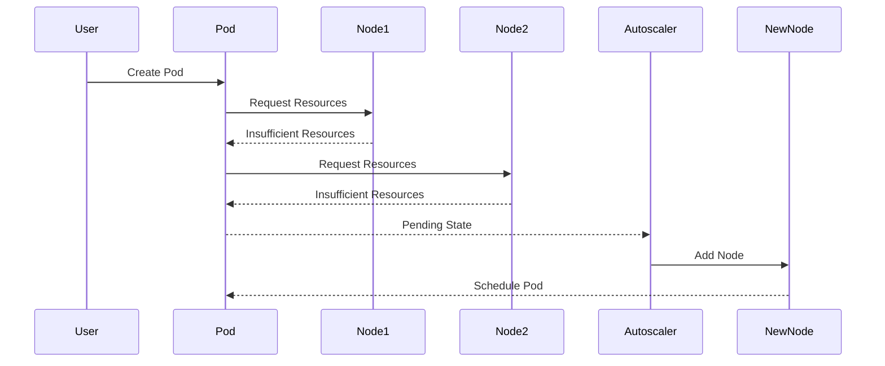

## Overview of EKS Add-Ons

In the context of DevSecOps, managing Kubernetes clusters efficiently is crucial for maintaining high availability and performance. Amazon Elastic Kubernetes Service (EKS) provides several add-ons that automate various operational tasks, making the management of Kubernetes clusters more streamlined and less error-prone. This chapter delves into two key add-ons: the Cluster Autoscaler and the Metric Server, explaining their functionalities, benefits, and how they work under the hood.

### Cluster Autoscaler

The Cluster Autoscaler is a critical component that helps manage the scalability of your EKS cluster. Its primary function is to dynamically adjust the number of worker nodes based on the current workload. This ensures that your cluster can handle varying loads without manual intervention, thereby saving costs and improving efficiency.

#### How It Works

When you deploy the Cluster Autoscaler in your EKS cluster, it continuously monitors the state of your nodes and pods. If it detects that some pods are unable to be scheduled due to resource constraints (such as CPU or memory), it triggers the addition of new nodes to the cluster. Conversely, if the cluster becomes over-provisioned, the autoscaler can also remove nodes to optimize resource usage.

Consider a scenario where you have two nodes in your cluster, and both are heavily loaded. New pods are being created, but they cannot be scheduled because neither node has enough available resources. In this situation, the new pods enter a `Pending` state with a label indicating they are `unschedulable`. This condition serves as a trigger for the Cluster Autoscaler to add new nodes to the cluster, allowing the pending pods to be scheduled and executed.



#### Benefits

- **Cost Efficiency**: By dynamically scaling the number of nodes, the Cluster Autoscaler ensures that you only pay for the resources you need at any given time.
- **High Availability**: Automatically adding nodes when needed helps maintain high availability and prevents downtime due to resource exhaustion.
- **Reduced Manual Intervention**: The autoscaler handles scaling operations automatically, reducing the need for manual intervention and minimizing human error.

#### Recent Real-World Examples

A notable example of the importance of autoscaling is the incident during the 2021 Black Friday sales period. Many e-commerce platforms experienced significant traffic spikes, leading to resource exhaustion and service disruptions. Had these platforms implemented an effective autoscaling solution like the Cluster Autoscaler, they could have better managed the sudden increase in load, ensuring smoother operations.

### Metric Server

The Metric Server is another essential add-on that provides detailed metrics about resource consumption within your EKS cluster. These metrics are crucial for monitoring and optimizing the performance of your applications.

#### How It Works

The Metric Server collects and aggregates resource usage data from all nodes in the cluster. It then exposes this data through the Kubernetes API, allowing you to query and analyze the resource consumption of individual pods and nodes. This information is invaluable for capacity planning, identifying bottlenecks, and optimizing resource allocation.

For instance, you can use the `kubectl top` command to check the CPU and memory usage of your nodes:

```bash
kubectl top nodes
```

This command returns output similar to the following:

```plaintext
NAME       CPU(cores)   CPU%   MEMORY(bytes)   MEMORY%
ip-10-0-0-1.ec2.internal   100m       5%         1024Mi           50%
ip-10-0-0-2.ec2.internal   200m       10%        2048Mi           100%
```

#### Benefits

- **Resource Monitoring**: Provides real-time insights into resource usage, helping you identify and address potential issues proactively.
- **Capacity Planning**: Helps in planning future resource requirements based on historical usage patterns.
- **Optimization**: Enables fine-tuning of resource allocation to improve overall cluster performance.

#### Recent Real-World Examples

During the 2022 Winter Olympics, many streaming platforms faced unprecedented traffic surges. Platforms that had implemented robust monitoring solutions, including the Metric Server, were able to quickly identify and mitigate resource bottlenecks, ensuring smooth streaming experiences for viewers.

### Integration with EKS

To integrate the Cluster Autoscaler and Metric Server into your EKS cluster, you can use the `eksctl` command-line tool, which simplifies the process of deploying and managing EKS clusters.

#### Deploying Cluster Autoscaler

First, ensure you have `eksctl` installed. Then, you can enable the Cluster Autoscaler using the following command:

```bash
eksctl create cluster --name my-cluster --region us-west-2 --with-iam --with-addon cluster-autoscaler
```

This command creates an EKS cluster named `my-cluster` in the `us-west-2` region and enables the Cluster Autoscaler add-on.

#### Deploying Metric Server

Similarly, you can enable the Metric Server using the following command:

```bash
eksctl create cluster --name my-cluster --region us-west-2 --with-iam --with-addon metrics-server
```

This command creates an EKS cluster named ` `my-cluster` in the `us-west-2` region and enables the Metric Server add-on.

### Pitfalls and Best Practices

While the Cluster Autoscaler and Metric Server provide significant benefits, there are several pitfalls to be aware of:

- **Over-Provisioning**: Ensure that your autoscaling policies are configured correctly to avoid unnecessary over-provisioning, which can lead to increased costs.
- **Monitoring**: Regularly monitor the metrics provided by the Metric Server to identify and address potential issues proactively.
- **Security**: Ensure that the add-ons are deployed securely and that access to the Kubernetes API is properly restricted.

### How to Prevent / Defend

#### Detection

To detect issues related to resource exhaustion and autoscaling, regularly monitor the metrics provided by the Metric Server. You can set up alerts using tools like Prometheus and Grafana to notify you of any anomalies.

#### Prevention

- **Proper Configuration**: Configure the autoscaling policies to match your workload patterns. Avoid overly aggressive scaling policies that can lead to frequent node additions and removals.
- **Regular Audits**: Conduct regular audits of your cluster to ensure that all components are functioning as expected and that there are no security vulnerabilities.

#### Secure Coding Fixes

Here is an example of how to configure the Cluster Autoscaler and Metric Server securely:

**Vulnerable Configuration:**

```yaml
apiVersion: autoscaling/v1
kind: HorizontalPodAutoscaler
metadata:
  name: my-hpa
spec:
  scaleTargetRef:
    apiVersion: apps/v1
    kind: Deployment
    name: my-deployment
  minReplicas: 1
  maxReplicas: 10
  targetCPUUtilizationPercentage: 50
```

**Secure Configuration:**

```yaml
apiVersion: autoscaling/v1
kind: HorizontalPodAutoscaler
metadata:
  name: my-hpa
spec:
  scaleTargetRef:
    apiVersion: apps/v1
    kind: Deployment
    name: my-deployment
  minReplicas: 2
  maxReplicas: 5
  targetCPUUtilizationPercentage: 70
```

In the secure configuration, the minimum and maximum replicas are set to more conservative values, and the target CPU utilization percentage is increased to reduce the frequency of scaling events.

### Conclusion

The Cluster Autoscaler and Metric Server are powerful add-ons that significantly enhance the management and performance of your EKS cluster. By understanding how they work and implementing best practices, you can ensure that your cluster remains highly available, efficient, and secure.

### Hands-On Labs

To gain practical experience with these concepts, consider the following labs:

- **PortSwigger Web Security Academy**: Offers hands-on labs to practice securing Kubernetes clusters.
- **CloudGoat**: Provides a series of labs to learn about securing AWS services, including EKS.
- **Pacu**: A penetration testing framework for AWS that includes modules for testing EKS configurations.

By completing these labs, you can reinforce your understanding of the concepts covered in this chapter and gain practical skills in managing and securing EKS clusters.

---
<!-- nav -->
[[DevSecOps/DevSecOps Bootcamp/06-Container & Kubernetes Security/02-EKS Blueprints/Overview of EKS Add ons we install/03-Kubernetes Metric Server Overview|Kubernetes Metric Server Overview]] | [[DevSecOps/DevSecOps Bootcamp/06-Container & Kubernetes Security/02-EKS Blueprints/Overview of EKS Add ons we install/00-Overview|Overview]] | [[DevSecOps/DevSecOps Bootcamp/06-Container & Kubernetes Security/02-EKS Blueprints/Overview of EKS Add ons we install/05-Overview of EKS Add-ons Load Balancer Controller|Overview of EKS Add-ons Load Balancer Controller]]
