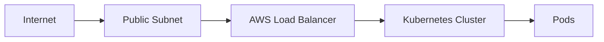

## Overview of EKS Add-ons: Load Balancer Controller

In the context of deploying applications on Amazon Elastic Kubernetes Service (EKS), one of the critical components is the ability to expose these applications to external traffic. This is achieved through the use of a load balancer, which acts as an intermediary between the internet and your Kubernetes services. In this section, we will delve into the details of the AWS Load Balancer Controller, which is a key component in facilitating this process.

### What is a Load Balancer?

A load balancer is a device or software that distributes incoming network traffic across multiple servers. This helps to ensure that no single server becomes overwhelmed with requests, thereby improving the overall performance and reliability of the system. In the context of Kubernetes, a load balancer can be used to route traffic to different pods within a service.

### Why Use AWS Load Balancer Controller?

The AWS Load Balancer Controller is a Kubernetes controller that integrates with the AWS infrastructure to manage load balancers. It allows you to define load balancing rules using Kubernetes resources and annotations, and it automatically provisions and manages the corresponding AWS load balancers.

#### Key Features:

- **Integration with AWS**: The controller interacts with the AWS API to create and manage load balancers.
- **Kubernetes Annotations**: You can specify load balancing configurations using annotations on Kubernetes services.
- **Automatic Management**: The controller automatically creates and updates load balancers based on the defined Kubernetes resources.

### How Does the AWS Load Balancer Controller Work?

The AWS Load Balancer Controller operates by watching Kubernetes resources (such as services) and interpreting annotations that define load balancing requirements. When a new service is created with specific annotations, the controller sends requests to the AWS API to provision a load balancer and configure it to route traffic to the appropriate pods.

#### Step-by-Step Mechanics:

1. **Service Definition**: Define a Kubernetes service with annotations specifying the need for a load balancer.
2. **Controller Detection**: The AWS Load Balancer Controller detects the new service and reads the annotations.
3. **AWS API Interaction**: The controller sends requests to the AWS API to create a load balancer.
4. **Load Balancer Configuration**: The load balancer is configured to route traffic to the pods associated with the service.
5. **Public Accessibility**: The load balancer is placed in public subnets, making it accessible from the internet.

### Example: Configuring a Load Balancer

Let's walk through a complete example of configuring a load balancer using the AWS Load Balancer Controller.

#### Step 1: Define a Kubernetes Service

First, we define a Kubernetes service with annotations specifying the need for a load balancer.

```yaml
apiVersion: v1
kind: Service
metadata:
  name: my-service
  annotations:
    service.beta.kubernetes.io/aws-load-balancer-type: "nlb"
spec:
  type: LoadBalancer
  selector:
    app: my-app
  ports:
    - protocol: TCP
      port: 80
      targetPort: 8080
```

#### Step 2: Install the AWS Load Balancer Controller

Next, we install the AWS Load Balancer Controller using Terraform.

```hcl
resource "aws_eks_addon" "alb_controller" {
  cluster_name = aws_eks_cluster.main.id
  addon_name   = "vpc-cni"
  resolve_conflicts = "OVERWRITE"

  service_account_role_arn = aws_iam_role.alb_controller.arn

  tags = {
    Name = "alb-controller"
  }
}

resource "aws_iam_role" "alb_controller" {
  name = "alb-controller-role"

  assume_role_policy = jsonencode({
    Version = "2012-10-17"
    Statement = [
      {
        Action = "sts:AssumeRole"
        Effect = "Allow"
        Principal = {
          Service = "eks.amazonaws.com"
        }
      }
    ]
  })
}

resource "aws_iam_role_policy_attachment" "alb_controller" {
  role       = aws_iam_role.alb_controller.name
  policy_arn = "arn:aws:iam::aws:policy/AmazonEKSCNIPolicy"
}
```

#### Step 3: Verify the Load Balancer Creation

Once the service is defined and the controller is installed, the AWS Load Balancer Controller will automatically create a load balancer and configure it to route traffic to the pods associated with the service.

### Diagram: Load Balancer Architecture



### Common Pitfalls and Best Practices

#### Pitfall: Incorrect Annotations

One common pitfall is using incorrect annotations on the Kubernetes service. Ensure that the annotations are correctly specified according to the AWS Load Balancer Controller documentation.

#### Best Practice: Secure Load Balancer Configuration

Ensure that the load balancer is configured securely. This includes setting up proper security groups and network ACLs to restrict access to the load balancer.

### Real-World Example: CVE-2021-20225

CVE-2021-20225 is a vulnerability in the AWS Load Balancer Controller that could allow unauthorized access to the Kubernetes cluster. This vulnerability was due to improper validation of the annotations used to configure the load balancer.

#### How to Prevent / Defend

##### Detection

Monitor the Kubernetes cluster for any unauthorized changes to the load balancer configuration. Use tools like `kubectl` to inspect the annotations on the services.

```sh
kubectl get svc my-service -o yaml
```

##### Prevention

Ensure that the AWS Load Balancer Controller is kept up-to-date with the latest security patches. Follow the official AWS documentation for best practices in securing the load balancer.

##### Secure Code Fix

Compare the vulnerable and secure versions of the service definition.

**Vulnerable Version:**

```yaml
apiVersion: v1
kind: Service
metadata:
  name: my-service
  annotations:
    service.beta.kubernetes.io/aws-load-balancer-type: "nlb"
spec:
  type: LoadBalancer
  selector:
    app: my-app
  ports:
    - protocol: TCP
      port: 80
      targetPort: 8080
```

**Secure Version:**

```yaml
apiVersion: v1
kind: Service
metadata:
  name: my-service
  annotations:
    service.beta.kubernetes.io/aws-load-balancer-type: "nlb"
    service.beta.kubernetes.io/aws-load-balancer-internal: "true"
spec:
  type: LoadBalancer
  selector:
    app: my-app
  ports:
    - protocol: TCP
      port: 80
      targetPort: 8080
```

### Hands-On Lab: PortSwigger Web Security Academy

To practice working with the AWS Load Balancer Controller, you can use the PortSwigger Web Security Academy. This platform provides a variety of labs that cover different aspects of web security, including Kubernetes and load balancers.

### Conclusion

Understanding and properly configuring the AWS Load Balancer Controller is crucial for exposing applications running on EKS to external traffic. By following best practices and staying vigilant about security, you can ensure that your Kubernetes cluster remains secure and performant.

---
<!-- nav -->
[[DevSecOps/DevSecOps Bootcamp/06-Container & Kubernetes Security/02-EKS Blueprints/Overview of EKS Add ons we install/04-Overview of EKS Add-Ons|Overview of EKS Add-Ons]] | [[DevSecOps/DevSecOps Bootcamp/06-Container & Kubernetes Security/02-EKS Blueprints/Overview of EKS Add ons we install/00-Overview|Overview]] | [[DevSecOps/DevSecOps Bootcamp/06-Container & Kubernetes Security/02-EKS Blueprints/Overview of EKS Add ons we install/06-Overview of EKS Add-ons We Install|Overview of EKS Add-ons We Install]]
