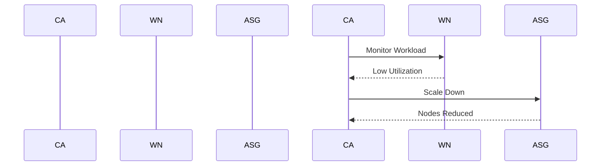

## Overview of EKS Add-ons We Install

### Introduction to EKS and Cluster Autoscaler

Amazon Elastic Kubernetes Service (EKS) is a managed service that makes it easy to run Kubernetes on AWS without needing expertise in Kubernetes cluster management. One of the key components that enhance the functionality of an EKS cluster is the **Cluster Autoscaler**. This service dynamically scales the number of worker nodes in your cluster based on the current workload.

#### What is Cluster Autoscaler?

The **Cluster Autoscaler** is a Kubernetes-native component that was first introduced in Kubernetes version 1.8. Its primary function is to automatically adjust the number of worker nodes in a Kubernetes cluster to ensure that all pods have a place to run while avoiding unnecessary nodes. This helps in optimizing resource utilization and cost efficiency.

#### Why Use Cluster Autoscaler?

- **Cost Efficiency**: By scaling down when the workload decreases, you avoid paying for idle resources.
- **Resource Optimization**: Ensures that all pods have a place to run without over-provisioning.
- **Dynamic Workloads**: Ideal for environments where the workload fluctuates frequently.

### How Cluster Autoscaler Works

The **Cluster Autoscaler** operates by interacting with the underlying cloud provider's auto-scaling groups. Here’s a detailed breakdown of its operation:

1. **Monitoring Workload**: The autoscaler continuously monitors the current workload in the cluster.
2. **Node Count Adjustment**: Based on the workload, it decides whether to scale up or down the number of worker nodes.
3. **Auto-scaling Groups**: It leverages the cloud provider's auto-scaling groups to manage the node count.

#### Example: Scaling Up and Down

Consider a scenario where you have a Kubernetes cluster with four worker nodes, but currently, only two nodes are utilized due to low workload. The **Cluster Autoscaler** would detect this and scale down the number of nodes to two, thereby saving costs.



### Installing and Configuring Cluster Autoscaler

To install the **Cluster Autoscaler** in an EKS cluster, you need to deploy it as a Kubernetes pod. Below is a step-by-step guide to deploying the **Cluster Autoscaler**:

1. **Create a Namespace**:
   ```yaml
   apiVersion: v1
   kind: Namespace
   metadata:
     name: cluster-autoscaler
   ```

2. **Deploy the Cluster Autoscaler**:
   ```yaml
   apiVersion: apps/v1
   kind: Deployment
   metadata:
     name: cluster-autoscaler
     namespace: cluster-autoscaler
   spec:
     replicas: 1
     selector:
       matchLabels:
         app: cluster-autoscaler
     template:
       metadata:
         labels:
           app: cluster-autoscaler
       spec:
         containers:
         - name: cluster-autoscaler
           image: k8s.gcr.io/autoscaling/cluster-autoscaler:v1.22.0
           args:
             - --v=4
             - --stderrthreshold=info
             - --cloud-provider=aws
             - --skip-nodes-with-local-storage=false
             - --nodes=2:4
             - --node-group-auto-discovery=asg:tag=k8s.io/cluster-autoscaler/enabled=true
           volumeMounts:
           - name: ssl-certs
             mountPath: /etc/ssl/certs
           - name: ca-certificates
             mountPath: /etc/ca-certificates
         volumes:
         - name: ssl-certs
           hostPath:
             path: /etc/ssl/certs
         - name: ca-certificates
           hostPath:
             path: /etc/ca-certificates
   ```

3. **Apply the Configuration**:
   ```sh
   kubectl apply -f namespace.yaml
   kubectl apply -f cluster-autoscaler-deployment.yaml
   ```

### Real-World Examples and Recent Breaches

#### Example: Cost Savings with Cluster Autoscaler

A real-world example of the benefits of using the **Cluster Autoscaler** is a company that saw significant cost savings after implementing it. Before the implementation, the company had a fixed number of worker nodes, leading to idle resources during off-peak hours. After deploying the **Cluster Autoscaler**, the company was able to dynamically scale down the number of nodes during low-demand periods, resulting in substantial cost savings.

#### Recent Breach: Misconfigured Autoscaling Groups

In a recent breach, a company suffered a data leak due to misconfigured auto-scaling groups. The issue arose because the auto-scaling group was not properly configured to restrict access to the nodes, allowing unauthorized access to sensitive data. This highlights the importance of proper configuration and security measures when using auto-scaling groups.

### Common Pitfalls and How to Prevent Them

#### Pitfall: Over-provisioning Resources

One common pitfall is over-provisioning resources, which can lead to unnecessary costs. To prevent this, ensure that the **Cluster Autoscaler** is properly configured to scale down when the workload decreases.

#### Pitfall: Misconfigured Auto-scaling Groups

Misconfigured auto-scaling groups can lead to security vulnerabilities. To prevent this, ensure that the auto-scaling groups are properly configured with appropriate security settings, such as restricting access to the nodes.

### Secure Coding Practices

#### Vulnerable Code Example

Here is an example of a vulnerable configuration where the auto-scaling group is not properly restricted:

```yaml
apiVersion: autoscaling/v1
kind: HorizontalPodAutoscaler
metadata:
  name: example-hpa
spec:
  scaleTargetRef:
    apiVersion: apps/v1
    kind: Deployment
    name: example-deployment
  minReplicas: 1
  maxReplicas: 10
  targetCPUUtilizationPercentage: 50
```

#### Secure Code Example

Here is the corrected configuration with proper restrictions:

```yaml
apiVersion: autoscaling/v1
kind: HorizontalPodAutoscaler
metadata:
  name: example-hpa
spec:
  scaleTargetRef:
    apiVersion: apps/v1
    kind: Deployment
    name: example-deployment
  minReplicas: 1
  maxReplicas: 10
  targetCPUUtilizationPercentage: 50
  behavior:
    scaleDown:
      stabilizationWindowSeconds: 300
```

### Detection and Prevention

#### Detection

To detect issues with the **Cluster Autoscaler**, you can monitor the logs and metrics generated by the autoscaler. Tools like Prometheus and Grafana can be used to visualize these metrics and identify any anomalies.

#### Prevention

To prevent issues, ensure that the **Cluster Autoscaler** is properly configured and that the auto-scaling groups are correctly set up. Regularly review the configuration and perform security audits to identify and mitigate potential risks.

### Conclusion

The **Cluster Autoscaler** is a powerful tool for managing the number of worker nodes in a Kubernetes cluster. By dynamically adjusting the node count based on the workload, it helps optimize resource utilization and cost efficiency. Proper installation, configuration, and monitoring are essential to ensure that the **Cluster Autoscaler** functions effectively and securely.

### Practice Labs

For hands-on experience with EKS and the **Cluster Autoscaler**, consider the following labs:

- **PortSwigger Web Security Academy**: Offers practical exercises on securing Kubernetes clusters.
- **OWASP Juice Shop**: Provides a vulnerable web application for practicing security techniques.
- **CloudGoat**: A series of labs designed to help you understand and secure AWS services, including EKS.

By completing these labs, you can gain practical experience in deploying and managing the **Cluster Autoscaler** in an EKS environment.

---
<!-- nav -->
[[DevSecOps/DevSecOps Bootcamp/06-Container & Kubernetes Security/02-EKS Blueprints/Overview of EKS Add ons we install/05-Overview of EKS Add-ons Load Balancer Controller|Overview of EKS Add-ons Load Balancer Controller]] | [[DevSecOps/DevSecOps Bootcamp/06-Container & Kubernetes Security/02-EKS Blueprints/Overview of EKS Add ons we install/00-Overview|Overview]] | [[DevSecOps/DevSecOps Bootcamp/06-Container & Kubernetes Security/02-EKS Blueprints/Overview of EKS Add ons we install/07-Practice Questions & Answers|Practice Questions & Answers]]
