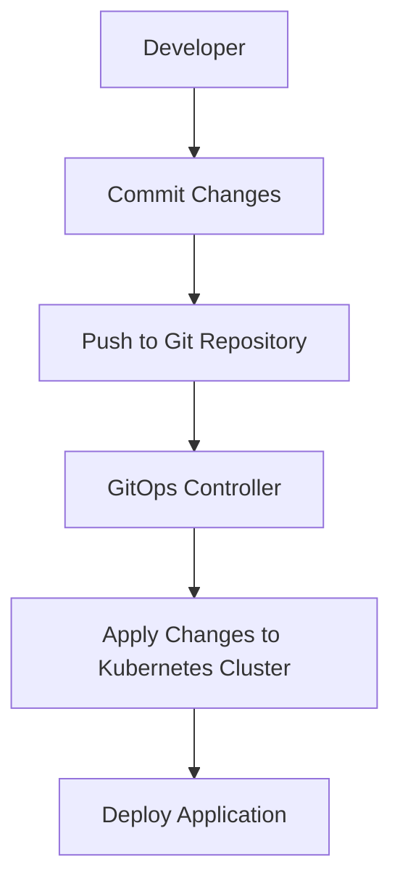

## Overview of CI/CD Pipelines to Git Repositories

### Introduction to CI/CD Pipelines

Continuous Integration (CI) and Continuous Deployment (CD) are essential components of modern software development practices. These processes automate the integration and deployment of code changes, ensuring that applications are built, tested, and deployed efficiently and reliably. In the context of DevSecOps, integrating security practices into these pipelines is crucial to ensure that the software is secure throughout its lifecycle.

### Separation of Application Logic and Deployment Logic

One key principle in managing CI/CD pipelines is to separate the application logic from the deployment logic. This separation allows for better management and cleaner division of responsibilities within the development process. By keeping the application code and deployment configurations in different repositories, developers can focus on writing high-quality code, while operations teams can manage the deployment and infrastructure aspects.

#### Why Separate Application and Deployment Logic?

- **Clarity and Maintainability**: Separating concerns makes the codebase easier to understand and maintain. Developers can focus on the business logic without worrying about deployment details.
- **Version Control**: Different versions of the application and deployment configurations can be managed independently, allowing for more granular control over changes.
- **Security**: Keeping sensitive deployment information separate reduces the risk of exposing critical infrastructure details to unauthorized users.

### Creating a New Project with GitOps

In this section, we will walk through the process of creating a new project using GitOps principles. GitOps is an operational framework that uses Git as a single source of truth for all infrastructure and application configurations. This approach ensures that all changes are tracked, reviewed, and audited, providing a robust and transparent way to manage deployments.

#### Step-by-Step Guide to Creating a New Project

1. **Create a Private Repository**:
   - Navigate to your preferred Git hosting service (e.g., GitHub, GitLab).
   - Create a new private repository named `online-boutique-gitops`.

```markdown
# GitHub Example
1. Log in to GitHub.
2. Click on the "+" icon in the top-right corner and select "New repository".
3. Enter the repository name `online-boutique-gitops`.
4. Ensure the repository is set to "Private".
5. Click "Create repository".
```

2. **Initialize the Repository**:
   - Clone the repository to your local machine.
   - Initialize the repository with basic files and directories.

```bash
git clone https://github.com/yourusername/online-boutique-gitops.git
cd online-boutique-gitops
touch README.md
mkdir kubernetes-manifests
git add .
git commit -m "Initial commit"
git push origin main
```

3. **Structure the Repository**:
   - Organize the repository to include directories for Kubernetes manifests and other necessary files.

```markdown
online-boutique-gitops/
├── README.md
└── kubernetes-manifests/
    ├── deployment.yaml
    └── service.yaml
```

### Hosting Kubernetes Manifest Files

Kubernetes manifest files are YAML or JSON files that describe the desired state of your Kubernetes resources. These files are used to deploy and manage applications in a Kubernetes cluster. By hosting these files in a Git repository, you can leverage GitOps principles to manage your deployments.

#### Example Kubernetes Manifest Files

1. **Deployment Manifest** (`kubernetes-manifests/deployment.yaml`):

```yaml
apiVersion: apps/v1
kind: Deployment
metadata:
  name: online-boutique
spec:
  replicas: 3
  selector:
    matchLabels:
      app: online-boutique
  template:
    metadata:
      labels:
        app: online-boutique
    spec:
      containers:
      - name: online-boutique
        image: yourregistry/online-boutique:latest
        ports:
        - containerPort: 8080
```

2. **Service Manifest** (`kubernetes-manifests/service.yaml`):

```yaml
apiVersion: v1
kind: Service
metadata:
  name: online-boutique-service
spec:
  selector:
    app: online-boutique
  ports:
    - protocol: TCP
      port: 80
      targetPort: 8080
  type: LoadBalancer
```

### Using Customization Frameworks

Customization frameworks like `customize` (or `Helm`) allow you to define configurable Kubernetes manifest files. This means you can pass parameters to your manifests, making them more flexible and reusable.

#### Comparison with Helm Charts

- **Customize**: A lightweight framework that provides basic templating capabilities.
- **Helm**: A more comprehensive package manager for Kubernetes that includes templating, dependency management, and release management.

For our use case, we will use `customize` due to its simplicity and ease of use.

#### Example Customization Configuration

1. **Customize Configuration File** (`kubernetes-manifests/customize.yaml`):

```yaml
apiVersion: customize.k8s.io/v1
kind: Customize
metadata:
  name: online-boutique-customize
spec:
  templates:
  - path: deployment.yaml
    parameters:
      - name: replicas
        value: 3
      - name: image
        value: yourregistry/online-boutique:latest
  - path: service.yaml
    parameters:
      - name: port
        value: 80
      - name: targetPort
        value: 8080
```

### How to Prevent / Defend

#### Detection and Prevention

1. **Repository Security**:
   - Ensure that the repository is private and restrict access to authorized personnel.
   - Enable two-factor authentication (2FA) for all users with access to the repository.

2. **Code Review**:
   - Implement a strict code review process to ensure that all changes are thoroughly reviewed before being merged.
   - Use tools like GitHub Actions or GitLab CI/CD to automatically run security checks on pull requests.

3. **Secure Coding Practices**:
   - Follow secure coding guidelines to prevent common vulnerabilities such as SQL injection, cross-site scripting (XSS), and command injection.
   - Use static analysis tools to identify potential security issues in the code.

4. **Infrastructure as Code (IaC)**:
   - Use IaC tools like Terraform or Ansible to manage infrastructure configurations.
   - Implement version control and change management practices to track and audit infrastructure changes.

#### Secure-Coding Fixes

1. **Vulnerable Pattern**:

```yaml
apiVersion: apps/v1
kind: Deployment
metadata:
  name: online-boutique
spec:
  replicas: 3
  selector:
    matchLabels:
      app: online-boutique
  template:
    metadata:
      labels:
        app: online-boutique
    spec:
      containers:
      - name: online-boutique
        image: yourregistry/online-boutique:latest
        ports:
        - containerPort: 8080
```

2. **Fixed Pattern**:

```yaml
apiVersion: apps/v1
kind: Deployment
metadata:
  name: online-boutique
spec:
  replicas: 3
  selector:
    matchLabels:
      app: online-boutique
  template:
    metadata:
      labels:
        app: online-boutique
    spec:
      containers:
      - name: online-boutique
        image: yourregistry/-secure/online-boutique:latest
        ports:
        - containerPort: 8080
```

### Real-World Examples

#### Recent CVEs and Breaches

1. **CVE-2021-25741**: A vulnerability in Kubernetes API server allowed attackers to bypass RBAC (Role-Based Access Control) and gain elevated privileges.
   - **Impact**: Attackers could execute arbitrary commands on the cluster.
   - **Mitigation**: Ensure that RBAC policies are correctly configured and regularly audited.

2. **GitHub Data Breach (2022)**: A breach exposed sensitive data from private repositories.
   - **Impact**: Confidential information was leaked, including source code and deployment configurations.
   - **Mitigation**: Use strong access controls and encryption to protect sensitive data.

### Mermaid Diagrams

#### Deployment Workflow Diagram



### Complete Example

#### Full HTTP Request and Response

1. **HTTP Request**:

```http
POST /api/v1/namespaces/default/deployments HTTP/1.1
Host: kubernetes.example.com
Authorization: Bearer <token>
Content-Type: application/json

{
  "apiVersion": "apps/v1",
  "kind": "Deployment",
  "metadata": {
    "name": "online-boutique"
  },
  "spec": {
    "replicas": 3,
    "selector": {
      "matchLabels": {
        "app": "online-boutique"
      }
    },
    "template": {
      "metadata": {
        "labels": {
          "app": "online-boutique"
        }
      },
      "spec": {
        "containers": [
          {
            "name": "online-boutique",
            "image": "yourregistry/online-boutique:latest",
            "ports": [
              {
                "containerPort": 8080
              }
            ]
          }
        ]
      }
    }
  }
}
```

2. **HTTP Response**:

```http
HTTP/1.1 201 Created
Date: Mon, 01 Jan 2024 00:00:00 GMT
Content-Type: application/json

{
  "apiVersion": "apps/v1",
  "kind": "Deployment",
  "metadata": {
    "name": "online-boutique",
    "namespace": "default",
    "uid": "unique-id",
    "resourceVersion": "123456789",
    "creationTimestamp": "2024-01-01T00:00:00Z"
  },
  "spec": {
    "replicas": 3,
    "selector": {
      "matchLabels": {
        "app": "online-boutique"
      }
    },
    "template": {
      "metadata": {
        "labels": {
          "app": "online-boutique"
        }
      },
      "spec": {
        "containers": [
          {
            "name": "online-boutique",
            "image": "yourregistry/online-boutique:latest",
            "ports": [
              {
                "containerPort": 8080
              }
            ]
          }
        ]
      }
    }
  }
}
```

### Hands-On Labs

#### Recommended Labs

- **PortSwigger Web Security Academy**: Focuses on web application security and includes modules on CI/CD pipelines.
- **OWASP Juice Shop**: A deliberately insecure web application for security training.
- **DVWA (Damn Vulnerable Web Application)**: Another popular web application for security training.
- **WebGoat**: An interactive web application security training tool.

These labs provide practical experience in setting up and securing CI/CD pipelines, making them ideal for hands-on learning.

By following these steps and best practices, you can effectively manage your CI/CD pipelines using GitOps principles, ensuring that your applications are deployed securely and efficiently.

---
<!-- nav -->
[[04-Introduction to CICD Pipelines with ArgoCD|Introduction to CICD Pipelines with ArgoCD]] | [[DevSecOps/DevSecOps Bootcamp/07-CI CD Security Pipeline/01-App Release Pipeline with ArgoCD/Overview of CI or CD Pipelines to Git repositories/00-Overview|Overview]] | [[06-ArgoCD and GitOps Workflow|ArgoCD and GitOps Workflow]]
