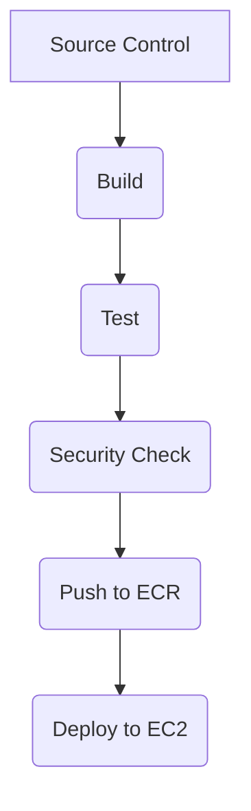
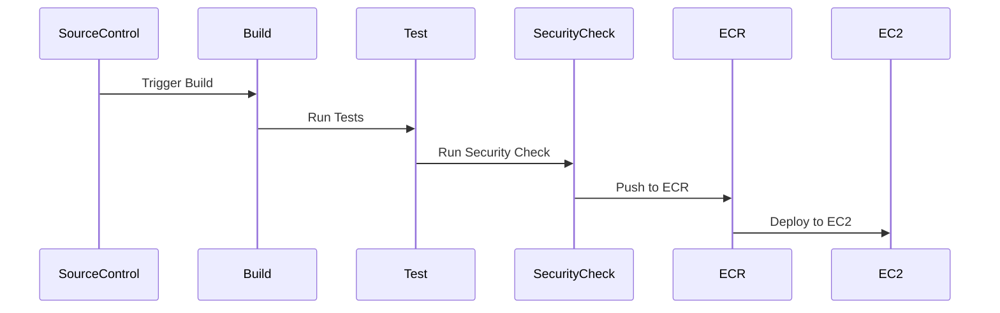

## Mermaid Diagrams

### CD Pipeline Architecture

### Sequence Diagram

---
<!-- nav -->
[[12-Integration of CICD Pipeline with AWS ECR|Integration of CICD Pipeline with AWS ECR]] | [[DevSecOps/DevSecOps Bootcamp/07-CI CD Security Pipeline/02-Build a CD Pipeline/Integrate CICD Pipeline with AWS ECR/00-Overview|Overview]] | [[14-Pitfalls and Common Mistakes|Pitfalls and Common Mistakes]]
