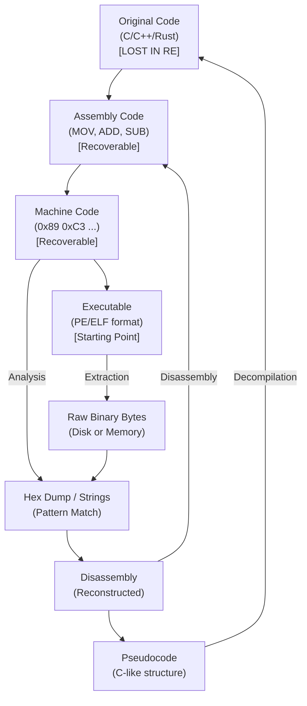

# Introduction to Reverse Engineering and Assembly

Reverse engineering (RE) is the process of deconstructing a system, software, or hardware component to extract its design, architecture, or underlying source code. In the context of software security, reverse engineering is often performed on compiled binaries to understand their inner workings, discover vulnerabilities, or analyze malware. Because source code is rarely available during penetration testing or incident response, reverse engineers must rely on analyzing machine code and assembly language to piece together the software's functionality.

## The Compilation Pipeline

To understand how to reverse engineer software, one must first understand how software is engineered. The process of translating high-level code (like C or C++) into machine code is known as compilation. It generally involves four stages:

1. **Preprocessing:** The preprocessor handles macros, includes files, and conditional compilation directives.
2. **Compilation:** The compiler translates the preprocessed high-level code into assembly language specific to the target architecture.
3. **Assembly:** The assembler translates the assembly code into machine code (object files), which consists of raw binary instructions.
4. **Linking:** The linker combines object files and necessary libraries into a single executable file (like PE for Windows or ELF for Linux).

Reverse engineering effectively attempts to traverse this pipeline in reverse, although getting back to the exact original high-level code is impossible due to the loss of information (variable names, comments, structural context) during compilation.

## The Reversing Pipeline (Disassembly and Decompilation)



## Disassembly vs. Decompilation

When analyzing a binary, you will primarily interact with two types of tools: disassemblers and decompilers.

### Disassemblers
A disassembler takes raw machine code (opcodes) and translates it back into assembly language. Since there is a 1-to-1 mapping between machine code instructions and assembly instructions (for the most part), disassembly is highly accurate. Tools like IDA Pro, Ghidra, and radare2 provide excellent disassembly capabilities.

### Decompilers
A decompiler attempts to translate assembly language back into high-level pseudocode (typically C-like). This process relies on heuristics and pattern matching to identify control structures (if/else loops, while loops), function boundaries, and variable types. Because compilation is a lossy process, decompiled code is never identical to the original source. Variables are typically named automatically (e.g., `local_1c`, `var_8`), and optimized code can produce heavily mangled pseudocode.

## Introduction to Assembly Language

Assembly language is a low-level programming language that is specific to a particular computer architecture (e.g., x86, x64, ARM, MIPS). It uses mnemonics to represent machine code instructions. A typical assembly instruction consists of an operation code (opcode) and one or more operands.

### Instruction Format

There are two primary syntaxes for x86/x64 assembly: Intel syntax and AT&T syntax.

**Intel Syntax (Default for Windows, IDA, Ghidra):**
`INSTRUCTION DESTINATION, SOURCE`
Example: `mov eax, ebx` (Move the value in `ebx` into `eax`)

**AT&T Syntax (Default for Linux GNU tools like objdump):**
`INSTRUCTION SOURCE, DESTINATION`
Example: `mov %ebx, %eax` (Move the value in `ebx` into `eax`)

For most reverse engineering tasks, Intel syntax is preferred as it is generally considered easier to read.

### Core Instruction Categories

Assembly instructions can be grouped into several key categories:

#### 1. Data Movement
These instructions move data between registers, memory, and immediate values.
- `mov dest, src`: Copies the value from `src` to `dest`.
- `lea dest, [src]`: Load Effective Address. Calculates the address of `src` and stores it in `dest`. Often used for pointer arithmetic.
- `push src`: Decrements the stack pointer and stores `src` at the top of the stack.
- `pop dest`: Retrieves the value at the top of the stack, stores it in `dest`, and increments the stack pointer.

#### 2. Arithmetic and Logic
These perform mathematical operations and bitwise logic.
- `add dest, src`: `dest = dest + src`
- `sub dest, src`: `dest = dest - src`
- `inc dest`: `dest = dest + 1`
- `dec dest`: `dest = dest - 1`
- `and dest, src`: Bitwise AND. Often used to mask bits.
- `or dest, src`: Bitwise OR.
- `xor dest, src`: Bitwise XOR. `xor eax, eax` is a common way to quickly set a register to zero.

#### 3. Control Flow
These instructions alter the sequential execution of code, enabling loops and conditional statements.
- `jmp target`: Unconditional jump to `target`.
- `call target`: Pushes the return address (the next instruction) onto the stack and jumps to `target`.
- `ret`: Pops the return address from the stack and jumps to it (returns from a function).
- `cmp arg1, arg2`: Compares two values by subtracting `arg2` from `arg1` and setting the CPU status flags (Zero Flag, Sign Flag, etc.) without storing the result.
- `test arg1, arg2`: Performs a bitwise AND and sets flags. `test eax, eax` is used to check if a register is zero.

#### 4. Conditional Jumps
These jump to a target only if specific CPU flags are set, usually following a `cmp` or `test` instruction.
- `je` / `jz`: Jump if Equal / Jump if Zero (Zero Flag = 1).
- `jne` / `jnz`: Jump if Not Equal / Jump if Not Zero (Zero Flag = 0).
- `jg` / `ja`: Jump if Greater / Jump if Above.
- `jl` / `jb`: Jump if Less / Jump if Below.

## Assembly Code Example: A Simple Loop

To understand how assembly structures translate from high-level code, consider a simple `for` loop in C:

```c
int sum = 0;
for(int i = 0; i < 5; i++) {
    sum += i;
}
```

In x86 assembly (Intel syntax), this might look something like:

```nasm
    xor eax, eax      ; eax will be our 'sum', initialize to 0
    xor ecx, ecx      ; ecx will be our counter 'i', initialize to 0
loop_start:
    cmp ecx, 5        ; Compare i with 5
    jge loop_end      ; If i >= 5, jump to loop_end
    add eax, ecx      ; sum = sum + i
    inc ecx           ; i++
    jmp loop_start    ; Unconditional jump back to loop_start
loop_end:
    ; Loop finished, sum is in eax
```

Understanding these basic patterns is critical for identifying control flow in disassemblers. When you see a `cmp` followed by a conditional jump (`jge`) that jumps past a block of code, and an unconditional jump (`jmp`) at the end of that block jumping back to the `cmp`, you are looking at a loop.

## Endianness

A critical concept when looking at raw memory or hex dumps is Endianness—the order in which bytes of a multibyte value are stored in memory.

- **Little-Endian:** The least significant byte (LSB) is stored at the lowest memory address. Used by x86/x64 architecture.
- **Big-Endian:** The most significant byte (MSB) is stored at the lowest memory address. Used by network protocols and some architectures like SPARC or older ARM.

For example, the 32-bit hex value `0x12345678` is stored in Little-Endian memory as:
`78 56 34 12`

When reverse engineering Windows or Linux binaries on standard Intel/AMD processors, you must always mentally reverse the bytes when reading from a raw hex dump.

## The Role of Architecture

The architecture of the target CPU determines the instruction set and registers.
- **x86 (32-bit):** Extremely common historically, heavily uses the stack for passing function parameters.
- **x86_64 (64-bit):** The modern standard. Uses registers for passing the first few function parameters (improving speed), and has an expanded set of general-purpose registers (r8-r15).
- **ARM:** Used in mobile devices (Android, iOS), IoT devices, and increasingly in laptops (Apple Silicon). ARM is a RISC (Reduced Instruction Set Computer) architecture, characterized by simpler, uniform-length instructions compared to the complex, variable-length instructions of x86.

## Tools of the Trade

Reverse engineers use a mix of static and dynamic analysis tools.
- **Static Analysis Tools:** Analyze the binary without executing it. Examples include IDA Pro, Ghidra, Binary Ninja, and radare2/Cutter.
- **Dynamic Analysis Tools (Debuggers):** Analyze the binary while it is running. Examples include x64dbg (Windows), GDB (Linux), and WinDbg.
- **Hex Editors:** Used for modifying the raw binary bytes (e.g., HxD, 010 Editor).

## Methodologies in Reverse Engineering

When approaching an unknown binary, reverse engineers rarely read assembly line-by-line from start to finish. Instead, they use a targeted approach:
1. **String Analysis:** Searching for readable text (URLs, file paths, error messages) to find interesting code locations.
2. **API Hooking/Tracing:** Looking at which operating system functions the binary imports (e.g., `CreateFile`, `InternetConnect`) to infer behavior.
3. **Cross-Referencing (XREFs):** Finding where a specific variable, string, or function is used within the code to trace execution flow.
4. **Dynamic Triage:** Running the malware in a sandbox to observe its behavior, then jumping to the corresponding code sections in the disassembler.

## Chaining Opportunities
- **[[02 - CPU Registers Stack and Heap Basics]]**: To fully comprehend assembly, you must understand the registers and memory structures it manipulates.
- **[[03 - PE File Format Overview Windows]]**: Knowing how the operating system loads the binary helps you locate the entry point and imports.
- **[[04 - ELF File Format Overview Linux]]**: Essential for reversing Linux binaries, understanding sections, and dynamic linking.
- **[[05 - Static Analysis Tools Strings Binwalk ExifTool]]**: The first step before jumping into assembly is extracting quick wins using static tools.

## Related Notes
- Reverse engineering forms the foundation of malware analysis and exploit development (buffer overflows, ROP).
- Patching binaries involves changing assembly instructions (e.g., changing a `jz` to a `jnz` to bypass a license check) using a hex editor.
- Obfuscation and packing are techniques used by developers (and malware authors) to make disassembly and decompilation significantly harder.
