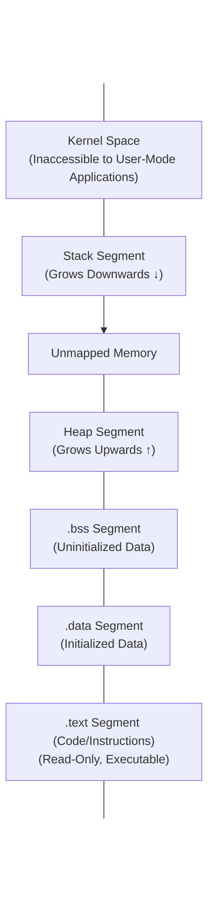

# CPU Registers, Stack, and Heap Basics

To effectively reverse engineer a compiled binary, you must understand how a computer processor manages memory and data during execution. High-level concepts like variables, objects, and function calls do not exist in machine code. Instead, the CPU interacts with registers, the stack, and the heap.

Understanding these structures is the most crucial step for transitioning from reading code to reading execution states, which is required for dynamic analysis, exploit development, and malware analysis.

## Process Memory Layout

When an operating system executes a binary, it loads it into memory and creates a process. The memory allocated to this process is strictly structured and divided into several segments.



1. **.text:** Contains the executable instructions of the program. It is typically marked as Read-Only and Executable to prevent self-modifying code.
2. **.data:** Contains global and static variables that are initialized by the programmer.
3. **.bss:** Contains global and static variables that are uninitialized (or initialized to zero).
4. **Heap:** Used for dynamic memory allocation during runtime (e.g., via `malloc()` or `new`).
5. **Stack:** Used for local variables, function parameters, and control flow management (return addresses).

## CPU Registers

Registers are tiny, ultra-fast storage locations located directly inside the CPU. Because accessing RAM (even the stack and heap) is relatively slow, the CPU uses registers to hold the data it is currently operating on. 

### General Purpose Registers (x86 and x64)

In 32-bit architecture (x86), general-purpose registers are 32 bits (4 bytes) wide and start with 'E' (Extended). In 64-bit architecture (x64), they are 64 bits (8 bytes) wide and start with 'R'.

The x64 architecture extends the existing registers and adds 8 new ones (`R8` to `R15`).

| 64-bit (x64) | 32-bit (x86) | 16-bit | 8-bit High | 8-bit Low | Traditional Purpose |
| :--- | :--- | :--- | :--- | :--- | :--- |
| `RAX` | `EAX` | `AX` | `AH` | `AL` | Accumulator (Math, Function Return Values) |
| `RBX` | `EBX` | `BX` | `BH` | `BL` | Base (Memory Pointers) |
| `RCX` | `ECX` | `CX` | `CH` | `CL` | Counter (Loop Iterations, String operations) |
| `RDX` | `EDX` | `DX` | `DH` | `DL` | Data (I/O, Math extensions) |
| `RSI` | `ESI` | `SI` | - | `SIL` | Source Index (String/Memory copies) |
| `RDI` | `EDI` | `DI` | - | `DIL` | Destination Index (String/Memory copies) |

*Note: In modern code, "Traditional Purpose" is mostly a suggestion, and compilers will use these registers interchangeably for general data storage, with the exception of `RAX` (which almost universally holds return values) and specific instructions that implicitly require `RCX` or `RSI`/`RDI`.*

### Pointer Registers

These registers manage the Stack and the Instruction Pointer.

| 64-bit | 32-bit | Description |
| :--- | :--- | :--- |
| `RBP` | `EBP` | **Base Pointer:** Points to the base (bottom) of the current stack frame. Used to reference local variables and parameters. |
| `RSP` | `ESP` | **Stack Pointer:** Points to the very top (current location) of the stack. Changes dynamically as `push` and `pop` happen. |
| `RIP` | `EIP` | **Instruction Pointer:** Holds the memory address of the *next* instruction to be executed by the CPU. Cannot be modified directly by `mov`; modified by jumps, calls, and returns. |

### The EFLAGS / RFLAGS Register

The FLAGS register does not hold memory addresses or general data. Instead, it is a collection of 1-bit flags that reflect the outcome of logical and arithmetic operations (like `cmp` and `test`).

Key flags include:
- **Zero Flag (ZF):** Set to 1 if the result of an operation is zero (e.g., `cmp eax, ebx` where `eax` == `ebx`).
- **Sign Flag (SF):** Set to 1 if the result is negative.
- **Carry Flag (CF):** Set to 1 if an arithmetic operation generates a carry/borrow out of the most significant bit.
- **Overflow Flag (OF):** Set to 1 if signed arithmetic overflows.

Conditional jumps (`jz`, `jnz`, `jg`) evaluate these flags to determine whether to take the jump.

## The Stack

The stack is a contiguous block of memory utilized as a Last-In, First-Out (LIFO) data structure. It is managed automatically by the CPU and the compiler.

### Stack Characteristics
- **Grows Downwards:** The stack starts at a high memory address and grows towards lower memory addresses. When you add data, the stack pointer (`ESP`/`RSP`) decreases.
- **Push:** Places data onto the top of the stack and subtracts from the stack pointer.
- **Pop:** Takes data off the top of the stack and adds to the stack pointer.

### Stack Frames
Every time a function is called, a new "Stack Frame" is created. This frame contains everything the function needs to operate independently:
1. Function arguments (in 32-bit x86).
2. The Return Address (where execution should resume after the function finishes).
3. The saved Base Pointer of the calling function.
4. Local variables for the current function.

### The Function Prologue and Epilogue

To set up and tear down these stack frames, compilers automatically insert boilerplate assembly code at the beginning and end of functions.

**Function Prologue (Setting up the frame):**
```nasm
push ebp        ; Save the base pointer of the caller
mov ebp, esp    ; Set the current stack pointer as the new base pointer
sub esp, 0x10   ; Allocate 16 bytes on the stack for local variables
```

**Function Epilogue (Tearing down the frame):**
```nasm
mov esp, ebp    ; Restore the stack pointer (destroys local variables)
pop ebp         ; Restore the caller's base pointer
ret             ; Pop the return address into EIP and jump to it
```

This strict structure is what buffer overflow exploits abuse. By overflowing a local variable on the stack, an attacker can overwrite the saved Return Address. When the function hits the `ret` instruction, it jumps to the attacker's shellcode instead of the legitimate caller.

## Calling Conventions

A calling convention is a standardized method for functions to pass arguments and clean up the stack. If the caller and the callee don't agree on the convention, the program will crash.

### 32-bit (x86) Calling Conventions

1. **cdecl (C Declaration):**
   - Arguments are pushed onto the stack from right to left.
   - The *Caller* cleans up the stack after the function returns (by adding to `ESP`).
   - Standard for C/C++ programs.
2. **stdcall:**
   - Arguments pushed right to left.
   - The *Callee* (the function itself) cleans up the stack before returning.
   - Standard for the Windows API (Win32).
3. **fastcall:**
   - The first two arguments are passed in registers (`ECX` and `EDX`).
   - Remaining arguments are pushed on the stack right to left.
   - Callee cleans the stack.

### 64-bit (x64) Calling Conventions

64-bit architecture unified calling conventions significantly, heavily favoring registers to improve speed.

**Microsoft x64 Calling Convention (Windows):**
- First 4 integer/pointer arguments passed in: `RCX`, `RDX`, `R8`, `R9`.
- Remaining arguments pushed onto the stack.
- Caller cleans the stack.
- Caller must allocate 32 bytes of "Shadow Space" on the stack for the callee to use if needed.

**System V AMD64 ABI (Linux, macOS):**
- First 6 integer/pointer arguments passed in: `RDI`, `RSI`, `RDX`, `RCX`, `R8`, `R9`.
- Remaining arguments pushed onto the stack.
- Caller cleans the stack.

Knowing the calling convention is crucial for reverse engineering, as it tells you exactly where to look for the function's input parameters.

## The Heap

Unlike the stack, which is highly structured and LIFO, the heap is a pool of memory used for dynamic allocation.

### Heap Characteristics
- **Dynamic Size:** Allocated at runtime using functions like `malloc()`, `calloc()`, or `HeapAlloc()`.
- **Grows Upwards:** Typically grows toward higher memory addresses.
- **Manual Management:** The programmer is entirely responsible for allocating and freeing heap memory.
- **Persistent:** Data in the heap remains until explicitly freed (or the process terminates).

### Heap Mechanics in Reverse Engineering
When `malloc(0x20)` is called, the OS memory manager finds a suitable 32-byte chunk of memory and returns a pointer (stored in `RAX`).
In assembly, you will often see patterns like:
```nasm
push 0x20           ; Request 32 bytes
call malloc         ; Call allocator
mov [ebp-4], eax    ; Save the returned pointer to a local variable
```

Because the heap is managed manually, it is prone to vulnerabilities:
- **Memory Leaks:** Forgetting to call `free()`.
- **Use-After-Free (UAF):** Accessing a pointer after it has been freed.
- **Heap Overflows:** Writing past the bounds of an allocated chunk, corrupting heap metadata (chunk headers), which can lead to arbitrary code execution.

## Summary

- **Registers:** Fast, immediate variables. Know `RAX` (return), `RCX/RDI/RSI` (args), `RSP` (stack top), `RBP` (frame base), `RIP` (next instruction).
- **Stack:** LIFO memory for local execution context. The battleground for buffer overflows and ROP chains.
- **Heap:** Unstructured memory for dynamic data. The battleground for UAF and heap corruption.
- **Calling Conventions:** The rules of engagement for function calls. Determine where arguments are stored.

## Chaining Opportunities
- **[[01 - Introduction to Reverse Engineering and Assembly]]**: Registers and stack operations are manipulated directly by assembly instructions.
- **[[03 - PE File Format Overview Windows]]**: The PE format dictates how the sections (.text, .data) are mapped into memory.
- **[[04 - ELF File Format Overview Linux]]**: The ELF format handles mapping in Unix-like systems.
- **[[06 - Buffer Overflows and Exploit Development]]**: Understanding stack frames and the return address is a strict prerequisite for buffer overflow exploitation.

## Related Notes
- In dynamic analysis (using x64dbg or GDB), stepping through code involves watching registers change in real-time.
- Debuggers allow you to view memory maps, inspecting the raw bytes residing in the stack, heap, and code sections.
- ASLR (Address Space Layout Randomization) is an OS mitigation that randomizes the starting addresses of the stack, heap, and loaded libraries to thwart hardcoded exploit addresses.
