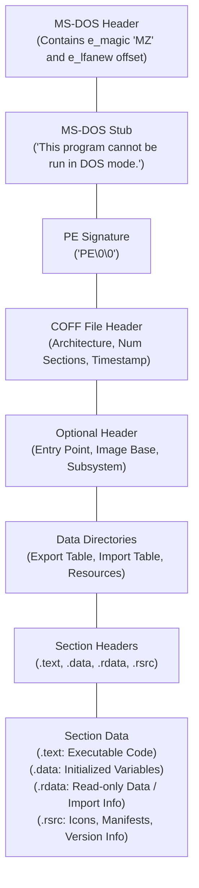

# PE File Format Overview (Windows)

The Portable Executable (PE) format is the standard executable file format used by Microsoft Windows. It encapsulates executables (`.exe`), dynamic-link libraries (`.dll`), object code (`.obj`), and driver files (`.sys`). Understanding the PE format is an absolute prerequisite for malware analysis, reverse engineering, and red teaming (e.g., writing shellcode loaders, process injection, API hooking).

The PE format tells the Windows OS Loader how to map the file from disk into memory, where execution should begin, what external libraries it depends on, and what access rights different sections of memory require.

## The Structure of a PE File

A PE file is a highly structured array of headers and data structures followed by the actual code and data sections.

### 1. MS-DOS Header and Stub
Every PE file starts with a legacy 64-byte MS-DOS Header.
- **e_magic:** The first two bytes are `0x4D 0x5A` (ASCII `MZ`), named after Mark Zbikowski, an early Microsoft architect. This is the primary indicator of a Windows executable.
- **e_lfanew:** Located at offset `0x3C`, this 4-byte value holds the offset address to the actual PE Signature (NT Headers).

Between the DOS Header and PE Signature lies the DOS Stub, a tiny 16-bit MS-DOS program that prints "This program cannot be run in DOS mode" and exits if run on a legacy OS.

### 2. NT Headers
The NT Headers represent the core of the PE structure. It is located using the `e_lfanew` pointer and consists of three parts:

#### A. Signature
A 4-byte signature: `0x50 0x45 0x00 0x00` (ASCII `PE\0\0`).

#### B. File Header (COFF Header)
Contains basic information about the physical layout of the file.
- **Machine:** Identifies the target CPU architecture (e.g., `0x014C` for x86, `0x8664` for x64).
- **NumberOfSections:** The number of sections following the headers.
- **TimeDateStamp:** The time the binary was compiled (though often manipulated or zeroed out in malware).
- **Characteristics:** Flags indicating if the file is an executable, a DLL, and if it supports >2GB memory addresses.

#### C. Optional Header
Despite its name, it is mandatory for executables. It contains critical information the OS Loader needs.
- **Magic:** `0x010B` for PE32 (32-bit), `0x020B` for PE32+ (64-bit).
- **AddressOfEntryPoint:** The Relative Virtual Address (RVA) of the first instruction to execute.
- **ImageBase:** The preferred memory address where the file should be loaded (historically `0x00400000` for EXEs). Modern ASLR makes this obsolete, but it acts as a base for RVAs.
- **Subsystem:** Specifies the Windows subsystem required (e.g., `1` for Native/Driver, `2` for GUI/Windowed, `3` for Console/CUI).
- **DllCharacteristics:** Security mitigations like ASLR (`IMAGE_DLLCHARACTERISTICS_DYNAMIC_BASE`), DEP/NX (`IMAGE_DLLCHARACTERISTICS_NX_COMPAT`), and CFG.

### 3. Data Directories
An array within the Optional Header pointing to important data structures used by the OS. The most critical for reverse engineers are:
- **Export Directory:** Functions exposed by this file (common in DLLs).
- **Import Directory:** Functions this file imports from other DLLs.
- **Resource Directory:** Embedded assets like icons, dialogs, and nested binaries.
- **Relocation Directory:** Data required to fix up addresses if the binary cannot load at its preferred ImageBase (crucial for ASLR).

### 4. Section Headers and Sections
The Section Table immediately follows the Optional Header. It defines where each section of the binary is located on disk, where it should be mapped in memory, and its permissions.

- **Name:** An 8-byte ASCII name (e.g., `.text`, `.data`). Can be arbitrary; malware often uses custom names (e.g., `.upx`, `.vmp0`).
- **VirtualSize:** Size of the section in memory.
- **VirtualAddress:** RVA of the section in memory.
- **SizeOfRawData:** Size of the section on disk.
- **PointerToRawData:** Offset to the section on disk.
- **Characteristics:** Flags defining permissions (Read, Write, Execute).
  - `.text` is typically `RX` (Read/Execute).
  - `.data` is typically `RW` (Read/Write).
  - Finding a section marked `RWX` (Read/Write/Execute) is a major red flag, often indicating a packed or obfuscated binary.

## Virtual Address (VA) vs Relative Virtual Address (RVA)

Understanding the difference between raw disk offsets, VAs, and RVAs is a common stumbling block in reverse engineering.

- **File Offset (Raw Address):** The exact byte position within the file on the hard drive.
- **Virtual Address (VA):** The absolute memory address where data resides once the program is loaded into RAM.
- **Relative Virtual Address (RVA):** The memory address *relative* to the `ImageBase`.

**Formula:**
`Virtual Address (VA) = ImageBase + RVA`

For example, if a binary is loaded at `ImageBase 0x10000000` and a function's RVA is `0x1000`, the absolute VA in memory is `0x10001000`.

When analyzing static files on disk, tools often need to convert an RVA to a File Offset using the Section Headers. If a reverse engineer extracts an RVA from the Optional Header, they must find which Section Header contains that RVA, calculate the difference, and apply it to the `PointerToRawData` to find the exact byte on disk.

## Imports and the Import Address Table (IAT)

No Windows application runs in a vacuum. They all rely on the Windows API (stored in libraries like `kernel32.dll`, `user32.dll`, `ntdll.dll`). Since the exact memory location of a function like `CreateFileW` in `kernel32.dll` varies between OS versions and reboots, a binary cannot hardcode the address.

Instead, the PE uses the Import Directory.
1. The compiler creates a table (the Import Directory) listing all the external DLLs and functions it needs.
2. The compiler writes calls to an empty table in the binary called the **Import Address Table (IAT)**.
3. When the OS Loader runs the executable, it reads the Import Directory, loads the required DLLs into memory, finds the real addresses of the requested functions, and writes those absolute addresses into the IAT.
4. The program then jumps to the address stored in the IAT.

### IAT Hooking
The IAT is a prime target for both attackers and security software (EDRs). By overwriting an entry in a process's IAT, an attacker can redirect a legitimate API call (like `MessageBoxA`) to their own malicious function, allowing them to monitor, block, or alter the execution flow.

## Exports

While executables primarily import functions, DLLs generally export them so other programs can use them. The Export Directory contains:
- The names of the exported functions.
- The RVAs of those functions.
- The ordinal numbers (an index number) of those functions. Programs can import by name (easier) or by ordinal (slightly faster and more obscure).

## Chaining Opportunities
- **[[02 - CPU Registers Stack and Heap Basics]]**: The PE format dictates memory segments, which the CPU registers interact with during execution.
- **[[04 - ELF File Format Overview Linux]]**: Compare the PE structure with its Linux counterpart.
- **[[05 - Static Analysis Tools Strings Binwalk ExifTool]]**: Tools like `pe-tree` and `CFF Explorer` statically parse the PE headers to extract indicators.
- **[[06 - Malware Analysis - Packing and Obfuscation]]**: Packers like UPX heavily abuse the PE format by destroying the IAT, changing entry points, and compressing sections.

## Related Notes
- Tools to analyze PE files: `PE-bear`, `CFF Explorer`, `LordPE`, and the `pefile` Python library.
- The entry point RVA defined in the Optional Header is where disassemblers like IDA or Ghidra will start their analysis.
- Anomalies in the PE structure (e.g., VirtualSize vastly larger than SizeOfRawData) strongly imply that the binary will unpack or decrypt more code into memory at runtime.
