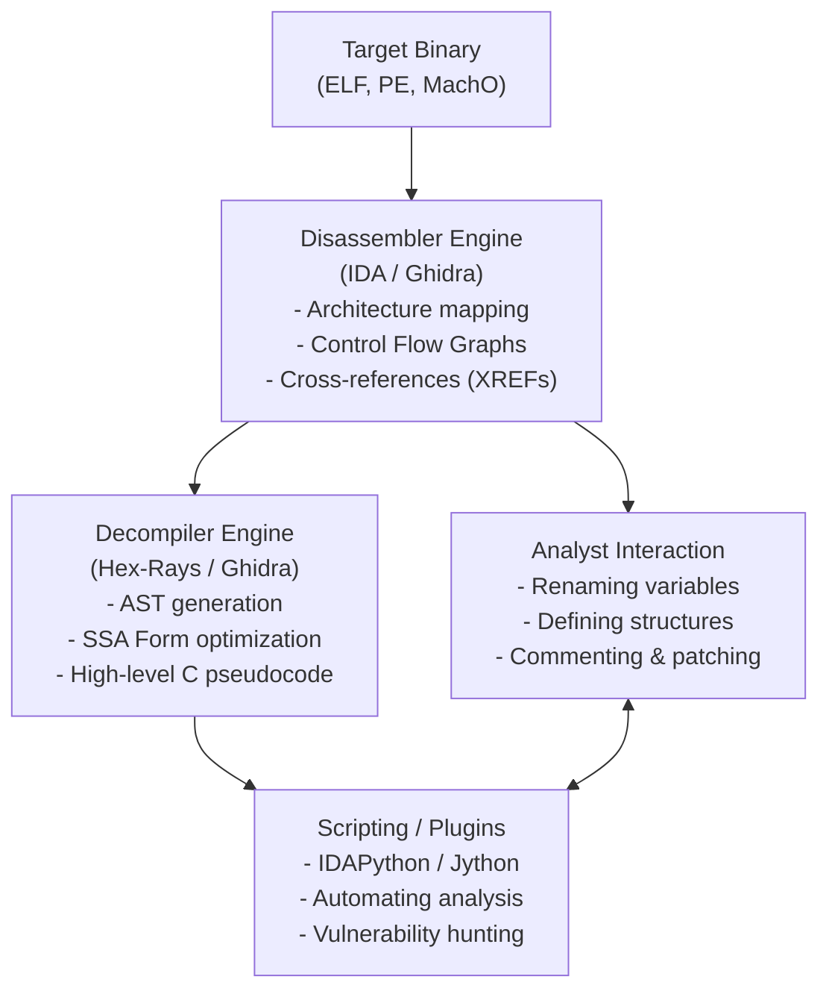

# Introduction to IDA Pro and Ghidra

## Overview

When delving into reverse engineering, software analysis, and vulnerability research, an analyst's primary toolkit invariably includes a robust disassembler and decompiler. Two of the most dominant titans in this domain are **IDA Pro** (Interactive Disassembler Professional) by Hex-Rays and **Ghidra**, an open-source software reverse engineering (SRE) framework created and maintained by the National Security Agency (NSA) Research Directorate. 

Understanding the capabilities, underlying architectures, and effective usage of these two platforms is essential for any modern reverse engineer, malware analyst, or vulnerability researcher. They serve as the lenses through which compiled binary code is translated back into human-readable assembly instructions and high-level pseudocode.

## ASCII Diagram: Reverse Engineering Toolchain Workflow



## IDA Pro (Interactive Disassembler)

### History and Evolution

Developed by Ilfak Guilfanov and later managed by Hex-Rays, IDA Pro has been the industry standard for decades. Its dominance stems from its unparalleled support for a vast array of processor architectures, its interactive nature, and the incredibly powerful Hex-Rays decompiler, which revolutionized the field by reliably converting assembly back into C-like pseudocode.

### Core Architecture and Features

1.  **FLIRT (Fast Library Identification and Recognition Technology):** 
    IDA Pro's FLIRT signatures allow it to automatically recognize standard library functions statically linked into a binary. By identifying functions like `printf`, `strcpy`, or `malloc`, IDA spares the analyst from manually reverse-engineering well-known code, drastically reducing analysis time.
2.  **Lumina Server:**
    Lumina pushes IDA's capabilities further by storing metadata (names, comments, prototype info) about functions in a centralized database. When you analyze a binary, IDA can query Lumina with function hashes to retrieve community-sourced or private-server metadata.
3.  **The Hex-Rays Decompiler:**
    Initially available as a separate, expensive add-on (now integrated into specific tiers), the decompiler transforms assembly into high-level C code. It heavily relies on Data Flow Analysis (DFA) and advanced heuristic algorithms to resolve variables, types, and control flow structures.
4.  **Interactive Workflow:**
    The true power of IDA is in the "I" (Interactive). Analysts are expected to rename variables (`N`), define structures (`Shift+F9`), change data types (`Y`), and add comments (`:` or `;`) to progressively document their understanding of the binary.

### Scripting with IDAPython

IDAPython is a plugin that integrates Python with IDA's extensive C++ API. It allows analysts to write scripts to automate tedious tasks, extract specific data, or perform advanced vulnerability hunting.

```python
import idc
import idautils
import idaapi

# Example: Enumerate all functions and print their addresses and names
for func_ea in idautils.Functions():
    func_name = idc.get_func_name(func_ea)
    print(f"Function {func_name} found at 0x{func_ea:x}")
```

IDAPython scripts can be used to unpack malware, resolve dynamically loaded APIs, or trace execution paths statically.

---

## Ghidra: The NSA's Open Source Powerhouse

### The Arrival of Ghidra

Released to the public at RSA Conference 2019, Ghidra immediately disrupted the SRE market. Its major selling points were that it was entirely free, open-source, and included a highly capable decompiler out-of-the-box for all supported architectures—a feature that costs thousands of dollars in the IDA Pro ecosystem.

### Core Architecture and Features

1.  **Sleigh Language:**
    Ghidra handles processor specifications using a proprietary language called SLEIGH. SLEIGH defines how machine code bytes map to assembly instructions and, crucially, how those instructions map to P-Code (Ghidra's intermediate representation). This makes adding support for exotic or custom architectures significantly easier than in IDA.
2.  **P-Code Intermediate Representation:**
    Before decompilation, Ghidra translates all assembly instructions into P-Code. P-Code consists of simple micro-operations. By elevating everything to P-Code, Ghidra's decompiler only needs to understand P-Code, rather than the nuances of x86, ARM, or MIPS. This decoupled architecture is highly elegant and extensible.
3.  **Collaborative Reverse Engineering:**
    Ghidra was built with team collaboration in mind from day one. It includes a built-in version tracking system and allows multiple analysts to connect to a shared Ghidra server, working on the same project simultaneously, seeing each other's changes in real-time.
4.  **Version Tracking:**
    Ghidra includes powerful tools to compare two different binaries (e.g., before and after a patch) to identify what changed. This is an invaluable feature for patch diffing and zero-day vulnerability research.

### Scripting in Ghidra

Ghidra runs on the Java Virtual Machine (JVM). Its primary scripting languages are Java and Jython (Python 2 implementation for the JVM). While modern reverse engineers often prefer Python 3, Jython still offers access to Ghidra's massive flat API. Recently, community projects like Ghidrathon have brought CPython 3 support to Ghidra.

```java
// Example Ghidra Java Script
import ghidra.app.script.GhidraScript;
import ghidra.program.model.listing.Function;

public class EnumerateFunctions extends GhidraScript {
    @Override
    protected void run() throws Exception {
        Function func = getFirstFunction();
        while (func != null) {
            println("Function: " + func.getName() + " at " + func.getEntryPoint());
            func = getFunctionAfter(func);
        }
    }
}
```

---

## Comparative Analysis: IDA Pro vs. Ghidra

| Feature | IDA Pro | Ghidra |
| :--- | :--- | :--- |
| **Cost** | Expensive commercial licenses | Free and Open Source |
| **Decompiler** | Hex-Rays (Extremely mature, reliable) | Built-in (Constantly improving) |
| **Intermediate Language** | Microcode | P-Code |
| **Scripting** | IDAPython (Python 3 natively) | Java, Jython (Community Python 3) |
| **Collaboration** | Lumina (Metadata sharing), Third-party plugins | Native server-based multi-user collaboration |
| **UI/UX** | Fast, responsive, keyboard-centric | Slightly heavier (Java Swing), highly customizable |
| **Debugging** | Built-in native debuggers | Limited native debugging (Ghidra debugger integration improving) |

### When to use which?

*   **Choose IDA Pro when:** You are working on highly complex, obfuscated binaries where the absolute best decompiler heuristics are required. You are working in an enterprise environment that already pays for licenses. You need built-in dynamic debugging seamlessly integrated with your static analysis. You need lightning-fast UI responsiveness.
*   **Choose Ghidra when:** You are on a budget or prefer open-source tooling. You are analyzing an exotic architecture not supported by IDA or where writing a SLEIGH specification is easier. You need to collaborate in real-time with a team of analysts. You need to perform extensive patch diffing between binary versions. You want to write complex analysis modules in Java.

## Advanced Usage Concepts

### Structs and Typing

Both tools rely heavily on the user defining custom C structs to make sense of data. If you see code like `v1 = *(DWORD *)(a1 + 0x14)`, the tools don't know what `a1` is. An advanced analyst will deduce that `a1` is a pointer to a struct, create that struct in the tool's struct editor, define an integer at offset `0x14`, and apply that type to `a1`. The pseudocode will magically transform into `v1 = my_struct->field_14;`.

### Intermediate Representations (IR)

Understanding the underlying IR (Microcode for IDA, P-Code for Ghidra) is crucial for advanced vulnerability research. Often, analysts will write scripts that operate on the IR rather than the raw assembly. This is because searching for an insecure pattern (like an unchecked `strcpy`) is much easier when dealing with standardized IR instructions rather than architecture-specific assembly nuances.

## Chaining Opportunities

*   Knowledge gained here directly applies to [[07 - Decompiling vs Disassembling]] where we explore the translation layers.
*   Once static analysis is exhausted, analysts move to [[09 - Dynamic Analysis Basics]] to observe the binary in execution.
*   Recognizing patterns in these tools requires strong foundational knowledge from [[08 - Identifying Common C Constructs in Assembly]].

## Related Notes

*   [[01 - Assembly Language Fundamentals]]
*   [[02 - CPU Architectures (x86, ARM, MIPS)]]
*   [[10 - Debugging with GDB and Pwndbg]]
*   [[12 - Patch Diffing for Vulnerability Discovery]]
