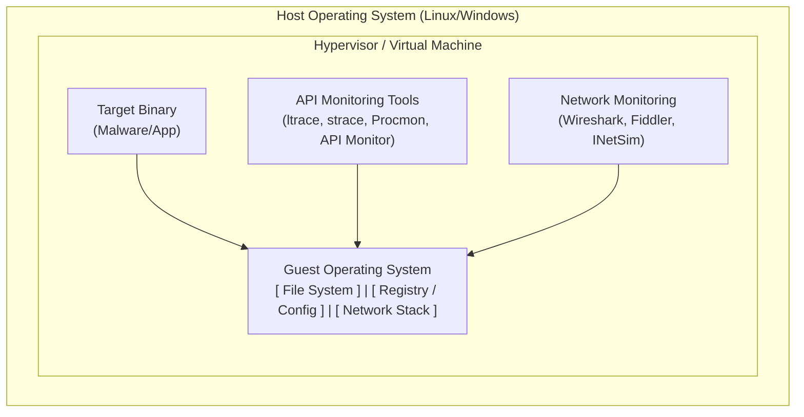

# Dynamic Analysis Basics

## Overview

Reverse engineering is broadly divided into two phases: Static Analysis (examining code without executing it) and **Dynamic Analysis** (running the code in a controlled environment and observing its behavior). While static analysis is necessary for deep algorithmic understanding, dynamic analysis is often faster for determining exactly *what* a binary does, how it interacts with the operating system, what network indicators it generates, and for unpacking obfuscated payloads.

Dynamic analysis treats the binary as a black box (or gray box). By intercepting API calls, monitoring file system changes, and capturing network traffic, an analyst can build a comprehensive behavioral profile of the application or malware.

## ASCII Diagram: The Dynamic Analysis Sandbox Environment

## The Necessity of Safe Environments

Dynamic analysis involves executing potentially malicious or destructive code. Therefore, it is an absolute requirement that all dynamic analysis occurs within a heavily isolated environment, typically a Virtual Machine (VM) configured as a sandbox.

### Sandbox Configuration Rules:
1.  **Host-Only Networking:** The VM must not have access to the host's internal network or the open internet unless specifically required and routed through an analysis proxy.
2.  **Snapshots:** Always take a clean snapshot of the VM *before* running any unknown binary. Revert to this snapshot after the analysis is complete to ensure a pristine state for the next test.
3.  **Disable Shared Folders:** Prevent malware from escaping the VM and infecting the host OS via shared filesystems.
4.  **Anti-Analysis Defenses:** Advanced malware checks if it is running in a VM. Analysts must often harden their VMs (e.g., changing MAC addresses, modifying registry keys, hiding VM tools) to ensure the malware executes its true payload.

## Core Methodologies of Dynamic Analysis

Dynamic analysis is primarily concerned with monitoring the binary's interaction with the underlying OS. This is achieved by monitoring at different levels of the system architecture.

### 1. System Call Monitoring
System calls (syscalls) are the fundamental interface between an application and the Linux/Windows kernel. Everything a binary does—reading a file, opening a network socket, allocating memory—eventually requires a syscall.

*   **Linux Tool:** `strace`
    *   `strace -f ./binary` will trace all system calls made by the binary and any child processes it spawns. This reveals exactly what files are being opened, what memory protections are being applied, and what network connections are attempted.
*   **Windows Equivalent:** Process Monitor (Procmon) provides a GUI to trace filesystem, Registry, and process/thread activity in real-time.

### 2. Library/API Hooking
While syscalls show the raw kernel interaction, monitoring dynamically linked library (Shared Object/DLL) calls provides higher-level context. Knowing a binary called `fopen("config.txt")` is often more readable than analyzing the underlying `openat()` syscalls.

*   **Linux Tool:** `ltrace`
    *   `ltrace ./binary` intercepts and records dynamic library calls. It is invaluable for observing cryptographic functions being called, string manipulation, or high-level network APIs.
*   **Windows Tool:** API Monitor allows analysts to hook thousands of documented and undocumented Windows APIs, view parameters passed to them, and modify return values on the fly.

### 3. Network Traffic Analysis
Many binaries (especially malware) reach out to Command and Control (C2) servers, download secondary payloads, or exfiltrate data. Monitoring this traffic is critical.

*   **Packet Capture:** Running **Wireshark** or `tcpdump` on the analysis VM (or on the virtual network interface from the host) captures all inbound and outbound traffic.
*   **Network Simulation:** Because the VM is usually disconnected from the internet, malware might fail to run if it cannot resolve its C2 domain. Tools like **INetSim** simulate standard internet services (DNS, HTTP, SMTP) locally. INetSim will fake a DNS response, pointing the malware to a local HTTP server, allowing the analyst to capture the HTTP request the malware intended to send to the internet.

## Advanced Dynamic Techniques

### Dynamic Instrumentation (Frida)
Frida is a dynamic instrumentation toolkit that allows analysts to inject JavaScript engines into running processes. This allows for unparalleled dynamic analysis:
*   You can hook specific functions in memory.
*   You can read and modify the arguments passed to functions before they execute.
*   You can alter the return value of functions (e.g., forcing an authentication check function to always return `true`).
*   You can trace execution flow dynamically without needing a traditional debugger.

### Unpacking via Dynamic Analysis
Malware authors frequently pack or encrypt their binaries to thwart static analysis. The code remains encrypted on disk and only decrypts itself into memory during execution.
Dynamic analysis is the primary method for defeating packers. By monitoring API calls like `VirtualAlloc` (Windows) or `mmap` (Linux) followed by execution transfer to the newly allocated region, an analyst can pause execution, dump the newly decrypted memory to disk, and analyze the raw, unpacked payload statically.

## Chaining Opportunities

*   Dynamic analysis is often used to quickly locate the regions of code that require deep static analysis via [[06 - Introduction to IDA Pro and Ghidra]].
*   When dynamic monitoring tools (like `strace`) identify interesting behavior, analysts will attach to the process to gain fine-grained control, as detailed in [[10 - Debugging with GDB and Pwndbg]].
*   Understanding the OS architecture and syscall mechanisms is foundational, refer to [[04 - Operating System Internals for Reverse Engineers]].

## Related Notes

*   [[11 - Sandbox Evasion and Anti-Debugging]]
*   [[15 - Unpacking and Decrypting Payloads]]
*   [[16 - Network Protocol Reverse Engineering]]
