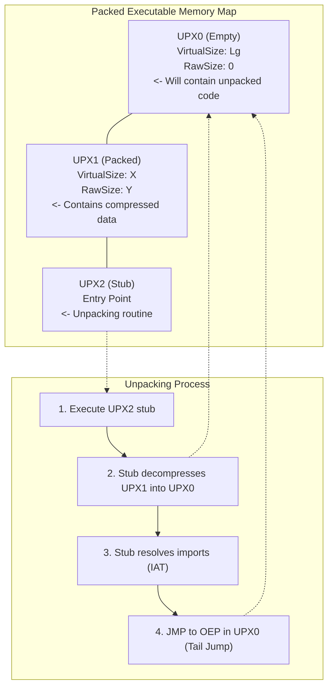

# 61.14 Unpacking Packed Executables UPX

## Introduction to Packers and Entropy

A packer is a utility that compresses, encrypts, or obfuscates an executable file, bundling it with a small routine known as the "stub". When the packed application is executed, the stub runs first. It allocates memory, decompresses the original executable into that memory, resolves necessary imports, and finally transfers execution control to the Original Entry Point (OEP) of the application.

Packers were originally designed to reduce file size (like UPX - Ultimate Packer for eXecutables). However, they are now predominantly used by malware authors to evade signature-based antivirus detection.

### Recognizing a Packed Executable
1. **High Entropy**: Normal executables have distinct structures and predictable byte distributions. Compressed or encrypted data appears as high-entropy (random) data. An entropy score close to 8.0 indicates packing.
2. **Few Imports**: A packed executable typically imports very few functions (usually just `LoadLibraryA` and `GetProcAddress`), as the stub dynamically resolves the rest at runtime.
3. **Abnormal Section Names**: UPX typically renames PE sections to `UPX0`, `UPX1`, and `UPX2`.

## The UPX Architecture

UPX is the most famous and widely understood packer. It structures the PE file into three main sections:
- **UPX0**: A completely empty section in the file (Raw Size is 0), but with a large Virtual Size. This is the destination where the uncompressed code will be written in memory.
- **UPX1**: Contains the compressed data of the original executable.
- **UPX2**: Contains the unpacking stub. The entry point of the binary points here.

## The Unpacking Strategy

To analyze the underlying malware, we must unpack it. While UPX offers an automated `-d` switch to decompress files, malware authors often modify the UPX headers slightly to break the automated tool. Thus, manual unpacking is required.

### 1. Finding the Original Entry Point (OEP)

The goal is to let the stub do the hard work of decompressing the file, and then pause execution exactly when the stub is about to jump to the OEP.

#### The `pushad` / `popad` Trick
Many packers, including UPX, save the state of all general-purpose registers at the beginning of the stub using the `pushad` instruction. Once unpacking is finished, they restore the registers using `popad` before jumping to the OEP.
1. Open the binary in x64dbg.
2. Step Into (F7) once to execute the `pushad` instruction.
3. Observe the Stack Pointer (ESP).
4. Set a Hardware Breakpoint on access (Read/Write) on the ESP address.
5. Run the program (F9).
The debugger will break exactly after the `popad` instruction because the CPU accesses the ESP address to pop the registers.

#### The Tail Jump
Immediately following the `popad`, you will typically see a massive, unconditional jump (e.g., `JMP 0x00401000`). This jump is heading to a memory address far away from the stub. This is the "Tail Jump," and its destination is the OEP.

### 2. Dumping the Memory

Once you step over the Tail Jump, you are at the OEP. The original program is now fully uncompressed in memory.
Using tools like **Scylla** (integrated into x64dbg):
1. Note the current EIP (the OEP).
2. Open Scylla.
3. Input the OEP.
4. Click "Dump" to save the uncompressed memory to disk.

### 3. Rebuilding the Import Address Table (IAT)

The dumped file cannot run on its own because its IAT is destroyed. The IAT is a table of pointers to external functions (like `MessageBoxA`). The unpacking stub manually populated these pointers for the current memory space, which will not be valid if the binary is run again.
In Scylla:
1. Click "IAT Autosearch".
2. Click "Get Imports".
3. Verify that all imports show as "Valid".
4. Click "Fix Dump" and select the dumped binary.
Scylla will append a new section containing a rebuilt IAT, producing a fully functioning, unpacked executable.

## ASCII Architecture Diagram (UPX Memory Map)

## Advanced Packers

While UPX is simple, modern protectors like VMProtect or Themida do not simply unpack code and jump to an OEP. They virtualize instructions, implement aggressive anti-debugging (see [[12 - Anti-Debugging and Anti-Disassembly Techniques]]), and use stolen bytes. Bypassing them requires kernel-level debugging and custom scripting.

## Chaining Opportunities

- Manual unpacking relies entirely on debugger proficiency learned in [[11 - Debugging with x64dbg and OllyDbg]].
- Stub execution may employ checks requiring evasion tactics from [[13 - Bypassing Anti-Debugging Checks]].
- You may need to patch the binary to bypass custom anti-dumping checks during unpacking, as seen in [[15 - Patching Binaries NOPing Jumps]].

## Related Notes
- [[11 - Debugging with x64dbg and OllyDbg]]
- [[12 - Anti-Debugging and Anti-Disassembly Techniques]]
- [[13 - Bypassing Anti-Debugging Checks]]
- [[15 - Patching Binaries NOPing Jumps]]
