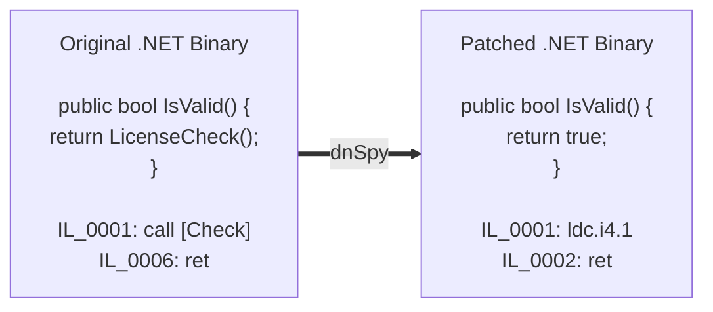
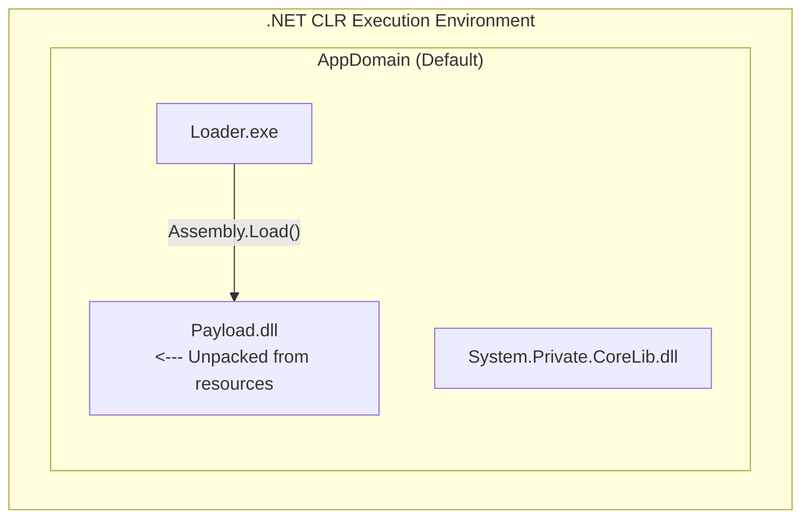

# 61.17 Reverse Engineering .NET Applications

## 1. Introduction to the .NET Ecosystem

Reverse engineering .NET applications is fundamentally different from analyzing native C/C++ or Rust binaries. When a developer compiles a C# or VB.NET application, it is not compiled directly into machine code (x86/x64). Instead, it is compiled into **Common Intermediate Language (CIL)**, historically known as MSIL (Microsoft Intermediate Language). 

This CIL code, along with extensive metadata, is packaged into a standard Portable Executable (PE) file. When the executable is run, the **Common Language Runtime (CLR)** loads the assembly and the **Just-In-Time (JIT) Compiler** translates the CIL into native machine code on the fly. 

Because the CIL and metadata contain rich information about the application's structure (class names, method names, variable types, and even localized strings), un-obfuscated .NET applications can be decompiled back into nearly perfect original C# source code.

## 2. Core Components of a .NET Assembly

To reverse engineer .NET binaries effectively, one must understand their internal structure.

*   **Manifest**: Contains assembly metadata, versioning, security identity, and references to other assemblies.
*   **Metadata Tables**: The heart of .NET RE. Metadata tables store the schema of the application. They define the classes (`TypeDef`), methods (`MethodDef`), fields (`FieldDef`), and references to external libraries (`MemberRef`). 
*   **Metadata Tokens**: Every element in a .NET assembly is referenced via a unique 4-byte token (e.g., `0x06000001` where `06` specifies the `MethodDef` table and `000001` is the row index).
*   **CIL Instructions**: The actual bytecode instructions (e.g., `ldarg.0`, `callvirt`, `stloc.1`).

## 3. Tooling for .NET Reverse Engineering

The .NET reversing toolkit heavily revolves around decompilers and memory manipulation tools rather than traditional disassemblers like IDA Pro (though IDA supports .NET, specialized tools are far superior).

*   **dnSpy / dnSpyEx**: The absolute gold standard for .NET reverse engineering. It serves as both a powerful decompiler (to C# or IL) and an interactive debugger. It allows direct modification and patching of assemblies.
*   **ILSpy**: An open-source decompiler, excellent for static analysis and exporting projects back to Visual Studio solutions.
*   **de4dot**: An open-source, automated deobfuscator that attempts to restore heavily obfuscated .NET assemblies to a readable state by renaming symbols, decrypting strings, and removing proxy calls.
*   **CFF Explorer**: Used for low-level PE header manipulation, viewing metadata tables, and removing the "Strong Name Signature" of modified assemblies.
*   **Harmony / hooking tools**: Used for dynamically patching methods at runtime without modifying the binary on disk.

## 4. Understanding and Defeating Obfuscation

Because decompiling .NET is so trivial, malware authors and commercial software vendors use **Obfuscators** (e.g., ConfuserEx, .NET Reactor, SmartAssembly, VMProtect for .NET) to protect their code.

### 4.1 Common Obfuscation Techniques
1.  **Symbol Renaming**: Classes and methods are renamed to unreadable Unicode characters, invisible characters, or generic names (e.g., `Class1.method_0()`).
2.  **String Encryption**: Hardcoded strings (like URLs, passwords, API keys) are encrypted. They are decrypted at runtime via a centralized decryption method.
3.  **Control Flow Flattening (CFF)**: Transforms linear code into a giant `switch` statement inside an infinite `while` loop, destroying the logical structure of the decompiled C# code.
4.  **Proxy Calls**: Instead of calling a standard API like `Console.WriteLine()`, the obfuscator redirects the call through deeply nested, dynamically generated delegate functions.
5.  **Anti-Debugging / Anti-Dump**: Injecting code that detects `IsDebuggerPresent` or prevents memory dumping utilities from reading the process.

### 4.2 Deobfuscation Methodology

**Step 1: Identification**
Load the binary into **Detect It Easy (DiE)**. It will typically identify the exact obfuscator used (e.g., "ConfuserEx 1.x").

**Step 2: Automated Deobfuscation with de4dot**
Run the binary through `de4dot`.
```bash
de4dot.exe -f obfuscated_malware.exe -o cleaned_malware.exe
```
`de4dot` will attempt to decrypt strings, restore control flow, and rename random symbols to `Class_0`, `Method_1`, which makes manual analysis significantly easier.

**Step 3: Manual String Decryption via dnSpy Scripting**
If `de4dot` fails, you can dynamically decrypt strings using dnSpy:
1. Identify the string decryption method. It usually takes an integer (the string ID) and returns a string.
2. Write a small C# application, reference the obfuscated assembly, and use **Reflection** to invoke the decryption method for every possible ID, dumping the results to a text file.

## 5. Modifying and Patching .NET Assemblies

One of the most powerful features of `dnSpy` is the ability to modify the application and save the patched binary. This is commonly used in VAPT to bypass license checks, remove anti-debugging functions, or force malware to decrypt its payload.



### 5.1 Patching IL vs C#
In `dnSpy`, you can right-click a method and select **"Edit Method (C#)"** or **"Edit IL Instructions"**. 
*   **Edit C#**: Allows you to write raw C# code. dnSpy will compile it to IL in the background. This often fails if the code is heavily obfuscated or contains invalid variables.
*   **Edit IL**: Highly reliable. To bypass a boolean check, you can simply replace the method body with:
    ```cil
    ldc.i4.1   // Load integer 1 (true) onto the stack
    ret        // Return
    ```

### 5.2 Bypassing Strong Name Validation
If an assembly is signed with a Strong Name (SN), patching it will invalidate the signature. The CLR will refuse to load the patched assembly, throwing a `System.IO.FileLoadException`.
To fix this:
1. Open the patched executable in **CFF Explorer**.
2. Go to `.NET Directory`.
3. Uncheck the `StrongNameSigned` flag.
4. Save the file. The OS will now treat it as an unsigned assembly and execute it without signature validation.

## 6. Advanced Dynamic Analysis: Debugging and Memory Dumping

When dealing with packed .NET malware (where the true payload is stored encrypted in the resources and loaded dynamically via `Assembly.Load(byte[])`), static analysis is insufficient.

### 6.1 Debugging with dnSpy
1. Open dnSpy and go to `Debug -> Start Debugging`.
2. Configure the executable path and arguments.
3. In the "Modules" window (Debug -> Windows -> Modules), you can see every DLL loaded into the AppDomain.
4. Set breakpoints on critical API calls, specifically `System.Reflection.Assembly.Load`.
5. When the breakpoint hits, the malware is about to load a dynamic payload. You can inspect the `byte[]` argument in the "Locals" window, right-click it, and select **"Save as..."** to dump the decrypted payload directly to disk.

### 6.2 AppDomain and Payload Extraction
Malware often creates hidden AppDomains to execute secondary payloads without leaving traces in the primary application space.


Using a tool like **MegaDumper** or writing a custom C# injector allows you to enumerate all AppDomains and dump loaded assemblies straight from memory, bypassing the need to analyze the custom unpacking loop entirely.

## 7. Analyzing JIT Compilation Traces

For the most extreme cases (e.g., where methods are encrypted and only decrypted immediately before the JIT compiler compiles them, and then re-encrypted—often called Method Level Obfuscation or JIT-Hooking), you must debug the CLR itself.
This involves attaching a native debugger (like x64dbg) to the `.NET` process and hooking `clr.dll!compileMethod`. By intercepting the `CORINFO_METHOD_INFO` structure passed to the JIT compiler, an analyst can dump the unencrypted IL code of every method right before it is translated to machine code.

## Chaining Opportunities
*   Many native C++ droppers will reflectively load a .NET assembly using the `mscoree.dll` COM interfaces (`ICLRRuntimeHost`). Understanding this crossover is crucial for tracking full kill-chains.
*   Once a .NET application is decompiled, finding Hardcoded Credentials or Deserialization vulnerabilities provides an immediate pivot to Web/Infrastructure exploitation.

## Related Notes
*   [[16 - Analyzing Malware Loaders and Droppers]]
*   [[09 - Static Analysis Fundamentals]]
*   [[35 - Insecure Deserialization Vulnerabilities]]
*   [[12 - Advanced x64dbg Debugging Techniques]]
