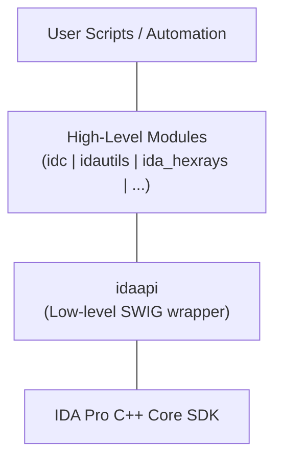

# 61.20 Scripting in Ghidra and IDA (Python APIs)

## 1. Introduction: The Power of Automation in RE

Reverse engineering complex, heavily obfuscated software or massive malware frameworks (like Emotet, Trickbot, or modern ransomware) manually is often an exercise in futility. When faced with an executable containing 5,000 functions, custom string encryption across 1,000 distinct locations, or heavily flattened control flow, manual point-and-click analysis does not scale.

This is where **Scripting** becomes the reverse engineer's most lethal weapon. Both of the industry-standard disassemblers—IDA Pro and Ghidra—expose deep APIs that allow analysts to automate repetitive tasks, extract indicators of compromise (IOCs) dynamically, decrypt data, rename functions systematically, and perform bulk binary patching.

## 2. IDAPython API Architecture

IDAPython integrates the Python programming language deeply into IDA Pro. It allows you to write scripts that interact with IDA's database, the disassembly text, and the decompiler AST (Abstract Syntax Tree).

### 2.1 The Core Modules
IDAPython is divided into several distinct modules, each responsible for different layers of abstraction:

*   **`idc`**: The legacy, high-level compatibility module. It provides simple, functional wrappers for common tasks (e.g., `idc.get_inf_attr()`, `idc.patch_byte()`). Easiest to use, but limited in deep structural analysis.
*   **`idautils`**: A highly practical, Pythonic module. It provides generators and iterators to traverse the binary quickly (e.g., iterating through all functions, segments, or cross-references).
*   **`idaapi`**: The lowest-level module. It provides a direct SWIG wrapper over the native IDA C++ SDK. It is complex and verbose but absolutely necessary for advanced tasks like UI hooking, writing custom processor modules, or interacting with the Hex-Rays decompiler microcode.



### 2.2 Common IDAPython Patterns

**Iterating Over All Functions and Instructions:**
```python
import idautils
import idc

for func_ea in idautils.Functions():
    func_name = idc.get_func_name(func_ea)
    print(f"Analyzing function: {func_name} at {hex(func_ea)}")
    
    # Iterate over all instructions in the function
    for instr_ea in idautils.FuncItems(func_ea):
        mnemonic = idc.print_insn_mnem(instr_ea)
        if mnemonic == 'xor':
            print(f"  [!] Found XOR at {hex(instr_ea)}")
```

**Finding Cross-References (XREFs):**
Finding where an encryption function or a specific string is called is a daily task.
```python
target_func = idc.get_name_ea_simple("decrypt_string_routine")

for ref in idautils.CodeRefsTo(target_func, 0):
    print(f"decrypt_string_routine is called from {hex(ref)}")
    # We can automatically rename the caller function:
    idc.set_name(ref, f"caller_of_decrypt_{hex(ref)}", idc.SN_NOCHECK)
```

## 3. Ghidra Scripting APIs (Java & Python)

Ghidra approaches scripting differently. Because Ghidra is written in Java, its primary scripting language is Java. However, it supports Python 2.7 via **Jython**. 
*Note: Because it uses Jython, you cannot easily import modern Python 3 libraries (like `requests` or advanced cryptography modules) directly into Ghidra without workarounds like `ghidra_bridge`.*

### 3.1 The FlatProgramAPI
Ghidra exposes the `FlatProgramAPI`, a massive class containing hundreds of utility functions that act as the primary interface for scripts. When you write a Ghidra script, your class inherits from `GhidraScript`, giving you direct access to variables like `currentProgram`, `currentAddress`, and `monitor`.

### 3.2 Common Ghidra Scripting Patterns (Python/Jython)

**Iterating Over Functions:**
```python
# In Ghidra, currentProgram is automatically injected into the environment
functionManager = currentProgram.getFunctionManager()
functions = functionManager.getFunctions(True) # True = forward iteration

for func in functions:
    print("Found function: {} @ {}".format(func.getName(), func.getEntryPoint()))
```

**Patching Bytes (Deobfuscation):**
Often, malware uses inline junk code. You can automate NOP'ing (filling with `0x90`) this junk out.
```python
address = toAddr(0x401000) # Convert string/int to Ghidra Address object
length_to_nop = 5

for i in range(length_to_nop):
    # Overwrite with 0x90 (NOP on x86/x64)
    setByte(address.add(i), 0x90)

print("Patching complete!")
```

## 4. Practical Automation: Automated String Decryption

The most common use case for RE scripting is defeating string obfuscation.
Consider a malware sample where strings are encrypted using RC4, and a function `decrypt_rc4(byte* enc_string, int length, byte* key)` is called hundreds of times.

**IDAPython Approach:**
1. Use `idautils.CodeRefsTo()` to find every location `decrypt_rc4` is called.
2. At each call site, traverse backwards to find the `push` or `mov` instructions loading the arguments (the encrypted string address, length, and key address).
3. Read the encrypted bytes from the binary database using `idaapi.get_bytes(addr, length)`.
4. Use Python's built-in cryptographic functions to decrypt the string in memory.
5. Apply the decrypted string back into the IDA database using `idc.set_cmt(call_addr, decrypted_string, 0)` so the analyst can see the plaintext string right inside the disassembly view.

## 5. Headless Analysis with Ghidra

One of Ghidra's most devastatingly powerful features is **analyzeHeadless**. It allows you to run Ghidra from the command line without the GUI, import a binary, run a specific script against it, dump the results (like IOCs), and exit. 

This is highly utilized in VAPT and SOC automation pipelines (e.g., tying Ghidra to a SOAR platform or Cuckoo Sandbox).

**Headless Execution Example:**
```bash
./analyzeHeadless /path/to/ghidra_project MyProject \
    -import /path/to/malware.exe \
    -postScript ExtractIOCs.py \
    -scriptPath /path/to/my/scripts \
    -deleteProject
```
In this command, Ghidra creates a temporary project, imports `malware.exe`, runs full auto-analysis, executes the `ExtractIOCs.py` script (which could print decrypted URLs to `stdout`), and then deletes the project, entirely automating the static extraction phase.

## 6. Hex-Rays Microcode API

For the absolute elite reverse engineers, manipulating assembly text is not enough. Obfuscators like Control Flow Flattening (CFF) destroy assembly readability. 
IDA's `ida_hexrays` API allows analysts to hook into the decompilation pipeline and manipulate the **Microcode** (the intermediate representation that IDA uses before generating C code). 
By writing a Microcode optimization pass, an analyst can programmatically detect obfuscated control flow blocks, calculate the actual intended execution path, and rewrite the AST, effectively "un-flattening" the binary and restoring pristine C code.

## Chaining Opportunities
*   Scripts written in IDAPython can extract embedded configuration files from malware and pass them directly to Threat Intelligence platforms.
*   Headless Ghidra analysis can be integrated directly into CI/CD pipelines to automatically analyze proprietary binaries for insecure API usage or hardcoded credentials during the build process.

## Related Notes
*   [[09 - Static Analysis Fundamentals]]
*   [[16 - Analyzing Malware Loaders and Droppers]]
*   [[17 - Reverse Engineering dotNET Applications dnSpy]]
*   [[08 - PE File Format and Windows Internals]]
