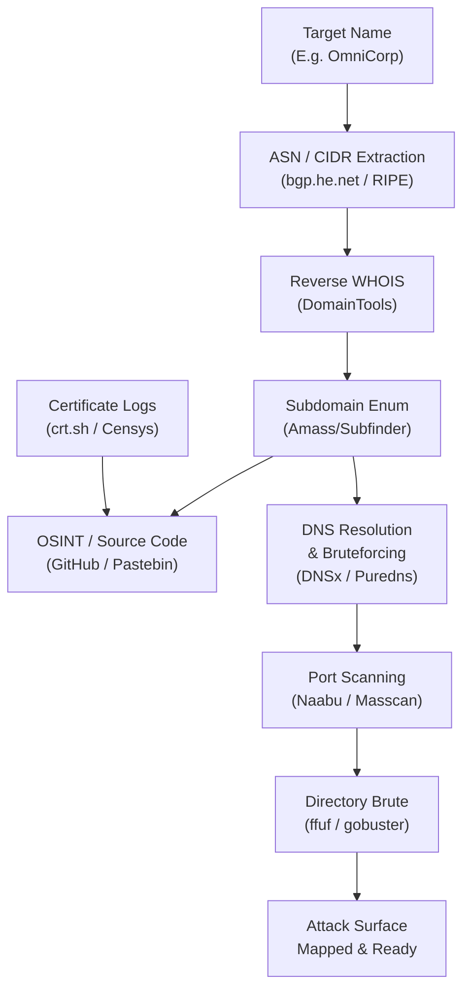

# Web Security Interview Preparation: Module 01 - Intro and Reconnaissance

Welcome to the expert-level interview preparation guide for Web Security Reconnaissance. This module evaluates your capability to conduct comprehensive, stealthy, and effective information gathering during the initial phases of a penetration test or red team operation.

Reconnaissance is the foundational pillar of any offensive engagement. A deep understanding of the target's external attack surface often dictates the success of subsequent attack phases. The following questions range from foundational concepts to advanced, scenario-based red teaming challenges.

---

## Formal Technical Questions

### Q1: Detail the difference between Active and Passive Reconnaissance. What specific OPSEC considerations must be taken into account for each?
**Answer:**
Reconnaissance is generally classified into two domains based on interaction levels with the target environment:

- **Passive Reconnaissance:** Involves gathering intelligence without sending any direct traffic to the target's infrastructure. 
  - *Techniques:* Utilizing third-party search engines (Google Dorks, Shodan, Censys), analyzing historical DNS records (SecurityTrails), harvesting certificates (crt.sh), and OSINT gathering from public repositories (GitHub, Pastebin) or social media (LinkedIn).
  - *OPSEC Considerations:* Passive recon is inherently safe from intrusion detection systems (IDS) on the target side. However, OPSEC requires utilizing proxies or VPNs when interacting with third-party datasets to prevent traffic correlation by advanced threat intelligence vendors tracking search patterns.

- **Active Reconnaissance:** Involves direct interaction with the target's network or web applications to uncover specific technical details.
  - *Techniques:* Port scanning (Nmap, Masscan), directory brute-forcing (ffuf, gobuster), banner grabbing, and active DNS zone transfers (axfr).
  - *OPSEC Considerations:* Active recon is highly noisy. OPSEC dictates the use of distributed scanning architectures, randomizing IP addresses, slowing down scan rates to stay below SIEM threshold alerts, and spoofing User-Agent headers to mimic legitimate traffic.

### Q2: How does Certificate Transparency (CT) logging work, and how can it be leveraged to uncover hidden subdomains? What are its limitations?
**Answer:**
Certificate Transparency (CT) is an open framework designed to monitor and audit SSL/TLS certificates. Whenever a Certificate Authority (CA) issues a certificate, it must log the issuance in publicly verifiable, append-only cryptographic ledgers (CT logs).
- *Exploitation for Recon:* Security researchers query platforms like `crt.sh` or use tools like `ctfr` to extract the Subject Alternative Names (SANs) from these certificates. This often reveals internal or pre-production subdomains (e.g., `dev.staging.target.com`) that developers secured with valid certs but didn't intend to publicize.
- *Limitations:* 
  1. CT logs only show that a certificate was *issued*, not that the underlying host is currently active or resolvable via DNS.
  2. Wildcard certificates (e.g., `*.target.com`) obscure specific subdomains, drastically reducing the effectiveness of CT log analysis for that particular domain.

### Q3: Explain the concept of ASN mapping and how it contributes to defining the target's IP space. 
**Answer:**
An Autonomous System Number (ASN) uniquely identifies a network or a collection of IP routing prefixes controlled by a single administrative entity. 
- *Recon Value:* Organizations often register their own ASNs to manage their network routing via BGP. By identifying a target organization's ASN using databases like Hurricane Electric (bgp.he.net) or RIPE, an attacker can map out the entire block of IP addresses (CIDR ranges) owned by the entity.
- *Execution:* Once the ASN is acquired (e.g., AS12345), tools like `amass` or WHOIS queries can extract all associated IPv4/IPv6 ranges. This ensures the penetration tester uncovers legacy systems, forgotten infrastructure, and development environments that are physically hosted within the corporate network but not linked via DNS subdomains.

---

## Scenario-Based Questions

### Scenario 1: The Blind Scope Engagement
**Prompt:** You are on a Red Team engagement. The client has provided a "black-box" scope containing only the company name: "OmniCorp Global". You have no domains, no IPs, and no architecture diagrams. Walk through your first 48 hours of reconnaissance to build an attack surface map.

**Expert Answer:**
The initial phase requires horizontal correlation before moving to vertical enumeration. 
1. **Corporate Acquisition Mapping:** I would begin by querying Crunchbase, Wikipedia, and SEC EDGAR filings (if publicly traded) to map all subsidiary companies and recent acquisitions associated with "OmniCorp Global." Often, newly acquired companies have weaker security postures and legacy infrastructure.
2. **Reverse WHOIS and ASN Discovery:** Using the corporate names, I'd perform Reverse WHOIS lookups (via DomainTools or Whoxy) to find domains registered under the same email addresses or corporate entities. Concurrently, I'd search BGP toolkits for ASNs registered to "OmniCorp."
3. **Vertical Enumeration:** Once root domains (e.g., `omnicorp.com`) are established, I transition to vertical recon. This involves combining passive subdomain enumeration (Subfinder, Amass, crt.sh) with active DNS brute-forcing (using customized wordlists via DNSx or Puredns) to find resolving subdomains.
4. **Cloud Infrastructure Recon:** OmniCorp likely uses the cloud. I would generate permutations of their domain name (e.g., `omnicorp-dev`, `omnicorp-backup`) and use tools like `CloudEnum` or `S3Scanner` to identify exposed AWS S3 buckets, Azure Blobs, or GCP storage buckets.
5. **Vulnerability Surface Profiling:** Finally, resolving IPs are fed into Naabu/Masscan to find open ports, followed by HTTPx to capture web page titles, server headers, and status codes. This distills thousands of subdomains into a prioritized list of actionable targets.

### Scenario 2: Bypassing the Web Application Firewall (WAF)
**Prompt:** You discover a critical application at `portal.target.com`. However, all active reconnaissance (directory brute-forcing, parameter discovery) is being aggressively blocked by a strict Cloudflare WAF, returning 403 Forbidden errors. How do you bypass or circumvent this WAF to continue your recon?

**Expert Answer:**
When dealing with a robust WAF/CDN like Cloudflare, the objective shifts from confronting the WAF to bypassing it entirely by locating the origin server's true IP address.
1. **Historical DNS Records:** I would query SecurityTrails or ViewDNS.info to find historical A records for `portal.target.com` prior to their migration behind Cloudflare. Often, companies leave the origin IP unchanged.
2. **Censys and Shodan Certificate Correlation:** I would search Shodan or Censys for the specific SSL certificate associated with `portal.target.com`. Cloudflare terminates SSL at the edge, but the origin server often serves the exact same SSL certificate on port 443 directly. Searching by the certificate hash or Common Name can expose the raw IP.
3. **Triggering Outbound Connections (SSRF/Blind XSS):** If the application has any functionality that fetches external resources (e.g., profile picture upload from URL), I would point it to a Burp Collaborator or custom webhook. The incoming request to my server will reveal the true IP of the origin infrastructure, completely bypassing the edge WAF.
4. **Direct IP Access Validation:** Once the suspected origin IP is found, I would send a manual curl request with the Host header set to the target: `curl -H "Host: portal.target.com" https://<Origin_IP> -k`. If the application responds correctly instead of throwing a default web server page, the WAF has been successfully bypassed.

---

## Deep-Dive Defensive Questions

### D1: As a Blue Team defender, how would you design an architecture to detect and thwart active reconnaissance, specifically directory brute-forcing and DNS enumeration?
**Answer:**
Detecting and mitigating active reconnaissance requires a layered defense strategy (Defense-in-Depth):
- **Combating DNS Enumeration:** Implement DNS Rate Limiting (RRL) on authoritative nameservers to drop excessive queries from single sources. Furthermore, avoid wildcard DNS records, as they give attackers infinite valid resolutions. Implementing DNSSEC with NSEC3 using aggressive iterations prevents zone-walking attacks.
- **Thwarting Directory Brute-Forcing:** 
  1. *Dynamic Rate Limiting & Tarpitting:* Deploy WAF rules that track request velocities (e.g., >50 requests to 404 endpoints within 10 seconds). Instead of simply blocking the IP, implement a tarpit mechanism that holds the HTTP connection open, slowing down the attacker's scanning tools drastically.
  2. *Honeypot Endpoints:* Embed invisible links or directories (e.g., `/admin-legacy-bkp/`) in `robots.txt` or application source code. These act as high-fidelity tripwires. A legitimate user will never access them; an automated scanner will, triggering an immediate IP ban at the edge.

### D2: What are the best practices for managing an organization's External Attack Surface to prevent successful reconnaissance by threat actors?
**Answer:**
External Attack Surface Management (EASM) is a continuous process. 
- **Continuous Discovery:** Organizations must continuously run their own recon. Utilizing tools like Amass and OpenVAS on a schedule to identify forgotten assets before attackers do. 
- **Strict Asset Lifecycle Management:** Decommissioning a service must include removing its associated DNS records immediately. Leaving a CNAME pointing to an expired third-party service leads directly to Subdomain Takeover vulnerabilities.
- **Data Leakage Prevention:** Developers must be restricted from pushing code to public repositories without pre-commit hooks (like `trufflehog` or `git-secrets`) scanning for hardcoded credentials, AWS keys, or internal network diagrams.

---

## Real-World Attack Scenario

### The Forgotten Staging Environment
During a routine penetration test against a financial institution, reconnaissance using `crt.sh` revealed a deeply nested subdomain: `v2-staging-auth.corp.target.com`. 
Active DNS resolution confirmed it pointed to an AWS Elastic IP. 

Navigating to the application revealed it was an exact replica of their production Single Sign-On (SSO) portal. However, directory brute-forcing with `ffuf` (using a customized wordlist tailored for Java Spring Boot apps) uncovered an exposed `/actuator/env` endpoint. 

The developers had left the Spring Boot Actuators enabled without authentication in the staging environment for debugging purposes. Accessing this endpoint leaked the database credentials, AWS IAM keys, and internal network configurations. Because the staging environment used a snapshot of the production database, the Red Team was able to extract real customer PII and pivot directly into the internal AWS infrastructure using the exposed IAM keys. This complete compromise stemmed entirely from thorough, methodical reconnaissance.

---

## Custom ASCII Diagram: Complete Reconnaissance Architecture

---

## Chaining Opportunities
Reconnaissance is the prerequisite for all vulnerability chaining. Effective recon directly enables:
1. **Subdomain Takeover to Stored XSS:** Finding a dangling DNS record -> claiming the third-party service -> serving malicious JavaScript -> achieving Stored XSS across the primary domain.
2. **Information Disclosure to SSRF:** Finding a hidden swagger documentation endpoint -> understanding internal application architecture -> exploiting Server-Side Request Forgery against a documented internal service.
3. **OSINT to Credential Stuffing:** Scraping employee emails via LinkedIn -> discovering past data breaches -> credential stuffing against the target's VPN portals.

---

## Related Notes
- [[02 - Web App Architecture & Protocols]]
- [[05 - Bypassing Web Application Firewalls]]
- [[11 - Subdomain Takeovers & Cloud Sec]]
- [[19 - Open Source Intelligence (OSINT) Techniques]]

