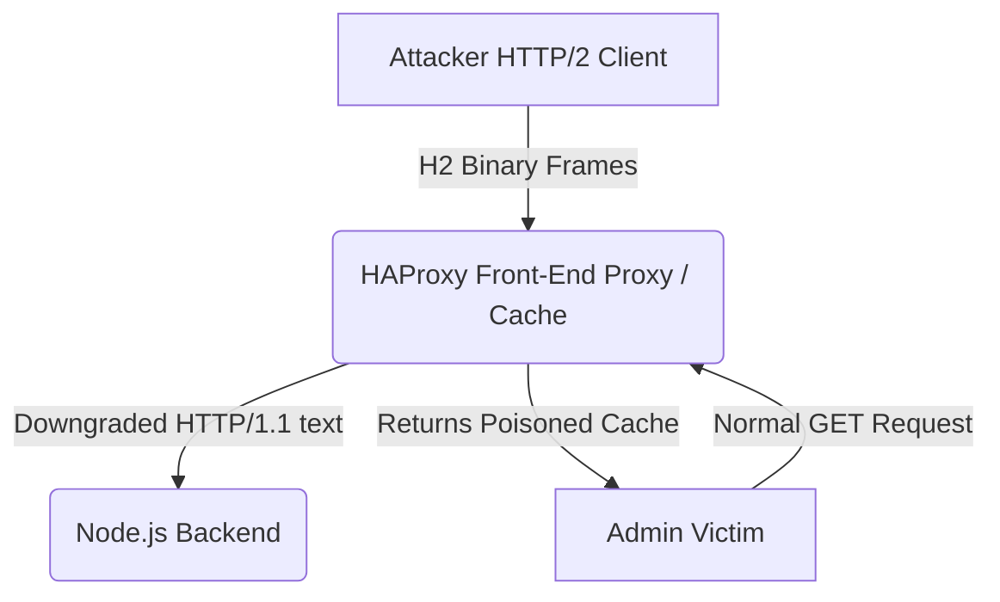

# Web Ultra 04 - HTTP/2 Request Smuggling to Cache Poisoning and Admin Takeover

## 1. Scenario Briefing

**Context:**
You are analyzing a high-traffic e-commerce platform. The front-end architecture employs an HAProxy load balancer acting as a reverse proxy, heavily caching static and dynamic content. The backend consists of several Node.js microservices.
To optimize performance, the load balancer accepts HTTP/2 traffic from the internet but downgrades (translates) these requests to HTTP/1.1 before routing them to the internal Node.js backend.

**The Goal:**
Identify and exploit an HTTP/2 to HTTP/1.1 Downgrade Request Smuggling vulnerability (H2.TE or H2.CL). Use this to smuggle a malicious request that poisons the front-end web cache. Finally, force an administrative user to execute a Cross-Site Scripting (XSS) payload delivered via the poisoned cache to steal their session.

**The Catch:**
Modern HTTP/1.1 smuggling (CL.TE / TE.CL) is heavily monitored and often patched. However, the protocol translation layer from HTTP/2 binary frames to HTTP/1.1 plain text introduces a new, highly complex attack surface that evades traditional WAFs.

---

## 2. Architecture & Attack Surface



*   **Vulnerability:** HTTP/2 Downgrade Request Smuggling.
*   **Mechanism:** The front-end accepts HTTP/2 pseudo-headers and translates them into HTTP/1.1 `Transfer-Encoding` or `Content-Length` headers without proper validation, causing desynchronization on the backend.
*   **Impact:** Web Cache Poisoning, leading to Stored XSS.

---

## 3. Attack Path & Exploitation Physics

### Phase 1: The Physics of H2.TE Request Smuggling
HTTP/2 does not use `Content-Length` or `Transfer-Encoding` headers. It determines message boundaries using built-in binary frame length fields (the `DATA` frame length).
However, when a front-end downgrades HTTP/2 to HTTP/1.1, it must generate standard HTTP/1.1 headers so the backend understands the request.
If an attacker manually injects an HTTP/1.1 `Transfer-Encoding: chunked` header *inside* their HTTP/2 headers block, a vulnerable proxy might blindly pass this header to the backend.

**The Desynchronization:**
1.  **Front-End (HTTP/2):** Reads the exact binary frame size. It ignores the injected `Transfer-Encoding` header because HTTP/2 doesn't use it.
2.  **Back-End (HTTP/1.1):** Receives the translated plain-text request. It sees the `Transfer-Encoding: chunked` header and decides to parse the body using chunked encoding rules.

If we craft the body such that it contains a valid chunk size, followed by a smuggled second request, the backend will process two requests, while the front-end thinks it only forwarded one.

### Phase 2: Crafting the Smuggled Payload (H2.TE)
Using a specialized HTTP/2 client (like Burp Suite's HTTP/2 implementation), we construct the following request:

**HTTP/2 Headers Frame:**
```text
:method: POST
:path: /
:authority: target.com
transfer-encoding: chunked
```

**HTTP/2 Data Frame:**
```text
0

GET /admin/dashboard HTTP/1.1
Host: target.com
X-Ignore: X
```

**What the Backend Node.js sees (HTTP/1.1):**
```http
POST / HTTP/1.1
Host: target.com
Transfer-Encoding: chunked

0

GET /admin/dashboard HTTP/1.1
Host: target.com
X-Ignore: X
```
The backend processes the `POST /` request. It sees `0\r\n\r\n`, which terminates the chunked body.
The backend then leaves the remaining bytes (`GET /admin/dashboard...`) in the TCP buffer, treating it as the start of the *next* request.

### Phase 3: Web Cache Poisoning
To exploit this desynchronization, we use the smuggled request to poison a static asset, like `app.js`, which is heavily cached by HAProxy.

**We modify the smuggled request to target a vulnerable redirect or reflected XSS endpoint:**
We smuggle a request that generates a malicious response (e.g., a reflected XSS in `/search?q=<script>alert(1)</script>`).
Simultaneously, we (or an innocent user) request `/static/app.js`.
Because of the desynchronization, the backend matches the innocent request for `/static/app.js` with the response for `/search?q=XSS`.
The Front-End cache receives the malicious XSS response and associates it with the cache key for `/static/app.js`.

**The Payload Execution:**
1.  Attacker sends the HTTP/2 smuggled payload.
2.  The backend pipeline is poisoned. The next request processed on that TCP connection will receive the malicious XSS response.
3.  Attacker immediately requests `GET /static/app.js HTTP/2`.
4.  The backend answers the *smuggled* request and sends the XSS response.
5.  HAProxy caches the XSS response under the `/static/app.js` URI.
6.  The Admin logs in, loads `/static/app.js`, and executes the XSS, which steals their session token or executes administrative actions via XHR.

---

## 4. The Interviewer's Gauntlet (Q&A)

### Q1: "Why does HTTP/2 downgrade smuggling bypass traditional WAFs that perfectly catch HTTP/1.1 TE.CL/CL.TE attacks?"
**Expert Answer:**
"Traditional WAFs look for anomalies in HTTP/1.1 headers, such as duplicated `Content-Length` headers, conflicting `Transfer-Encoding` mutations (like `Transfer-Encoding: xchunked`), or malformed newlines (`\r\n`).
In HTTP/2, headers are compressed using HPACK and transmitted in binary `HEADERS` frames. There are no `\r\n` delimiters. A WAF parsing HTTP/2 relies on the binary structure. If the WAF doesn't strictly validate the *content* of the pseudo-headers before the downgrade, the attacker's `transfer-encoding: chunked` string is seamlessly passed through the HTTP/2 translation layer. The WAF sees a perfectly valid HTTP/2 request, but the translated HTTP/1.1 request contains the desynchronizing poison."

### Q2: "Can you explain the difference between H2.TE and H2.CL?"
**Expert Answer:**
"They describe how the backend handles the translated request.
- **H2.TE:** The front-end proxy downgrades the request and forwards an injected `transfer-encoding: chunked` header. The backend prioritizes TE, parsing the body as chunks, leading to our smuggled request left in the buffer.
- **H2.CL:** The front-end proxy forwards an injected `content-length` header that does not match the actual size of the HTTP/2 `DATA` frame. The backend uses this spoofed `Content-Length`, reading only a portion of the body. The remaining body is left in the TCP buffer and parsed as the next request."

### Q3: "In your Web Cache Poisoning phase, how do you ensure the cache binds your malicious response to the exact file you want (e.g., `app.js`), rather than just poisoning a random user's request?"
**Expert Answer:**
"This is the hardest part of exploiting request smuggling: timing and alignment.
If we leave a smuggled request in the backend's TCP socket buffer, the *very next* request forwarded by the proxy on that specific connection will receive the smuggled response.
To guarantee we poison `app.js`, we don't wait for a random user. We immediately send a follow-up request for `app.js` ourselves.
```http
(Connection 1) HTTP/2 Request containing smuggled XSS payload
(Connection 1) HTTP/2 Request for GET /static/app.js
```
Because both requests route over the same HTTP/2 multiplexed stream and are processed sequentially over the same backend TCP connection, our legitimate `app.js` request aligns perfectly with the smuggled response. The proxy caches it, and from then on, all users requesting `app.js` get compromised."

### Q4: "What is an HTTP/2 Connection Preface, and could an attacker manually construct it via Telnet/Netcat to test this?"
**Expert Answer:**
"The HTTP/2 Connection Preface is a static magic string `PRI * HTTP/2.0\r\n\r\nSM\r\n\r\n` followed by a `SETTINGS` frame. It is required to establish an HTTP/2 connection.
You *cannot* test HTTP/2 request smuggling easily using raw Netcat or Telnet because HTTP/2 requires multiplexing, binary framing, and HPACK header compression. To manually craft these payloads, you must use a custom tool, a heavily modified proxy like Burp Suite's HTTP/2 experimental features, or a custom Python script using the `h2` library to manually construct the `HEADERS` and `DATA` binary frames. A raw text stream will be instantly rejected by the server."

### Q5: "If the backend is Node.js, how does its specific HTTP parser behavior contribute to smuggling compared to a Python/Gunicorn backend?"
**Expert Answer:**
"Different HTTP parsers have different tolerances for RFC violations. Node.js's `llhttp` parser (which replaced the older `http_parser`) is notoriously strict, but historically, Node.js had issues with spaces in headers or accepting multiple `Content-Length` headers.
In an H2.TE scenario, if the frontend HAProxy strips the `Transfer-Encoding` header, we might use a mutation to bypass HAProxy but still trigger Node.js. For instance, injecting `transfer-encoding:  chunked` (with extra spaces or a tab). If HAProxy ignores it (because it expects strict RFC compliance) but Node.js processes it (because it strips whitespace before evaluation), we create the desynchronization. Understanding the exact C/C++ parsing implementation of the specific backend version is critical for advanced smuggling."

---

## 5. Defensive Telemetry & Incident Response

### Identifying the Attack in Logs
- **HAProxy Logs:** Look for HTTP 400 or 500 errors immediately followed by normal 200 requests on the same backend connection. The backend erroring out on part of the smuggled request is a strong indicator.
- **Cache Hit Ratios:** An anomalous spike in cache invalidations or strange sizes for cached static assets. If `app.js` is normally 50KB, but the cache shows a size of 2KB (the size of an HTML error page or XSS payload), it has been poisoned.
- **Backend Access Logs:** The backend Node.js logs will show requests that the HAProxy access logs *do not have*. Because the backend processed a smuggled request entirely independently, the frontend has no record of routing it. A mismatch in request counts between frontend and backend is the smoking gun of Request Smuggling.

### Remediation Strategies
1.  **End-to-End HTTP/2:** The most robust fix is to disable HTTP downgrading entirely. Run HTTP/2 (via gRPC or native Node.js HTTP/2 modules) from the load balancer all the way to the backend microservices. Without protocol translation, H2.TE/CL is impossible.
2.  **Strict Header Validation (WAF/Proxy):** Configure HAProxy to aggressively reject any HTTP/2 request containing HTTP/1.1 specific connection headers (`Transfer-Encoding`, `Content-Length`, `Connection`, `Keep-Alive`). These have no legitimate purpose in HTTP/2.
3.  **Disable Connection Reuse:** As a temporary mitigation, disable TCP keep-alive (connection reuse) between the proxy and the backend. If a new TCP connection is created for every single request, request smuggling is impossible because the socket is closed before the smuggled payload can attach to a subsequent request. (Note: This has massive performance penalties).
